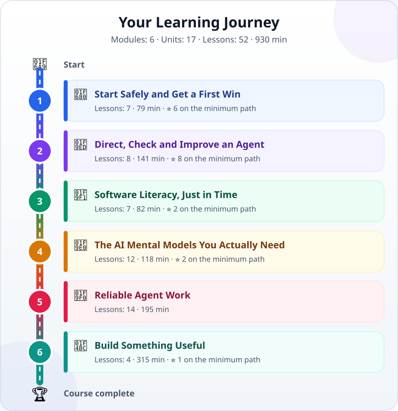

<!-- Generated by `python -m src.main build` from course/data/ and the lesson files. Do not edit by hand: CI fails when this file is out of date. -->

🌐 [Tiếng Việt](../vi/README.md) · **English** · [日本語](../ja/README.md)

# Agentic Coding for Absolute Beginners

> From "what is software?" to directing AI agents that build software, and checking their work — in three languages.

**Who it is for:** Working adults, students and engineers from outside software who know nothing about AI or programming yet, and want to use AI agents to build their own tools and automate their work. No programming needed to start: you learn enough to hand coding work to AI, check it and own the result. Especially suited to Vietnamese learners who study or work in or with Japan.

**Modules: 6 · Units: 17 · Lessons: 52 · 893 min** · [Glossary in three languages](glossary.md)

_Lessons with a link are ready to read; the others are being written._

## ⭐ The minimum path

Start here: 19 lessons · 347 min, enough to give an AI agent real work and check the result yourself. They carry a ⭐ in the tables below; take the other lessons when you need them.

1. [From Chatbot to AI Agent: AI That Does the Work, Not Just Answers](lessons/chatbot-to-agent.md) — 8 min
2. [Brain, Tools and the Loop: What an AI Agent Is Made Of](lessons/agent-parts-and-loop.md) — 8 min
3. [Watch an AI Agent Build and Check a Tiny Web Page](lessons/watch-an-agent-build.md) — 10 min
4. [Choose Your Setup: Browser, Personal PC or Work PC](lessons/choose-your-learning-setup.md) — 10 min
5. [Before You Let an Agent Act: Safe, Ask First, Never](lessons/data-safety-and-permissions.md) — 10 min
6. [Your First Agent Session: Build a One-File Task Card](lessons/first-agent-session.md) — 25 min
7. [New Mindset: You Are the Lead, Not the Typist](lessons/lead-not-typist.md) — 8 min
8. [Writing Good Specs: The Task and Its Definition of Done](lessons/writing-good-specs.md) — 12 min
9. [The Four-Step Workflow: Explore → Plan → Build → Verify](lessons/explore-plan-build-verify.md) — 12 min
10. [Files, Folders and Paths: The Map Inside Your Computer](lessons/files-folders-paths.md) — 10 min
11. [Reading and Reviewing an Agent's Changes (Diffs)](lessons/reviewing-agent-changes.md) — 15 min
12. [Turn "Looks Right" into Checks](lessons/testing-basics.md) — 12 min
13. [Reading Error Messages and Debugging Like a Detective](lessons/errors-and-debugging.md) — 12 min
14. [Project: Your Personal Web Page](lessons/project-personal-page.md) — 60 min
15. [What Data Looks Like: JSON, CSV and YAML](lessons/data-formats.md) — 10 min
16. [Git: A Magic Undo Button for Your Whole Project](lessons/git-version-control.md) — 15 min
17. [Hallucination: Why AI Is Confidently Wrong](lessons/hallucination.md) — 10 min
18. [The Context Window: AI's Short-Term Memory](lessons/context-window.md) — 10 min
19. [Project: Automate an Office Task (Spreadsheet → Report)](lessons/project-office-automation.md) — 90 min

## 1. 🚀 Start Safely and Get a First Win

🎯 See how an AI agent differs from a chatbot, choose a safe way to practise on your own device, then have an agent build your first small artifact and check it yourself.

### 1.1 What Agents Do

| # | Lesson | Type | Time |
|---|---|---|---|
| 1.1.1 | ⭐ [From Chatbot to AI Agent: AI That Does the Work, Not Just Answers](lessons/chatbot-to-agent.md) | 📖 Concept | 8 min |
| 1.1.2 | ⭐ [Brain, Tools and the Loop: What an AI Agent Is Made Of](lessons/agent-parts-and-loop.md) | 📖 Concept | 8 min |
| 1.1.3 | ⭐ [Watch an AI Agent Build and Check a Tiny Web Page](lessons/watch-an-agent-build.md) | 🎬 Demo | 10 min |

### 1.2 Choose a Safe Route

| # | Lesson | Type | Time |
|---|---|---|---|
| 1.2.1 | ⭐ [Choose Your Setup: Browser, Personal PC or Work PC](lessons/choose-your-learning-setup.md) | 🛠️ Hands-on | 10 min |
| 1.2.2 | ⭐ [Before You Let an Agent Act: Safe, Ask First, Never](lessons/data-safety-and-permissions.md) | 📖 Concept | 10 min |

### 1.3 Your First Build

| # | Lesson | Type | Time |
|---|---|---|---|
| 1.3.1 | ⭐ [Your First Agent Session: Build a One-File Task Card](lessons/first-agent-session.md) | 🛠️ Hands-on | 25 min |
| 1.3.2 | [Choose Your Path and Keep a Learning Log](lessons/how-to-learn-this-course.md) | 🛠️ Hands-on | 8 min |

## 2. 🧭 Direct, Check and Improve an Agent

🎯 Give an agent clear work, check every change against evidence, and finish your first meaningful project.

### 2.1 Give Clear Work

| # | Lesson | Type | Time |
|---|---|---|---|
| 2.1.1 | ⭐ [New Mindset: You Are the Lead, Not the Typist](lessons/lead-not-typist.md) | 📖 Concept | 8 min |
| 2.1.2 | ⭐ [Writing Good Specs: The Task and Its Definition of Done](lessons/writing-good-specs.md) | 🛠️ Hands-on | 12 min |
| 2.1.3 | ⭐ [The Four-Step Workflow: Explore → Plan → Build → Verify](lessons/explore-plan-build-verify.md) | 🛠️ Hands-on | 12 min |

### 2.2 Inspect the Result

| # | Lesson | Type | Time |
|---|---|---|---|
| 2.2.1 | ⭐ [Files, Folders and Paths: The Map Inside Your Computer](lessons/files-folders-paths.md) | 🛠️ Hands-on | 10 min |
| 2.2.2 | ⭐ [Reading and Reviewing an Agent's Changes (Diffs)](lessons/reviewing-agent-changes.md) | 🛠️ Hands-on | 15 min |
| 2.2.3 | ⭐ [Turn "Looks Right" into Checks](lessons/testing-basics.md) | 🛠️ Hands-on | 12 min |
| 2.2.4 | ⭐ [Reading Error Messages and Debugging Like a Detective](lessons/errors-and-debugging.md) | 🛠️ Hands-on | 12 min |

### 2.3 Your First Project

| # | Lesson | Type | Time |
|---|---|---|---|
| 2.3.1 | ⭐ [Project: Your Personal Web Page](lessons/project-personal-page.md) | 🚀 Project | 60 min |

## 3. 🧱 Software Literacy, Just in Time

🎯 Understand what the agent just made — files, folders, data, code and history — well enough to supervise it and undo safely.

### 3.1 Files and Projects

| # | Lesson | Type | Time |
|---|---|---|---|
| 3.1.1 | What Is Software? A Program Is Like a Recipe | 📖 Concept | 8 min |
| 3.1.2 | Anatomy of a Project: Frontend, Backend, Database, API | 📖 Concept | 10 min |
| 3.1.3 | ⭐ [What Data Looks Like: JSON, CSV and YAML](lessons/data-formats.md) | 🛠️ Hands-on | 10 min |

### 3.2 Code and History

| # | Lesson | Type | Time |
|---|---|---|---|
| 3.2.1 | [Variables, Functions, Conditions, Loops: The Four Building Blocks](lessons/programming-building-blocks.md) | 📖 Concept | 12 min |
| 3.2.2 | ⭐ [Git: A Magic Undo Button for Your Whole Project](lessons/git-version-control.md) | 🛠️ Hands-on | 15 min |
| 3.2.3 | [The Terminal Is Not Scary: Your First Five Safe Commands](lessons/command-line-basics.md) | 🛠️ Hands-on | 15 min |

### 3.3 Security Essentials

| # | Lesson | Type | Time |
|---|---|---|---|
| 3.3.1 | Safety Basics: API Keys, Passwords and Personal Data | 📖 Concept | 12 min |

## 4. 🧠 The AI Mental Models You Actually Need

🎯 Know why a fluent AI answer can still be wrong, what an agent can see and how it uses tools; the deeper theory is optional.

### 4.1 Asking and Grounding

| # | Lesson | Type | Time |
|---|---|---|---|
| 4.1.1 | Prompting Basics: Talking So AI Understands | 🛠️ Hands-on | 12 min |
| 4.1.2 | ⭐ [Hallucination: Why AI Is Confidently Wrong](lessons/hallucination.md) | 📖 Concept | 10 min |
| 4.1.3 | ⭐ [The Context Window: AI's Short-Term Memory](lessons/context-window.md) | 📖 Concept | 10 min |
| 4.1.4 | Next-Token Prediction: The Simple Secret Behind LLMs | 📖 Concept | 10 min |
| 4.1.5 | Tool Calling: How an LLM Presses Real Buttons | 🎬 Demo | 10 min |

### 4.2 AI Foundations · _optional_

| # | Lesson | Type | Time |
|---|---|---|---|
| 4.2.1 | The AI Family Tree in One Picture: From Machine Learning to LLMs | 📖 Concept | 8 min |
| 4.2.2 | How Do Machines "Learn"? Data, Training and Models | 📖 Concept | 10 min |
| 4.2.3 | RAG: Letting AI Look Things Up | 🎬 Demo | 10 min |
| 4.2.4 | Prompting, RAG or Fine-Tuning: Which One When? | 📖 Concept | 10 min |

### 4.3 Model Literacy · _optional_

| # | Lesson | Type | Time |
|---|---|---|---|
| 4.3.1 | Tokens: How AI Reads Text in Pieces | 🎬 Demo | 8 min |
| 4.3.2 | Models That "Think": What Is Reasoning? | 📖 Concept | 10 min |
| 4.3.3 | Choosing a Model: Big or Small, Fast or Slow, Cheap or Costly | 🛠️ Hands-on | 10 min |

## 5. 🧰 Reliable Agent Work

🎯 Make an agent a dependable colleague: the right workflow, the right context, clear permissions and automatic checks.

### 5.1 Agentic Work as a System

| # | Lesson | Type | Time |
|---|---|---|---|
| 5.1.1 | Traditional Coding vs Agentic Coding | 📖 Concept | 8 min |
| 5.1.2 | Vibe Coding vs Agentic Coding: What Is the Difference? | 📖 Concept | 8 min |
| 5.1.3 | Trace an Agent Loop Through a Real Session | 🎬 Demo | 10 min |
| 5.1.4 | Choose a Tool by Environment, Not Hype | 📖 Concept | 10 min |
| 5.1.5 | Add Structure When the Task Needs It: Plans, Tests First, Reviews | 📖 Concept | 10 min |

### 5.2 The Minimum Useful Harness

| # | Lesson | Type | Time |
|---|---|---|---|
| 5.2.1 | Model + Harness = Agent: The Horse and the Reins | 📖 Concept | 10 min |
| 5.2.2 | Context Engineering: The Right Information at the Right Time | 🛠️ Hands-on | 12 min |
| 5.2.3 | Prompt Engineering for Agents: System Prompts and Instructions | 🛠️ Hands-on | 12 min |
| 5.2.4 | Hooks and Permissions: Automatic Guardrails | 🛠️ Hands-on | 12 min |
| 5.2.5 | Tests and CI: Let Machines Check Machines | 🎬 Demo | 12 min |

### 5.3 Deeper Practice · _advanced_

| # | Lesson | Type | Time |
|---|---|---|---|
| 5.3.1 | Project Memory and Reusable Skills | 🛠️ Hands-on | 15 min |
| 5.3.2 | Agents and Workflows: When Do You Need More Than One Agent? | 📖 Concept | 12 min |
| 5.3.3 | MCP: A USB-C Port for AI | 🎬 Demo | 12 min |
| 5.3.4 | Evals: Scoring an Agent's Quality | 🛠️ Hands-on | 15 min |

## 6. 💼 Build Something Useful

🎯 Use what you have learned to automate an office task you can verify, then take on advanced projects if you like.

### 6.1 An Office Task, Automated

| # | Lesson | Type | Time |
|---|---|---|---|
| 6.1.1 | ⭐ [Project: Automate an Office Task (Spreadsheet → Report)](lessons/project-office-automation.md) | 🚀 Project | 90 min |
| 6.1.2 | Project Retrospective and Evidence Pack | 🛠️ Hands-on | 15 min |

### 6.2 Advanced Projects · _advanced_

| # | Lesson | Type | Time |
|---|---|---|---|
| 6.2.1 | Project: Build a Small MCP Tool for Your Agent | 🚀 Project | 90 min |
| 6.2.2 | Capstone: Your Own Idea | 🚀 Project | 120 min |
