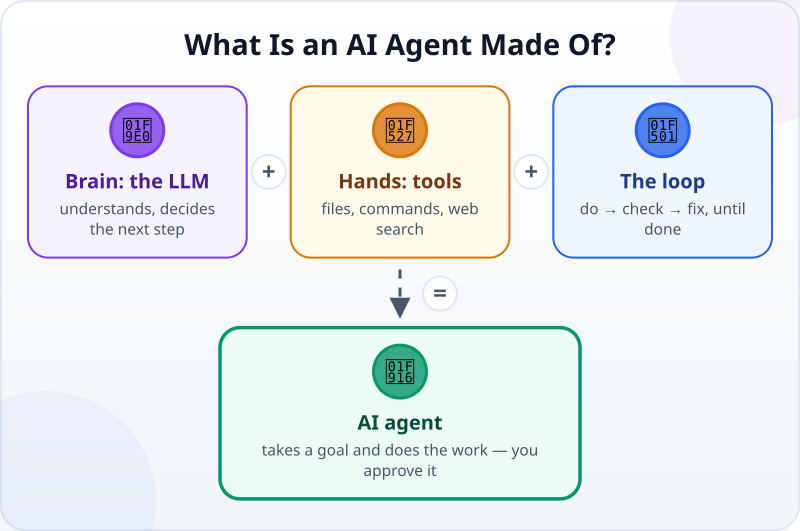
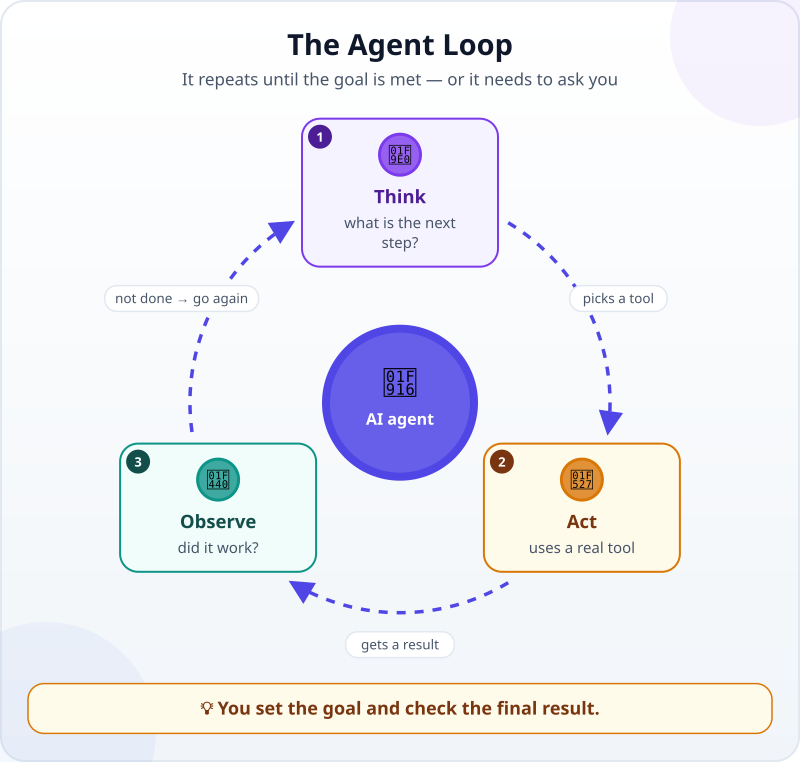
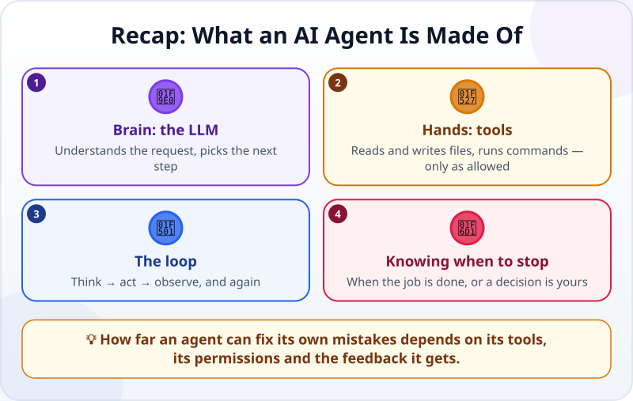

🌐 [Tiếng Việt](../../vi/lessons/agent-parts-and-loop.md) · **English** · [日本語](../../ja/lessons/agent-parts-and-loop.md)

# Brain, Tools and the Loop: What an AI Agent Is Made Of

<!-- section: objective -->
## Lesson Objective

By the end of this lesson, you will be able to:

- Name the three parts of an AI agent: a **brain (an LLM)**, **hands (tools)** and a **loop**.
- Describe the *think → act → observe* loop and say when it should stop.
- Explain why how far an agent can fix its own mistakes depends on its tools, its permissions and the feedback it gets.

<!-- section: hook -->
## Why It Matters

You already know that [an agent does the steps for you](chatbot-to-agent.md). But a language model only produces text — so how can it **open a file** or **run a program**?

The answer lies in how an agent is put together. Once you know its three parts, you can predict what an agent can do, what it cannot, and when it needs you.

<!-- section: concept -->
## Core Idea

### The formula for an AI agent

- **Brain — the LLM (large language model):** understands the request, reasons and decides the next step. On its own, it only writes text.
- **Hands — tools:** the real actions the agent is **allowed** to take: reading and writing files, running commands, searching the web, calling other services. The LLM chooses a tool; the software around it actually presses the button.
- **Loop:** an agent does not act once and stop. It repeats until the goal is met.

### The think → act → observe loop

1. **Think:** what is the next step?
2. **Act:** use a tool — for example, open the web page to try it.
3. **Observe:** read the result — does the page work, is there an error message?

Then back to step 1. The loop **stops** when the goal is met, when the agent reaches a decision only you are entitled to make (deleting data, for example), or when it runs out of permissions or ideas.

### Fixing its own mistakes is not magic

An agent can only fix mistakes it can **observe**. If it is not allowed to run the program, it never sees the error; without error messages or clear checks, it cannot tell that it is wrong. So how much an agent can fix depends on its **tools**, its **permissions** and the **feedback** it gets — and you are still the final check.

<!-- section: analogy -->
## Simple Analogy

Think of a cook making the dish you ordered:

- The **brain** is the cook's experience: knowing what to do next.
- The **hands** are the knives, stove and pans: without them, experience stays on paper.
- The **loop** is season — taste — adjust — taste again, until it is right; a question like *"can you handle spicy food?"* goes to the customer.

Where the analogy breaks: a cook can always taste the food, while an agent can only "taste" what its tools let it see.

<!-- section: example -->
## Real Example

The goal you give: *"Rename the 50 photos in the Travel folder by the date they were taken, like 2026-09-01_01.jpg."*

1. **Think:** it needs each photo's date. **Act:** list the files. **Observe:** 50 photos, 3 of them without a date taken.
2. **Think:** how should those 3 be named? That is your decision, so the agent **asks**: *"May I use the file creation date for these 3 photos?"* You agree.
3. **Act:** rename the files. **Observe:** list the folder again and see 50 files named the right way.
4. Goal met, so the loop stops and the agent reports what it did.

You check quickly: open a few photos and see whether the names match the dates they were taken.

<!-- section: misconceptions -->
## Common Misconceptions

- **"The LLM opens files by itself."** — No. The LLM only decides which tool to use; the agent's software carries it out, and only within what it is allowed to do.
- **"Every agent notices and fixes its own errors."** — Only when it has tools to observe the result and permission to fix it. Even then, a fix can be wrong.

<!-- section: recap -->
## The Lesson in One Picture

<!-- section: takeaways -->
## Key Takeaways

- Agent = **LLM** (brain) + **tools** (hands) + a think → act → observe **loop**.
- The loop stops when the job is done, or when a decision is yours.
- How far an agent can fix its own mistakes depends on its tools, permissions and feedback — the final check is still yours.

<!-- section: quiz -->
## Quick Check

**Question 1.** Which part lets an agent do real work, such as creating a file?

- A) The LLM
- B) A tool
- C) The chat window

**Question 2.** An agent is fixing a web page but is not allowed to open the page to try it. What is most likely to happen?

- A) It still finds every error for certain
- B) It may miss errors because it cannot observe the result
- C) It gives itself more permissions

**Question 3.** When should an agent stop its loop and ask you?

- A) After every line of code it writes
- B) When it needs a decision only you are entitled to make, such as deleting data
- C) Never

Show answers

1. **B** — the LLM chooses what to do; a tool is what actually creates the file.
2. **B** — without observing the result, it cannot know it is wrong; fixing depends on tools and feedback.
3. **B** — important or hard-to-undo decisions are yours.

<!-- section: sources -->
## Recommended Sources

- Anthropic — [Building Effective AI Agents](https://www.anthropic.com/engineering/building-effective-agents) (December 2024): agents are typically LLMs using tools based on environmental feedback in a loop, and can pause for human feedback when they hit a blocker.
- IBM — [What is Agentic AI?](https://www.ibm.com/think/topics/agentic-ai)
