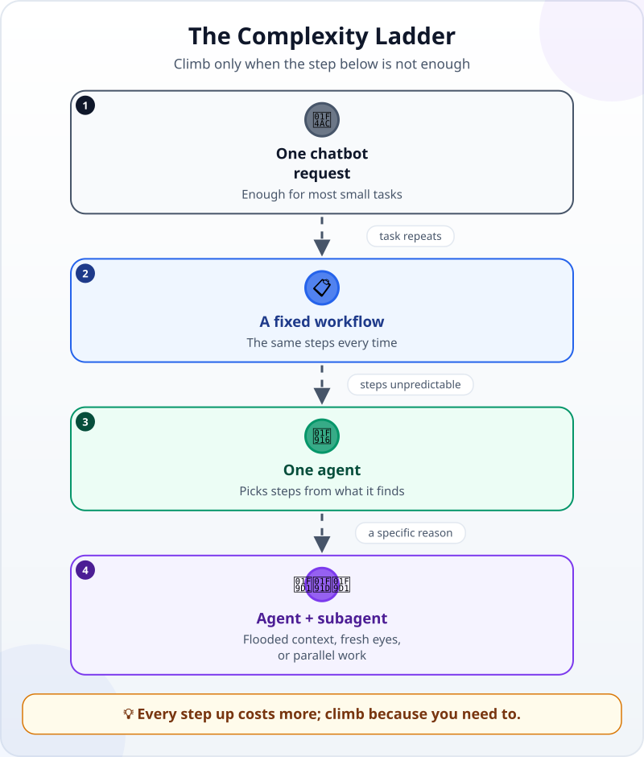
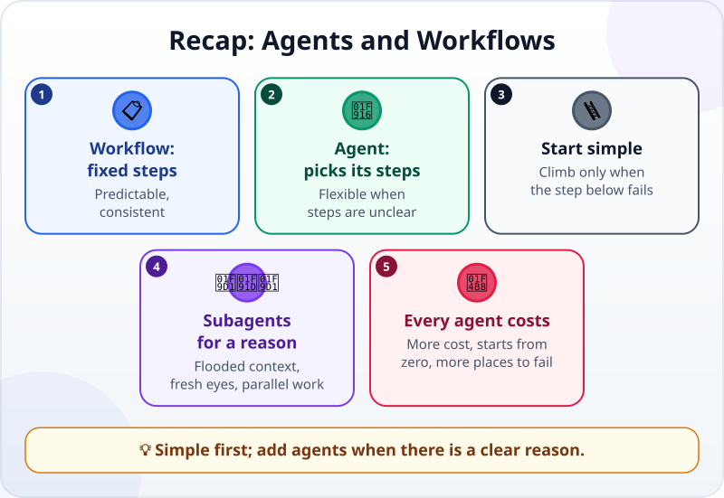

🌐 [Tiếng Việt](../../vi/lessons/agents-and-workflows.md) · **English** · [日本語](../../ja/lessons/agents-and-workflows.md)

# Agents and Workflows: When Do You Need More Than One Agent?

<!-- section: objective -->
## Lesson Objective

By the end of this lesson, you will be able to:

- Tell a **workflow** (steps fixed in advance) apart from an **agent** (the model decides the steps).
- Choose the simplest thing that gets the job done, using a four-step "ladder".
- Name three cases where a **subagent** (a helper agent) really helps, and what it costs.

<!-- section: hook -->
## Why It Matters

Huy watches a video: ten agents working like a company — a research agent, a writing agent, an editing agent, a translation agent, a publishing agent. He wants the same for his club's **monthly newsletter**: five agents, each with a role.

It sounds great. But Huy's newsletter is one page long, draws on three event-calendar files, and comes out once a month. Are five agents the right tool — or is it hiring five chefs to cook a family dinner?

<!-- section: concept -->
## Core Idea

### Workflows and agents

Anthropic (December 2024) distinguishes two kinds of system:

- **A workflow:** the steps are fixed in advance — by code, or by you. The model does each step, but does not choose the steps. Example: Mai's monthly-report skill in [Project Memory and Reusable Skills](memory-and-skills.md).
- **An agent:** the model **decides** the next step and which tool to use itself, as you saw in [the agent loop](the-agent-loop.md).

Workflows are predictable and consistent for well-defined tasks. Agents are flexible when the steps cannot be predicted.

### Start simple

Anthropic's advice: find **the simplest solution** that works, and only add complexity when needed — which sometimes means no agentic system at all. Agentic systems usually trade time and cost for better results; ask whether that trade is worth it.

Climb one step at a time, and only when the step below is not enough:

1. **One request** to a chatbot — one question, one answer, no tools or loop — enough for most small tasks.
2. **A fixed workflow** — a task repeated with the same steps.
3. **One agent** — a task whose steps depend on what it discovers along the way.
4. **Agent + subagent** — when there is a specific reason, like the three below.

### Three times a subagent helps

A **subagent** is a helper agent that the main agent starts; it does one part of the work in **its own context** and returns the result. The Claude Code documentation (September 2026) lists reasons to use one; the three most common are:

- **A side task would flood the main context.** Searching hundreds of files, reading long logs — the subagent does it in its own context and returns only its final answer — so ask in the brief for a short summary.
- **You need fresh eyes.** A review in a fresh context that sees only the result and the criteria (if your tool would pass the conversation along, ask for a fresh one) — as you learned in [Add Structure When the Task Needs It](workflow-frameworks.md).
- **Independent parts can run in parallel**, where no part needs another's result.

### What every added agent costs

- **More cost:** each subagent sends its own requests to the model, counted against the same usage limits as the main session.
- **It usually starts without your conversation:** in Claude Code (as of September 2026), an ordinary subagent does not see your conversation, or the files the main agent has read. It knows its brief, plus whatever its setup loads (usually the project's instruction file). Some tools — and Claude Code's fork mode — pass the conversation along instead, so check how yours works. Either way, brief it vaguely and it guesses.
- **More places to go wrong:** results pass through more hands; each handoff can lose or distort information. And you still have to check the final result.

<!-- section: analogy -->
## Simple Analogy

A big restaurant kitchen has a head chef, a prep cook, a grill cook and someone who tastes before serving. That makes sense — they cook hundreds of plates a night. But hiring five chefs to cook a family dinner for four only adds directing, bumping into each other, and cost.

One thing worth adding even in a small kitchen: **someone who tastes again** before the food goes out — a person who did not cook the dish tastes it more honestly.

Where the comparison breaks down: a new cook in the kitchen can still hear and see everything around them. An ordinary subagent cannot — it does not hear your conversation with the main agent, so whatever it needs from that conversation must be written in its brief.

<!-- section: example -->
## Real Example

Huy writes down his five-agent plan, then goes up the ladder one step at a time.

**What really has to be done each month:** read three event-calendar files (made-up data, in `ai-practice`), write a one-page newsletter, check the dates, times and places, and save it as `newsletter_month_X.md`.

- **Step 1 — one request?** Almost enough. But he does the same steps every month.
- **Step 2 — a fixed workflow?** Yes: the steps do not change. Huy writes a `monthly-newsletter` skill: read the three files, write to the template, save the file.
- **Is a subagent needed?** He checks the three reasons. The three calendars are short — they will not flood the context. Nothing needs to run in parallel. And **fresh eyes**? Yes: wrong dates in the newsletter are something the whole club will rely on.

Huy adds a last step to the skill: *"Give a new subagent this task: compare every date, time and place in the newsletter with the three calendar files. Only report mismatches; change nothing."*

In the first month, the review subagent reports one thing: the picnic says *Saturday 17 October*, but the calendar file says *Sunday 18 October*. The writing agent had mixed up two calendar lines while merging them. Huy fixes it, then reads the whole newsletter himself before sending it.

The result: one workflow and one review subagent — instead of five agents. It costs less, has fewer places to go wrong, and the one place that needed fresh eyes got them.

<!-- section: misconceptions -->
## Common Misconceptions

- **"More agents means more intelligence."** — Every added agent costs more, and adds another handoff where information can go wrong. Add agents for a specific reason, not because it sounds modern.
- **"A subagent knows what I told the main agent."** — In Claude Code, an ordinary subagent starts with a fresh context, without your conversation (other tools vary); what you told the main agent reaches it only if the brief (or the project files it reads) says so. A brief for a subagent needs to be as clear as a request for someone new.
- **"With a review agent, I don't need to read it."** — A review subagent helps catch mistakes; it does not replace your responsibility for the final result.

<!-- section: recap -->
## The Lesson in One Picture

<!-- section: takeaways -->
## Key Takeaways

- Workflow: steps fixed in advance. Agent: the model picks the steps.
- Start simple; only climb to a more complex step when the one below is not enough.
- Subagents help when a side task would flood the context, when you need fresh eyes, or when independent parts can run in parallel.
- Every added agent costs more, usually starts without your conversation, and adds places to go wrong.
- More agents do not replace your check of the final result.

<!-- section: quiz -->
## Quick Check

**Question 1.** What is the core difference between a workflow and an agent?

- A) Workflows use cheap models, agents use expensive ones
- B) In a workflow the steps are fixed in advance; in an agent the model decides the next step
- C) Workflows don't use AI

**Question 2.** When is a subagent most worth using?

- A) Changing the color of a heading
- B) Writing a short email
- C) Finding one piece of information in hundreds of long log files, when you only need a summary

**Question 3.** Why does a subagent's brief need to be clear?

- A) Because an ordinary subagent (as in Claude Code) starts with a fresh context and does not see your conversation with the main agent
- B) Because a subagent always runs on a weaker model that needs simpler instructions
- C) Because the subagent cannot use any tools

Show answers

1. **B** — who picks the next step is the main difference; both use a model.
2. **C** — the side task would flood the main context; a subagent does it separately and, if the brief asks for one, returns only a short summary.
3. **A** — an ordinary subagent does not see your conversation; what you told the main agent reaches it only through the brief (or the project files it reads).

<!-- section: sources -->
## Recommended Sources

- Anthropic — [Building Effective AI Agents](https://www.anthropic.com/engineering/building-effective-agents) (English, December 2024): workflows orchestrate models and tools through predefined code paths, agents let the model direct its own process and tool use; find the simplest solution and only add complexity when needed; agentic systems trade latency and cost for better performance.
- Anthropic — [Create custom subagents](https://code.claude.com/docs/en/sub-agents) (English, as of September 2026): a subagent works in its own context and returns only its final result, not its exploration; use one when a side task produces output you do not need in the main context; a subagent does not see the conversation history or the files the main agent has read; each subagent sends its own requests, counted against the same usage limits.
