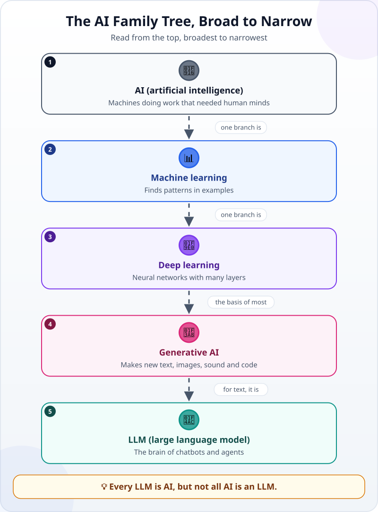
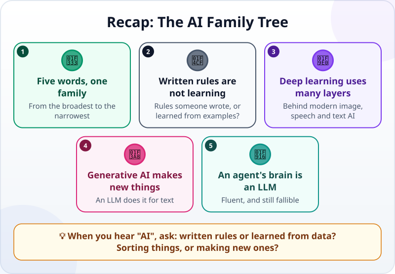

🌐 [Tiếng Việt](../../vi/lessons/ai-ml-dl.md) · **English** · [日本語](../../ja/lessons/ai-ml-dl.md)

# The AI Family Tree in One Picture: From Machine Learning to LLMs

<!-- section: objective -->
## Lesson Objective

By the end of this lesson, you will be able to:

- Place five words — **AI, machine learning, deep learning, generative AI, LLM** — on one family tree, from the broadest to the narrowest.
- Tell software that follows written rules from software that learns from data.
- Say which branch the agent in this course belongs to, and what that means for its strengths and weaknesses.

<!-- section: hook -->
## Why It Matters

In the weekly meeting, Hana hears three sentences in a row. Her manager says: *"The new timesheet software has AI."* A colleague says: *"Our chatbot is generative AI."* The company newsletter says: *"The spam filter uses machine learning."*

Hana nods, but she is not sure how these three differ — or whether they are one thing with three names. The next ten minutes will sort it out, for Hana and for you.

<!-- section: concept -->
## Core Idea

### One family tree, not five separate things

Read the picture from the top, from the broadest word to the narrowest:

1. **AI (artificial intelligence)** — the umbrella term for technologies that let machines do work that used to need a human mind: understanding language, analysing data, making suggestions. Some "AI" software only follows rules a person wrote (*if… then…*) and learns nothing at all.
2. **Machine learning** — a branch of AI. Instead of writing the rules, people show the machine many examples so it finds the patterns itself. [How Do Machines "Learn"?](how-machines-learn.md) goes into this.
3. **Deep learning** — a branch of machine learning that uses neural networks with many layers. It is behind most modern AI for images, speech and language.
4. **Generative AI** — AI that makes new content: text, images, sound, code, rather than only sorting or scoring things. The name says what it *does*, not what it is *built with*: today most generative AI is built with deep learning, but that is the usual path, not a rule.
5. **LLM (large language model)** — generative AI for text: trained on huge amounts of writing to continue a piece of text in the most plausible way.

### Foundation models

You will meet this word too. A **foundation model** is a very large model trained on very varied data and then used for many different tasks. An LLM is a foundation model for text — which is why the same model can summarize, translate and write code.

### Which branch is your agent on?

The "brain" of the agent in this course is an LLM — the bottom level of the tree. So it has that branch's strengths and weaknesses: fluent writing and many skills, but it can be confidently wrong ([hallucination](hallucination.md)). Its "hands" — reading files, running commands — come from the program around it, as you saw in [Brain, Tools and the Loop](agent-parts-and-loop.md).

<!-- section: analogy -->
## Simple Analogy

Think of **vehicles**: vehicles → cars → electric cars → one particular electric model. Every electric car is a car, but not every car is electric. In the same way, every LLM is AI, but not all AI is an LLM — a spam filter or a product recommender is AI too.

Where it breaks down: the lines between kinds of vehicle are clear; the lines between branches of AI are much blurrier. And in advertising, "AI" is often used very loosely — sometimes for a few *if… then…* rules written in advance.

<!-- section: example -->
## Real Example

After the meeting, Hana takes four things from her company and places them on the tree:

| What Hana found | What it does | Branch |
|---|---|---|
| Timesheet software "with AI" | Flags anyone more than 10 minutes late, by a built-in rule | Rule-based AI — it learns nothing from data |
| Spam filter | Learned from many emails marked "spam" or "not spam" | Machine learning |
| App that reads text on photographed receipts | A many-layered neural network recognizes the characters | Deep learning |
| Chatbot that drafts e-mails | Writes new paragraphs from a few lines of request | Generative AI — an LLM |

From now on, whenever she hears *"it has AI"*, Hana asks two more questions: **"Does it follow rules, or learn from data?"** and **"Does it sort things, or make new ones?"** Those two questions tell her how far to trust it, and what to check.

<!-- section: misconceptions -->
## Common Misconceptions

- **"AI means ChatGPT."** — Chatbots are one small branch at the bottom of the tree. Spam filters, film recommendations and face recognition are AI too.
- **"If it says AI, it learns."** — Some "AI" software only follows written rules; it does not get better however long you use it.
- **"Machine learning means the machine thinks like a person."** — It finds patterns in examples. It can be very good at one task without understanding it the way people do.

<!-- section: recap -->
## The Lesson in One Picture

<!-- section: takeaways -->
## Key Takeaways

- AI → machine learning → deep learning → generative AI → LLM: from the broadest word to the narrowest; today most generative AI is built with deep learning.
- Following written rules is not learning from data, even though both can be called "AI".
- Deep learning uses many-layered neural networks; generative AI makes new content; an LLM does it for text.
- The agent in this course has an LLM for a brain: fluent, and still in need of your checks.
- When you hear "AI", ask: rules or learned from data? Sorting, or making something new?

<!-- section: quiz -->
## Quick Check

**Question 1.** Which statement is true?

- A) All AI software is an LLM
- B) Deep learning is a branch of machine learning
- C) Machine learning is a branch of generative AI

**Question 2.** Timesheet software flags anyone more than 10 minutes late, using a built-in rule. What kind is it?

- A) Rule-based AI that learns nothing from data
- B) Generative AI
- C) Deep learning

**Question 3.** Why do an agent's answers still need checking?

- A) Because the agent follows written rules, so it is inflexible
- B) Because the agent cannot read any files
- C) Because its brain is an LLM: fluent, but able to be confidently wrong

Show answers

1. **B** — deep learning sits inside machine learning, which sits inside AI; not all AI is an LLM.
2. **A** — it learns from no examples; it just runs a rule a person wrote.
3. **C** — an LLM writes the most plausible text, and plausible is not the same as true.

<!-- section: sources -->
## Recommended Sources

- Google Cloud — [What is Artificial Intelligence (AI)?](https://cloud.google.com/learn/what-is-artificial-intelligence): AI is a set of technologies that let computers do work that used to require human intelligence.
- Google Cloud — [What is Machine Learning?](https://cloud.google.com/learn/what-is-machine-learning): machine learning is a subset of AI that learns from data rather than being explicitly programmed; deep learning is a subset of machine learning.
- Google Cloud — [What are foundation models?](https://cloud.google.com/discover/what-are-foundation-models): foundation models are trained on a massive amount of data and can be adapted to a wide range of tasks.
- Anthropic — [Glossary](https://platform.claude.com/docs/en/about-claude/glossary), entry *LLM*: LLMs are trained on vast amounts of text and can generate text, answer questions and summarize.
