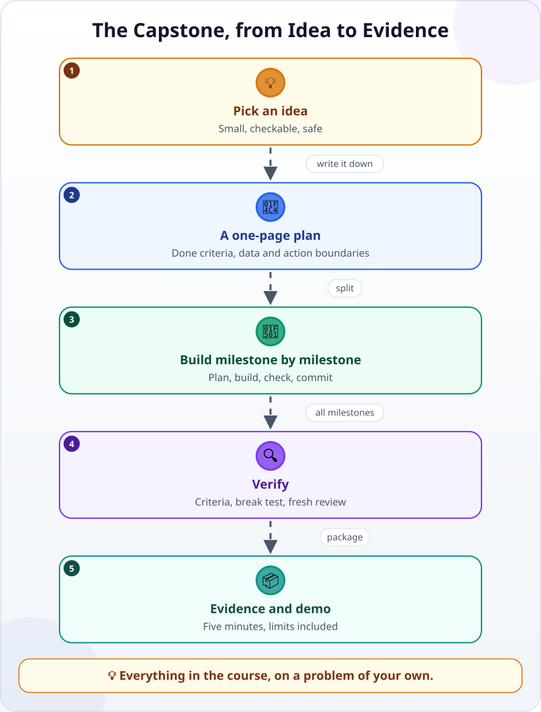
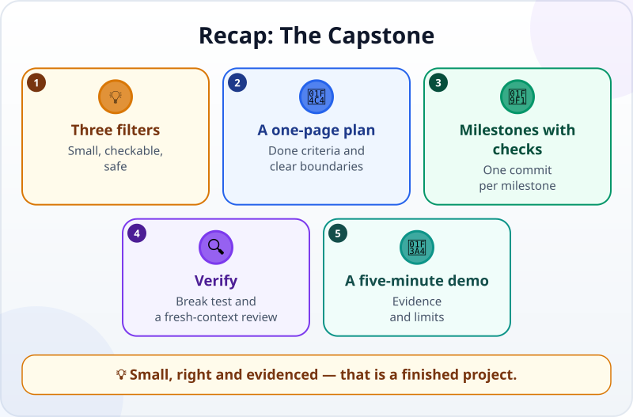

🌐 [Tiếng Việt](../../vi/lessons/capstone-your-idea.md) · **English** · [日本語](../../ja/lessons/capstone-your-idea.md)

# Capstone: Your Own Idea

<!-- section: objective -->
## Lesson Objective

By the end of this project, you will be able to:

- Choose a problem that is **the right size**: done in about two hours, checkable, and safe.
- Lead a project from start to finish with an agent: a one-page plan, milestones with checks, verification, an evidence pack.
- Present the result to someone else in five minutes — including its limits.

<!-- section: hook -->
## Why It Matters

By now you have watched an agent work, written specs, read diffs, written checks, used Git, set guardrails and done two projects with a given brief. This time there is no brief.

Tuấn has a small problem of his own: he is learning technical Japanese, and his new words are scattered across notebooks, photos and messages. He wants a simple vocabulary review page on his personal laptop. It sounds small — but to make it **right**, **safe** and **usable for a long time**, he will need almost everything in the course.

<!-- section: concept -->
## Core Idea

### Choosing an idea: three filters

Write down three ideas, then put each one through three filters:

- **Small:** the first version is done in about two hours. Too big? Cut it down to its core.
- **Checkable:** you can say in advance *what "right" means*, with specific numbers or behavior.
- **Safe:** only made-up data — a sample you invent with the same columns and formats, never your real files, notes or photos; no company data, no other people's data, no passwords or API keys.

A good capstone idea is often a repeated task of your own: a personal spreadsheet, a small page, a tool that converts a file format. Only an idea that passes all three filters is worth building.

### A one-page plan

Before you open the agent, write **one page** — combining what you learned about [good specs](writing-good-specs.md) and [the three kinds of action](data-safety-and-permissions.md):

- **The problem and the user:** who uses it, when, and how it is done today.
- **Done criteria:** 3–5 checkable conditions.
- **Data boundaries:** which data it uses; what ⛔ never goes in.
- **Action boundaries:** what the agent may do by itself (✅), what it must ask about (✋), what it must never do (⛔).
- **Not doing:** what you are deliberately leaving for next time.

### From the plan to the evidence



Split the project into **2–4 milestones**, each with its own check. For each milestone, go around the familiar loop of [explore → plan → build → verify](explore-plan-build-verify.md), add structure when the task needs it (as in [Add Structure When the Task Needs It](workflow-frameworks.md)), and commit when the milestone passes. At the end, [pack the evidence](project-retrospective.md) and present it.

<!-- section: example -->
## Real Example

Tuấn's one-page plan, shortened:

```text
Problem: my technical Japanese vocabulary is scattered everywhere; I want to review for 10 minutes each evening.
User: only me, on my personal laptop (not the company PC).
Done criteria:
1. The page review.html reads the word list from words.csv (columns: word, reading, meaning).
2. It shows one word at a time; only after "Show meaning" does it show the reading and meaning.
3. Buttons "Got it" and "Not yet"; a "Not yet" word comes back after 2 other words (at the end of the session if fewer than 2 remain).
4. A check with 5 sample words:
   a) pressing "Got it" for all 5: each word appears exactly once, then "Session done" appears;
   b) pressing "Not yet" on word 1: the next words shown are word 2, word 3, then word 1.
Data: only a made-up sample list of about 20 words that I type in myself (not my real notebooks, photos or messages); no drawings, documents or project names from work. ⛔
Actions: the agent edits files in ai-practice/review by itself (✅); installing libraries, deleting files (✋); sending data anywhere (⛔).
Not doing this time: syncing to my phone, pronunciation audio.
```

He splits it into three milestones: (1) read the CSV and show a word, (2) the "Show meaning" and "Got it / Not yet" buttons, (3) the 5-word check. At milestone 3, check (b) fails: a "Not yet" word comes back **immediately**, so the same word repeats forever — a bug he did not notice when he clicked around by hand at milestone 2. The agent fixes it, the check passes, he commits. Before calling it done, he opens a new session for a separate review, giving it only the plan and the whole diff since his first commit. The review asks: what if the CSV has a comma inside a meaning? He adds such a word to the sample data, fixes it, and writes in the limits what has not been tried.

The five-minute demo for a friend: the problem (30 seconds), the demo (2 minutes), the check evidence (1 minute), limits and next steps (1 minute), questions.

<!-- section: try-it -->
## Try It Yourself

About 120 minutes, in a new folder inside `ai-practice`, in the mode where the agent asks first. Start with a baseline: in the new folder write a one-line `README.md` (the project's name) and commit it — if `ai-practice` is not a Git repository yet, run `git init` first. That is your starting commit. (On the watch-only route? Do steps 1–3 on paper: that is already the harder half of the project.)

**1. Pick an idea (15 minutes).** Write down three ideas. Put each one through the three filters: small, checkable, safe. Keep one. None passes? Cut your best idea down until it does.

**2. Write the one-page plan (15 minutes)** with the five parts above. The done criteria must be checkable with specific numbers or behavior. Ask the agent to read the page and ask about anything unclear — **without building anything yet**.

**3. Split into milestones (10 minutes).** 2–4 milestones, each with a *"done when…"* sentence and a way to check it.

**4. Build each milestone (45 minutes).** For each milestone: plan (read it with the three questions), build, read the diff, run the check, commit. The agent is stuck or going off track? Interrupt early and give a clear new direction.

**5. Verify (15 minutes).** Check every done criterion yourself. Break something on purpose to see the check fail, then put it back (`git restore THE_FILE_YOU_BROKE` — ✋, the agent will ask). Open a new session for a separate review: give it the plan and the whole change since your starting commit (ask the agent for the `git diff` from that commit to the latest one — a plain `git diff` is empty once everything is committed), and ask it to find what is missing.

**6. Evidence pack and demo (20 minutes).** Write `EVIDENCE.md` (spec, before and after, checks, limits, one improvement) and run the stranger test. Give a five-minute demo to someone — a friend, a family member, a colleague — or record it for yourself.

**Evidence:**

- *I can show…* the working project, the one-page plan, the Git history milestone by milestone, and `EVIDENCE.md`.
- *I checked…* every done criterion; the check fails when I break something on purpose; a review in a fresh context.
- *I would not use this when…* the project needs real data (company data, other people's data or your own personal files) rather than made-up data, or someone relies on it before anyone but me has checked it.

<!-- section: misconceptions -->
## Common Misconceptions

- **"A capstone has to be impressive."** — A small task done right, with evidence, teaches you more than a big one left half-done. Save the big one for next time, with this project as a base.
- **"It only means something with real company data."** — In this course, company data is still ⛔, even just for learning. Made-up data with the same structure is enough to prove the method.
- **"It runs, so it's done."** — It is done when the criteria have been checked, there is evidence, and someone else understands its limits.

<!-- section: recap -->
## The Lesson in One Picture



<!-- section: takeaways -->
## Key Takeaways

- Choose the idea through three filters: small, checkable, safe.
- Write a one-page plan first: the problem, done criteria, data and action boundaries, what you are not doing.
- Split into milestones; each has a check and a commit.
- Verify with the criteria, a break test and a review in a fresh context.
- Pack the evidence and demo it in five minutes — limits included.
