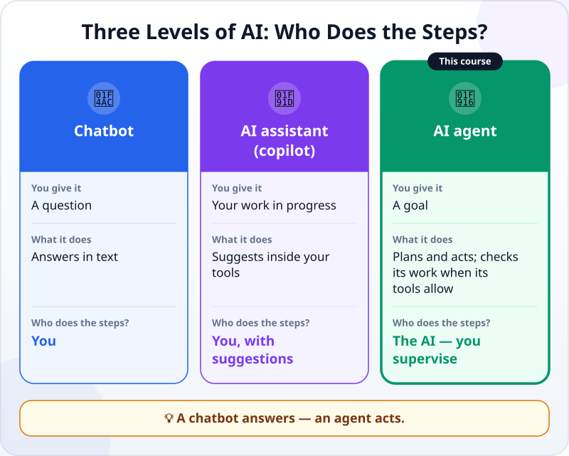
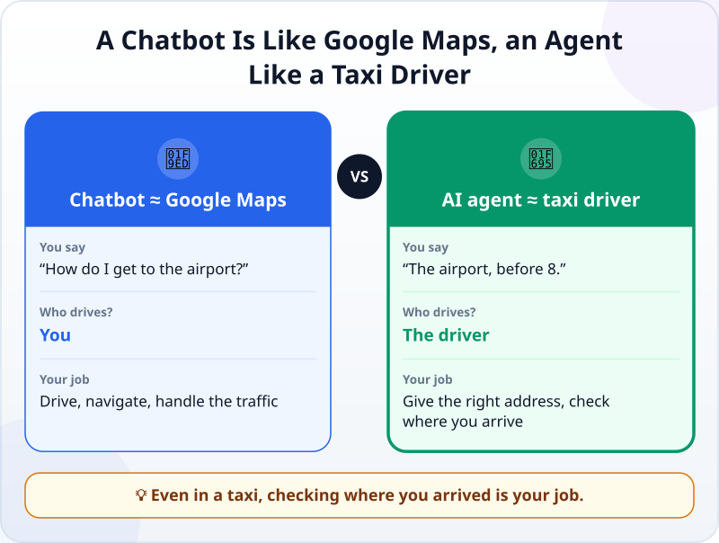
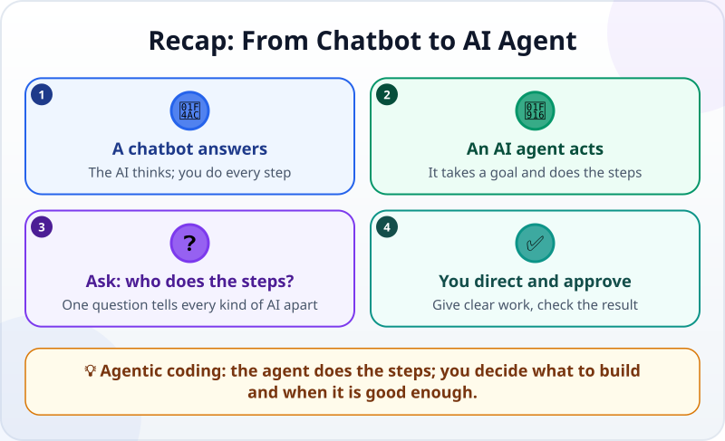

🌐 [Tiếng Việt](../../vi/lessons/chatbot-to-agent.md) · **English** · [日本語](../../ja/lessons/chatbot-to-agent.md)

# From Chatbot to AI Agent: AI That Does the Work, Not Just Answers

<!-- section: objective -->
## Lesson Objective

By the end of this lesson, you will be able to:

- Tell a **chatbot**, an **AI assistant** and an **AI agent** apart with one simple question: *who performs the steps?*
- Explain why **agentic coding** — building software with AI agents — turns you from the person doing the work into the person directing and approving it.

<!-- section: hook -->
## Why It Matters

Think back to the last time you asked ChatGPT, Gemini or Claude for help with something concrete, such as *"How do I total this month's spending from three Excel files?"*

The answer was great: five steps, formulas included. But then **you** still had to open each file, copy the formulas, fix the errors and come back to ask again…

Now imagine a different kind of AI. You state the goal, and it **opens the files, writes the formulas and runs them itself**, then reports back: *"Done — September spending comes to $1,240. Here is what I did."*

That kind of AI has a name: an **AI agent**. And it is changing the way people build software.

<!-- section: concept -->
## Core Idea

### Three levels of AI you will meet

The single most useful question is: **who performs the steps?**

- **Chatbot:** the AI thinks, you do. It answers; every step is yours.
- **AI assistant (copilot):** the AI makes suggestions inside the tools you are using, but you still take each step.
- **AI agent:** the AI thinks *and* does. You hand it a goal; the agent chooses and carries out the steps, then reports back.

### What is agentic coding?

When agents are used to build software — writing code, running it, fixing bugs — we call it **agentic coding**. You do not type every line; your role is **assigning the work, setting the criteria and checking the result**. This course teaches exactly that skill, plus just enough about software to do it well.

<!-- section: analogy -->
## Simple Analogy

You need to get from home to the airport.

- **A chatbot is like Google Maps:** it gives detailed directions — but **you** drive, deal with the traffic jams and find a parking space.
- **An AI agent is like a taxi driver:** you just say *"the airport, before 8 o'clock."* The driver picks the route, detours around traffic and gets you there.

But notice: even in a taxi, **you still have to give the right address and check that you arrived at the right terminal**. The comparison has a weak spot, too: a taxi driver rarely drives to the wrong city, while an agent sometimes misunderstands a request with great confidence — so with an agent, the check matters even more.

<!-- section: example -->
## Real Example

The task: *build a birthday invitation web page for Alex, who is turning five — dinosaur theme, with an "RSVP" button.*

**With a chatbot:**

1. You ask; the chatbot gives you a block of HTML.
2. You create a file, paste the code in and open it in a browser.
3. The button does not work, so you copy the error message and paste it back into the chat.
4. You repeat steps 2–3 until it works. You performed every step.

**With an AI agent that builds software** (for example Claude Code or Codex — tool names as of September 2026):

1. You type the request above.
2. The agent creates the folder and files, writes the HTML and CSS, and opens the page to try it.
3. If the tool lets it run the page, the agent may notice the broken button, read the error, fix it and run it again. Not every agent can do this, and a fix is not always right.
4. It reports: *"Done. I created three files; here is how to open the page."* You look at it and ask for changes: *"Make it green and add the party date and time."*

Same goal — but with an agent, **you move from doing the work to directing and approving it**.

<!-- section: try-it -->
## Try It Yourself

No installation needed; it takes about five minutes:

1. Which of these two tasks only needs an **answer** from a chatbot, and which needs an agent to **do the steps**?
   - *"Explain the VLOOKUP formula in Excel."*
   - *"Combine these 12 monthly report files into one table, remove duplicate rows and save it as a new file."*
2. Pick a task **of your own** that you would like to hand to an agent. Write the goal in **one sentence**.
3. Add **one criterion** you would use to check that the agent did it right, for example: *"The new file covers all 12 months, and its total sales match the total of the 12 files."*

Answer to question 1

Explaining VLOOKUP only needs an answer, so a chatbot is enough. Combining 12 files takes several real steps (open, merge, filter, save), which suits an agent.

Keep your goal and criterion — you will use them again when you learn to write requests for an agent.

<!-- section: misconceptions -->
## Common Misconceptions

- **"An agent is a humanoid robot."** — No. An agent is software; its "hands" are tools on a computer.
- **"You have to be a programmer to use agents."** — Not to start. This course teaches you just enough about software to give clear instructions and spot problems early.
- **"Agents will replace people entirely."** — Agents take over many *steps*; people still decide *what* to build, *for whom*, and *what counts as done*.

<!-- section: recap -->
## The Lesson in One Picture

<!-- section: takeaways -->
## Key Takeaways

- A chatbot **answers**; an AI agent **acts** to reach a goal.
- The deciding question: **who performs the steps?**
- Agentic coding = building software with AI agents: the agent does the steps, **you assign the work and check the result**.

<!-- section: quiz -->
## Quick Check

**Question 1.** What is the biggest difference between a chatbot and an AI agent?

- A) An agent uses a bigger AI model
- B) An agent carries out the steps to reach a goal, while a chatbot only answers
- C) An agent never makes mistakes

**Question 2.** Which of these tasks needs an AI agent rather than a chatbot?

- A) Explaining what a "variable" is in programming
- B) Creating the files for a web page, running it and fixing errors until it works
- C) Translating a sentence into Japanese

**Question 3.** An agent says "done." What should you do next?

- A) Trust it completely and use it right away
- B) Check the result against the criteria you set
- C) Make the agent redo everything, just to be safe

Show answers

1. **B** — the agent does the steps; model size is not the difference, and agents can still be wrong.
2. **B** — it takes several real actions (creating files, running, fixing), not just an answer.
3. **B** — assigning the work and approving it is always your responsibility.

<!-- section: sources -->
## Recommended Sources

- Anthropic — [Building Effective AI Agents](https://www.anthropic.com/engineering/building-effective-agents) (December 2024)
- Anthropic — [Claude Code overview](https://code.claude.com/docs/en/overview)
- Google Cloud — [What is agentic coding?](https://cloud.google.com/discover/what-is-agentic-coding)
- IBM — [What is Agentic AI?](https://www.ibm.com/think/topics/agentic-ai)
