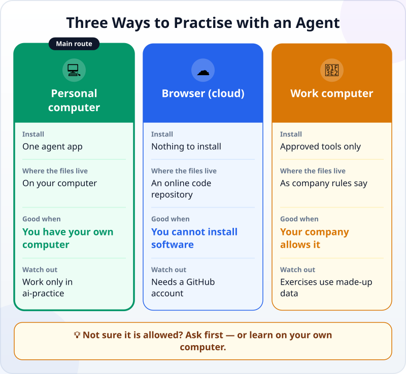
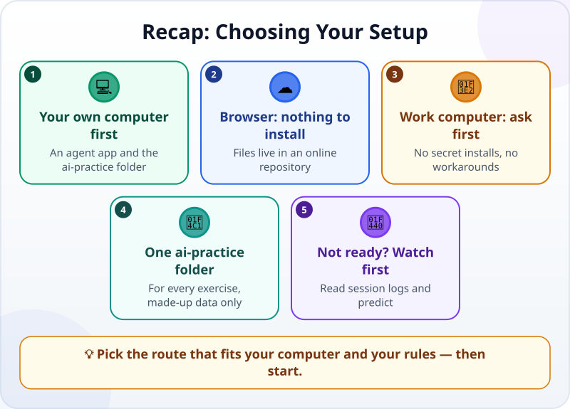

🌐 [Tiếng Việt](../../vi/lessons/choose-your-learning-setup.md) · **English** · [日本語](../../ja/lessons/choose-your-learning-setup.md)

# Choose Your Setup: Browser, Personal PC or Work PC

<!-- section: objective -->
## Lesson Objective

By the end of this lesson, you will be able to:

- Compare three ways to practise with an agent: **your own computer**, **the browser (cloud)** and **a work computer**.
- Choose the one that fits your computer, your accounts and the rules where you work.
- Have your `ai-practice` folder ready — or know whom to ask first.

<!-- section: hook -->
## Why It Matters

Tuấn is a mechanical engineer in Japan. After watching an agent session, he wants to try one at once — but his work laptop blocks software installs, and he is not sure his company allows AI tools at all.

Practising in the wrong place can cost you an afternoon of setup or, worse, break your company's rules. Ten minutes spent choosing well now makes every later lesson go smoothly.

<!-- section: concept -->
## Core Idea

### Three routes and how they differ

- **💻 Your own computer — the course's main route.** You install an agent app, choose the `ai-practice` folder and hand over the work. The files sit on your computer, so checking them yourself is easy. For example (as of September 2026): the Claude desktop app has a *Code* tab that runs on macOS and Windows; you choose to run on your machine (*Local*) and pick a working folder — no typing commands.
- **☁️ The browser (cloud).** The agent runs on the provider's servers; all you need is a browser. In exchange, the files live in an online code repository (usually GitHub), so you need a GitHub account and must download the files to open them on your computer. It suits you when you cannot install software — on a computer you are allowed to use.
- **🏢 A work computer.** Use only the tools your company has approved, in the way it allows. No secret installs, no getting around the rules, no company data in personal accounts. Not sure? Ask your IT team or your manager first.

### Before you choose: three things to know

- **Accounts:** many agent tools need a paid account. For example, as of September 2026, Claude Code needs a Pro, Max, Team or Enterprise plan or a Console account; the free plan does not include it. Check the page of the tool you choose.
- **Your computer:** the AI model does not run on your computer but on the provider's servers. Your computer only needs to be recent enough and online — for Claude Code, macOS 13 or Windows 10 or later with at least 4 GB of RAM.
- **Not ready yet?** You can still learn on the **watch-only route**: read the session logs in the lessons, predict the next step, do the quizzes — and set up later.

### One folder for every exercise

Whichever route you take, every exercise in this course happens in **one separate folder called `ai-practice`**, with made-up data only. A separate folder helps **you** keep track of what the agent does and where. But it is not a fence around the agent: what an agent may do depends on the permissions you give it — which you will learn when you sort actions into [safe, ask first and never](data-safety-and-permissions.md).

<!-- section: try-it -->
## Try It Yourself

About 10 minutes.

1. **Answer three questions:**
   - Do you have your own computer (macOS 13 or Windows 10 or later) on which you may install software?
   - Do you have, or are you ready to sign up for, an account with an agent tool?
   - If you plan to use a work computer: has your company approved that tool?
2. **Pick your route** from the answers:
   - Your own computer and an account → 💻 **your own computer**.
   - You cannot install software, and you have or will create a GitHub account → ☁️ **the browser**.
   - Your company has approved the tool → 🏢 **the work computer**, exactly as the rules say.
   - None of these yet → 👀 **watch only**, and set up later.
3. **Prepare your workspace:**
   - 💻 Create a folder called `ai-practice` in your Documents folder. Inside it, create a file `README.txt` that says: *"Practice folder for working with an AI agent. Made-up data only."*
   - ☁️ Follow the tool's getting-started guide to connect GitHub, then create an empty repository called `ai-practice`.
   - 🏢 If the rules are unclear, send this message to IT or your manager: *"I would like to learn to use the AI agent [tool name] with made-up data in a separate folder. Is that allowed on my work computer?"*
   - 👀 Note down which computer you will use, and when you will set it up.
4. **Write your evidence** (three lines):
   - *I can show…* — for example: the `ai-practice` folder with its `README.txt`.
   - *I checked…* — for example: my computer meets the requirements, I have an account, my company allows it.
   - *I would not use this when…* — for example: I need to work with real company data.

<!-- section: misconceptions -->
## Common Misconceptions

- **"A work computer is like a home computer — just install and go."** — No. Work computers come with rules about software and data; installing on your own or working around the rules can get you into real trouble. Ask first.
- **"You need a powerful computer to run an agent."** — The AI model runs on the provider's servers. Your computer only needs to be recent enough and online.
- **"With a separate folder, the agent cannot touch anything else."** — A separate folder is a boundary for you, not a fence for the agent. What the agent may do is decided by its permissions.

<!-- section: recap -->
## The Lesson in One Picture

<!-- section: takeaways -->
## Key Takeaways

- Three routes: **your own computer** (the main route), **the browser** (nothing to install, files online), **a work computer** (only when allowed).
- On a work computer: approved tools only; no secret installs, no workarounds, no company data in personal accounts.
- Every exercise happens in the `ai-practice` folder, with made-up data only.
- Not ready to set up? Start on the watch-only route.

<!-- section: quiz -->
## Quick Check

**Question 1.** Your work computer blocks software installs. What should you **not** do?

- A) Ask IT whether the company has approved any AI tool
- B) Learn on your own computer with made-up data
- C) Find a way around the block to install the tool

**Question 2.** When you use an agent in the browser (cloud), where do the files it makes live?

- A) Always on your computer's hard drive
- B) In an online code repository; you download them when you need them
- C) Nowhere at all

**Question 3.** Why does every exercise happen in the `ai-practice` folder?

- A) To make the agent faster
- B) To keep track of what the agent does and where, with made-up data only
- C) Because the agent cannot open any other folder

Show answers

1. **C** — getting around your company's rules is never acceptable, not even to learn.
2. **B** — a cloud agent works in an online repository, not on your hard drive.
3. **B** — the folder helps you keep track; what the agent may do is decided by its permissions, so C is wrong.

<!-- section: sources -->
## Recommended Sources

- Anthropic — [Advanced setup](https://code.claude.com/docs/en/setup): Claude Code's system requirements and the accounts it needs (as of September 2026).
- Anthropic — [Desktop application](https://code.claude.com/docs/en/desktop): the *Code* tab of the Claude app; choosing to run on your machine (*Local*) or in the cloud (*Cloud*), and choosing a working folder.
- Anthropic — [Use Claude Code in the cloud](https://code.claude.com/docs/en/claude-code-on-the-web): cloud sessions run on the provider's infrastructure and need access to your GitHub repositories.
