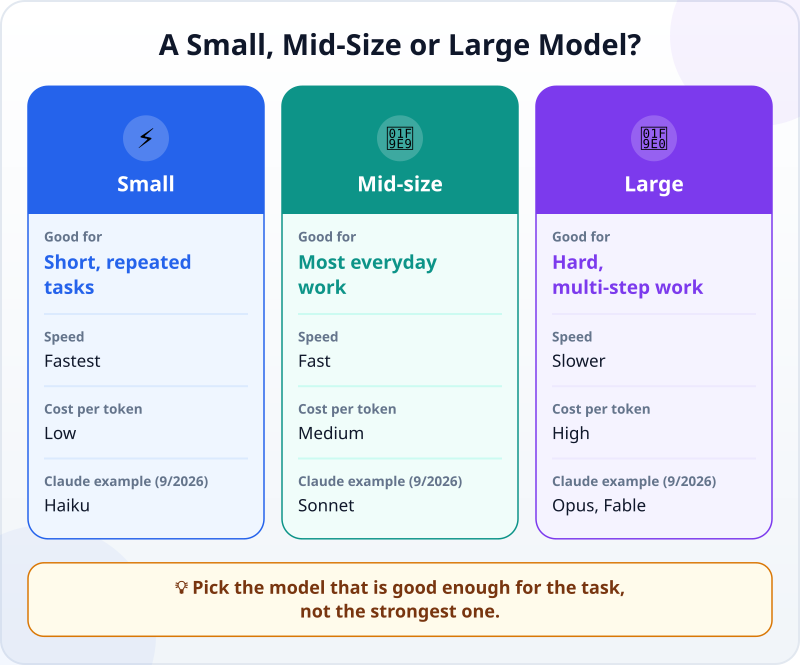
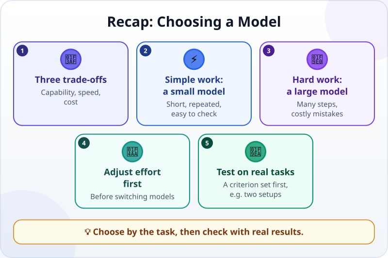

🌐 [Tiếng Việt](../../vi/lessons/choosing-models.md) · **English** · [日本語](../../ja/lessons/choosing-models.md)

# Choosing a Model: Big or Small, Fast or Slow, Cheap or Costly

<!-- section: objective -->
## Lesson Objective

After this lesson, you will be able to:

- Name the three things you trade off when you choose a **model**: capability, speed and cost.
- Pick a sensible starting point for a task: a small model for simple, repeated work; a large model for hard, multi-step work.
- Compare two setups (two models, or two effort levels) on the same real task yourself and decide from results you have checked.

<!-- section: hook -->
## Why It Matters

Hana works in an office in Tokyo. Since she found out that her company's AI tool lets her choose the model, she always picks the strongest one — for everything, even fixing one typo in an email. The answers are always good, but she often has to wait, and some weeks she runs out of her usage allowance by Wednesday.

Her colleague at the next desk laughs: *"Are you renting a truck to buy a sandwich?"* Hana wonders: so which model should she use for which task, and how can she tell if a small model is "good enough"?

<!-- section: concept -->
## Core Idea

### One company, several model sizes

AI companies usually offer a family of models in several sizes. For example, as of September 2026, Anthropic offers Claude Haiku (fast and economical), Claude Sonnet (for most everyday work, coding included), Claude Opus (for complex work and long-running agents) and Claude Fable (the most capable, for the hardest and longest tasks). Other companies have similar sizes. Names and versions change quickly, so remember **how to choose**, not the names.



### Three things to trade off

Anthropic's documentation describes choosing a model as a balance between three things:

- **Capability:** a large model does better on hard work — many steps, deep understanding, complex code.
- **Speed:** a small model answers faster.
- **Cost:** a large model costs more per [token](tokens.md). Whether you pay for a plan or by usage, heavier models usually use up your allowance faster.

No model wins all three. The "best" model is the one that is **good enough for this task**, at a speed and cost you can accept.

### Two ways to start

- **Small first:** start with a small model, test it carefully, and move up only when you see it fall short in a specific way. Good for simple work you do many times and want fast.
- **Strong first:** start with a strong model, get the result right, then try stepping down. Good for hard, multi-step work, or work where a mistake costs more than waiting.

### Try adjusting effort before switching models

In [Models That "Think"](reasoning-models.md), you met the **effort level**. Anthropic's documentation (September 2026) says that adjusting it is often a better lever than switching models: with the same model, low effort is faster and more economical, and high effort thinks more carefully.

### Check it on real work

Comparison tables and marketing do not know *your* work. And when a small model cannot handle a task, it rarely says so — a wrong answer still sounds very confident. The same documentation calls a few tests taken from your own work, checked against a criterion set in advance, the most important step — the same way you accept an agent's work. The easiest way to see the difference is to run the same request on **two setups**: two models, or one model at two effort levels.

<!-- section: example -->
## Real Example

Hana picks three tasks from her week, uses made-up data, and runs each on a small model and a strong one: rewriting an apology email to a customer, sorting 30 comments into 4 groups (compared with 10 she sorted herself beforehand), and planning a reorganization of the shared folder under the constraint "delete no files". On the first two, both models pass, and the small one is clearly faster. On the third, the small model's plan has a step that deletes files with duplicate names — breaking the constraint. Hana writes down a rule for herself:

```text
Short, repeated, easy to check    → small model
Many steps, mistakes are costly   → strong model (or high effort)
Not sure                          → try both, check against the criterion
```

That rule fits Hana's work; on your work, the results may differ.

<!-- section: try-it -->
## Try It Yourself

About 8 minutes, in `ai-practice`, with made-up data only. You need a tool that lets you choose either the model or the effort level — one of the two is enough. For example, as of September 2026, in Claude Code you type `/model haiku`, `/model sonnet` or `/model opus` to switch models; chat apps usually have a model picker near the message box. If your tool offers only an effort level, compare low and high effort. Below, **two setups** means a small and a large model, or low and high effort.

**1. Run three tasks on two setups (6 minutes).** Paste exactly the same request to the small setup (small model or low effort) and to the large one (large model or high effort). Use a new conversation for every run — each task, each setup (in Claude Code: type `/clear`) — so the second setup cannot see the first one's answer.

*Task A — your own task:* pick a short task you often do, use made-up data, and **write your pass criterion before you run it**. If nothing comes to mind, use the sample below, with this criterion: polite (no orders, includes a thank-you or an apology), keeps the points (the file is 2 days late and is needed for tomorrow's meeting), 3 sentences at most.

```text
Rewrite this message so it is polite, in 3 sentences at most:
"You sent the file 2 days late. Send it now, I have a meeting tomorrow."
```

*Task B — adding up amounts by group:*

```text
Give the total for each group (Meals, Travel, Stationery) and the grand total:
Lunch $14; Taxi $23; Printer paper $8; Lunch $12;
Taxi $18; Pens $5; Coffee with a client $19; Bus $3.
```

*Task C — a schedule with several constraints:*

```text
Put 4 tasks into 4 Monday time slots: 9:00, 10:00, 11:00, 14:00 (each task takes 1 hour; the lunch break is from 12:00 to 14:00).
Tasks: Write report, Send report, Team meeting, Call client.
- Write report and Team meeting must both be done before Send report.
- Send report must happen before the lunch break.
- The client only answers the phone from 11:00 onwards.
- The team lead arrives at 10:00, so no meeting at 9:00.
Give the schedule and check each condition again.
```

**2. Record the results (1 minute)** in the file `ai-practice/model-comparison.md`, as a small table: for each task and each setup, *fast or slow* and *passed or failed*. Tasks B and C have correct answers below — compare them after you have run everything.

**3. Write your own rule (1 minute)** on the model of Hana's, in the same file, then write down your evidence:

- *I can show…* the file `model-comparison.md`: the table comparing three tasks on two setups, and my rule.
- *I checked…* the totals in task B and the schedule in task C match the answers; the result of task A meets every criterion I wrote in advance.
- *I would not use this when…* for example: I have tried each task only once and would draw a conclusion for a whole kind of large, important work.

<details>
<summary>Answers for tasks B and C</summary>

**Task B:** Meals $45 ($14 + $12 + $19) · Travel $44 ($23 + $18 + $3) · Stationery $13 ($8 + $5) · **Grand total $102**.

**Task C** has only one correct schedule: 9:00 Write report · 10:00 Team meeting · 11:00 Send report · 14:00 Call client. Send report must come after two other tasks and before lunch, so it can only be at 11:00; Team meeting cannot be at 9:00, so it is at 10:00; Call client gets the remaining 14:00.

</details>

<!-- section: misconceptions -->
## Common Misconceptions

- **"The strongest model is always the right choice."** — For simple work, it mostly makes you wait longer and uses more of your allowance, with no better result.
- **"A small model is a bad model."** — It is built for fast, frequent, simple work, and it does that work well. Just do not give it work beyond it without checking.
- **"One try tells you everything."** — AI answers can differ from one run to the next. For important work, try a few times and a few examples before you choose.

<!-- section: recap -->
## The Lesson in One Picture



<!-- section: takeaways -->
## Key Takeaways

- Choosing a model is a trade-off between capability, speed and cost; no model wins all three.
- Short, repeated, easy-to-check work: start with a small model.
- Hard, multi-step work where mistakes are costly: start with a strong model.
- Try adjusting the effort level before switching models.
- Check it on real work against a criterion set in advance — for example, two setups on the same task.

<!-- section: quiz -->
## Quick Check

**Question 1.** Every day you need to sort a few hundred short comments into 4 groups. How should you start?

- A) Use the strongest model to be safe, no testing needed
- B) Try a small model on a sample you sorted yourself beforehand, check it, then use it
- C) Choose the model with the newest name

**Question 2.** For simple questions, the large model you use answers much more slowly than you need. What should you do first?

- A) Switch to an even larger model
- B) Write a longer prompt so the model understands better
- C) Lower the effort level, or use a smaller model for this kind of task

**Question 3.** How can you tell whether a small model is "good enough" for your work?

- A) Run it on a few real tasks and check against a criterion set in advance
- B) Ask the small model whether it can do the job
- C) See which model tops a ranking online

<details>
<summary>Show answers</summary>

1. **B** — short, repeated, easy-to-check work suits "small first"; a sample you have already sorted tells you whether it is good enough.
2. **C** — the effort level is often a better lever than switching models; a larger model or a longer prompt only makes it slower.
3. **A** — rankings and a model's opinion of itself do not know your work; checked results do.

</details>

<!-- section: sources -->
## Recommended Sources

- Anthropic — [Choosing the right model](https://platform.claude.com/docs/en/about-claude/models/choosing-a-model) (English, as of September 2026): choosing a model balances capabilities, speed and cost; two ways to start (efficiency-first with Claude Haiku, capability-first with Claude Opus); tuning effort is often a better lever than switching models; a good set of tests for your own use case is the most important step.
- Anthropic — [Model configuration](https://code.claude.com/docs/en/model-config) (English, as of September 2026): in Claude Code, the `/model` command switches models; `haiku` for simple tasks, `sonnet` for daily coding, `opus` for complex reasoning, `fable` for the hardest and longest tasks.
