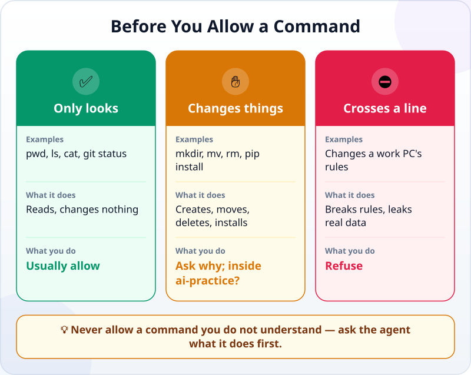
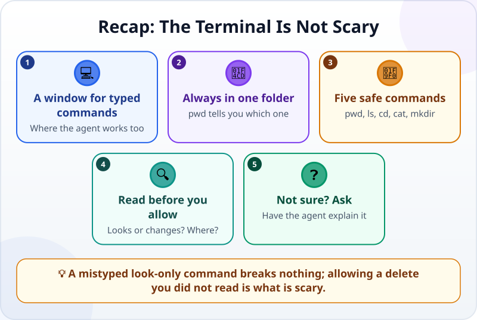

🌐 [Tiếng Việt](../../vi/lessons/command-line-basics.md) · **English** · [日本語](../../ja/lessons/command-line-basics.md)

# The Terminal Is Not Scary: Your First Five Safe Commands

<!-- section: objective -->
## Lesson Objective

By the end of this lesson, you will be able to:

- Open a terminal right in your `ai-practice` folder and use five safe commands: `pwd`, `ls`, `cd`, `cat`, `mkdir`.
- Read a command an agent asks to run: does it only look, or will it change something, and where?
- Decide to allow, ask or refuse, using the three kinds of action ✅ ✋ ⛔.

<!-- section: hook -->
## Why It Matters

Tuấn is working with an agent on his own computer, in the mode where it asks before each change. Halfway through, the agent asks: *"Allow the command `rm -rf build`?"* (In PowerShell, the same job is `Remove-Item build -Recurse -Force`.) Tuấn has no idea what it does. Click No, and the agent might get stuck; click Yes, and he might lose files. He clicks Yes to keep things moving.

This time he was lucky: `build` was just a folder the agent had created. But luck is not a way to manage work. Fifteen minutes with the terminal will let you read questions like this one.

<!-- section: concept -->
## Core Idea

### What is a terminal?

A **terminal (command line)** is a window where you type commands instead of clicking with the mouse. On Windows the built-in one is **PowerShell**; on a Mac it is the **Terminal** app. An agent does most of its work on a computer through exactly these commands: listing files, running programs, running checks, installing libraries.

A command is a **command name**, usually followed by **what it acts on**: in `cd ai-practice`, `cd` is the command ("go into a folder") and `ai-practice` is what it acts on. A terminal also always "stands" in one folder — the current folder — like a folder you have open in File Explorer. On Windows, the prompt `PS C:\Users\Tuan>` tells you that you are in PowerShell, in the folder `C:\Users\Tuan`.

### Five safe commands

| Command | What it does | Does it change anything? |
|---|---|---|
| `pwd` | Shows which folder you are in | No |
| `ls` | Lists what is in the folder | No |
| `cd <folder>` | Goes into a folder; `cd ..` goes up one level | No, it only moves you |
| `cat <file>` | Prints a file's contents so you can read it | No |
| `mkdir <name>` | Creates a new folder | Yes — it adds, it deletes nothing |

All five work in PowerShell and in the Mac Terminal; only the way the results look differs a little. The first four only look. `mkdir` is the first change, and it stays safe when the new folder is inside `ai-practice`.

### Reading the commands an agent asks to run



For example, as of September 2026, Claude Code in its default mode runs some read-only commands such as `ls`, `cat` and `git status` without asking, and asks you first before commands that can change your computer. In other words: **a command that shows up asking for permission is usually one that can change something** — all the more reason to read it.

Before you click allow, answer three questions:

1. **What command?** Does it only look — or create, move, delete, install, send?
2. **Where?** Is the path in the command inside `ai-practice`? Does a `..`, `~`, `C:\` or `/` lead outside it?
3. **Can it be undone?** `rm -rf <folder>` (Mac Terminal or Git Bash) and `Remove-Item <folder> -Recurse -Force` (PowerShell) delete a whole folder and everything in it, **without going to the Recycle Bin or Trash**. Read these commands; do not run them.

If you cannot answer, do not allow it yet: ask the agent *"What does this command do, and which files does it change?"*. Commands can look a little different from one computer to another — on Windows, Claude Code uses PowerShell, or Mac-style commands if Git for Windows is installed — but the three questions stay the same.

<!-- section: try-it -->
## Try It Yourself

About 12 minutes, on your own computer, in `ai-practice`. On a work computer, do it only if your company allows PowerShell; if not, read along and skip the typing — never look for a way around the rule.

**1. Open a terminal right in `ai-practice` (2 minutes)**

- **Windows:** open the `ai-practice` folder in File Explorer, click the address bar, type `powershell` and press Enter — PowerShell opens in that folder. Use this File Explorer method first. If you instead open PowerShell elsewhere, the displayed name may be translated and Documents may have been moved into OneDrive; use the folder’s actual path rather than assuming `cd Documents`.
- **Mac:** `Cmd + Space`, type `Terminal`, Enter. Type `cd ` (with one space), drag the `ai-practice` folder from Finder onto the Terminal window, then press Enter.

**2. Five commands (5 minutes)** — type one line at a time, press Enter after each, and guess the result first:

```text
pwd
ls
cat README.txt
mkdir test-folder
ls
cd test-folder
pwd
cd ..
```

On Windows, if accented or non-English letters show up as strange symbols, type `cat README.txt -Encoding utf8`: the file is fine; that is just how PowerShell reads it.

**3. Read the agent's commands (5 minutes)** — in your agent app, in the mode where it asks first, send:

```text
Create a folder called reports in this folder, then list the files.
Then explain both delete commands without running them: rm -rf test-folder (Mac Terminal or Git Bash), and Remove-Item test-folder -Recurse -Force (PowerShell).
```

When the agent asks to run a command, answer the three questions before you allow it. Then read its explanation of `rm -rf <folder>` (Mac Terminal or Git Bash) and `Remove-Item <folder> -Recurse -Force` (PowerShell), and compare it with the table above. Read them; do not run them.

Want to get rid of `test-folder`? Delete it in File Explorer or Finder as usual — it goes to the Recycle Bin or Trash, so you can get it back.

Write your evidence:

- *I can show…* the terminal window with the `pwd` result ending in `ai-practice`, and the new `test-folder`.
- *I checked…* that `test-folder` and `reports` also appear in File Explorer or Finder.
- *I would not use this when…* for example: my work computer does not allow PowerShell — then I ask the IT team.

<!-- section: misconceptions -->
## Common Misconceptions

- **"The terminal is only for IT people."** — It is just another way to give the computer instructions. You do not need to memorize it; you need to understand the commands an agent asks to run.
- **"One wrong command will break my computer."** — These five only look or add; mistype a name and the terminal shows an error, nothing more. What deserves care are delete commands, install commands, and commands copied from the internet that you do not understand.
- **"If the agent asks to run a command, just allow it — it knows best."** — An agent can pick the wrong folder, and delete commands skip the Recycle Bin. Read first; if you do not understand, ask.

<!-- section: recap -->
## The Lesson in One Picture



<!-- section: takeaways -->
## Key Takeaways

- A terminal is a window for typed commands — and it is where an agent works.
- A terminal always stands in one folder; `pwd` tells you which.
- Five safe commands: `pwd`, `ls`, `cd` and `cat` only look; `mkdir` adds.
- Before you allow a command: does it look or change? Where? Can it be undone?
- Do not allow a command you do not understand — ask the agent to explain it first.

<!-- section: quiz -->
## Quick Check

**Question 1.** Which command shows the folder the terminal is in?

- A) `ls`
- B) `mkdir`
- C) `pwd`

**Question 2.** The agent shows `rm -rf build` (Mac Terminal or Git Bash) and `Remove-Item build -Recurse -Force` (PowerShell). You are reading them, not running them. What would either command do?

- A) Lists the files in the `build` folder
- B) Deletes the `build` folder and everything in it, without going to the Recycle Bin or Trash
- C) Creates a new folder called `build`

**Question 3.** The agent asks to run a command you do not understand. What should you do?

- A) Ask the agent what it does and which files it changes, then decide
- B) Allow it, since the agent knows best
- C) Close the app to be safe

<details>
<summary>Show answers</summary>

1. **C** — `pwd` prints the current folder; `ls` lists what is inside it.
2. **B** — both shell-specific forms delete the folder with everything in it without asking again: an ✋ ask-first action.
3. **A** — do not allow what you do not understand; asking is the fastest way to understand it.

</details>

<!-- section: sources -->
## Recommended Sources

- Anthropic — [Terminal guide for new users](https://code.claude.com/docs/en/terminal-guide): opening a terminal on a Mac (`Cmd + Space`, type Terminal) and on Windows (`Win + X`, choose Windows PowerShell or Terminal); the prompt `PS C:\Users\...>` shows you are in PowerShell.
- Anthropic — [Security](https://code.claude.com/docs/en/security): in its default mode, Claude Code runs some read-only commands such as `ls`, `cat` and `git status` without asking, and asks first before commands that can change your system (as of September 2026).
- Anthropic — [Advanced setup](https://code.claude.com/docs/en/setup): on Windows, Claude Code runs commands with PowerShell, or with Git Bash when Git for Windows is installed.
