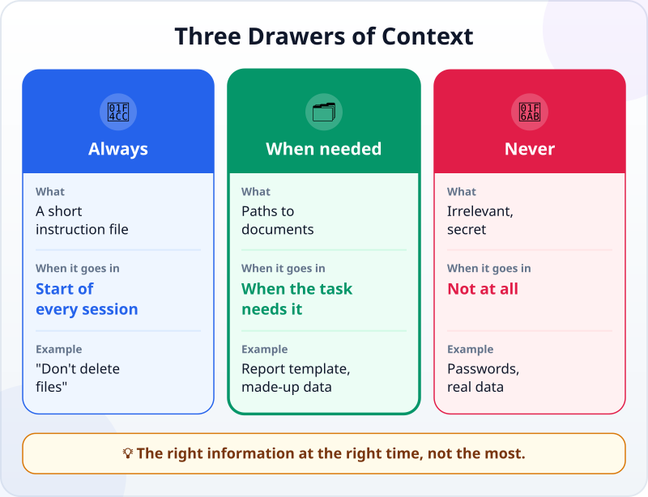
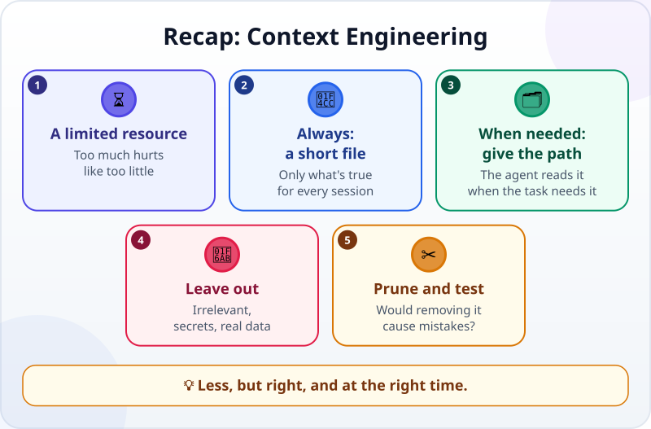

🌐 [Tiếng Việt](../../vi/lessons/context-engineering.md) · **English** · [日本語](../../ja/lessons/context-engineering.md)

# Context Engineering: The Right Information at the Right Time

<!-- section: objective -->
## Lesson Objective

By the end of this lesson, you will be able to:

- Sort information for an agent into three drawers: **always**, **when needed**, **never**.
- Write a short instruction file for a project, and know which lines to cut.
- Check that the agent really follows the instruction file without you reminding it.

<!-- section: hook -->
## Why It Matters

Hana wants an agent to write the weekly report in her team's format. "Just in case", she pastes at the start of every session: the 50-page staff handbook, three old reports, a glossary, and at the very end one line: *"Do not put customer names in the report."*

The result: a report with customer names in it.

The agent did not disobey on purpose. The most important line was buried under tens of thousands of irrelevant words. More information does not make an agent work better — the **right** information does.

<!-- section: concept -->
## Core Idea

### What is context engineering?

You already know the [context window](context-window.md) is an agent's limited working memory. **Context engineering** is deciding what goes into it, and when, so the agent has exactly what the task needs — nothing missing, nothing extra.

Anthropic (September 2025) explains why extra hurts too: as the context gets longer, the model's ability to accurately recall information from it goes down. They call context a finite resource, and the goal is to find the *smallest set of information* that still makes the task succeed.

### Three drawers



**1. Always — a short instruction file.** Things that are true for **every** session of the project: what this folder is, what must not be changed, how to check the work, conventions the agent cannot guess. Many tools read such a file at the start of every session — as of September 2026, for Claude Code it is `CLAUDE.md`. The Claude Code guidance recommends keeping it short, and asking of each line: *"Would removing this cause the agent to make mistakes?"* If not, cut it. A file that is too long makes the agent ignore the very instructions you need.

**2. When needed — point the way, don't paste the whole library.** Long documents, data, old reports: do not paste them all in at the start. Write down the **path** — *"the report template is in `templates/weekly_report.md`"* — so the agent opens it when the task needs it. Anthropic calls this bringing context in *just in time*: the agent keeps lightweight "addresses" and uses tools to read the contents when needed.

**3. Never.** Anything unrelated to this task. Huge files when a few lines are enough. And the [⛔ never](data-safety-and-permissions.md) items: passwords, API keys, real company or customer data.

### Context needs tidying too

- **One task, one session.** For a new, unrelated task, open a new session, so the context is not full of the old task.
- **What must be remembered for long goes into a file**, not just into the conversation — the next session will not remember it.
- **The instruction file needs pruning too.** The agent keeps getting something wrong despite a line about it? The file may have grown too long and that line got lost.

<!-- section: try-it -->
## Try It Yourself

About 8 minutes, in `ai-practice`, with made-up data. Use the task card `my-week.html` from [your first agent session](first-agent-session.md), or any file you have made in this folder. (On the watch-only route? Do steps 1 and 3 on paper.)

**1. Write the instruction file (3 minutes).** Create the instruction file your tool reads at the start of a session (for Claude Code, `CLAUDE.md` in the `ai-practice` folder, as of September 2026; other tools use their own name — check their documentation). At most 5 lines, only things true for every session. For example:

```text
- Practice folder, made-up data only.
- Do not delete any file; if something needs deleting, ask me first.
- Write dates like 30 Sep 2026.
- The task card is my-week.html, a single file, no outside libraries.
- When done, open the page and list what you checked and what you did not.
```

**2. Test without reminding (3 minutes).** Open a **new session**. Give a small task **without** repeating any convention:

```text
Add a line to my-week.html that shows today's date.
```

Read the result: is the date written like 30 Sep 2026? At the end of the session, did the agent list what it checked and what it did not? Did the agent do anything differently from a line in the file?

**3. Prune (2 minutes).** Read each line again with the question *"Would removing this cause the agent to make mistakes?"*. If one line is only true for a single task — for example "this week, also add a notes section" — move it out of the file; next time, say it in that task's request. If the agent got a convention wrong, make the sentence clearer, then test again in a new session.

**Evidence:**

- *I can show…* the 5-line instruction file, and the result of a new session that followed a convention I did not mention.
- *I checked…* each convention in the file against the real result (the date, the report of what was checked, no file deleted).
- *I would not use this when…* the information is only needed for one task (then say it in the request), or it is a secret or real data (then it goes nowhere).

<!-- section: misconceptions -->
## Common Misconceptions

- **"The more context, the better."** — A long context makes the model's recall less accurate. Irrelevant material takes up space and hides what matters.
- **"Put everything in the instruction file, just in case."** — That file is read in **every** session. Something needed for one task belongs in that task's request, or in a separate file the agent opens when needed.
- **"Tell the agent once in the chat and it remembers forever."** — A new session starts with a new context. What must be remembered for long goes into a file.

<!-- section: recap -->
## The Lesson in One Picture



<!-- section: takeaways -->
## Key Takeaways

- Context engineering: deciding which information goes into the context, and when.
- Context is a finite resource; too much hurts as much as too little.
- Always: a short instruction file, only what is true for every session.
- When needed: give a path so the agent reads it when the task needs it.
- Never: anything irrelevant, huge files, secrets, real data.

<!-- section: quiz -->
## Quick Check

**Question 1.** Hana pastes 50 pages of documents at the start of the session, and the agent ignores the most important instruction. What is the most likely reason?

- A) The agent disobeyed on purpose
- B) The important line was buried under too much irrelevant information
- C) The documents were written in English

**Question 2.** Which line **belongs** in an instruction file read in every session?

- A) "This week, also add a notes section to the report"
- B) The whole staff handbook
- C) "Do not change files in the data/ folder"

**Question 3.** A report template is 20 pages long and is only needed for the weekly report. What is the best approach?

- A) Write down the path to the template, so the agent opens it when writing the report
- B) Paste all 20 pages into the instruction file
- C) Don't tell the agent there is a template

<details>
<summary>Show answers</summary>

1. **B** — the longer the context, the easier it is for the model to miss things; the right information matters more than more information.
2. **C** — it is true for every session; A is only true for one task, and B is too long and mostly irrelevant.
3. **A** — just in time: the agent knows where it is, and only reads it when the task needs it.

</details>

<!-- section: sources -->
## Recommended Sources

- Anthropic — [Effective context engineering for AI agents](https://www.anthropic.com/engineering/effective-context-engineering-for-ai-agents) (English, September 2025): the longer the context, the lower the model's ability to recall accurately; treat context as a finite resource and find the smallest effective set of information; bringing context in just in time through paths and tools.
- Anthropic — [Best practices for Claude Code](https://code.claude.com/docs/en/best-practices) (English, as of September 2026): `CLAUDE.md` is read at the start of every session, so include only what applies broadly and keep it short; for each line, ask whether removing it would cause Claude to make mistakes; a bloated file makes Claude ignore instructions.
