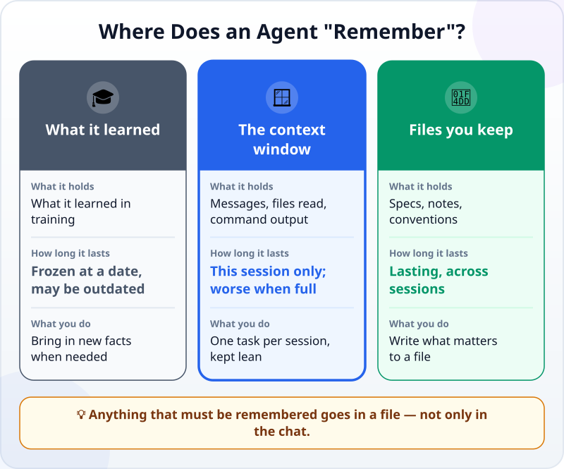
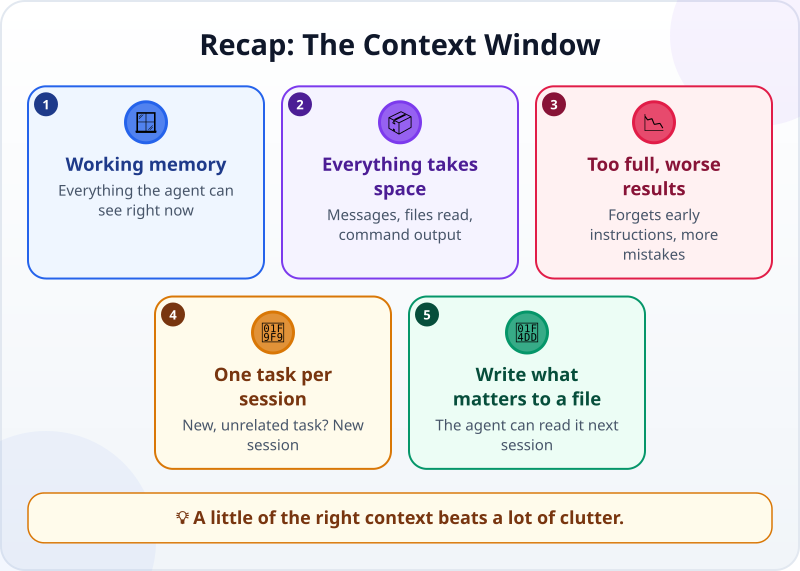

🌐 [Tiếng Việt](../../vi/lessons/context-window.md) · **English** · [日本語](../../ja/lessons/context-window.md)

# The Context Window: AI's Short-Term Memory

<!-- section: objective -->
## Lesson Objective

By the end of this lesson, you will be able to:

- Explain the **context window**: an AI's working memory, as opposed to what it learned.
- Say what takes up space in it, and why results get worse when it is too full.
- Keep context lean: one task per session, and what matters written to a file.

<!-- section: hook -->
## Why It Matters

Tuấn worked with an agent all afternoon: improving his week card, asking about an error somewhere else, then back to the card. At the start he said: *"Do not change the saving code."* By the end, the agent changed exactly that.

The agent did not disobey — it "forgot". Claude Code's guidance puts it plainly: most good habits with agents come from one constraint — the context window fills up fast, and the agent does worse as it fills.

<!-- section: concept -->
## Core Idea

### What is the context window?

The context window is **all the text the model can see when it answers** — like working memory. It is different from the huge body of data the model learned from in training. In an agent session **everything takes up space**: your messages, the agent's replies, every file it reads, every command output. One debugging session can use tens of thousands of tokens.

### Where does an agent "remember"?

- **What it learned:** broad, but frozen at a date, and it knows nothing about your work.
- **The context window:** knows your work — but only in this session, and it is limited.
- **Files you keep:** specs, notes, conventions — they last; the agent can read them again next session.

### More is not better

Anthropic's documentation says more context is not automatically better: as the token count grows, accuracy and recall degrade. When the window is nearly full, the agent may "forget" early instructions or make more mistakes.

### Keeping context lean

- **One task per session.** Finished one task and starting an unrelated one? Start a new session, or clear the context (for example with the `/clear` command in Claude Code).
- **Write what matters to a file.** A constraint like "do not change the saving code" belongs in a spec file, and the agent should read that file at the start of each session.
- **Give only what is needed.** Point to the relevant files, not the whole folder.

<!-- section: analogy -->
## Simple Analogy

The context window is like **your desk**. What the model learned is what you learned at school. The filing cabinet holds the files you keep.

A desk has limited space: the more papers from different jobs you pile on it, the harder it is to find the one you need. Good workers clear the desk between jobs and file important papers where they can find them again.

Where the analogy breaks: you can see a messy desk at a glance; an agent does not tell you "my desk is a mess" — you have to watch for the signs: it forgets instructions, repeats old mistakes.

<!-- section: example -->
## Real Example

After that afternoon, Tuấn changed how he works:

1. He created `week-card-spec.txt` with the goal and the constraints — including *"Do not change the saving code"*.
2. For each new task he starts a new session and opens with: *"Read week-card-spec.txt before you start."*
3. His question about an error elsewhere goes into a separate session.

The result: the agent no longer "forgets" the constraint, and each session is short and easy to follow.

<!-- section: misconceptions -->
## Common Misconceptions

- **"The agent remembers everything I ever told it."** — It remembers only what is still in this session's context window. A new session starts afresh — except for what you wrote to files.
- **"The bigger the window the better — put everything in."** — More context is not automatically better; the right context is.
- **"AI knows about recent events."** — What it learned stops at a date. It knows about your work and the latest news only if you put them in its context, or it has a tool to look them up.

<!-- section: recap -->
## The Lesson in One Picture

<!-- section: takeaways -->
## Key Takeaways

- The context window = working memory: everything the agent can see right now.
- Messages, files read, command output — everything takes space; too full, and the agent forgets and makes more mistakes.
- One task per session; a new, unrelated task gets a fresh start.
- Write what matters to a file so the agent can read it next session.

<!-- section: quiz -->
## Quick Check

**Question 1.** What takes up space in the context window of an agent session?

- A) Only the messages you type
- B) The whole internet
- C) Everything in the session: messages, files the agent read, command output

**Question 2.** You have finished task A and are about to start task B, which is unrelated. What should you do?

- A) Start a new session
- B) Carry on in the same session; it is convenient
- C) Paste all of task A again, to be safe

**Question 3.** Where should an important constraint, such as "do not change the saving code", live?

- A) Said once at the start of a very long session
- B) In a spec file the agent reads at the start of every session
- C) Nowhere; the agent will work it out

Show answers

1. **C** — everything in the session takes up space, not only your messages.
2. **A** — task A's context only muddles task B.
3. **B** — a file lasts across sessions; a sentence in a long conversation can be "forgotten".

<!-- section: sources -->
## Recommended Sources

- Anthropic — [Context windows](https://platform.claude.com/docs/en/build-with-claude/context-windows): the context window is all the text the model can reference when answering — a "working memory", unlike its training data; more context is not automatically better, as accuracy and recall degrade as the token count grows.
- Anthropic — [Best practices for Claude Code](https://code.claude.com/docs/en/best-practices): the context window fills up fast and performance degrades as it fills; clear the context between unrelated tasks.
- Anthropic — [Effective context engineering for AI agents](https://www.anthropic.com/engineering/effective-context-engineering-for-ai-agents) (September 2025): context is a critical but finite resource; aim for the smallest set of high-signal information.
