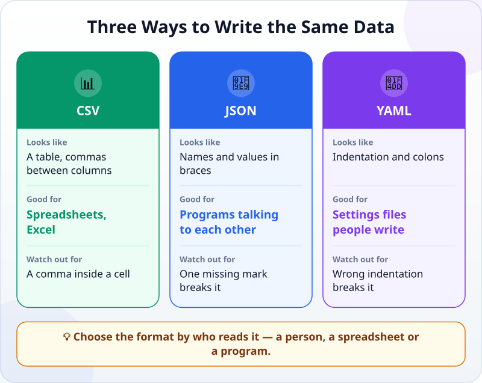
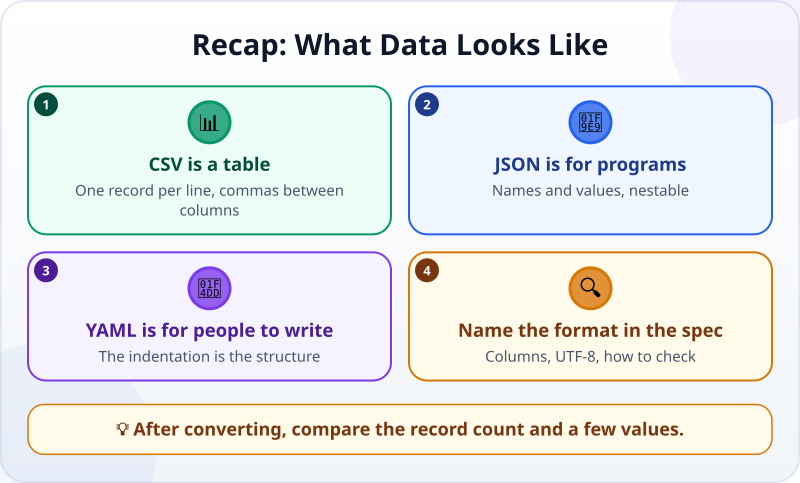

🌐 [Tiếng Việt](../../vi/lessons/data-formats.md) · **English** · [日本語](../../ja/lessons/data-formats.md)

# What Data Looks Like: JSON, CSV and YAML

<!-- section: objective -->
## Lesson Objective

By the end of this lesson, you will be able to:

- Recognise three common data formats: **CSV**, **JSON** and **YAML**.
- Say what each is good for, and where each trips people up.
- Name the format in a spec, and check the data after the agent converts it.

<!-- section: hook -->
## Why It Matters

Much of the work you hand to an agent is work with data: read a table, sum it up, export a report. The agent will ask — or choose for itself — a format: *"Export as CSV or JSON?"*

You do not need to learn the syntax. You need to recognise the formats at a glance, know which suits your task, and know what to check after a conversion. (By the way: this course's own data — the outline, the glossary, the infographics — is stored as YAML.)

<!-- section: concept -->
## Core Idea

### The same data, three ways

Two of Mai's expenses in **CSV** — a table, one record per line, columns separated by commas:

```text
date,category,amount
2026-09-01,Travel,50000
2026-09-02,Meals,120000
```

In **JSON** — names and values inside braces, ideal for programs sending data to each other:

```json
[
  {"date": "2026-09-01", "category": "Travel", "amount": 50000},
  {"date": "2026-09-02", "category": "Meals", "amount": 120000}
]
```

In **YAML** — indentation and colons, easy to read and to write by hand:

```yaml
- date: 2026-09-01
  category: Travel
  amount: 50000
- date: 2026-09-02
  category: Meals
  amount: 120000
```

### What each format is good for



- **CSV:** for people who use spreadsheets. It trips you up when a cell contains a comma (the cell must be in double quotes), when Excel turns `0901…` into a number and drops the leading zero, or when accented letters come out garbled.
- **JSON:** for programs to read and write. It is strict: one missing comma or bracket and the whole file cannot be read.
- **YAML:** for settings files people write by hand. The indentation is the structure — one space out of place changes the meaning.

### Name the format in the spec

When you hand over data work, write in the spec: the format, the column names, the encoding (usually **UTF-8** for Vietnamese or Japanese text) and how to check. After every conversion, **compare the record count and a few values** between the old file and the new one.

<!-- section: try-it -->
## Try It Yourself

About 10 minutes, with `expenses.csv` (20 rows of made-up data from [writing good specs](writing-good-specs.md)).

**1. Convert (3 minutes):**

```text
From expenses.csv, create expenses.json and expenses.yaml with the same data. Do not change expenses.csv.
Then write a check: the three files have the same number of records and the same total amount.
Run it and show me the result.
```

**2. See for yourself (3 minutes):** open all three files in Notepad (Windows) or TextEdit (Mac). Find the same expense in each — what does it look like in each format?

**3. Try a common stumbling block (4 minutes):**

```text
Add a new row to expenses.csv: date 2026-09-30, category "Meals, with a client", amount 300000.
Then recreate expenses.json and run the check again.
```

Open `expenses.csv`: did the agent put the cell with a comma in double quotes? In `expenses.json`, is the category still the whole "Meals, with a client"?

Write your evidence:

- *I can show…* three files with the same data, and a check reporting matching record counts and totals.
- *I checked…* one expense in all three files, and the cell with a comma after the conversion.
- *I would not use this when…* for example: the data has codes starting with 0 that I will open in Excel — then I tell the agent to keep them as text.

<!-- section: misconceptions -->
## Common Misconceptions

- **"CSV is an Excel file."** — CSV is plain text; Excel is just one program that opens it. Colours, formulas and multiple sheets are not stored in CSV.
- **"JSON and YAML are only for programmers."** — They are readable text. You will read them to check what an agent produced.
- **"Converting a format keeps the data the same."** — A conversion can drop leading zeros, change dates, split a cell at its comma or garble accented letters. Compare the record count and a few values.

<!-- section: recap -->
## The Lesson in One Picture



<!-- section: takeaways -->
## Key Takeaways

- CSV is a table; JSON is for programs; YAML is for files people write by hand.
- Stumbling blocks: a comma inside a CSV cell, one missing mark in JSON, wrong indentation in YAML.
- Name the format, the columns and the encoding (UTF-8) in the spec.
- After converting, compare the record count and a few values.

<!-- section: quiz -->
## Quick Check

**Question 1.** You need to send a table to a colleague who will open it in Excel. Which format fits best?

- A) CSV
- B) JSON
- C) YAML

**Question 2.** The agent has just converted `expenses.csv` to JSON. What is the quickest reliable check?

- A) Open the JSON file and see whether it looks tidy
- B) Compare the record count and a few values between the two files
- C) Ask the agent "is it right?"

**Question 3.** Why can the cell "Meals, with a client" break a CSV file?

- A) Because CSV cannot hold text
- B) Because the text is too long
- C) Because the comma separates columns, so the cell must be in double quotes

<details>
<summary>Show answers</summary>

1. **A** — CSV is a table that Excel opens directly.
2. **B** — record counts and values can be checked; tidiness is an impression.
3. **C** — without double quotes, the cell is cut into two columns.

</details>
