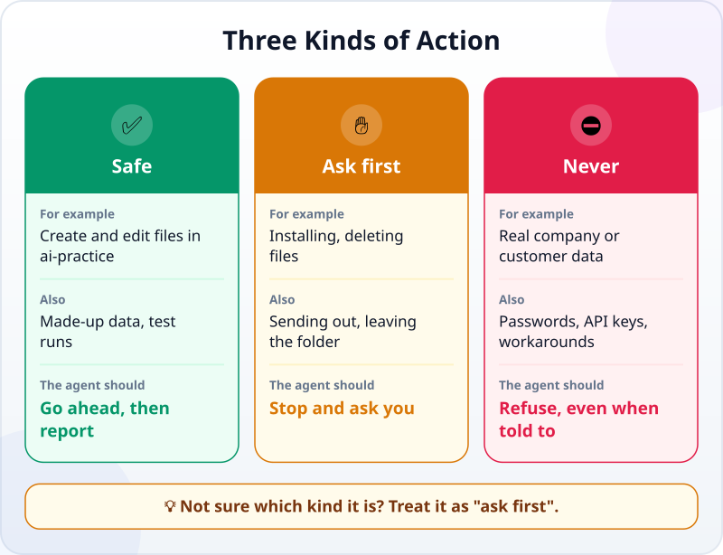
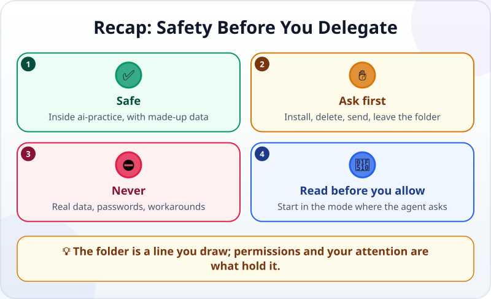

🌐 [Tiếng Việt](../../vi/lessons/data-safety-and-permissions.md) · **English** · [日本語](../../ja/lessons/data-safety-and-permissions.md)

# Before You Let an Agent Act: Safe, Ask First, Never

<!-- section: objective -->
## Lesson Objective

By the end of this lesson, you will be able to:

- Sort an action into one of three kinds: ✅ **safe**, ✋ **ask first** or ⛔ **never**.
- Explain why a separate folder is a **line you draw**, while the agent's **permissions** are what hold it.
- Read an agent's permission request before you click "allow".

<!-- section: hook -->
## Why It Matters

What sets an agent apart from a chatbot is that it **really acts**: it creates files, deletes files, runs commands. Real actions have real consequences — a file deleted by mistake, a payroll sheet sent to the wrong person, a password leaked.

The good news: you do not need to be a security expert. You need one habit: **before the agent acts, ask which kind of action it is.**

<!-- section: concept -->
## Core Idea

### Three kinds of action

- ✅ **Safe — go ahead, then report:** creating and editing files in `ai-practice`, using made-up data, test-running the page or spreadsheet you just made.
- ✋ **Ask first — the agent stops and you decide:** installing software or libraries, deleting files, sending anything out (e-mail, posting online), doing anything outside the folder, running a command you do not understand.
- ⛔ **Never — not even when told to:** real company or customer data, passwords and API keys (the keys that let software use a service), getting around a work computer's rules.

Not sure which kind it is? Treat it as ✋ **ask first**.

### The folder is the line; permissions hold it

The `ai-practice` folder is a line you draw. What holds that line is **permissions**: what the agent's software lets it do on its own, without asking you.

For example, as of September 2026, Claude Code in its default mode only **reads** on its own; to edit a file or run a command that can change something, it must ask you first. In this mode it can only write inside the folder you opened, and it asks before reading outside it. More automatic modes ask less — and the line gets looser.

So while you are learning: **choose the mode in which the agent asks first**, and read every request.

### Reading a permission request

When the agent asks, answer three questions before you click:

1. **What will it do?** Install, delete, send or run a command?
2. **Where?** Inside `ai-practice` or outside it?
3. **Can it be undone?** A deleted file or a sent e-mail is hard to take back.

Do not understand the request? Ask the agent: *"What does this command do? Is there a safer way?"*

<!-- section: analogy -->
## Simple Analogy

Think of a new intern in your office:

- ✅ **Fine on their own:** copying documents, writing drafts, tidying their own desk.
- ✋ **Must ask:** sending a letter to a customer, shredding old documents, using another team's equipment.
- ⛔ **Never:** taking customer files home, telling an outsider the office password.

Where the analogy breaks: an intern understands context and hesitates; an agent does not know on its own what is sensitive — unless you say so, or its permissions stop it.

<!-- section: example -->
## Real Example

Mai is an accountant in Ho Chi Minh City who lives in Excel. She wants an agent to help with her monthly sales report.

1. ⛔ Mai is about to drag the real file `Customer_Sales_Aug.xlsx` into `ai-practice` — then stops: this is real customer data. Instead, she asks the agent to **create a made-up file** with the same columns (date, customer, amount) and 30 rows of invented numbers.
2. ✋ The agent asks: *"I need to install the openpyxl library to read Excel files. May I?"* Mai asks what it is, hears the answer (a widely used library for reading and writing Excel files) and allows it **once**.
3. ✋ The agent offers to delete `old_report.xlsx` to tidy the folder. Mai says no — a deleted file is hard to get back — and asks it to move the file into a subfolder, `old`.
4. ✅ The agent builds the report from the made-up data, opens it to check the totals, and reports.
5. ✋ Finally the agent suggests: *"I can e-mail the report to your manager."* Mai declines: sending things out is her job, after she has checked them.

<!-- section: misconceptions -->
## Common Misconceptions

- **"The agent asks too much — switch to an automatic mode to go faster."** — Automatic modes are for when you understand what you are doing. While you are learning, those questions are the lesson.
- **"You cannot learn anything real with made-up data."** — The skills are exactly the same. Made-up data with the same columns and formats is enough to practise — and it puts no one at risk.
- **"Telling the agent 'don't touch other files' is enough."** — Instructions help, but they are not guarantees; permissions and your careful reading are the real protection. A file or a web page can even contain text posing as instructions to the agent: if the agent proposes something you never asked for, stop.

<!-- section: recap -->
## The Lesson in One Picture

<!-- section: takeaways -->
## Key Takeaways

- ✅ Safe: inside `ai-practice`, with made-up data — the agent goes ahead, then reports.
- ✋ Ask first: installing, deleting, sending, leaving the folder, commands you do not understand. When in doubt, it goes here.
- ⛔ Never: real company and customer data, passwords and API keys, workarounds.
- The folder is the line; permissions and your careful reading before you allow are what hold it.

<!-- section: quiz -->
## Quick Check

**Question 1.** The agent asks to install a library to read Excel files. Which kind of action is this?

- A) ✅ Safe
- B) ✋ Ask first
- C) ⛔ Never

**Question 2.** You want to practise making a report with an agent. Which data should you use?

- A) The company's real sales file, to keep it realistic
- B) A screenshot of a real report
- C) A made-up file with the same columns and invented numbers

**Question 3.** Why is a separate folder alone not enough to be safe?

- A) Because what an agent may do is decided by its permissions; depending on the mode, it can still read or act outside
- B) Because a separate folder makes the agent slower
- C) Because agents cannot use separate folders

Show answers

1. **B** — installing changes your computer, so the agent must ask and you decide.
2. **C** — made-up data with the same structure is enough to practise; real data, screenshots included, never goes into an exercise.
3. **A** — the folder is a line you draw; permissions are what hold it.

<!-- section: sources -->
## Recommended Sources

- Anthropic — [Security](https://code.claude.com/docs/en/security): in its default mode Claude Code starts with read-only permissions and asks before editing files or running commands; it can only write inside the folder it was opened in. It has only the permissions you grant, and you are responsible for reviewing before you approve.
- Anthropic — [Choose a permission mode](https://code.claude.com/docs/en/permission-modes): a table of the permission modes and what each lets the agent do without asking.
