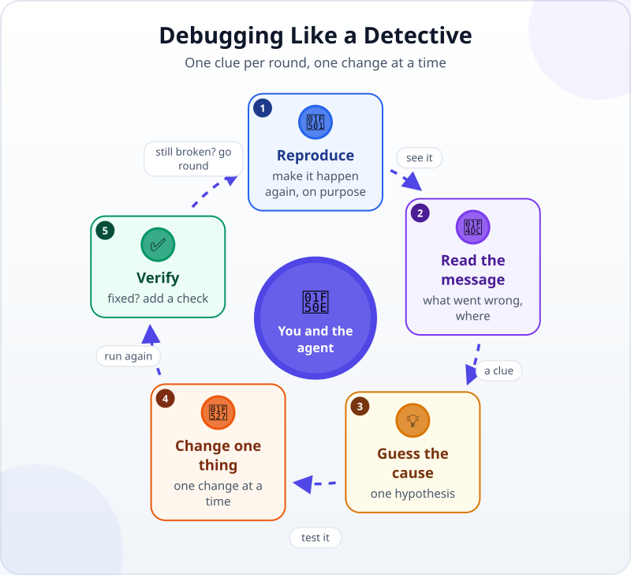
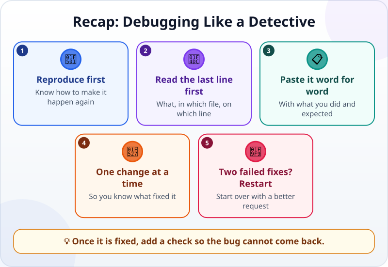

🌐 [Tiếng Việt](../../vi/lessons/errors-and-debugging.md) · **English** · [日本語](../../ja/lessons/errors-and-debugging.md)

# Reading Error Messages and Debugging Like a Detective

<!-- section: objective -->
## Lesson Objective

By the end of this lesson, you will be able to:

- Read an error message: **what** went wrong and **where**.
- Debug with the agent in a loop: reproduce → read → guess the cause → change one thing → verify.
- Know when to stop fixing and start over with a better request.

<!-- section: hook -->
## Why It Matters

In [turning "looks right" into checks](testing-basics.md), Mai's expense summary stopped with some strange text when it met an empty amount. Many people close an error message on sight, or just tell the agent "it's broken".

In fact an error message is a **clue** — often pointing straight at what broke. You do not need to understand all of it; read two places, then hand that clue to the agent.

<!-- section: concept -->
## Core Idea

### Anatomy of an error message

```text
Traceback (most recent call last):
  File "summary.py", line 12, in <module>
    total += int(row["amount"])
ValueError: invalid literal for int() with base 10: ''
```

- **The last line — what went wrong:** `ValueError` (a bad value): the program could not turn `''` (an empty cell) into a number.
- **Above it — where:** the file `summary.py`, line 12, the very line that adds up the amounts.

For Python-style messages like this one, read **from the bottom up**. Web pages show errors too: in Chrome or Edge press **F12** (Mac: **Cmd+Option+J**) and look at the **Console** tab — errors appear in red, with the file name and line number.

### The detective's debugging loop



1. **Reproduce:** know exactly what makes the bug happen. If you cannot reproduce it, you cannot fix it yet.
2. **Read the message:** what went wrong, and where.
3. **Guess the cause:** one hypothesis. Ask the agent to explain the cause **before** fixing anything.
4. **Change one thing:** one change at a time, so you know which change worked.
5. **Verify:** repeat the exact steps that caused the bug. Fixed? Add a check so it cannot come back. Still broken? Go round again.

### Reporting a bug to the agent

Paste the error message **word for word** — do not retell it — along with two things: what you did, and what you expected. Better still, as Claude Code's guidance suggests: ask the agent to write a check that reproduces the bug, and only then fix it.

### When the agent keeps failing

If you have corrected the agent twice and it is still wrong, the conversation is full of failed attempts. Claude Code's guidance says: stop, start a fresh session and write a better request that includes what you have learned.

<!-- section: example -->
## Real Example

Mai runs her summary program and gets the message above. She sends the agent:

> *"I ran summary.py on expenses.csv (row 7 has an empty amount) and got this error: [the error message, pasted word for word]. Expected: an empty amount counts as 0 and is listed in the report. Before fixing anything, explain the cause, then write a check that reproduces this error."*

The agent explains: line 12 turns each amount into a whole number, and `''` is not a number. It writes the check — which fails, just like the bug. It changes **one thing** — an empty amount counts as 0 and is noted — then runs again: the check passes, and the summary now has a line "1 empty amount (row 7)".

<!-- section: try-it -->
## Try It Yourself

About 12 minutes: a detective game with `my-week.html`.

**1. Let the agent hide a bug (2 minutes):**

```text
Make a copy of my-week.html called my-week-bug.html, then deliberately add exactly ONE small bug
that stops the checkboxes from working. Do not tell me where it is. Do not change my-week.html.
```

**2. Reproduce and read (4 minutes):** open `my-week-bug.html` in a browser and click a box. Press F12 (Mac: Cmd+Option+J), open the Console tab and read the red line: what went wrong, in which file, on which line?

**3. Report it like a detective (4 minutes)** — in a new session, send:

```text
I opened my-week-bug.html and clicked the first task's box. Nothing happened.
The Console says: [the error line, pasted word for word]. Expected: the text gets a line through it.
Before fixing, explain the cause. Then change one thing only.
```

**4. Verify (2 minutes):** repeat step 2 — is the bug gone? Any red text left in the Console?

Write your evidence:

- *I can show…* the error message before the fix, and the page working after it.
- *I checked…* with exactly the steps that caused the bug, and the Console shows no errors.
- *I would not use this when…* for example: the bug only happens now and then — then I first need a reliable way to reproduce it.

<!-- section: misconceptions -->
## Common Misconceptions

- **"Error messages are an alien language — skip them."** — Read just two things: what went wrong (often the last line) and where (the file name and line number).
- **"Keep telling the agent 'fix it' until it works."** — After two failed fixes, stop and start over with a better request.
- **"Change several things at once to save time."** — Then you cannot tell which change worked and which one broke something else.

<!-- section: recap -->
## The Lesson in One Picture



<!-- section: takeaways -->
## Key Takeaways

- An error message is a clue: what went wrong (last line) and where (file, line number).
- The detective's loop: reproduce → read → guess the cause → change one thing → verify.
- Report bugs word for word, with what you did and expected; ask for the cause before the fix.
- Two failed fixes? Start over with a better request. Once it is fixed, add a check.

<!-- section: quiz -->
## Quick Check

**Question 1.** In a Python-style error message like the one above, which line should you read first?

- A) The first line: `Traceback (most recent call last)`
- B) Any line in the middle
- C) The very last line: the kind of error and its message

**Question 2.** Which way of reporting a bug helps the agent most?

- A) Paste the error message word for word, with what you did and what you expected
- B) "It's broken, fix it."
- C) Retell the error in your own words, to keep it short

**Question 3.** The agent has tried twice and the bug is still there. What now?

- A) Keep saying "try again" a third and fourth time
- B) Stop, start a fresh session with a better request that includes what you know
- C) Give up

<details>
<summary>Show answers</summary>

1. **C** — the last line says what went wrong; the lines above say where.
2. **A** — word for word keeps the clue intact; retelling tends to drop details.
3. **B** — after two failures the conversation is full of dead ends; a clean start works better.

</details>

<!-- section: sources -->
## Recommended Sources

- Anthropic — [Best practices for Claude Code](https://code.claude.com/docs/en/best-practices): when reporting a bug, describe the symptom, the likely location and what "fixed" looks like — for example, ask for a failing check that reproduces the bug before the fix; after correcting the agent twice without success, start over with a better request that includes what you learned.
