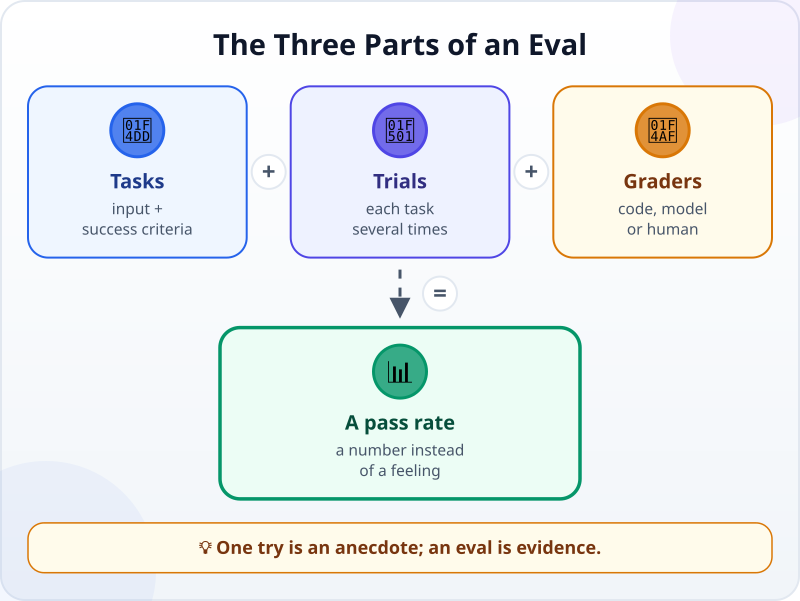
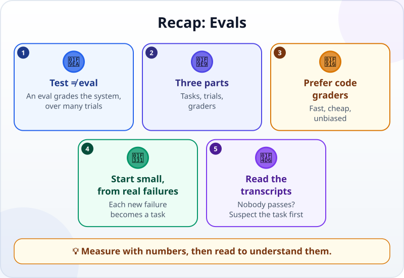

🌐 [Tiếng Việt](../../vi/lessons/evals.md) · **English** · [日本語](../../ja/lessons/evals.md)

# Evals: Scoring an Agent's Quality

<!-- section: objective -->
## Lesson Objective

By the end of this lesson, you will be able to:

- Tell a **test** (checks code) apart from an **eval** (scores an AI system across many tasks and many runs).
- Name the three parts of an eval — **tasks**, **trials**, **graders** — and the three kinds of grader.
- Build a small eval to compare two ways of writing a request, with numbers.

<!-- section: hook -->
## Why It Matters

Mai is practising with an invoice-reading agent on made-up invoices. She adds a sentence about the date format to its request, tries one invoice — correct — and concludes *"the new version is better"*. The next week, the new version misreads an invoice written as *"3.5 thousand dollars"*, which the old one read correctly.

One correct try cannot tell you which version is better: an AI can answer the same question differently, and one invoice is not every invoice. Mai needs a **repeatable** measure: many tasks, many runs, graded the same way.

<!-- section: concept -->
## Core Idea

### Tests and evals

A [test](tests-and-ci-for-agents.md) checks **code**: same input, same result, pass or fail. An **eval** (evaluation) checks **the whole AI system** — model, instructions, tools — across many tasks. Because an AI's answers can vary, an eval runs each task **several times** and counts the pass rate. Anthropic (January 2026) puts it simply: give an AI an input, then apply grading logic to its output to measure success.

### The three parts of an eval



- **Task:** one test with a defined input and success criteria — for example, read one invoice and return its date and amount.
- **Trial:** one attempt at a task; run each task a few times.
- **Grader:** how you decide whether a trial passed.
  - **Code-based** — exact matching, running tests, checking the outcome. Fast, cheap and consistent; prefer it when you can.
  - **Model-based** — an AI grades against a written rubric, for things hard to match exactly (tone, summaries).
  - **Human** — someone who knows the work grades it or spot-checks a sample. Slowest, but the final yardstick.

### Start small, from real failures

Anthropic advises starting with about 20–50 simple tasks **drawn from real failures**, not waiting for hundreds. For a learner, five tasks in `ai-practice` are a start: every time the AI gets something wrong, turn it into a new task.

### Three habits that keep an eval honest

- **Read the transcripts of failed runs** — the full record of a trial. Without them, you cannot tell whether the fault is in the AI, the task or the grader.
- **Grade the outcome, not every step.** A grader that insists on one path fails other approaches that are just as right.
- **If nobody passes, suspect the task first.** Anthropic notes that a task that never passes, even in a hundred tries, is most often a broken task, not an incapable agent.

<!-- section: try-it -->
## Try It Yourself

About 11 minutes, in `ai-practice`, with made-up data and an agent (or an allowed chatbot — then grade by eye). (On the watch-only route? Do step 1 and guess the result of step 3.)

**1. Tasks and answers (2 minutes).** Create `invoices.txt`, one made-up invoice per line:

```text
Invoice no. 101, dated 3 Sep 2026, total $1,250.00
INV 102 — $2,400 — paid on 5 September 2026
On September 12, 2026, invoice 103, amount: $980
Invoice 104 of 20 Sep 2026: 3.5 thousand dollars
INV 105, 30 Sep 2026, deposit $500, balance $1,500; total $2,000
```

And `answers.jsonl` — the right answers, written before any run:

```text
{"no": 101, "date": "2026-09-03", "amount": 1250}
{"no": 102, "date": "2026-09-05", "amount": 2400}
{"no": 103, "date": "2026-09-12", "amount": 980}
{"no": 104, "date": "2026-09-20", "amount": 3500}
{"no": 105, "date": "2026-09-30", "amount": 2000}
```

**2. A code grader (2 minutes).** Ask the agent: *"Write grade.py, run as `python grade.py RESULT_FILE answers.jsonl`: compare each invoice in answers.jsonl with the result file by its number, and print how many are right and which are wrong. A line that cannot be read, a missing invoice, an invoice number not in the answers, or the same number twice, counts as wrong."* Test it before any AI run: copy `answers.jsonl` to `test_result.jsonl` and grade it — every invoice must be right. Then change one number in `test_result.jsonl` and grade it again — it must report exactly that invoice as wrong.

**3. Compare two ways of asking (5 minutes).** Do each run in a **new session**, writing results to its own file:

- **Way A:** *"Read invoices.txt, get the invoice number, date and amount, and write them to result_A1.jsonl."*
- **Way B:** *"Read invoices.txt. For each line, write one JSON line to result_B1.jsonl: no (integer), date (YYYY-MM-DD), amount (whole dollars, the invoice TOTAL). Example (an invoice not in the file): {"no": 999, "date": "2026-01-15", "amount": 500}."*

Run each way **twice** — for the second run, change the file name in the request to `result_A2.jsonl` or `result_B2.jsonl` — then grade all four files with `grade.py`. Fill in a table: A scored how many out of 10, B how many out of 10. Two runs each is enough to practise the method, not to decide which way is better — for a real decision, run each way many more times.

**4. Read a failure (2 minutes).** Reopen the session of one wrong invoice and read it: where did the AI misunderstand ("3.5 thousand dollars"? the deposit instead of the total?) — was the fault in the request, or in your answers? If every run passed, read one run on the trickiest invoice (104 or 105) instead: how did the AI decide? Then, for next time, add a harder invoice to `invoices.txt` and write its right answer in `answers.jsonl` before any run.

**Evidence:**

- *I can show…* five tasks, the answers, the grader, and the score table for the two ways of asking.
- *I checked…* the grader reports a mistake when I deliberately broke an answer; I read the transcript of at least one failed run (or, if all passed, one run on the trickiest invoice).
- *I would not use this when…* I only have one or two runs to compare (too few to conclude anything), or the tasks would need real company data.

<!-- section: misconceptions -->
## Common Misconceptions

- **"One correct try is enough."** — An AI can answer differently each time. One correct answer does not tell you the success rate; an eval runs many tasks, many times.
- **"You need hundreds of tasks before it counts as an eval."** — Start small, from real failures, and add as you go. Five properly graded tasks beat nothing at all.
- **"A low score means the AI is bad."** — The task may be ambiguous, the answer may be wrong, or the grader may be too rigid. Read the transcripts before concluding.

<!-- section: recap -->
## The Lesson in One Picture



<!-- section: takeaways -->
## Key Takeaways

- A test checks code; an eval checks the whole AI system, across many tasks and many runs.
- An eval has tasks, trials and graders; prefer code graders.
- Start small, from real failures; each new failure becomes a new task.
- Read the transcripts of failed runs, and grade outcomes rather than every step.
- If nobody passes, suspect the task and the answers first.

<!-- section: quiz -->
## Quick Check

**Question 1.** Why does an eval run each task several times?

- A) Because an AI can answer the same input differently
- B) So the model can learn from its earlier runs and improve
- C) Because the first run is always wrong

**Question 2.** A task says "return the date as YYYY-MM-DD". Which grader fits best?

- A) Ask someone to read it and give their impression
- B) A code grader that checks for an exact match with the answer
- C) No grading needed; you can tell at a glance

**Question 3.** A task was run 20 times and never passed. What should you do first?

- A) Conclude the model cannot do this job
- B) Run it 100 more times until it passes once
- C) Read the transcripts and recheck the task, the answer and the grader

<details>
<summary>Show answers</summary>

1. **A** — one run does not tell you the success rate; several runs do.
2. **B** — when there is an exact answer, code grades fast, cheaply and the same way every time (as long as the answers are right).
3. **C** — a task nobody passes is usually a sign the task or the grader has a problem.

</details>

<!-- section: sources -->
## Recommended Sources

- Anthropic — [Demystifying evals for AI agents](https://www.anthropic.com/engineering/demystifying-evals-for-ai-agents) (English, January 2026): an eval gives an AI an input and applies grading logic to its output; tasks, trials, graders (code-based, model-based, human), transcripts and outcomes; start with 20–50 simple tasks drawn from real failures; you have to read the transcripts; grade outcomes rather than steps; a task that never passes is most often a broken task.
