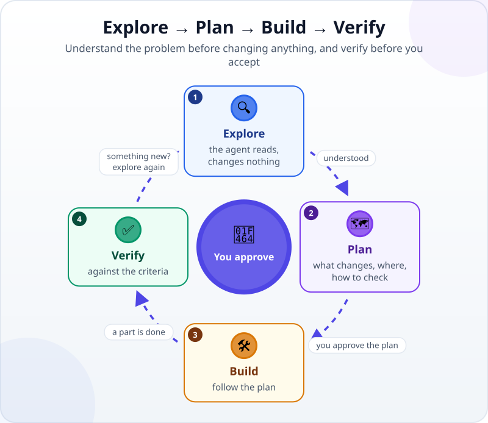
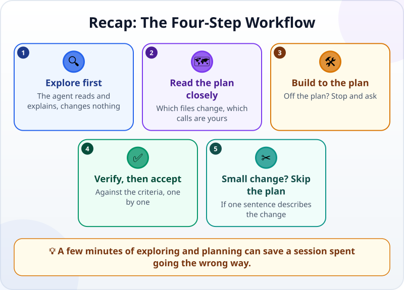

🌐 [Tiếng Việt](../../vi/lessons/explore-plan-build-verify.md) · **English** · [日本語](../../ja/lessons/explore-plan-build-verify.md)

# The Four-Step Workflow: Explore → Plan → Build → Verify

<!-- section: objective -->
## Lesson Objective

By the end of this lesson, you will be able to:

- Name the four steps — **explore, plan, build, verify** — and where you approve.
- Use a planning mode (plan mode) so the agent proposes before it edits.
- Read a plan with three questions, and know when to skip planning.

<!-- section: hook -->
## Why It Matters

An agent works fast — fast even when it is doing the wrong thing. Claude Code's guidance warns that letting the agent jump straight to coding can produce code that solves the wrong problem.

Anyone who has run a project knows this: before the work starts, you understand the request and agree on a plan. With an agent it is the same, only much faster.

<!-- section: concept -->
## Core Idea

### Four steps, and where you approve



1. **Explore:** the agent reads files, asks questions, explains — **and changes nothing**.
2. **Plan:** the agent proposes what will change, in which files, and how it will be checked. **You read it and approve.**
3. **Build:** the agent follows the approved plan. If it has to depart from the plan, it should stop and ask.
4. **Verify:** compare with the criteria. Something new turned up? Go back and explore.

### Plan mode

Many tools have a mode just for the first two steps. For example, as of September 2026, Claude Code has *plan mode*: the agent reads files and writes a plan but edits nothing until you approve the plan. In the Claude app you pick it in the permission-mode selector.

### Reading a plan: three questions

- **Which files will change?** Any you did not expect?
- **What gets added?** Libraries, tools, data — the ✋ ask-first kind of thing.
- **Which decision is yours?** A plan often hides a choice — where the data is stored, for example. Spot it and make the call yourself.

### When to skip the plan

Claude Code's guidance says planning helps most when you are unsure of the approach, when the change touches several files, or when you do not know that code well. **If you can describe the change in one sentence** — fix a typo, change a heading's colour — just ask for it.

<!-- section: try-it -->
## Try It Yourself

About 12 minutes, with the `my-week.html` card from [your first agent session](first-agent-session.md). The task: the card remembers checked tasks after the page reloads. (On the watch-only route? Read each step and answer the three questions in step 2 yourself.)

**1. Explore (3 minutes)** — switch to plan mode, then send:

```text
I want my-week.html to remember checked tasks after the page reloads.
First, only read my-week.html and briefly explain how it works now. Do not change anything yet.
```

**2. Plan (3 minutes):**

```text
Now propose a plan: what will change, in which file, where the data will be stored,
and how I can check it. Do not change anything yet.
```

Read the plan with the three questions. You may find that checked tasks are stored **in this computer's browser**, so another computer or another browser will not see them. Is that acceptable? That is your call.

**3. Build (3 minutes):** approve the plan, then read each change before you accept it.

**4. Verify (3 minutes):** check 2 tasks → reload the page → still checked? Uncheck 1 → reload → right? Then write your evidence:

- *I can show…* the card keeps checked tasks after a reload.
- *I checked…* both checking and unchecking, reloading every time.
- *I would not use this when…* I need the same list on several computers.

<!-- section: misconceptions -->
## Common Misconceptions

- **"Planning wastes time."** — A few minutes reading a plan costs far less than a session going the wrong way. But a one-sentence change can go straight ahead.
- **"The agent wrote the plan, so I can just approve it."** — The plan is the cheapest moment to spot an unexpected file being touched, an unexpected library being added, or a decision that should have been yours.
- **"Verifying happens once, at the end."** — For work in several parts, verify after each part; if something new turns up, go back and explore.

<!-- section: recap -->
## The Lesson in One Picture



<!-- section: takeaways -->
## Key Takeaways

- Four steps: explore (read only) → plan (you approve) → build → verify.
- Read a plan with three questions: which files change, what gets added, which decision is yours.
- Can you describe the change in one sentence? Skip the plan and just ask.
- Something new while verifying? Go back and explore.

<!-- section: quiz -->
## Quick Check

**Question 1.** Which task can go straight ahead without a plan?

- A) Fixing a typo in a heading
- B) Adding a feature that stores data and touches several files
- C) A task you are not sure how to approach

**Question 2.** In the explore step, what should the agent do?

- A) Start fixing things to save time
- B) Install any libraries it might need
- C) Read the files and explain, changing nothing

**Question 3.** The plan says: *"The data is stored in this computer's browser."* What should you do?

- A) Ignore it; it is a technical detail
- B) Decide whether that is acceptable to you, then approve
- C) Let the agent decide

<details>
<summary>Show answers</summary>

1. **A** — a one-sentence change needs no plan; B and C are exactly when a plan helps most.
2. **C** — exploring is read-only; editing and installing come after you approve a plan.
3. **B** — plans often hide a decision; spotting it and making the call is your job.

</details>

<!-- section: sources -->
## Recommended Sources

- Anthropic — [Best practices for Claude Code](https://code.claude.com/docs/en/best-practices), section *Explore first, then plan, then code*: separate research and planning from implementation so you do not solve the wrong problem; planning helps most when you are unsure of the approach, when the change touches several files or when you do not know the code; if you could describe the change in one sentence, skip the plan.
- Anthropic — [Choose a permission mode](https://code.claude.com/docs/en/permission-modes), on plan mode: the agent reads files and writes a plan but edits nothing until you approve the plan.
