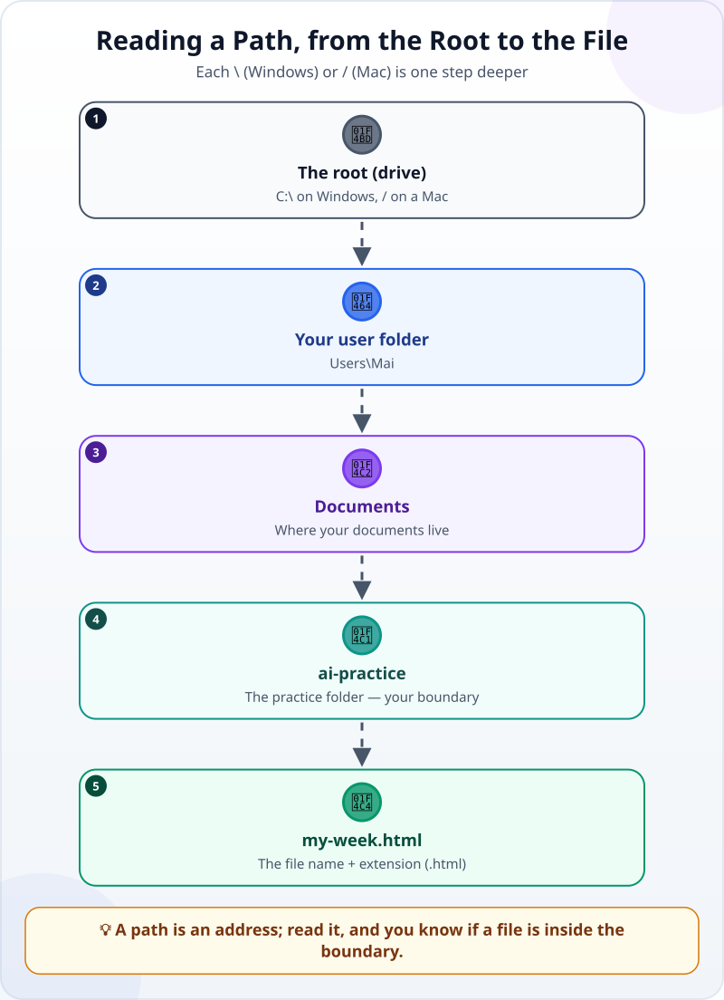
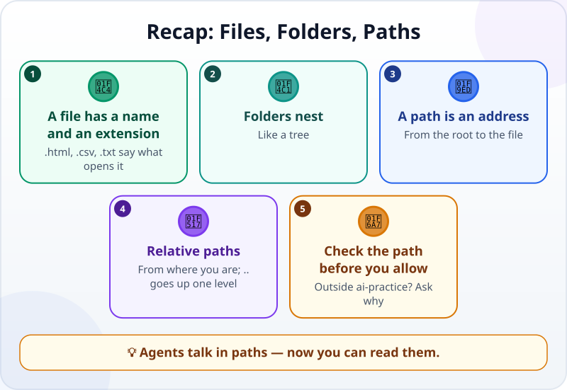

🌐 [Tiếng Việt](../../vi/lessons/files-folders-paths.md) · **English** · [日本語](../../ja/lessons/files-folders-paths.md)

# Files, Folders and Paths: The Map Inside Your Computer

<!-- section: objective -->
## Lesson Objective

By the end of this lesson, you will be able to:

- Tell **files**, **folders** and **paths** apart, and read a path on Windows and on a Mac.
- Understand **relative paths** and the `..` sign (one level up).
- Use paths to find the file an agent just made, and to tell whether a permission request stays inside `ai-practice`.

<!-- section: hook -->
## Why It Matters

Hana hands over a task and the agent reports: *"Created `tips/tips.html`."* She opens `ai-practice`… and `tips.html` is not there. The agent had made a subfolder called `tips`, and the file is inside it.

Agents talk in paths: in reports, in plans, in every permission request. Once you can read paths, you can find files — and spot at once when the agent wants to touch something outside the boundary.

<!-- section: concept -->
## Core Idea

### Files and folders

- A **file** holds content: a web page, a spreadsheet, a photo. Its name ends with an **extension** such as `.html`, `.csv` or `.txt`, which tells the computer which program opens it.
- A **folder** holds files and other folders, nested like a tree.

### A path: the address from the root to the file



- Windows: `C:\Users\Mai\Documents\ai-practice\my-week.html`
- Mac: `/Users/mai/Documents/ai-practice/my-week.html`

Windows uses `\` and a Mac uses `/`; they mean the same thing: each one is a step deeper.

### Relative paths

A full path starts at the root. A **relative path** starts from the folder you are in. When the agent works in `ai-practice`:

- `my-week.html` — a file right inside `ai-practice`.
- `tips/tips.html` — a file in the `tips` subfolder.
- `../../Desktop/salary.xlsx` — each `..` goes **one level up**: out of `ai-practice` into `Documents`, then into `Mai`, then down into `Desktop`. This path has **left the boundary**.

### Paths and the safety boundary

Whenever the agent asks to edit, delete or read a file, look at the path:

- Inside `ai-practice` → usually ✅.
- A `..` leading out, or a full path that is not inside `ai-practice` → ✋ ask why.

Tools help too: for example, in its default mode Claude Code can only write in the folder you opened and its subfolders.

<!-- section: try-it -->
## Try It Yourself

About 10 minutes, in `ai-practice`.

**1. Show file extensions (2 minutes).** Many computers hide them by default.

- Windows 11: open File Explorer → **View** → **Show** → turn on **File name extensions**.
- Mac: Finder → **Settings** → **Advanced** → turn on **Show all filename extensions**.

(The names may differ a little with your system's version and language.)

**2. Get the full path of `my-week.html` (2 minutes).**

- Windows 11: right-click the file → **Copy as path**.
- Mac: right-click, hold **Option** → **Copy "my-week.html" as Pathname**.

Paste it into a note and count the steps from the root to the file.

**3. Ask the agent to draw the folder tree (3 minutes):**

```text
List the files and folders in this folder as a tree,
with the relative path of each file. Do not change anything.
```

Compare it with what you see in File Explorer or Finder.

**4. Sort three paths (3 minutes).** The agent, working in `ai-practice`, asks to write to three places. Which kind is each — ✅, ✋ or ⛔?

1. `notes/week-2.html`
2. `../../Desktop/salary-september.xlsx`
3. `C:\Windows\System32\drivers\etc\hosts`

<details>
<summary>Suggested answers</summary>

1. ✅ — inside the `notes` subfolder of `ai-practice`.
2. ✋ — outside `ai-practice`; ask why. If it is a real payroll file, it is ⛔.
3. ⛔ — a Windows system file; exercises never touch it.

</details>

Write your evidence:

- *I can show…* the full path of `my-week.html`, and the agent's folder tree matching my computer.
- *I checked…* whether each path in exercise 4 stays inside `ai-practice`.
- *I would not use this when…* for example: a path contains a folder name I do not recognise — then I ask first.

<!-- section: misconceptions -->
## Common Misconceptions

- **"The Desktop is the screen, not a folder."** — The Desktop is a folder with a path too, such as `C:\Users\Mai\Desktop`.
- **"Two files with the same name are the same file."** — `report.csv` in two different folders is two different files; only the path tells them apart.
- **"Extensions are just decoration."** — The extension tells the computer what opens the file. A file called `report.csv.txt` is a text file, not a CSV — a common mistake when extensions are hidden.

<!-- section: recap -->
## The Lesson in One Picture



<!-- section: takeaways -->
## Key Takeaways

- A file has a name and an extension; folders hold files and other folders, like a tree.
- A path is the address from the root to a file: `\` on Windows, `/` on a Mac.
- A relative path starts from where you are; `..` goes up one level.
- Before you allow anything, look at the path: outside `ai-practice`? Ask why.

<!-- section: quiz -->
## Quick Check

**Question 1.** In `C:\Users\Mai\Documents\ai-practice\my-week.html`, which folder holds the file directly?

- A) `Users`
- B) `Documents`
- C) `ai-practice`

**Question 2.** The agent is working in `ai-practice`. Where does `..` point?

- A) The parent folder — here, `Documents`
- B) The first subfolder
- C) The `C:` drive

**Question 3.** The agent asks to write to `../../Desktop/salary.xlsx`. What do you do?

- A) Accept; it is only one file
- B) Ask why: this path leads outside `ai-practice`
- C) Paths do not need reading

<details>
<summary>Show answers</summary>

1. **C** — the part right before the file name is the folder that holds it.
2. **A** — `..` means one level up.
3. **B** — the two `..` lead outside `ai-practice`, so this is an ✋ ask-first action.

</details>

<!-- section: sources -->
## Recommended Sources

- Anthropic — [Security](https://code.claude.com/docs/en/security), section *Working directory boundary*: in its default mode Claude Code can only write to the folder where it was started and its subfolders, and cannot modify files in parent folders without your permission.
