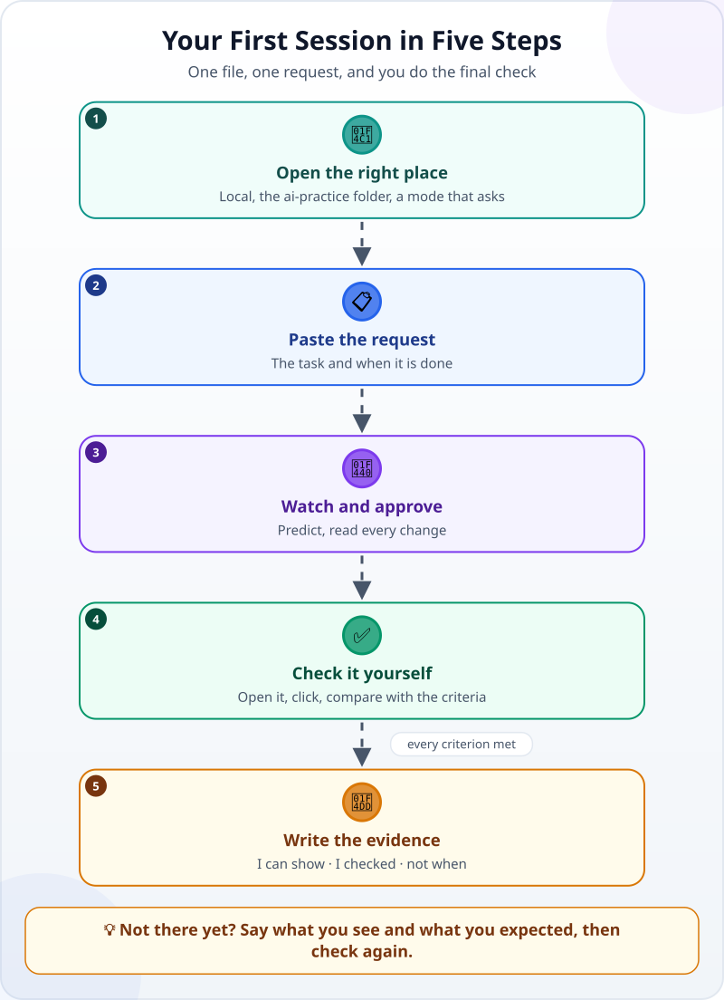
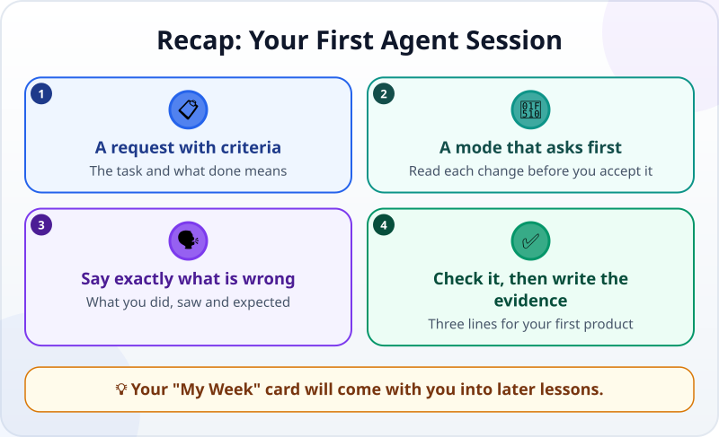

🌐 [Tiếng Việt](../../vi/lessons/first-agent-session.md) · **English** · [日本語](../../ja/lessons/first-agent-session.md)

# Your First Agent Session: Build a One-File Task Card

<!-- section: objective -->
## Lesson Objective

By the end of this lesson, you will be able to:

- Run a whole agent session: open the right place, hand over a task with criteria, approve changes, check the result yourself.
- Tell the agent clearly what is wrong: what you did, what you saw, what you expected.
- Write three lines of evidence for your first product.

<!-- section: hook -->
## Why It Matters

You have [watched an agent work](watch-an-agent-build.md), [chosen where to practise](choose-your-learning-setup.md) and learned [which actions are safe and which need asking](data-safety-and-permissions.md). Now it is your turn at the wheel.

Today's product is small — a single HTML file, a "My Week" task card with checkboxes — but you will go through every step of a real working session with an agent. The card will come with you into later lessons.

<!-- section: concept -->
## Core Idea

### Your first session in five steps



1. **Open the right place:** run the agent on your computer, choose the `ai-practice` folder, and pick the mode in which the agent **asks before** each change.
2. **Paste the request:** the task and what "done" means — a ready-made one is in *Try It Yourself*.
3. **Watch and approve:** predict the next step; read each change the agent proposes before you accept it.
4. **Check it yourself:** open the file in a browser, click around, compare with each criterion.
5. **Write the evidence:** three lines — what you can show, what you checked, when you would not use it.

### When the result is wrong: say what you see and what you expected

"It doesn't work" is the sentence an agent can do least with. Say **what you did, what you saw and what you expected**. For example:

> *"I clicked the box of the second task, but the text was not struck through. Expected: one click strikes it through, another click removes the line."*

A sentence like that gives the agent a clear check to run itself before it reports back.

<!-- section: try-it -->
## Try It Yourself

About 25 minutes. Made-up data only.

**1. Get ready (3 minutes)** — on the route you chose:

- 💻 **Your own computer:** open your agent app in the `ai-practice` folder. For example, with the Claude app (as of September 2026): the **Code** tab → choose **Local** → **Select folder** → pick `ai-practice` → in the permission-mode selector, choose **Manual**: the agent proposes each change and waits for you to accept it.
- ☁️ **Browser:** start a cloud session on your `ai-practice` repository.
- 👀 **Watch only:** read the *sample log* at the end of this section, then do steps 3–5 on paper.

**2. Paste the request (2 minutes):**

```text
In this folder, create one single file called my-week.html: a "My Week" task card.

Requirements:
- A title, "My Week", and 5 sample tasks (made up), each with a checkbox.
- Clicking a box strikes through that task's text; clicking again removes the line.
- It opens in a browser, needs no internet, and uses no outside libraries.

Done when:
1. Opening my-week.html in a browser shows the title and all 5 tasks.
2. Checking and unchecking each task works correctly.
3. At phone width (a narrow window) the text is still readable.

Before you start, restate the goal and the criteria in your own words.
When you finish, report what you checked and what you did not check.
```

**3. Watch and approve (10 minutes):**

- Does the agent's restatement match what you meant? If not, correct it now — this is the cheapest moment.
- Before each step, predict what the agent will do.
- For each proposed change, look at the file name — is it `my-week.html` in `ai-practice`? — before you accept. Does the agent ask for an ✋ action (installing, deleting, leaving the folder)? Ask why: this task needs none of them.

**4. Check it yourself (5 minutes):** open the `ai-practice` folder and double-click `my-week.html`. Compare with each criterion: title and 5 tasks? Checking and unchecking **each** task? Readable in a narrow window? If something fails, say what you see and what you expected, then check again.

**5. Write your evidence (3 minutes):**

- *I can show…* `my-week.html` open in a browser, with 5 tasks that can be checked off.
- *I checked…* all 3 criteria, task by task, and in a narrow window.
- *I would not use this when…* for example: the checked tasks must survive a page reload — this card cannot do that yet.

Want more? Send one more request so the card remembers checked tasks after a reload — with criteria of your own.

<details>
<summary>Sample log (for the watch-only route)</summary>

1. The agent restates: create one file, `my-week.html`, with 5 sample tasks and checkboxes, and 3 criteria.
2. It looks at the folder: only `README.txt`.
3. It proposes creating `my-week.html`; you read the file name and accept.
4. It opens the page to try it: each box strikes its task through and a second click removes the line; in a narrow window the text is still readable.
5. It reports: *"Created `my-week.html`. Checked: the 3 criteria. Not checked: on a real phone; checked tasks are lost when the page reloads."*

**Your question:** before you trust this report, what would you check yourself?

</details>

<!-- section: misconceptions -->
## Common Misconceptions

- **"The shorter the request, the better — the agent will understand."** — Short without criteria means the agent has to guess; a wrong guess costs you time fixing it.
- **"I have to understand all the code before I can check the result."** — Not yet. Today you check behaviour: open, click, compare with the criteria. Reading each change to the code is a skill you will learn later.
- **"If the agent gets it wrong the first time, I gave a bad task."** — One or two extra rounds are normal. What matters is that each round you say what you saw and what you expected.

<!-- section: recap -->
## The Lesson in One Picture



<!-- section: takeaways -->
## Key Takeaways

- A working session: open the right place → paste a request with criteria → watch and approve → check it yourself → write the evidence.
- While you are learning, choose the mode in which the agent asks first, and read each change before you accept it.
- Not there yet? Say what you did, what you saw and what you expected.
- Your first session succeeds when **you** can check the result — not when the agent says it is done.

<!-- section: quiz -->
## Quick Check

**Question 1.** Which permission mode suits a first session best?

- A) A fully automatic mode, to go faster
- B) A mode in which the agent proposes each change and waits for you to accept it
- C) Any mode; it does not matter

**Question 2.** Which sentence helps the agent fix a bug fastest?

- A) "It doesn't work."
- B) "Start again from scratch."
- C) "I clicked the second task's box but the text was not struck through; I expected a line through it."

**Question 3.** The agent says it is done. What do you do next?

- A) Open the file, try each criterion, then write the evidence
- B) Trust the report and move on
- C) Delete the file to keep the folder tidy

<details>
<summary>Show answers</summary>

1. **B** — while you are learning, reading each change before you accept it is how you learn.
2. **C** — saying what you did, saw and expected gives the agent a concrete check.
3. **A** — the agent's report is where your check starts; the final check is yours.

</details>

<!-- section: sources -->
## Recommended Sources

- Anthropic — [Get started with the desktop app](https://code.claude.com/docs/en/desktop-quickstart): install the app, open the *Code* tab, choose *Local* and a folder; in *Manual* mode the agent proposes each change and waits for you to accept or reject it.
- Anthropic — [Best practices for Claude Code](https://code.claude.com/docs/en/best-practices): give specific context in your requests, and give the agent a way to verify its own work.
