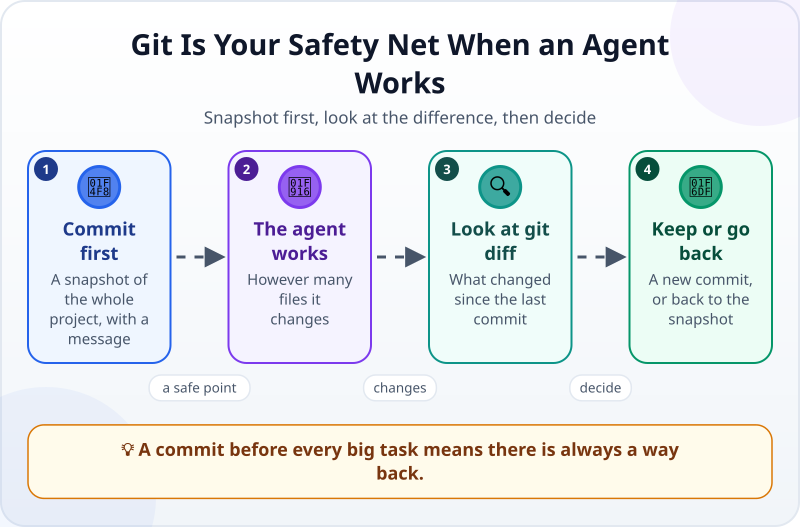
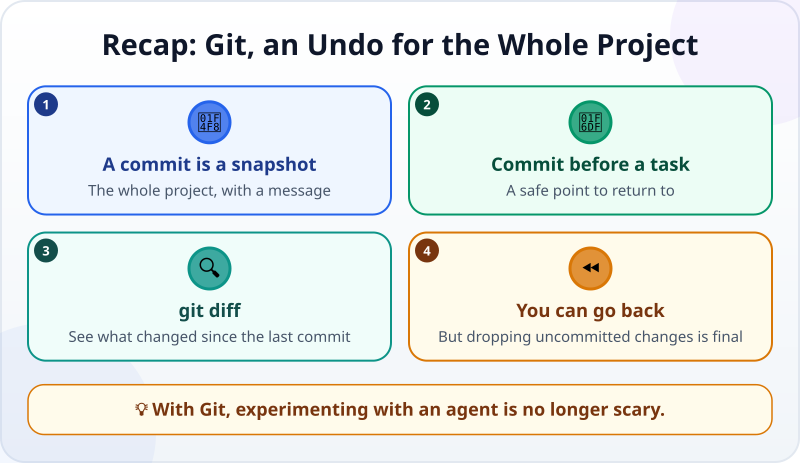

🌐 [Tiếng Việt](../../vi/lessons/git-version-control.md) · **English** · [日本語](../../ja/lessons/git-version-control.md)

# Git: A Magic Undo Button for Your Whole Project

<!-- section: objective -->
## Lesson Objective

By the end of this lesson, you will be able to:

- Explain **Git** and a **commit**: a snapshot of the whole project, with a message.
- Commit before handing a task to an agent, look at **git diff**, then keep the change or go back.
- Know which Git action needs care: dropping uncommitted changes is final.

<!-- section: hook -->
## Why It Matters

Agents change things fast and in bulk: one request can touch several files at once. Your editor's undo button remembers one file at a time, and forgets when you close the app.

Git is different: it records **the whole project** at a moment in time, and you can go back whenever you like. In [your personal web page](project-personal-page.md) you made something worth keeping. From this lesson on, everything in `ai-practice` has a way back.

<!-- section: concept -->
## Core Idea

### A commit: a snapshot of the whole project

A **commit** saves the state of every file in the folder at one moment, with a sentence describing it — for example *"Add 'Tidy my desk' to the week card"*. The chain of commits is the project's history: you can look back, compare and return. Git runs on your computer; no internet needed.

### A safety net when you hand over work



1. **Commit first:** before every big task, take a snapshot — your safe point.
2. **The agent works:** however many files it changes.
3. **Look at `git diff`:** what changed since the last commit — just like the diffs you have learned to read.
4. **Keep or go back:** happy? Make a new commit. Not happy? Go back to the snapshot.

### You do not need to learn the commands

The agent types the Git commands for you: `git init` (turn a folder into a Git repository), `git commit` (take a snapshot), `git log` (see the history), `git diff` (see the differences), `git restore` (put a file back as committed). Your job is to know **when** each is needed — and to read carefully before you allow it.

### What needs care

- **Dropping uncommitted changes is final.** `git restore` puts a file back as committed; anything changed since and not committed is gone for good. Commit what you want to keep first. This is an ✋ ask-first action.
- **Installing Git is an ✋ ask-first action.** On Windows, Claude Code's guidance (as of September 2026) recommends Git for Windows; without it, Claude Code uses PowerShell instead.

<!-- section: example -->
## Real Example

Tuấn has committed his week card with the message *"Week card remembers checked tasks"*. Then he asks the agent to *"make the card look nicer"* — a vague request. The agent changes the colours, the layout and… the card stops remembering checked tasks.

Tuấn looks at `git diff`: over 80 changed lines, the saving code rewritten too. He decides to go back: the agent asks again because uncommitted changes will be lost, Tuấn agrees, and within seconds the card is exactly as committed. This time he writes a clear spec: *"Only change the background colour and the font; do not touch the saving code."*

<!-- section: try-it -->
## Try It Yourself

About 15 minutes, in `ai-practice`, in a mode where the agent asks first.

**1. Check for Git (2 minutes):**

```text
Check whether Git is installed (git --version). If it is not, tell me how to install it; do not install it yourself.
```

**2. Your first commit (3 minutes):**

```text
Turn this folder into a Git repository, then make a first commit with all the current files,
with the message "First version: week card and personal page". Show me git log.
```

**3. Let the agent change something (3 minutes):** *"Change the background of my-week.html to light blue."* Do not commit yet.

**4. See the difference (2 minutes):** *"Show me git diff."* Read it: is exactly one thing changed?

**5. Go back (3 minutes):** say you do not like the new colour: *"Drop the change you just made to my-week.html and put it back as committed."* The agent should say the change will be lost and ask you. Open the file: back to how it was?

**6. Keep a change (2 minutes):** have the agent add a task you want to keep to the card, then commit it with a clear message. `git log` now shows two commits.

Write your evidence:

- *I can show…* `git log` with two commits, and the file back exactly as it was in step 5.
- *I checked…* `git diff` before deciding to keep or drop the change.
- *I would not use this when…* for example: I have not committed what I want to keep — then I commit first and go back after.

**Extra challenge (optional):** to put your personal page online, you can push the Git repository to a service such as GitHub and turn on its website publishing. Ask the agent for a step-by-step plan and read it very carefully: this is an ✋ sending-out action, and the page will be public.

<!-- section: misconceptions -->
## Common Misconceptions

- **"Git is GitHub."** — Git runs on your computer. GitHub is a website that stores Git repositories online. You can use Git without GitHub.
- **"The editor's undo button is enough."** — Undo remembers one file and forgets when you close the app; a commit captures the whole project and stays.
- **"The fewer commits, the tidier."** — Small, frequent commits with clear messages let you go back to exactly the point you need.

<!-- section: recap -->
## The Lesson in One Picture



<!-- section: takeaways -->
## Key Takeaways

- A commit = a snapshot of the whole project, with a message.
- Commit before every big task; look at `git diff`; happy — commit, unhappy — go back.
- Dropping uncommitted changes is final — an ✋ action that needs care.
- The agent types the Git commands; you decide when, and read carefully before you allow them.

<!-- section: quiz -->
## Quick Check

**Question 1.** What is a commit?

- A) An automatic online backup
- B) A snapshot of the whole project at one moment, with a message
- C) A command that deletes old files

**Question 2.** When should you commit?

- A) Only when the project is completely finished
- B) Once a month
- C) Before handing a big task to an agent, and after every change you want to keep

**Question 3.** What does `git restore my-week.html` do with that file's uncommitted changes?

- A) Drops them and puts the file back as committed — those changes are gone for good
- B) Saves them as a new commit
- C) Pushes them to GitHub

<details>
<summary>Show answers</summary>

1. **B** — a commit captures the whole project; it stays on your computer and does not go online by itself.
2. **C** — commit before, for a safe point, and after, to keep what you like.
3. **A** — which is why it is an ✋ ask-first action: commit what you want to keep first.

</details>

<!-- section: sources -->
## Recommended Sources

- Anthropic — [Best practices for Claude Code](https://code.claude.com/docs/en/best-practices): the recommended workflow ends by asking the agent to commit with a descriptive message.
- Anthropic — [Advanced setup](https://code.claude.com/docs/en/setup): on Windows, Git for Windows is recommended so Claude Code can use its Bash tool; without it, Claude Code uses PowerShell.
