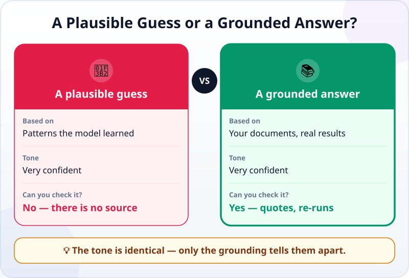
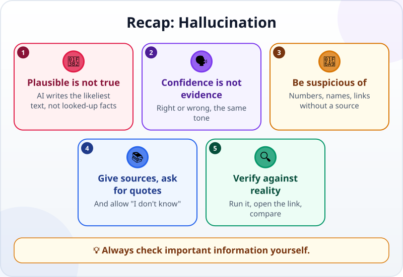

🌐 [Tiếng Việt](../../vi/lessons/hallucination.md) · **English** · [日本語](../../ja/lessons/hallucination.md)

# Hallucination: Why AI Is Confidently Wrong

<!-- section: objective -->
## Lesson Objective

By the end of this lesson, you will be able to:

- Explain what **AI hallucination** is and why it happens.
- Spot the warning signs: numbers, names and links without a source.
- Use a few ways to reduce and catch it: give sources, ask for quotes, allow "I don't know", verify against reality.

<!-- section: hook -->
## Why It Matters

In [your personal web page project](project-personal-page.md) you set a rule: content about you is yours to write, because an agent can very confidently make up plausible-sounding things. This lesson explains why.

Even the most advanced language models sometimes produce false information, or information that does not match the documents you gave them — Anthropic, the company that makes Claude, says so in its own guidance. Knowing when to be suspicious is the most important supervising skill of all.

<!-- section: concept -->
## Core Idea

### Why is AI confidently wrong?

A language model writes the answer that **sounds most plausible**, based on patterns it has learned — it does not look facts up unless it has tools or documents to rely on. Plausible does not mean true. And the writing is just as fluent and confident whether the answer is right or wrong.

### Warning signs

- A **very precise number** with no source ("74% of employees…").
- **Names, function names or library names** you have never seen.
- **Links or quotes** that sound very real — only opening them tells you whether they exist.
- Information about **you or your company** that you never gave it.

### Reducing and catching hallucinations

Anthropic's guidance suggests:

- **Allow "I don't know":** write in the request *"If you are not sure, say you don't know."*
- **Give documents, and only those:** *"Use only this file, not your general knowledge."*
- **Ask for word-for-word quotes:** every point must come with a quote from the document; no quote, no point.
- **Ask again and compare:** ask the same question a few times; answers that contradict each other are a warning sign.

With an agent there is a stronger way: **verify against reality.** A made-up function breaks as soon as it runs; a made-up link does not open. That is why you have learned to run things, read errors and write checks. But all of these only reduce hallucinations; they do not remove them: always check important information yourself.

<!-- section: analogy -->
## Simple Analogy

Picture a sharp new colleague who never says "I don't know". Whatever you ask, they answer at once, fluently — usually right, but now and then made up on the spot. Over time you learn to ask: *"Where did you get that?"*

Where the analogy breaks: your colleague knows when they are guessing; a language model cannot tell its guesses from what it knows.

<!-- section: example -->
## Real Example

Hana asks the agent to add a line to her tips page: *"How many times a day do office workers in Japan check their e-mail?"* The agent writes: *"74 times a day on average (according to a 2023 survey)."*

It sounds real — and there is no source. Hana asks: *"Which survey? Give me the link."* The agent cannot produce any source she can check. Hana drops the number and writes a tip that needs no statistic: *"Pick two fixed times a day to answer e-mail."* Her rule from now on: **no number goes on the page without a source she can check.**

<!-- section: misconceptions -->
## Common Misconceptions

- **"If the AI sounds sure, it is right."** — The tone is equally confident when it is right and when it is wrong. Confidence is not evidence.
- **"A link means there is a source."** — Links can be made up too. Open it and read whether it says what was claimed.
- **"Newer models will stop hallucinating."** — By Anthropic's own account, these techniques greatly reduce hallucinations but do not eliminate them; important information still needs checking.

<!-- section: recap -->
## The Lesson in One Picture

<!-- section: takeaways -->
## Key Takeaways

- Hallucination: AI states false or made-up things as if they were true, because it writes the most plausible text.
- Confidence is not evidence; only grounding tells right from wrong.
- Be suspicious of numbers, names and links without a source; give documents, ask for quotes, allow "I don't know".
- Verify against reality — run it, open the link, compare — especially for important information.

<!-- section: quiz -->
## Quick Check

**Question 1.** Why can an AI be wrong and still sound very confident?

- A) Because it is trying to fool you
- B) Because the internet is slow
- C) Because it writes the most plausible text; plausible is not necessarily true

**Question 2.** Which sign is the most suspicious?

- A) A very precise number with no source
- B) A short answer
- C) An answer with bullet points

**Question 3.** You ask an AI about a (made-up) company document. What reduces hallucination most?

- A) Firing lots of questions at it
- B) Giving it the document, asking it to use only that and to quote word for word
- C) Telling it "don't get it wrong"

Show answers

1. **C** — the AI is not lying on purpose; it writes plausible text, and its tone is always confident.
2. **A** — precise numbers without a source are where hallucinations show up most.
3. **B** — with the document and word-for-word quotes, every point can be checked.

<!-- section: sources -->
## Recommended Sources

- Anthropic — [Reduce hallucinations](https://platform.claude.com/docs/en/test-and-evaluate/strengthen-guardrails/reduce-hallucinations): even the most advanced models sometimes produce false information; allow "I don't know", use direct quotes, verify with citations, restrict answers to the documents provided; these reduce hallucinations but do not eliminate them.
- Anthropic — [Building Effective AI Agents](https://www.anthropic.com/engineering/building-effective-agents) (December 2024): at each step an agent needs "ground truth" from its environment — tool results, code execution.
