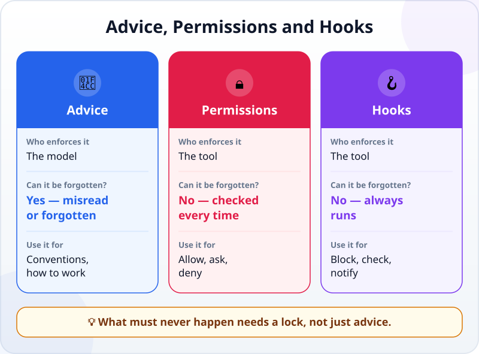
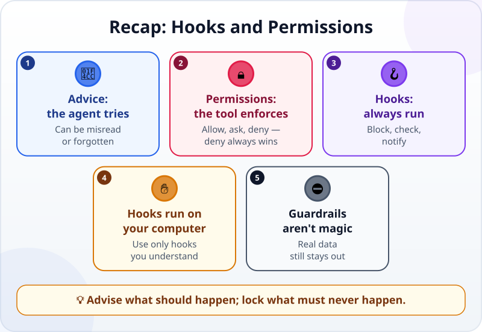

🌐 [Tiếng Việt](../../vi/lessons/hooks-and-permissions.md) · **English** · [日本語](../../ja/lessons/hooks-and-permissions.md)

# Hooks and Permissions: Automatic Guardrails

<!-- section: objective -->
## Lesson Objective

By the end of this lesson, you will be able to:

- Tell **advice** (the instruction file) apart from **locks** (permissions and **hooks**): which one the agent can forget, and which one the tool always enforces.
- Read and write a simple permission rule: allow, ask, deny.
- Add a rule in `ai-practice` that forbids editing the data folder, and check that it really blocks.

<!-- section: hook -->
## Why It Matters

In the instruction file of her report project, Mai wrote: *"Do not change any file in the data/ folder."* For weeks, the agent followed it.

Then one afternoon, after a very long session, the agent "helpfully" changed a line in `data/sales_november.csv` to make it match the report. Mai was in the mode that lets the agent edit files without asking, so no prompt appeared. Luckily she used [Git](git-version-control.md) and saw it straight away in the diff.

What happened? As you saw in [the agent loop](the-agent-loop.md), when the context is nearly full, instructions from early in the session can be lost. Advice is something the agent **tries** to follow. Mai needed something the agent **cannot** get past.

<!-- section: concept -->
## Core Idea

### Advice and locks

The Claude Code documentation (September 2026) is very clear: permission rules are enforced by **the tool**, not by the model. Instructions in a prompt or in `CLAUDE.md` shape what the agent tries to do, but they do not change what the tool allows.



- **Advice** (the instruction file): cheap and flexible, for conventions and ways of working. But the model can misread it, or forget it.
- **Permissions:** the tool checks **every time** the agent is about to use a tool, then allows it, asks you, or blocks it.
- **Hooks:** a command the tool **runs by itself** at a set moment — before the agent edits a file, after an edit, when the agent needs you. It always runs, whether or not the model remembers anything.

### Permission rules: allow, ask, deny

The three kinds of action you learned in [Before You Let an Agent Act](data-safety-and-permissions.md) can be written as rules for the tool. For example, with Claude Code (as of September 2026), in the project's `.claude/settings.json` file:

```json
{
  "permissions": {
    "deny": ["Edit(/data/**)"],
    "ask": ["Bash(rm *)"],
    "allow": ["Bash(python check_report.py)"]
  }
}
```

It reads: **deny** editing any file in `data/`; **ask** before any delete with `rm`; **allow** running the check without asking.

Two things to remember:

- **Deny always wins.** The tool checks in the order deny → ask → allow; an allow rule cannot open a hole in a deny rule.
- **Rules are not perfect.** The documentation also warns that a rule denying a command may not catch the same command written another way. For example, an `Edit(...)` rule blocks the agent's file-editing tool, but a terminal command can still write to that file — so terminal commands should stay in ask-first mode, and you read every command. Guardrails reduce risk; they do not remove it — real data still stays out of `ai-practice`.

Besides rules, tools also have **permission modes** (ask about everything, edit files freely, plan only…). While you are learning, keep the ask-first mode.

### Hooks: things that always happen

The Claude Code documentation describes hooks as commands you define that the tool runs at fixed moments, so that *certain actions always happen* rather than relying on the model to choose them. A few common examples:

- **Before editing a file:** check the path; if it is a protected file, block the edit, with a reason so the agent changes course.
- **After editing a file:** run the check or reformat the code automatically.
- **When the agent needs you:** show a notification on your computer, so you do not have to sit and watch.

A hook is a command that runs on your computer with your permissions. That makes it a ✋ **ask first** item: only use hooks you understand, or that someone you trust wrote.

<!-- section: try-it -->
## Try It Yourself

About 8 minutes, in `ai-practice`, with made-up data. The steps below use Claude Code (as of September 2026); other tools have similar settings — check their documentation. (On the watch-only route? Read the steps and answer the question in step 3 for yourself.)

**1. Prepare (1 minute).** In `ai-practice`, create a `data` folder with a made-up file `data/customers.csv`:

```text
name,city
Company A,Tokyo
Company B,Oskaa
```

(The misspelling "Oskaa" is on purpose.)

**2. Add the rule (2 minutes).** Create the file `ai-practice/.claude/settings.json` with:

```json
{
  "permissions": {
    "deny": ["Edit(/data/**)"]
  }
}
```

Create it yourself, or ask the agent to and read every line before you approve. Close the old session and open a **new session** so the setting takes effect.

**3. Try to get blocked (4 minutes).** Give the agent:

```text
Fix the spelling mistake "Oskaa" in data/customers.csv.
```

What you expect: the agent is **blocked** when it tries to edit the file. Watch what it does next — does it report that it was blocked and suggest another way? If it proposes a terminal command to change `data/customers.csv` instead, that is exactly the gap above — **deny** it. Then continue:

```text
Don't change the original file. Write a corrected copy to results/customers_fixed.csv.
```

This time the agent can do it, because `results/` is not denied. Open both files: the original still has the mistake; the new one is corrected.

**4. (Optional, ✋) A notification hook (1 minute).** If you like, ask the agent: *"Suggest a hook that shows a notification on my computer when you need me to answer. Don't install it yet; show me what it contains first."* Read the command it suggests. Only install it once you understand every part.

**Evidence:**

- *I can show…* the `settings.json` file with the deny rule, and the moment the agent was blocked from editing `data/customers.csv`.
- *I checked…* the original file is unchanged, and the file in `results/` is correctly fixed.
- *I would not use this when…* I am tempted to use guardrails as a reason to "safely" bring in real data — guardrails reduce risk; they do not replace the rules about data.

<!-- section: misconceptions -->
## Common Misconceptions

- **"Writing 'do not change' in the instruction file is enough."** — That is advice: the agent tries to follow it, but can misread or forget it. Something that must never happen needs a deny rule or a hook.
- **"Switch on allow-everything to go faster."** — It is faster, and every guardrail that relied on the prompt disappears too. Only automate what you are sure is safe, like running the check.
- **"With guardrails in place, real data is fine."** — Rules have gaps, and the data still passes through the model. ⛔ real data does not become ✅ because there is a guardrail.

<!-- section: recap -->
## The Lesson in One Picture



<!-- section: takeaways -->
## Key Takeaways

- Advice shapes what the agent tries to do; permissions and hooks are enforced by the tool.
- Permission rules: allow, ask, deny — deny always wins.
- A hook is a command that runs by itself at a set moment, so something always happens.
- Hooks run on your computer: only use hooks you understand (✋).
- Guardrails reduce risk; they do not remove it: real data is still ⛔.

<!-- section: quiz -->
## Quick Check

**Question 1.** The instruction file says "don't change data/", but the agent changed it after a long session. What is the surest way to stop this happening again?

- A) Write that line in capital letters
- B) Add a rule denying edits to `data/` in the tool's permission settings
- C) Repeat that line in every message

**Question 2.** There is a deny rule `Bash(rm *)` and an allow rule `Bash(rm temp.txt)`. The agent is about to run `rm temp.txt`. What happens?

- A) It is blocked, because deny rules are always checked first
- B) It runs, because the allow rule is more specific
- C) The tool picks at random

**Question 3.** Which of these is a job for a **hook**?

- A) Explaining to the agent why the report must be short
- B) Choosing the model for a session
- C) Automatically running the check every time the agent finishes editing a file

<details>
<summary>Show answers</summary>

1. **B** — the rule is enforced by the tool, whether the model remembers or forgets.
2. **A** — the order is deny → ask → allow; an allow cannot open a hole in a deny.
3. **C** — a hook is a command that runs by itself at a set moment; A is a job for advice.

</details>

<!-- section: sources -->
## Recommended Sources

- Anthropic — [Configure permissions](https://code.claude.com/docs/en/permissions) (English, as of September 2026): permission rules are enforced by Claude Code, not by the model; instructions in a prompt or `CLAUDE.md` do not change what the tool allows; rules are evaluated deny → ask → allow; `Edit(...)` and `Bash(...)` syntax; a rule denying a command does not catch every other way of writing it.
- Anthropic — [Automate actions with hooks](https://code.claude.com/docs/en/hooks-guide) (English, as of September 2026): hooks are user-defined commands run at fixed points so certain actions always happen; examples include blocking edits to protected files with a reason fed back to Claude, and a notification when Claude needs you.
