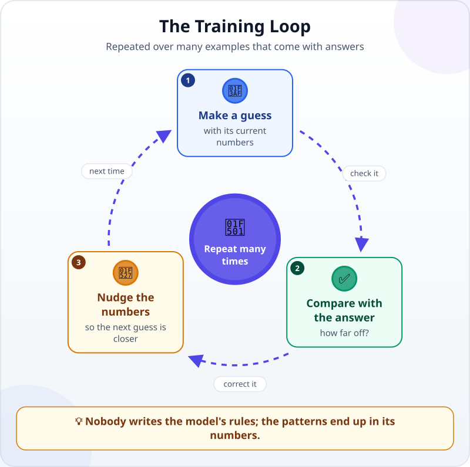
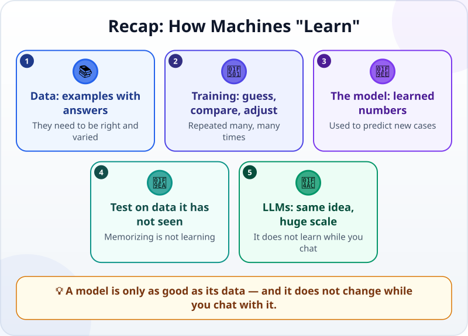

🌐 [Tiếng Việt](../../vi/lessons/how-machines-learn.md) · **English** · [日本語](../../ja/lessons/how-machines-learn.md)

# How Do Machines "Learn"? Data, Training and Models

<!-- section: objective -->
## Lesson Objective

By the end of this lesson, you will be able to:

- Explain **data, training and model** with an example of your own.
- Describe the training loop: guess, compare with the answer, adjust — and repeat.
- Say why poor data makes a poor model, and why a model does not learn anything new while you chat with it.

<!-- section: hook -->
## Why It Matters

Every month, Mai sorts hundreds of expenses into four categories: Travel, Meals, Stationery and Other. She tries writing rules so a machine can do it: *if it says "taxi", it is Travel*. After a few dozen rules it gets messy: is "Grab" a ride or a food delivery? Is "coffee with a client" Meals or Other?

A colleague suggests: *"Why not let the machine learn from the expenses you sorted last year?"* A machine that learns by itself sounds like magic. It is actually a very simple loop.

<!-- section: concept -->
## Core Idea

### Three things: data, training and the model

- **Training data:** examples that come with answers. For Mai, each example is one line describing an expense, together with the category she chose. To teach a machine to recognize apples, you show it many pictures labelled "apple".
- **Model:** a very large set of numbers that turns an input (an expense description) into an output (a category). At first the numbers are close to random, so the model guesses wildly.
- **Training:** the process of adjusting those numbers until the model gets most examples right.

### The training loop

1. **Make a guess:** the model guesses the category of one example, using its current numbers.
2. **Compare with the answer:** right or wrong, and by how much.
3. **Nudge the numbers:** a small adjustment, so the next guess is closer.

Repeat over a great many examples, in several passes. Nobody writes the rule *"Grab means Travel"*: the patterns end up in the numbers once training is done.

### Testing on data it has not seen

A model can "memorize" the old examples and still get new ones wrong. So part of the data is kept aside, never used for training, only for testing — like an exam whose questions did not leak.

### How does an LLM learn?

The same idea, at a huge scale. According to Anthropic, in the first stage (*pretraining*) a language model is trained on a very large body of text to predict the next word from the text before it. Then it is trained further — *fine-tuning*, and learning from human ratings (*RLHF*) — so it follows instructions and converses like an assistant. [The AI Family Tree](ai-ml-dl.md) shows where LLMs sit in the AI family.

### While you chat, the model is not learning

After training, the numbers are fixed. While you chat, the model does not adjust a single one. What it "remembers" during a session lives in the [context window](context-window.md) and is gone when you start a new session. If a product offers a "memory" feature, that is saved notes put back into the context — not the model learning something new.

<!-- section: analogy -->
## Simple Analogy

A new employee learns to sort receipts: they look at old receipts someone has already sorted, make their own guesses, and get corrected by the head accountant. After a few weeks, they get almost all of them right.

Where it breaks down: the employee understands **why** ("Grab Food is a meal delivery") and asks when something looks odd. A model only adjusts numbers; it cannot explain its reasons, and it can be confidently wrong about things it has never seen.

<!-- section: example -->
## Real Example

Suppose Mai's company tries this with made-up data:

1. They take 300 of last year's expenses, already sorted. They train on 250 and keep 50 aside for testing.
2. After training, the model gets most of the Travel and Meals expenses right among the 50 test expenses.
3. But it often gets "Other" wrong. Mai looks at the data and finds out why: last year "Other" had very few examples, and everyone used it differently.

Mai takes two lessons from this. To make the model better, she has to **fix the data** — add clear examples of "Other" and agree on how to sort them — not "tell" the model. And if she sorted things wrongly last year, the model learns those mistakes too: garbage in, garbage out.

<!-- section: misconceptions -->
## Common Misconceptions

- **"A model keeps a copy of its data to look things up."** — It keeps patterns in the form of numbers, not a store it searches example by example.
- **"More data is always better, whatever the data."** — More data helps only when it is correct and varied; wrong data teaches the model wrong things.
- **"If I correct the AI in a chat, it will remember next time."** — The numbers do not change during a chat. Write down what must be remembered in a file, and bring it back into the context.

<!-- section: recap -->
## The Lesson in One Picture

<!-- section: takeaways -->
## Key Takeaways

- Training data is examples with answers; the model is a set of numbers; training adjusts those numbers.
- The training loop: guess, compare with the answer, adjust a little — repeated many, many times.
- Test a model on data it has not seen; memorizing is not learning.
- LLMs learn with the same idea at a huge scale, then get further training to act as assistants.
- A model does not learn while you chat with it; write down what must be remembered.

<!-- section: quiz -->
## Quick Check

**Question 1.** What is a "model", really?

- A) A very large set of numbers adjusted through training
- B) A list of rules a programmer wrote
- C) A store of every example it has seen, to look things up

**Question 2.** Why keep part of the data aside and not train on it?

- A) To save memory
- B) To give the model more examples
- C) To test the model on cases it has never seen

**Question 3.** Yesterday you corrected a chatbot's mistake. Today, in a new conversation, will it remember the correction by itself?

- A) Yes, because it learned from the correction
- B) Don't count on it: the model's numbers do not change during a chat, so write it down and bring it back into the context
- C) Yes, if you corrected it enough times

Show answers

1. **A** — the patterns live in the numbers; nobody wrote rules, and it is not a store to look examples up in.
2. **C** — being right on old examples proves little; it has to be tried on things it has never seen.
3. **B** — training is over; a chat changes the context, not the model.

<!-- section: sources -->
## Recommended Sources

- Google Cloud — [What is Machine Learning?](https://cloud.google.com/learn/what-is-machine-learning): supervised learning uses labelled data (for example pictures labelled "apple"); training optimizes the model to predict the correct response from the training samples; more samples help when the data is of high quality.
- Anthropic — [Glossary](https://platform.claude.com/docs/en/about-claude/glossary), entries *Pretraining*, *Fine-tuning* and *RLHF*: language models are first trained to predict the next word, then fine-tuned and trained on human feedback to follow instructions.
