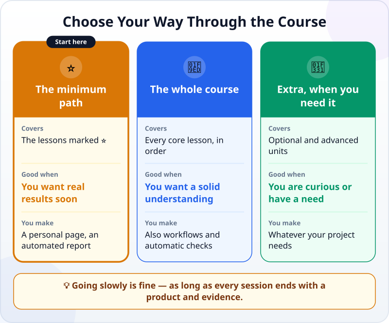
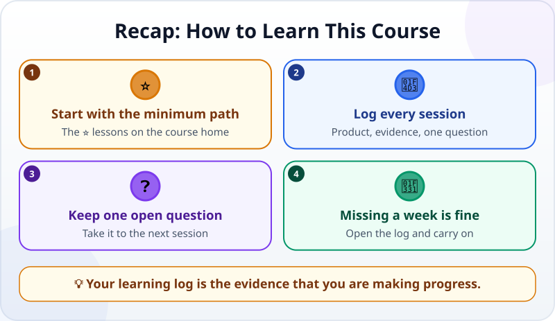

🌐 [Tiếng Việt](../../vi/lessons/how-to-learn-this-course.md) · **English** · [日本語](../../ja/lessons/how-to-learn-this-course.md)

# Choose Your Path and Keep a Learning Log

<!-- section: objective -->
## Lesson Objective

By the end of this lesson, you will be able to:

- Choose your way through the course: **the minimum path**, **the whole course**, or **extras when you need them**.
- Start a **learning log**: after each session, note the product, the evidence and one open question.
- Get back into learning after a break.

<!-- section: hook -->
## Why It Matters

You have just made your first product — the "My Week" card. There are many lessons ahead, and life is busy: there will be weeks when you cannot study.

People who finish long courses do not rely on iron willpower but on one small habit: every session leaves a trace — what they made, how they checked it, what they still wonder about. Next time, they open it and know where they are.

<!-- section: concept -->
## Core Idea

### Three ways through the course



- **⭐ The minimum path:** the lessons marked ⭐ on the [course home](../README.md), in order. Enough to hand real work to an agent and check the result, with two projects.
- **🧭 The whole course:** every core lesson in order — a more solid understanding, plus workflows and automatic checks.
- **🌱 Extras when you need them:** the units marked *optional* (how AI works) and *advanced* (working with agents at a larger scale) — when you are curious or a project needs them.

Not sure? Start with the minimum path. You can always learn more later.

### The learning log: three things after every session

1. **Product:** what did you make? (a file name, a screenshot)
2. **Evidence:** the familiar three lines — *I can show… / I checked… / I would not use this when…*
3. **One open question:** something you do not understand yet, or want to try next.

The open question is the best starting point for your next session.

### Missed a week? That is fine

The course does not count streaks. Missed a week — or a month? Open your log, read your latest open question and carry on from there.

<!-- section: try-it -->
## Try It Yourself

About 8 minutes.

**1. Choose how you will learn (2 minutes).** Open the [course home](../README.md), look at the ⭐ lessons and decide: minimum, whole course, or minimum first and then see.

**2. Create your log (3 minutes).** Ask the agent to create a file in `ai-practice`:

```text
Create a file learning-log.md titled "My agentic coding learning log",
with a template for each session: date, lesson, Product, Evidence (3 lines), Open question.
```

**3. Log your first session (3 minutes).** Fill in the first entry for [your first agent session](first-agent-session.md) — in your own words:

```text
## 2026-09-27 — My first agent session
- Product: my-week.html
- Evidence:
  - I can show…
  - I checked…
  - I would not use this when…
- Open question: …
```

If you have already done several lessons, add a line for each product you made.

<!-- section: misconceptions -->
## Common Misconceptions

- **"You have to study every day to get good."** — Regularity helps, but missing a few days does not erase what you learned. The log gets you back on track fast.
- **"A learning log is extra work."** — The three lines of evidence are a skill you use every day with agents. The log is where you practise it.
- **"You must finish the whole course before it is useful."** — After the minimum path you can already hand over real work and check the result.

<!-- section: recap -->
## The Lesson in One Picture



<!-- section: takeaways -->
## Key Takeaways

- Not sure what to learn? Start with the minimum path — the ⭐ lessons.
- After every session: the product, three lines of evidence, one open question.
- The open question is where your next session starts.
- Missed a week? Open the log and carry on.

<!-- section: quiz -->
## Quick Check

**Question 1.** You are not sure which lessons to take. Where should you start?

- A) The advanced lessons, to get good fast
- B) The minimum path — the ⭐ lessons
- C) Pick at random

**Question 2.** What goes into the learning log after each session?

- A) The product, three lines of evidence, one open question
- B) The number of hours you studied
- C) The whole conversation with the agent

**Question 3.** You have not studied for three weeks. What now?

- A) Start the course again from the beginning
- B) Give up; the streak is broken
- C) Open the log, read the latest open question and carry on from there

<details>
<summary>Show answers</summary>

1. **B** — the minimum path is enough for real work; extras can come later.
2. **A** — those three things tell you what you achieved and where to start next time.
3. **C** — this is exactly what the log is for.

</details>
