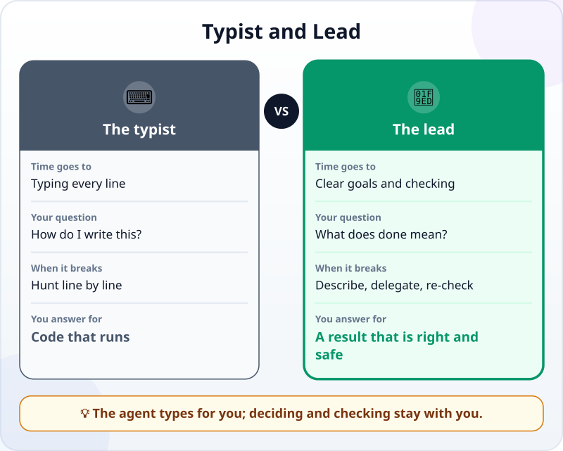
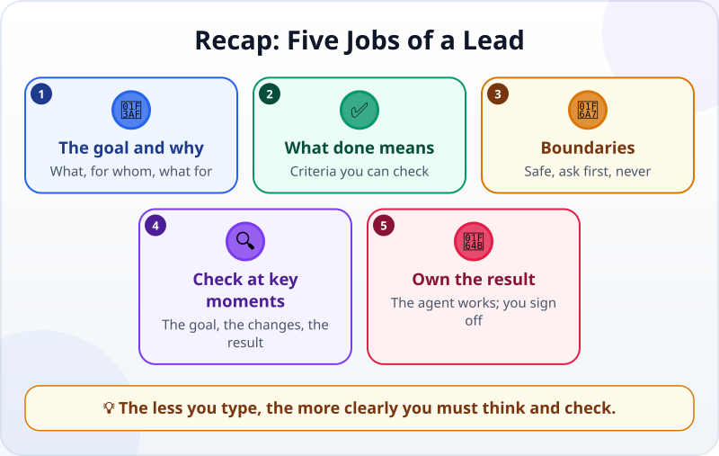

🌐 [Tiếng Việt](../../vi/lessons/lead-not-typist.md) · **English** · [日本語](../../ja/lessons/lead-not-typist.md)

# New Mindset: You Are the Lead, Not the Typist

<!-- section: objective -->
## Lesson Objective

By the end of this lesson, you will be able to:

- Describe your new role when working with an agent: from **typist** to **lead**.
- Name a lead's five jobs: the goal and why, what done means, boundaries, checks at key moments, owning the result.
- Rewrite a "typist" request as a "lead" request.

<!-- section: hook -->
## Why It Matters

In [your first agent session](first-agent-session.md) you did not type a single line of code — yet you did a lot: you said what you wanted, set criteria, read every change and checked the result yourself. That is a lead's job.

Many people think "AI writes the code for me" means less work. In fact the work only moves: less typing, but clearer thinking and more careful checking.

<!-- section: concept -->
## Core Idea

### What changes?

A typist spends time on *how*: writing each line, hunting each bug. A lead spends time on *what* needs doing and *how to know it is done*. The agent handles the typing; you handle the deciding.

### A lead's five jobs

1. **The goal and why:** what, for whom, what for. Knowing the reason helps the agent choose a better approach.
2. **What done means:** criteria you can check, as in your first session.
3. **Boundaries:** safe, ask first, never.
4. **Checks at key moments:** has the agent understood the goal, are the changes in the right place, does the result meet the criteria?
5. **Owning the result:** the agent does the work, but you are the one who signs it off.

<!-- section: analogy -->
## Simple Analogy

You hire a builder to work on your home. You do not lay the bricks yourself, but you say what you want (*"a bookshelf 2 metres tall that holds 50 kg of books"*), approve the drawing, look in at a few milestones and check each item before you pay.

Where the analogy breaks: an experienced builder usually asks when a request is vague; an agent sometimes fills the gap with a very confident guess. That is why your requests need to be clear.

<!-- section: example -->
## Real Example

Huy is a second-year student who knows a little Python. He has a file, `grades.csv` — made-up grades for 20 students in 4 subjects, each out of 10 — and needs a summary table.

**Typist style:** *"Write Python code that reads a CSV file."* The agent returns code that reads a file. Huy still has to work out the next step, put things together and test them himself.

**Lead style:**

> *"From `grades.csv`, create `summary.csv` with two new columns, Total and Grade (32 points or more: Excellent; 24 or more: Good; otherwise: Pass). Do not change the original file. Done when: `summary.csv` has all 20 rows; the totals of the first 3 students match the totals I add up myself; each grade follows the thresholds."*

The second request states the **result** (not just some code), a **boundary** (leave the original alone) and **how to check**. To sign it off, Huy adds up the first 3 students' grades himself and compares.

<!-- section: misconceptions -->
## Common Misconceptions

- **"If I do not type code, I do not need to understand software."** — You still need enough to judge: read error messages, know where files are, check results. This course teaches just enough of that.
- **"A lead gives orders and waits."** — A lead checks at a few key moments, not only at the end.
- **"If the agent is good, mistakes are the agent's fault."** — The agent bears no consequences. The person who uses the result — and who signed it off — is you.

<!-- section: recap -->
## The Lesson in One Picture

<!-- section: takeaways -->
## Key Takeaways

- Working with an agent, you move from typist to lead.
- Five jobs: the goal and why, what done means, boundaries, checks at key moments, owning the result.
- A good request talks about the result and how to check it, not only about code.
- The less you type, the more clearly you must think and check.

<!-- section: quiz -->
## Quick Check

**Question 1.** Which request shows a lead's mindset?

- A) "Write a Python function."
- B) "Fix the code so it works."
- C) "Create a summary file from `grades.csv` without changing the original; done when the first 3 totals match my own sums."

**Question 2.** Which is **not** one of a lead's five jobs?

- A) Typing every line of code
- B) Defining what done means
- C) Checking at key moments

**Question 3.** The agent made a mistake, and you signed it off without checking. Who answers for the result?

- A) The agent
- B) You
- C) Nobody

Show answers

1. **C** — it states the result, a boundary and how to check.
2. **A** — typing is the agent's part; the other jobs, plus owning the result, are yours.
3. **B** — the agent bears no consequences; you signed it off.

<!-- section: sources -->
## Recommended Sources

- Google Cloud — [What is agentic coding?](https://cloud.google.com/discover/what-is-agentic-coding): moving from "chatting with AI" to "assigning tasks to AI" lets developers focus on architecture and logic; agents work more like a skilled contractor than a passive consultant; code an agent writes should be reviewed by a person before it goes into the main project.
- Anthropic — [Best practices for Claude Code](https://code.claude.com/docs/en/best-practices): give specific context in your requests, and give the agent a way to check its own work.
