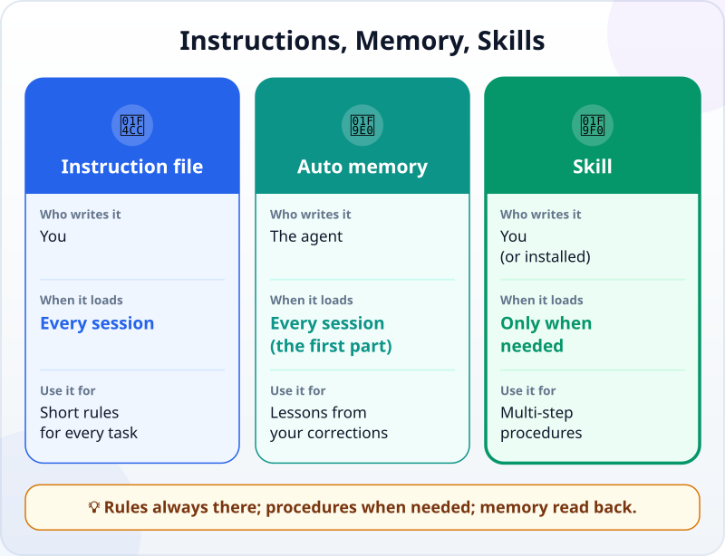
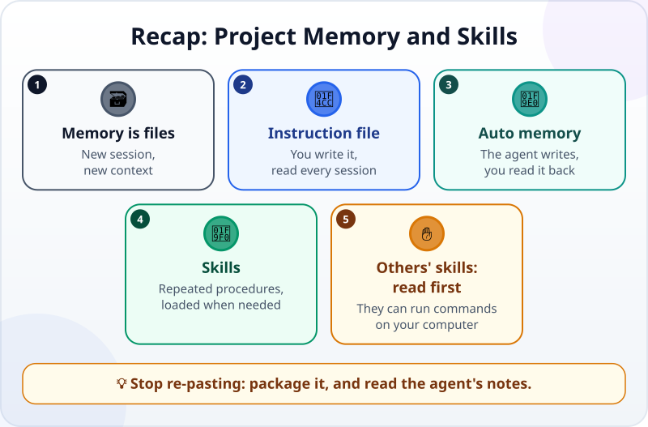

🌐 [Tiếng Việt](../../vi/lessons/memory-and-skills.md) · **English** · [日本語](../../ja/lessons/memory-and-skills.md)

# Project Memory and Reusable Skills

<!-- section: objective -->
## Lesson Objective

By the end of this lesson, you will be able to:

- Tell apart three things that carry over to the next session: the **instruction file**, **auto memory** and **skills**.
- Turn a procedure you often repeat into a skill, and call it in a new session.
- Read back and tidy the memory the agent writes itself, so it does not keep things that are wrong or should not be kept.

<!-- section: hook -->
## Why It Matters

At the end of every month, Mai opens a new session and pastes the same list for the agent:

```text
1. Check that the month's sales file (e.g. sales_october.csv) exists.
2. Run make_report.py on that month's file.
3. Run check_report.py; if it fails, stop and tell me.
4. Add up one branch's revenue by hand and compare it with the report.
5. Add a line to log.md: the month, total revenue, the check result.
6. Commit with the message "Report for month X".
```

In December, in a hurry, she just types *"make the December report"*. The agent makes the report — but skips step 3. A wrong number goes straight to her manager.

The agent did not "forget": every session starts with a fresh context. What Mai needs is a place where that procedure is **always there when needed**, without pasting it again.

<!-- section: concept -->
## Core Idea

### An agent remembers through files

You already know [where an agent "remembers"](context-window.md): apart from what it learned in training and what is in the current session, the only thing that carries over to the next session is **files**. Agent tools usually have three kinds of such files:



- **The instruction file** — you write it; read at the start of **every** session. For short rules that are true for every task (you wrote one in [Context Engineering](context-engineering.md)).
- **Auto memory** — **the agent** notes what it learns while working with you, such as your preferences or the times you corrected it. As of September 2026, Claude Code has *auto memory*: the first 200 lines (or first 25KB) of a `MEMORY.md` file are loaded at the start of every session.
- **A skill** — you write it (or install it); a multi-step **procedure** packaged in a file. Unlike the instruction file, a skill's content **is loaded only when it is used**, so a long procedure costs almost no space until you need it.

### When should you write a skill?

The Claude Code documentation (September 2026) suggests: create a skill when you **keep pasting** the same instructions, checklist or multi-step procedure — or when part of your instruction file has grown into a procedure rather than a rule.

A skill in Claude Code is a `SKILL.md` file in its own folder, with two parts:

- **The name and description** (at the top of the file): the name matches the folder; the description says *when* to use this skill. The agent reads it to decide by itself to load the skill when a task fits.
- **The instructions:** the steps the agent follows when the skill runs.

You can also call it directly by name, like `/monthly-report`. Claude Code's skills follow an open standard (Agent Skills) that other AI tools use too.

### Read the memory back

Auto memory is handy, but it is **the agent's notes**, not yours. It can note something wrong (misunderstanding one of your corrections), something out of date, or something that should not be in a file at all — a real name, an internal figure. It is all plain text files you can read, edit or delete. Open them from time to time.

### Other people's skills are ✋

A skill can include commands that run on your computer. Installing a skill someone else wrote is like installing a program: ✋ **ask first**, read all of it, and only use sources you trust.

<!-- section: try-it -->
## Try It Yourself

About 11 minutes, in `ai-practice`, with the made-up data from the [automation project](project-office-automation.md) (or any task you repeat with the same steps). The steps use Claude Code (as of September 2026); other tools have similar mechanisms — check their documentation. (On the watch-only route? Do step 1 and write step 2 on paper.)

**1. Write down the procedure (2 minutes).** List the 4–6 steps you repeat each time, in order, and which step must stop if there is a problem. Mai's list above is an example.

**2. Package it as a skill (4 minutes).** Create the file `ai-practice/.claude/skills/monthly-report/SKILL.md`:

```text
---
name: monthly-report
description: Makes the monthly revenue report from a month's sales file, e.g. sales_october.csv. Use when I ask for a monthly report.
---
When making the report for month X:
1. Check that the sales file for month X (e.g. sales_october.csv) exists; if not, stop and tell me.
2. Run make_report.py on that file.
3. Run check_report.py. If it fails, stop, tell me the result, and change nothing else.
4. Remind me to add up one branch's revenue by hand to compare; don't add it up for me. Stop and wait until I confirm it matches.
5. Add a line to log.md: the month, total revenue, the check result.
6. Commit with the message "Report for month X".
```

Use the file names your project really has: if your program or check is called something else (for example `verify_report.py`), change steps 2 and 3 to match.

**3. Test it in a new session (3 minutes).** Open a **new session** and type only:

```text
Make the October report.
```

Did the agent load the skill by itself? Did it run `check_report.py`, even though you did not mention it? At step 4, did it remind you to add up by hand, without doing it for you, and wait for your confirmation before logging and committing? If it did not load the skill, make the description clearer about "when to use it", and try again. You can also call `/monthly-report` directly.

**4. Read the memory (2 minutes).** Type `/memory` in Claude Code (or ask the agent *"What have you noted about this project on your own?"*). Read every line. Is anything wrong, out of date, or something that should not be there? Delete it.

**Evidence:**

- *I can show…* the `SKILL.md` file, and a new session that did every step when I typed one sentence.
- *I checked…* that the agent ran the check and stopped in the right place; that the memory holds nothing wrong or sensitive.
- *I would not use this when…* the procedure is a one-off (then say it in the request), or the skill comes from a source I have not read in full.

<!-- section: misconceptions -->
## Common Misconceptions

- **"After working with me for a while, the agent remembers everything."** — Every session starts with a fresh context. Only what is in files — instructions, memory, skills — carries over.
- **"Just put the whole procedure in the instruction file."** — The instruction file is read in every session, including the ones that have nothing to do with the report. A long procedure in a skill is loaded only when needed.
- **"Auto memory is always right because the agent wrote it."** — It is the agent's notes and can be misunderstood or out of date. Read it back and tidy it like a file of your own.

<!-- section: recap -->
## The Lesson in One Picture



<!-- section: takeaways -->
## Key Takeaways

- An agent remembers between sessions through files, not "memory".
- Instruction file: short rules, written by you, read every session.
- Auto memory: written by the agent — you read it back, edit it, delete from it.
- Skills: multi-step procedures, loaded only when used; write one when you keep pasting the same thing.
- Someone else's skill can run commands on your computer: ✋ read it before installing.

<!-- section: quiz -->
## Quick Check

**Question 1.** Mai pastes the same 6-step procedure every month. Where should it go?

- A) In a skill, loaded when making the monthly report
- B) In the instruction file, read in every session
- C) Nowhere; the agent will remember it

**Question 2.** What is the main difference between a skill and the instruction file?

- A) Skills can only be written in English
- B) A skill's content is loaded only when used; the instruction file is read in every session
- C) The instruction file is written by the agent

**Question 3.** You open the auto memory and find a line where the agent noted a project convention wrongly. What should you do?

- A) Leave it; the agent wrote it, so it must be right
- B) Restart the computer
- C) Edit or delete that line — memory is just a file you can read and edit

<details>
<summary>Show answers</summary>

1. **A** — a procedure used when needed fits a skill; in the instruction file it takes up space in every session.
2. **B** — a skill loads just in time; the instruction file is always there.
3. **C** — memory is the agent's notes; you are the one who keeps them right.

</details>

<!-- section: sources -->
## Recommended Sources

- Anthropic — [Extend Claude with skills](https://code.claude.com/docs/en/skills) (English, as of September 2026): create a skill when you keep pasting the same instructions or procedure; `SKILL.md` has a description (when to use it) and instructions; a skill's content loads only when used; call it directly with `/skill-name`; skills follow the Agent Skills open standard.
- Anthropic — [How Claude remembers your project](https://code.claude.com/docs/en/memory) (English, as of September 2026): you write `CLAUDE.md`, Claude writes auto memory; the first 200 lines or 25KB of `MEMORY.md` load every session; everything is markdown you can read, edit and delete, browsed with `/memory`.
