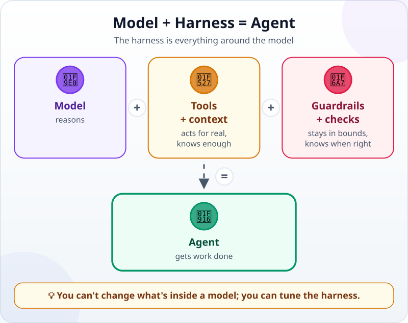
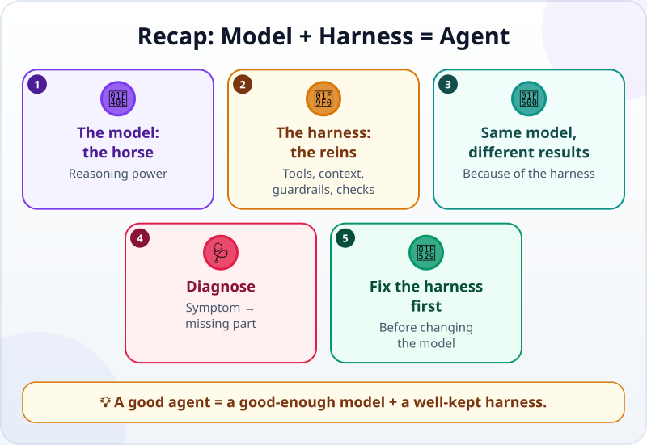

🌐 [Tiếng Việt](../../vi/lessons/model-plus-harness.md) · **English** · [日本語](../../ja/lessons/model-plus-harness.md)

# Model + Harness = Agent: The Horse and the Reins

<!-- section: objective -->
## Lesson Objective

By the end of this lesson, you will be able to:

- Explain **agent = model + harness**, and name the four parts of the harness you can adjust: tools, context, guardrails, checks.
- Diagnose an agent that does badly: which part of the harness is missing?
- Know which parts of the harness you can fix yourself, and which lessons in the course teach each one.

<!-- section: hook -->
## Why It Matters

Tuấn and Mai use **the same AI model**. Tuấn says: *"I pasted a table of numbers and asked for the total. It answered confidently, and wrongly. Useless."* Mai says: *"My agent builds the monthly report, checks it itself, and fixes its own mistakes. I can trust it."*

The same "brain" — so why such a difference? Because what they use is not just the brain.

<!-- section: concept -->
## Core Idea

### The two halves of an agent

You already know an agent is made of [a brain, tools and a loop](agent-parts-and-loop.md). From a user's point of view, it can be split more simply into two halves:

- **The model:** the reasoning part — understanding the request, choosing the next step, writing code. You choose the model, but you cannot change what is inside it.
- **The harness:** everything **around** the model that lets it do real work. The Claude Code documentation (September 2026) calls the software around the model — which provides the tools and manages what the model sees — the *agentic harness*.

### The four parts of the harness you adjust

The loop — call the model, use a tool, look at the result, repeat — is part of the harness too, but it runs on its own. The four parts below are the ones you can adjust:

- **🔧 Tools:** what the agent can really do — read files, run commands, search. Without tools, the model can only talk, not act.
- **📋 Context and instructions:** what the agent knows — your request, the relevant files, the project's conventions written down in an instruction file. Without context, the agent guesses.
- **🚧 Guardrails:** what the agent must **not** do, or must ask about first — permissions, and rules that automatically block dangerous actions. Without guardrails, one wrong step can become real damage.
- **✅ Checks:** how you know the work is right — tests, numbers that must match. Without checks, "looks done" is the only signal.

### Same model, different harness — different results

Tuấn uses the model through a chat window: no tool to run code, no files, no check. The model has to "do the sums in its head" for a long table, and easily [hallucinates](hallucination.md): confidently wrong. Mai uses the same model in an agent with a tool to run Python, a project folder, an instruction file and a check. The model is not smarter — it is better **equipped**.

### When an agent does badly, fix the harness first

Switching to a stronger model is the easiest idea, but often not the right one. Diagnose from the symptom:

- **It talks but cannot do the work** → missing tools.
- **It does not know the conventions and forgets them every session** → missing context.
- **It does things you did not allow** → missing guardrails.
- **It says it is done, but it is wrong** → missing checks.

You can adjust all four yourself. The later lessons in *The Minimum Useful Harness* teach them one by one, starting with [Context Engineering](context-engineering.md): context, instructions for agents, automatic guardrails, and tests that run automatically.

<!-- section: analogy -->
## Simple Analogy

A strong horse and its tack. The horse has the power — but without reins it does not go where you want, without a saddle it cannot carry a rider, and without fences it runs into the neighbor's field. A good rider does not swap horses every time the horse goes the wrong way; they adjust the reins, and put up fences where they are needed.

The model is the horse; the harness is the saddle, the reins and the fences; you are the rider.

Where the comparison breaks down: a horse has its own will and can feel its rider. A model does not "understand" you that way — it only sees what is in its context. Whatever you do not put into the harness does not exist for it.

<!-- section: example -->
## Real Example

Mai uses an agent to build the monthly report from the [automation project](project-office-automation.md). Over one month she runs into three problems, and fixes each one through the harness — without changing the model once.

**Problem 1 — it forgets every session.** Every week Mai has to remind it: *"Don't change the data files. Write amounts the Vietnamese way, with dots between thousands."* In a new session, the agent forgets again. **Diagnosis: missing context.** Mai writes both conventions into the project's instruction file (for Claude Code, `CLAUDE.md`, as of September 2026) — the file the agent reads at the start of every session. From then on, she does not need to remind it.

**Problem 2 — it almost deleted something.** Once, the agent offered to delete the folder of old reports "to tidy up". Luckily Mai was in the mode where the agent asks first, so she said no. **Diagnosis: the guardrail did its job.** Mai keeps the ask-first mode for every deletion, and never turns on allow-everything in a folder that holds data.

**Problem 3 — it said it was done, with one number wrong.** In November, the agent reported the work done and `check_report.py` still PASSED, but the Thu Duc total did not match what Mai added up by hand. It turned out `check_report.py` only compares the report with the table of right answers — and that table exists only for September and October. For a new month, it checked nothing. **Diagnosis: the check was not enough.** Mai asks the agent to add a check that needs no answers in advance: recompute each branch's total straight from the data rows in a separate, simple way, and compare it with the report. She breaks a number in a copy of the report on purpose to see it FAIL, and only then uses it.

By the end of the month, Mai's report is much more trustworthy. The model is still the same model.

<!-- section: misconceptions -->
## Common Misconceptions

- **"If an agent does badly, you need a stronger model."** — What is missing is usually tools, context, guardrails or a check. Fixing the harness is cheaper and lasts longer.
- **"The harness is for engineers; users don't touch it."** — Instruction files, permission modes, checks — you can set all of them yourself, as Mai did.
- **"The strongest model doesn't need guardrails."** — A strong model that goes wrong goes wrong fast and confidently. The more independent an agent is, the more guardrails matter.

<!-- section: recap -->
## The Lesson in One Picture

<!-- section: takeaways -->
## Key Takeaways

- Agent = model + harness; the model reasons, the harness equips it.
- The harness runs the loop for the model, and has four parts you can adjust: tools, context and instructions, guardrails, checks.
- The same model with different harnesses gives very different results.
- Agent doing badly? Diagnose from the symptom and fix the harness before changing the model.
- You can adjust those four parts yourself.

<!-- section: quiz -->
## Quick Check

**Question 1.** Tuấn and Mai use the same model but get very different results. What is the most likely reason?

- A) Mai's model was updated just for her
- B) Mai uses the model with a fuller harness: tools, context, guardrails, checks
- C) Tuấn types his requests in Japanese

**Question 2.** In every session, the agent forgets the convention "don't change the data files". Which part of the harness should you fix?

- A) Context — write the convention into the instruction file the agent reads every session
- B) Tools — give the agent permission to delete files
- C) Switch to another model

**Question 3.** The agent reported the work done, but one branch's total was wrong and nobody noticed. What does this symptom point to?

- A) Missing tools
- B) Missing guardrails
- C) The check was not enough

Show answers

1. **B** — the same brain; the difference is what surrounds it.
2. **A** — the agent does not remember between sessions; what it reads at the start of each session is always there.
3. **C** — "done, but wrong" is a sign the check did not catch that mistake.

<!-- section: sources -->
## Recommended Sources

- Anthropic — [How Claude Code works](https://code.claude.com/docs/en/how-claude-code-works) (English, as of September 2026): the agent loop is powered by two components, models that reason and tools that act; Claude Code is the layer around the model that provides the tools and manages the context — that layer is what *agentic harness* refers to; `CLAUDE.md` holds instructions loaded every session; permission modes set what Claude can do without asking.
- Google Cloud — [What is agentic coding?](https://cloud.google.com/discover/what-is-agentic-coding) (English, updated September 2026): the software that controls an agent's reasoning loop is called an *agentic harness*; limit what agents can access and stop them running dangerous commands.
