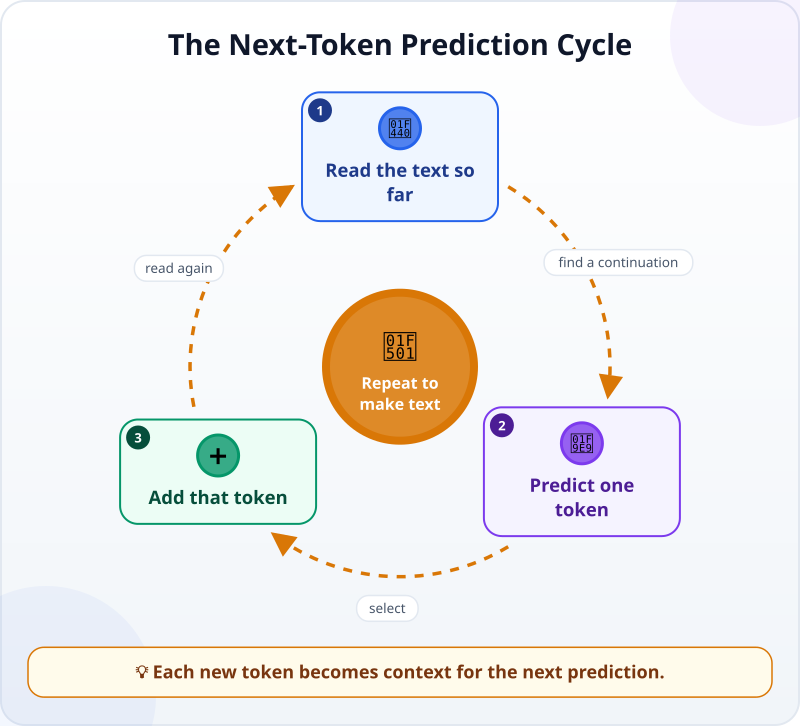
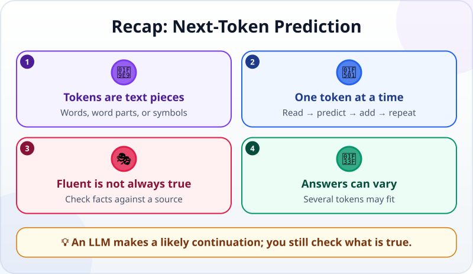

🌐 [Tiếng Việt](../../vi/lessons/next-token-prediction.md) · **English** · [日本語](../../ja/lessons/next-token-prediction.md)

# Next-Token Prediction: The Simple Secret Behind LLMs

<!-- section: objective -->
## Lesson Objective

By the end of this lesson, you will be able to:

- Describe how an LLM makes a response one token at a time.
- Explain why fluent writing does not guarantee correct information.
- Explain why the same question can produce different answers.

<!-- section: hook -->
## Why It Matters

Mai types, *“Write a friendly opening for the sales report.”* Seconds later, the AI returns a clear paragraph. It feels as if the whole paragraph was planned before it appeared.

In fact, a **large language model (LLM)** does something simpler: it looks at the text so far, chooses a likely piece to continue it, and repeats. Knowing this helps Mai avoid confusing a confident sentence with a checked fact.

<!-- section: concept -->
## Core Idea

### A token is a piece of text, not always a word

An LLM reads and writes **tokens**. A token can be a word, part of a word, punctuation, or another symbol. A person sees a sentence; the model processes a sequence of tokens.

### One tiny cycle repeats



When Mai starts with *“This month's report shows…”*, the model:

1. Reads all the tokens available in its [context window](context-window.md): the request, conversation, and answer written so far.
2. Works out which tokens are likely to come next.
3. Selects one token, perhaps *“sales”*, and adds it to the end.
4. Reads the new sequence and repeats for the next word, punctuation mark, and every later token.

It does not take a complete sentence from a drawer. Each new token becomes part of the input for the next prediction. Many small choices join into a long paragraph.

### “Likely” does not mean “true”

The immediate job of the cycle is to continue the existing text in a fitting way. That makes LLMs good at natural language. But the mechanism does not automatically open Mai's spreadsheet, call a customer, or check a date on a calendar.

When facts are missing, it may still produce a sequence that sounds reasonable. This is one reason for an [AI hallucination](hallucination.md): a convincing answer can be false or invented. For important facts, provide a source and check the output.

### Why can the answer change?

At one position, several tokens may fit. *“Rose,” “fell,”* and *“stayed”* could all follow a vague sentence about sales. The system can choose among fitting possibilities rather than always taking one fixed option. An early difference changes the text used in later rounds, so the whole paragraph can follow a different path.

That variation is useful for alternative wording or ideas. For facts, do not ask repeatedly and pick the answer you like. Compare it with a file, source, or tool result.

<!-- section: analogy -->
## Simple Analogy

Imagine a story-building game. One person says, *“This morning I went to…”* The next guesses *“the market,”* and another adds *“to buy.”* Each person only needs to add a fitting next piece, but the group slowly creates a story.

An LLM also continues what is already there, using tokens and repeating very quickly. The analogy breaks down because human players have experiences and intentions and can stop to ask what is true. A model produces output from learned patterns and given context; do not give it human thoughts or experiences.

<!-- section: example -->
## Real Example

In the practice folder `ai-practice`, Mai has a made-up file named `sales-note.txt`:

```text
Month: June
Most requested product: blue water bottle
Next action: check stock again
```

She asks, *“Using only `sales-note.txt`, write a two-sentence team update. If the file does not give the stock quantity, say it is unknown.”*

The model starts with the request and file content, then produces tokens one by one. *“Most requested”* supports a sentence about customer interest in blue bottles. The instruction about missing information supports *“The stock quantity is unknown”* instead of a plausible-looking number.

Mai checks each point against the file. The wording may change on another run, but the two facts must remain. If the output says *“we have plenty in stock,”* she rejects it: that is a natural continuation, not something the file proves.

<!-- section: recap -->
## The Lesson in One Picture



<!-- section: takeaways -->
## Key Takeaways

- LLMs read and write tokens: words, word parts, or symbols.
- The model reads the text so far → selects one token → adds it → repeats.
- Fluent writing comes from fitting predictions; it is not proof that an answer is correct.
- Several tokens can fit, so the same question can receive different answers.
- For important facts, provide a source and check the output yourself.

<!-- section: quiz -->
## Quick Check

**Question 1.** How does an LLM produce a paragraph?

- A) It writes the whole paragraph in one step before reading the request
- B) It predicts one token, adds it to the text, and repeats
- C) It finds an identical paragraph in a store of answers

**Question 2.** Why can a fluent answer still be wrong?

- A) Continuing text well does not automatically check real-world facts
- B) Every token is a complete sentence
- C) An LLM cannot write punctuation

**Question 3.** What is a good way to use AI with `sales-note.txt`?

- A) Run it many times and choose the largest number
- B) Trust the answer with the most confident tone
- C) Tell it to use only the file and compare every fact with the file

<details>
<summary>Show answers</summary>

1. **B** — each new token is added and becomes context for the next prediction.
2. **A** — likely language and verified truth are different things.
3. **C** — limiting the source and checking it helps catch added information.

</details>
