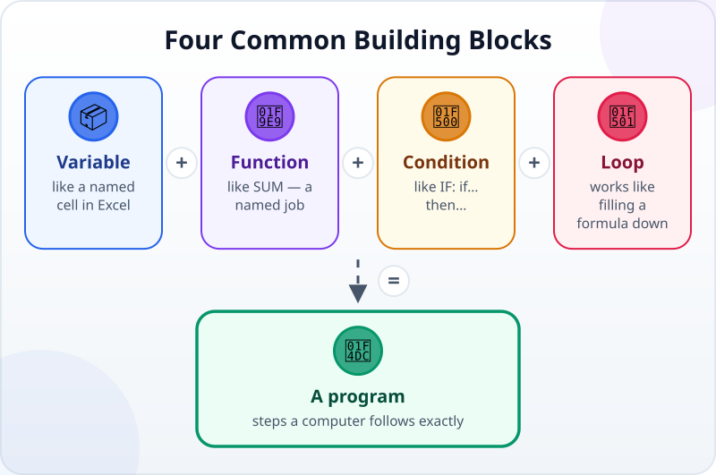
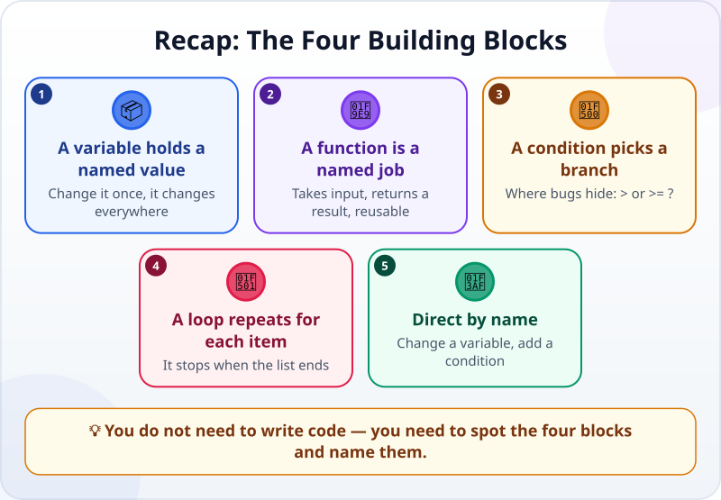

🌐 [Tiếng Việt](../../vi/lessons/programming-building-blocks.md) · **English** · [日本語](../../ja/lessons/programming-building-blocks.md)

# Variables, Functions, Conditions, Loops: The Four Building Blocks

<!-- section: objective -->
## Lesson Objective

By the end of this lesson, you will be able to:

- Name the four building blocks of every program — **variables, functions, conditions and loops** — and see that Excel already has them.
- Read a short piece of code an agent wrote and say in plain words what it does.
- Use these four words to give instructions and check changes more precisely.

<!-- section: hook -->
## Why It Matters

Mai asks an agent for a small program: read `expenses.csv` (made-up data, as in [Writing Good Specs](writing-good-specs.md)), add up the total and list the large expenses. The agent runs it, and the result is right. But when Mai opens `summary.py`, she sees a dozen lines of strange text: `def`, `for`, `if`…

*"I'm an accountant, not a programmer. How am I supposed to read this?"*

The good news: Mai can read it. Every program is built from the same four blocks, and Mai uses all four every day — in Excel.

<!-- section: concept -->
## Core Idea

### The four blocks



1. **Variable** — a box with a name that holds a value. In Excel: a cell you have named, such as a cell `exchange_rate` holding 25,000. In code: `THRESHOLD = 500000`. Change the value in one place, and everything that uses the name changes with it.
2. **Function** — a named job: it takes an input, returns a result and can be used again and again. In Excel: `SUM`, `VLOOKUP`. In code, the agent names its own functions, such as `is_large(amount)`: give it an amount, get back "yes" or "no".
3. **Condition** — *if… then…, otherwise…*. In Excel: `IF`. In code: `if amount >= THRESHOLD:`. This is where a program takes one branch or another — and where bugs like to hide: `>` or `>=`? Does an amount exactly at the threshold count as large?
4. **Loop** — the same steps repeated for each item: each row, each file, each customer. In Excel: filling a formula down every row. In code: `for row in ...:`.

Programming languages write them a little differently, but they all have these four blocks.

### Why the person giving the work needs them

You do not need to write code yourself. But knowing the four names helps you:

- **Read** the code an agent writes the way you read a formula: find the variables, functions, conditions and loops, then say it back in words.
- **Give precise instructions:** "change the threshold from 500,000 to 1,000,000" is one variable; "skip the rows whose category is Other" is one more condition.
- **Check changes:** you asked to change one variable, and the change (the diff) rewrites the loop too? Time to ask the agent why — as in [Reading and Reviewing an Agent's Changes](reviewing-agent-changes.md).

<!-- section: analogy -->
## Simple Analogy

Shopping for a family dinner with a list:

- **Variable:** a budget of $100 — written once at the top of the list, checked whenever you need it.
- **Function:** "buy one item" = check the price, compare, pay, put it in the basket. A named series of steps that works for any item.
- **Condition:** if an item costs more than $10, think twice; otherwise buy it.
- **Loop:** for each item on the list, do "buy one item" — and go home when the list is done.

Where it breaks down: you adapt on your own — an item is sold out, so you buy something else; you meet a friend, so you stop to chat. A program does not: it does exactly what is written. A situation that was never written as a condition in the code is a situation the program cannot handle — which is why your spec should mention the special cases up front.

<!-- section: example -->
## Real Example

This is the `summary.py` the agent wrote for Mai. Everything after a `#` is a note for the reader; the computer ignores it.

```python
import csv

THRESHOLD = 500000                    # variable: from this amount up, a "large" expense (dong)


def is_large(amount):                 # function: is this expense large?
    return amount >= THRESHOLD


total = 0                             # variable: the total, starting at 0
with open("expenses.csv", encoding="utf-8") as f:
    for row in csv.DictReader(f):     # loop: one row at a time
        amount = int(row["amount"])
        total = total + amount
        if is_large(amount):          # condition: print only the large ones
            print("Large:", row["date"], row["category"], amount)

print("Total:", total)
```

Mai reads it in plain words, from top to bottom:

1. Set the variable `THRESHOLD` to 500,000 dong: from this amount up, an expense is "large".
2. Make the function `is_large`: give it an amount, and it answers whether it is large.
3. Set `total` to 0, open `expenses.csv`, and **for each row**: take the amount and add it to the total; **if** it is large, print it.
4. At the end of the file, print the total.

From then on, Mai's instructions are much more precise:

- *"Change THRESHOLD to 1,000,000."* — exactly one variable; the change should be a single line.
- *"Skip the rows whose category is Other."* — one more condition, inside the loop.
- *"Does an expense of exactly 500,000 count as large?"* — a question about the `>=` condition, and an acceptance criterion worth adding to the spec.

Tip: when a piece of code is hard to follow, ask the agent: *"Explain it line by line in plain words, and point out the variables, functions, conditions and loops."*

<!-- section: misconceptions -->
## Common Misconceptions

- **"You have to know the syntax to work with an agent."** — You need to recognize the four blocks and say what they do. Getting every colon right is the agent's job — and the job of your checks.
- **"Excel formulas are not programming."** — `=IF(C2>=500000,"Large","")` filled down a whole column already uses all four blocks: a cell (a variable), the `IF` function, a condition, and filling down (a loop).
- **"Loops run forever."** — A loop over a list stops when the list ends. A loop that never stops is a bug: if a program the agent wrote never finishes, that is the first place to look.

<!-- section: recap -->
## The Lesson in One Picture



<!-- section: takeaways -->
## Key Takeaways

- Every program is built from four blocks: variables, functions, conditions and loops.
- A variable holds a named value; a function is a named, reusable job; a condition picks a branch; a loop repeats the steps for each item.
- You already use all four in Excel: named cells, `SUM`, `IF`, and filling a formula down.
- Read the code an agent writes by finding the four blocks, then saying it back in plain words.
- Give instructions by name — change a variable, add a condition — then check that the change touches only that spot.

<!-- section: quiz -->
## Quick Check

**Question 1.** In Mai's code, which block is `THRESHOLD = 500000`?

- A) A loop
- B) A function
- C) A variable

**Question 2.** Mai wants the program to skip the rows whose category is Other. What should she ask the agent to add?

- A) A condition inside the loop
- B) A new variable at the top of the file
- C) A new data file

**Question 3.** Mai only asked to change the threshold to 1,000,000, but the agent's change also rewrites the loop and the function. What should she do?

- A) Accept it, since the agent knows best
- B) Ask the agent why those parts had to change, before accepting
- C) Fix the code by hand herself

<details>
<summary>Show answers</summary>

1. **C** — a name that holds a value is a variable.
2. **A** — "skip when…" is a condition; it goes inside the loop so it applies to every row.
3. **B** — the request changed one variable; a wider change needs an explanation before you accept it.

</details>
