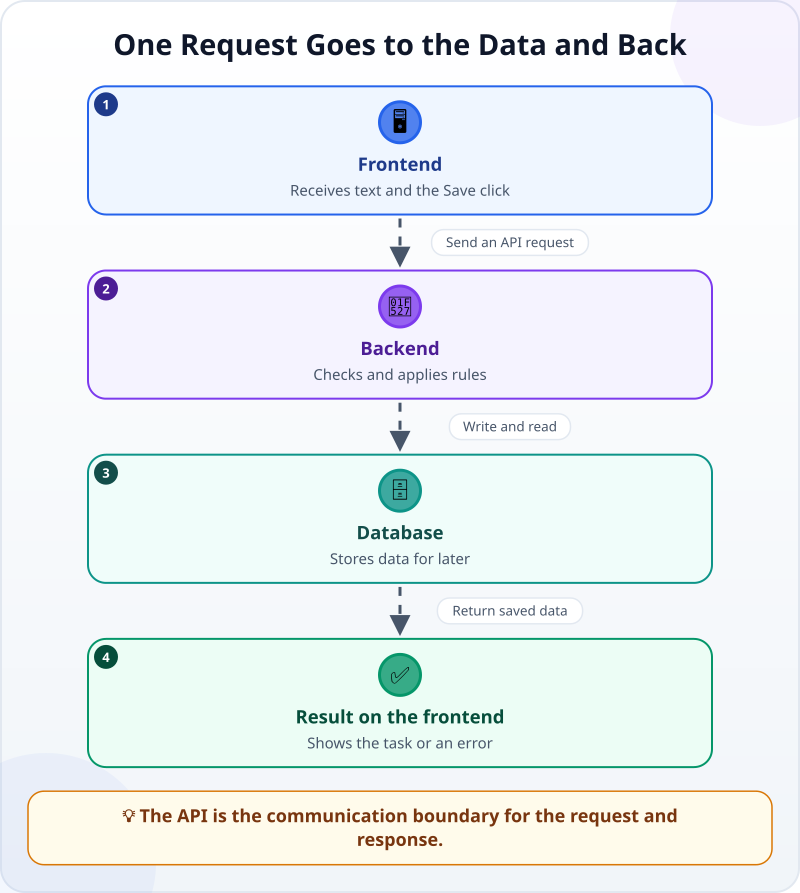
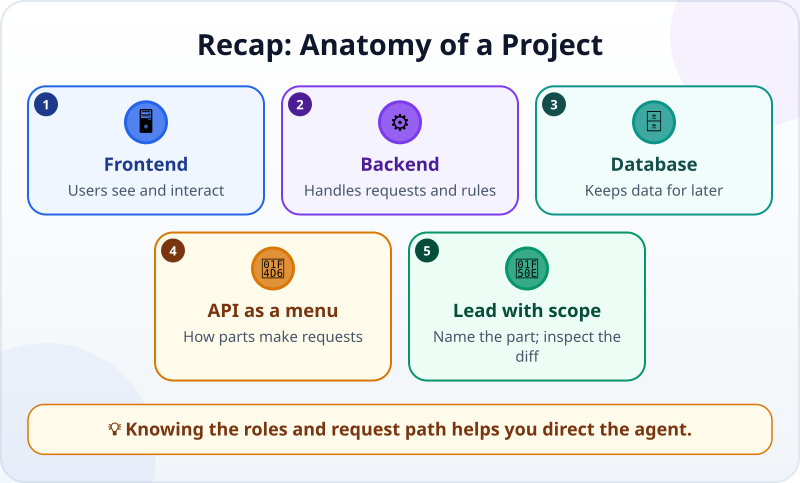

🌐 [Tiếng Việt](../../vi/lessons/project-anatomy.md) · **English** · [日本語](../../ja/lessons/project-anatomy.md)

# Anatomy of a Project: Frontend, Backend, Database, API

<!-- section: objective -->
## Lesson Objective

By the end of this lesson, you will be able to:

- State the basic roles of a frontend, backend, database and API in an app.
- Follow a request from the screen to the data and back.
- Point an agent to the right part and use folder names in a diff to check scope.

<!-- section: hook -->
## Why It Matters

Mai opens her weekly-task app and clicks **Save**. A moment later, the new task appears. She sees one button, but several parts may cooperate behind it: one receives the click, one checks rules, one keeps data, and a defined interface lets the parts communicate.

If Mai only tells an agent to “fix the app,” the scope is too broad. It may change the interface when the fault is in processing, or alter storage when the request only changes a button color. A lead need not build every part, but should name the right part and check that the agent stayed within its boundary.

<!-- section: concept -->
## Core Idea

### Four roles in an app

- The **frontend** is what users see and interact with: screens, fields, buttons and messages. Common folder names include `frontend/`, `web/` and `app/`.
- The **backend** receives requests, applies rules and prepares responses. It might reject an empty task name or decide an order. Its folder may be `backend/`, `server/` or `api/`.
- The **database** keeps data after the app closes: tasks, dates and completion states. Related work might appear in `database/`, `db/`, `migrations/` or `models/`.
- An **API** is a defined way for programs to request data or actions from each other. It specifies which requests are allowed, what information they need and the shape of a response.

Folder names are clues, not universal rules. A small project may keep several roles together; a large one may split them further. Read that project's structure and conventions before deciding.

### A request goes out and comes back



When Mai adds a task, its journey might be:

1. The **frontend** receives Mai's text and Save click.
2. It sends a request through the **API**: “Create a task with this name.”
3. The **backend** checks that the name is not empty and the request is valid.
4. The backend writes the task to the **database**, then reads the saved result.
5. A response travels back through the API; the frontend draws the new task or shows an error.

The API is not necessarily a fifth app. It is the **communication boundary** between parts. Code defining it commonly lives with the backend, while the frontend has code that calls it.

### How does a lead use this map?

Do not merely assign “fix the Save button.” State the symptom, the expected part and the boundary:

> In `ai-practice`, when the task name is empty, make the backend reject it and the frontend show “Enter a name.” Do not change the database structure. Before editing, list the files you plan to touch.

Afterward, read the **diff**—the changes between before and after. If a button-color request changes a file in `database/`, stop and ask why. If a validation rule changes only `frontend/`, ask whether the backend can still accept bad data from elsewhere. Folders help identify a part; the diff's contents reveal the actual change.

<!-- section: analogy -->
## Simple Analogy

Picture a restaurant:

- The dining room where customers look and order resembles the **frontend**.
- The kitchen applying recipes resembles the **backend**.
- The storeroom keeping ingredients resembles the **database**.
- The **API is like the restaurant menu**: it tells customers what they can request and how, without exposing the kitchen's arrangement.

A customer selects from the menu; staff carry the request to the kitchen; the kitchen uses the storeroom; the dish returns to the table. Likewise, a screen sends an API request, the backend works with data, and a result returns.

The analogy has limits: data is not “used up” like ingredients, and an API defines response shapes as well as available requests. One app can also put several roles on the same machine.

<!-- section: example -->
## Real Example

In the fictional `ai-practice/task-app` project, Mai sees:

```text
task-app/
├── frontend/
│   └── TaskForm.js
├── backend/
│   └── tasks.js
├── database/
│   └── schema.sql
└── README.md
```

Three similar-sounding requests belong to different parts:

- “Change the button label from **Add** to **Save task**” — start in `frontend/`.
- “Do not save a name made only of spaces” — protect the rule in `backend/`; the frontend may also warn early for convenience.
- “Give every task a due date and store it” — this may touch the database, backend/API and frontend. Mai should ask for a plan before this cross-part change.

Suppose the first request produces a diff only in `frontend/TaskForm.js`: the scope makes sense. If the agent also changes `database/schema.sql`, Mai need not understand every line to spot the surprise. She asks, “Why does a label change require a database change?” That is leading by project boundaries.

<!-- section: misconceptions -->
## Common Misconceptions

- **“Frontend means looks; backend means everything important.”** — Frontends also have important behavior. Backends protect rules and coordinate data; the roles differ.
- **“A database is just a spreadsheet file.”** — It is the role of persistently storing and retrieving data; many technologies can fill it.
- **“An API is a database.”** — An API is a way to request; a database is a place to store. A backend can answer without a database or use several data sources.
- **“The right folder name is proof enough.”** — Names only orient you. Read the diff and the real project's organization.

<!-- section: recap -->
## The Lesson in One Picture



<!-- section: takeaways -->
## Key Takeaways

- The frontend receives interaction; the backend applies rules; the database keeps data.
- An API is a defined way to communicate—like a menu, not the kitchen or storeroom.
- A request travels from screen to data, and the result returns to the screen.
- Direct the agent to the right part, then inspect folders and content in the diff.

<!-- section: quiz -->
## Quick Check

**Question 1.** Which part mainly keeps data for later use?

- A) Frontend
- B) API
- C) Database

**Question 2.** In the restaurant analogy, what is most like an API?

- A) The menu defining what can be ordered
- B) The ingredient storeroom
- C) The kitchen preparing dishes

**Question 3.** An agent changes a button color, but its diff includes a database file. What should you do?

- A) Accept it because the agent knows more
- B) Stop and ask why an interface change touches the database
- C) Delete the whole project immediately

<details>
<summary>Show answers</summary>

1. **C** — a database persistently stores and retrieves data.
2. **A** — an API defines possible requests, as a menu defines what can be ordered.
3. **B** — a file outside the expected scope needs an explanation before acceptance.

</details>
