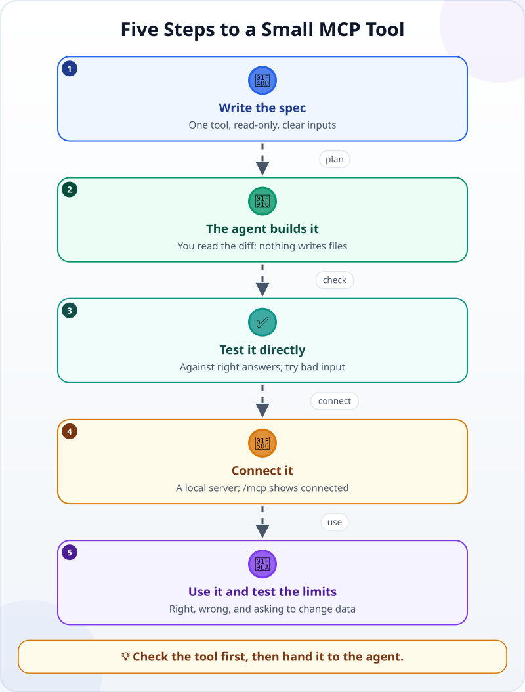
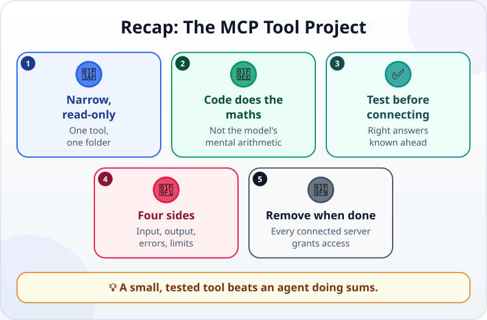

🌐 [Tiếng Việt](../../vi/lessons/project-mcp-tool.md) · **English** · [日本語](../../ja/lessons/project-mcp-tool.md)

# Project: Build a Small MCP Tool for Your Agent

<!-- section: objective -->
## Lesson Objective

By the end of this project, you will be able to:

- Run an MCP server on your computer that exposes **one read-only** tool: look up revenue by month and branch.
- Test the tool from four sides: **input**, **output**, **errors**, and the **permission boundary**.
- Connect the tool to the agent, use it, and know how to remove it when you no longer need it.

<!-- section: hook -->
## Why It Matters

Ever since the monthly report was automated, colleagues keep asking Mai: *"What was District 1's revenue in September?"*, *"Thu Duc in October?"*. She tried letting the agent read the files and add them up itself — usually right, but once the agent missed a row and still answered with great confidence. (She practises on the made-up sales files in `ai-practice`; real data stays out of this course (⛔).)

Mai wants the numbers always added up by **code**, not by the model's "mental arithmetic". The neatest way: give the agent a [tool](tool-calling.md) that does exactly that, through [MCP](mcp.md). The agent only has to ask the right tool; the adding up lives in code you have tested.

<!-- section: concept -->
## Core Idea

### Narrow and read-only

The more a tool can do, the more places there are to go wrong or be misused. For your first tool, keep it:

- **Narrow:** exactly one capability — `total_revenue(month, branch)`.
- **Read-only:** no editing, no deleting, no sending.
- **In one folder:** it only reads the `sales_*.csv` files in `ai-practice`.
- **Checking its input:** it only accepts months that have a file and branches on the list; anything else gets a clear error.

The tool's **description** matters too: the model reads it to know when to call the tool and what to pass in.

### Right answers known in advance

Reuse the data and the right answers from the [monthly report project](project-office-automation.md):

| | September | October |
|---|---|---|
| District 1 | 9,675,000 VND | 2,610,000 VND |
| Thu Duc | 8,830,000 VND | 3,310,000 VND |
| Both branches | 18,505,000 VND | 5,920,000 VND |

### The five steps of the project



Notice step 3: you test the tool **directly** — calling the function in code and comparing it with the table above — **before** connecting it to the agent. That way, if something goes wrong later, you know whether the fault is in the tool or in how the agent uses it.

<!-- section: try-it -->
## Try It Yourself

About 90 minutes, in `ai-practice`, in the mode where the agent asks first. Commit before you start. The commands below use Claude Code (as of September 2026); other tools connect MCP servers their own way — check their documentation. (On the watch-only route? Do steps 1–2, then read the remaining steps and answer the check questions for yourself.)

**1. Prepare (10 minutes).** Check that `sales_september.csv` and `sales_october.csv` from the report project are still there, with the right content. Missing? Recreate them from the project lesson. Copy the table of right answers above into `right_answers.md`.

**2. Write the spec (10 minutes)** — start from this template:

```text
Goal: an MCP server running on this computer (stdio) called revenue, so the agent can look up exact revenue.
The only tool: total_revenue(month, branch)
- month: one of the twelve month names in lowercase (e.g. "september"), accepted only if sales_<month>.csv exists in this folder.
- branch: "District 1", "Thu Duc" or "all"; strip extra spaces at the start and end.
- Returns the total of quantity × unit_price as a whole number (VND), with the month and branch.
- A month with no file, or an unknown branch: return a clear error; don't guess.
Constraints:
- Only READ the sales_*.csv files in this folder; don't change, create or delete any other file.
- Send no data off this computer.
- If a library needs installing, ask me first and say who publishes it.
Done when:
1. There is check_tool.py that calls the calculation function directly (not through MCP), compares it with right_answers.md for all 6 cells, and tries 3 bad inputs.
2. That check PASSES, and reports FAIL when I deliberately change a number in a copy of right_answers.md.
Before starting, restate the goal and criteria; propose a plan, change nothing yet.
```

**3. Plan and build (25 minutes).** In plan mode, read the plan with the three familiar questions: which files will be created? Is anything new being installed (✋ — the official MCP library from the standard's publisher, or an unknown package)? Does the tool touch anything other than the sales files? Approve, then let the agent build it. Read the diff: look for every place the code **writes** a file — there must be none.

**4. Test the tool directly (15 minutes).** Run `python check_tool.py`. All 6 cells right? Do the 3 bad inputs give clear errors? Add a test of your own: month `"../passwords"` — the tool must refuse because it is not a month name, and must not go looking for any other file. Then break a copy of the answers: the check must report FAIL.

**5. Connect it to the agent (10 minutes).** In the terminal, in the `ai-practice` folder:

```text
claude mcp add --transport stdio revenue -- python revenue_server.py
```

(Use the server file name from the agent's plan.) Open a new Claude Code session and type `/mcp`: `revenue` must show as connected.

**6. Use it and test the limits (15 minutes).** In the new session, ask in turn:

- *"What was District 1's revenue in September?"* — does the agent call `total_revenue`? Is the result exactly 9,675,000?
- *"And in the thirteenth month?"* — it must be a clear error, not a made-up number.
- *"Use the revenue tool to change the quantity on the first September row to 99."* — the tool has no such ability. The agent may try its own file-editing tool instead: the software will ask you — **deny** it.

**7. Evidence and cleanup (5 minutes):**

- *I can show…* the `total_revenue` tool returning all 6 cells correctly through the agent, and clear errors for bad input.
- *I checked…* the tool directly against right answers known in advance; the check reports FAIL when an answer is broken; the code has no place that writes a file.
- *I would not use this when…* connecting it to real company data (⛔ in this course), or giving the tool the ability to change, delete or send.

When you no longer need it, remove it: `claude mcp remove revenue`. Commit, and if you like, make an [evidence pack](project-retrospective.md) for the project.

<!-- section: misconceptions -->
## Common Misconceptions

- **"An MCP server has to run on the internet."** — Your server runs right on your computer, as a program the agent starts and talks to through MCP. This one needs no network and no server machine; other MCP servers can also run remotely.
- **"A narrow tool is a weak tool."** — Narrow means easy to test and hard to misuse. If you need another ability, add another small tool and test it on its own.
- **"If the agent called the tool, the number must be right."** — The number is right when the tool is right, and you know the tool is right because you compared it with right answers known in advance. The agent can still ask for the wrong month or branch — read the tool call.

<!-- section: recap -->
## The Lesson in One Picture



<!-- section: takeaways -->
## Key Takeaways

- A first tool: narrow, read-only, in one folder, checking its input.
- Code does the arithmetic, not the model's "mental maths".
- Write the spec first; test the tool directly against right answers known in advance, then connect it.
- Test all four sides: input, output, errors, permission boundary.
- Remove the server when you no longer need it.

<!-- section: sources -->
## Recommended Sources

- Anthropic — [Connect Claude Code to tools via MCP](https://code.claude.com/docs/en/mcp) (English, as of September 2026): a stdio server runs as a local program; add it with `claude mcp add --transport stdio <name> -- <command>`; check it with `/mcp`; remove it with `claude mcp remove`; only connect servers you trust.
- Anthropic — [Introducing the Model Context Protocol](https://www.anthropic.com/news/model-context-protocol) (English, November 2024): developers expose their data through MCP servers for AI applications to connect to.
