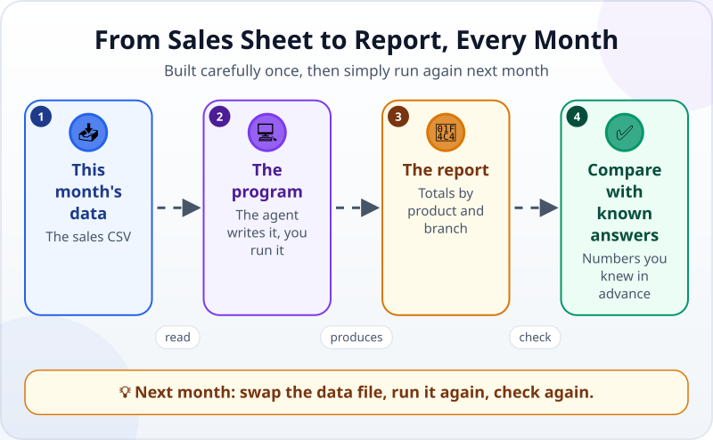
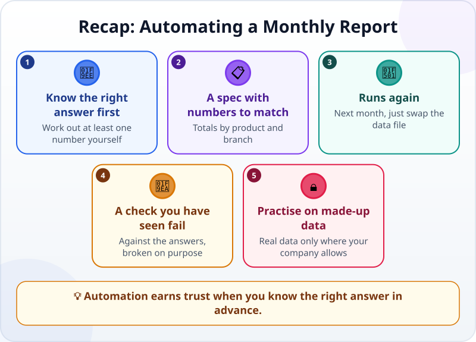

🌐 [Tiếng Việt](../../vi/lessons/project-office-automation.md) · **English** · [日本語](../../ja/lessons/project-office-automation.md)

# Project: Automate an Office Task (Spreadsheet → Report)

<!-- section: objective -->
## Lesson Objective

By the end of this project, you will:

- Have a program that turns a sales file into a monthly sales report and **runs again** next month.
- Verify the report against **answers known in advance** and a check you have seen fail.
- Know when this approach should — and should not yet — be used with real data at work.

<!-- section: hook -->
## Why It Matters

Mai is an accountant. At the end of every month she spends half a day adding up sales by product and branch from the sales file. It is repetitive, error-prone and dull — exactly the kind of task worth automating.

But a wrong report sent to a manager is worse than doing it by hand. This project teaches the most important rule of automation: **trust a program only once you have a way to know it is right.**

<!-- section: concept -->
## Core Idea

### From sales sheet to report



The agent writes a small Python program: it reads the sales CSV, works out revenue (quantity × unit price), adds it up by product and branch, and writes a report. You run the program and check it. Next month, you just swap the data file.

**Cannot install Python?** There is a spreadsheet-only route: open the CSV in Excel or Google Sheets, add a revenue column, then use a pivot table or `SUMIF` — ask an agent or a chatbot to guide you step by step. The check against the right answers stays exactly the same.

### Answers known in advance

Before you hand the task over, know at least one right number. For the sample data below, the right answers are:

| | September | October |
|---|---|---|
| **Total revenue** | 18,505,000 VND | 5,920,000 VND |
| Coffee beans | 6,480,000 VND | 3,600,000 VND |
| Green tea | 6,175,000 VND | 1,330,000 VND |
| Cookies | 5,850,000 VND | 990,000 VND |
| District 1 | 9,675,000 VND | 2,610,000 VND |
| Thu Duc | 8,830,000 VND | 3,310,000 VND |

At work you will not have a table like this — but you can always work out one or two numbers yourself (one product, one branch) to compare.

### What about real company data?

Practise on made-up data. Use real data **only where your company allows it**, with approved tools, by the rules — and still compare the report with a number you worked out yourself.

<!-- section: try-it -->
## Try It Yourself

About 90 minutes, in `ai-practice`, in a mode where the agent asks first. Commit before you start.

**1. Create the data (10 minutes).** Ask the agent to create two files with **exactly** this content.

`sales_september.csv`:

```text
date,branch,product,quantity,unit_price
2026-09-02,District 1,Coffee beans,12,180000
2026-09-03,Thu Duc,Green tea,20,95000
2026-09-05,District 1,Cookies,30,45000
2026-09-08,Thu Duc,Coffee beans,8,180000
2026-09-10,District 1,Green tea,15,95000
2026-09-12,Thu Duc,Cookies,25,45000
2026-09-15,District 1,Coffee beans,10,180000
2026-09-18,Thu Duc,Green tea,18,95000
2026-09-20,District 1,Cookies,40,45000
2026-09-23,Thu Duc,Coffee beans,6,180000
2026-09-26,District 1,Green tea,12,95000
2026-09-29,Thu Duc,Cookies,35,45000
```

`sales_october.csv`:

```text
date,branch,product,quantity,unit_price
2026-10-03,District 1,Coffee beans,9,180000
2026-10-09,Thu Duc,Green tea,14,95000
2026-10-16,District 1,Cookies,22,45000
2026-10-24,Thu Duc,Coffee beans,11,180000
```

**2. Work out one number yourself (10 minutes).** With a calculator: September revenue for Coffee beans = (12 + 8 + 10 + 6) × 180,000 = ? Compare it with the table of right answers.

**3. Write the spec (10 minutes)** — start from this one:

```text
Goal: every month, make a sales report from the sales file, to send to my manager.
Context: September's data is in sales_september.csv (columns date, branch, product,
quantity, unit_price; revenue = quantity × unit_price). The data is made up.
Constraints:
- Write a Python program, make_report.py, using only Python's built-in libraries;
  ask me before installing anything.
- Do not change the data files; write the report to a new file, report_september.html.
- It must run again for another month by changing the input file name.
Done when:
1. The report shows total revenue, revenue by product and revenue by branch.
2. The numbers match the table of right answers I am pasting below.
3. Run on sales_october.csv, it produces an October report matching October's right answers.
4. An automatic check compares with the right answers, and it says FAIL when a number is changed.
Before you start, restate the goal and the criteria. If anything is unclear, ask me first.
```

Paste the table of right answers below it.

**4. Explore and plan (10 minutes).** In plan mode, read the plan with the three questions. No Python yet? Decide: install it (✋ ask first, follow the official instructions) or take the spreadsheet route.

**5. Build and read the diffs (20 minutes).** Read each change. Which files are created? Does the program touch the data files?

**6. Check (20 minutes):**

- Run the program, open `report_september.html` and compare it with the right answers — every number.
- Have the agent run the check; then break a copy of the report on purpose: the check must say FAIL.
- Run it for October and compare again. Something wrong? Debug like a detective.

**7. Evidence, and show someone (10 minutes):**

- *I can show…* the September and October reports, made by the same program.
- *I checked…* every number against the right answers; the check says FAIL for the broken copy.
- *I would not use this when…* for example: with real company data I am not allowed to use, or a file whose columns differ from the ones the program was written for.

Commit the result with a clear message.

<!-- section: misconceptions -->
## Common Misconceptions

- **"If the program runs without errors, the report is right."** — A program can run smoothly and still add up wrongly. Only comparing with the right answers tells you.
- **"Once it is automated, you can stop checking."** — Each month's data may differ: new columns, new products, empty cells. Keep the check, and work out one number yourself each time.
- **"You only really learn with real data."** — The skills are identical with made-up data. Real data only where your company allows it.

<!-- section: recap -->
## The Lesson in One Picture



<!-- section: takeaways -->
## Key Takeaways

- Know the right answer in advance — at least one number you worked out — before trusting an automated report.
- A spec with numbers to match; a program that runs again next month.
- A check that compares with the right answers, and that you have seen fail.
- Practise on made-up data; real data only where your company allows it.
- You have finished the minimum path: you can hand work to an AI agent, check it and answer for the result.

<!-- section: sources -->
## Recommended Sources

- Anthropic — [Best practices for Claude Code](https://code.claude.com/docs/en/best-practices): a plausible-looking result can still miss edge cases; always provide a way to verify — if you cannot verify it, do not ship it.
