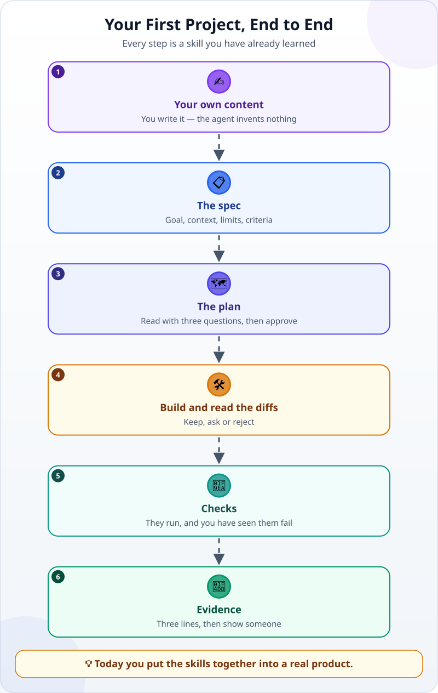
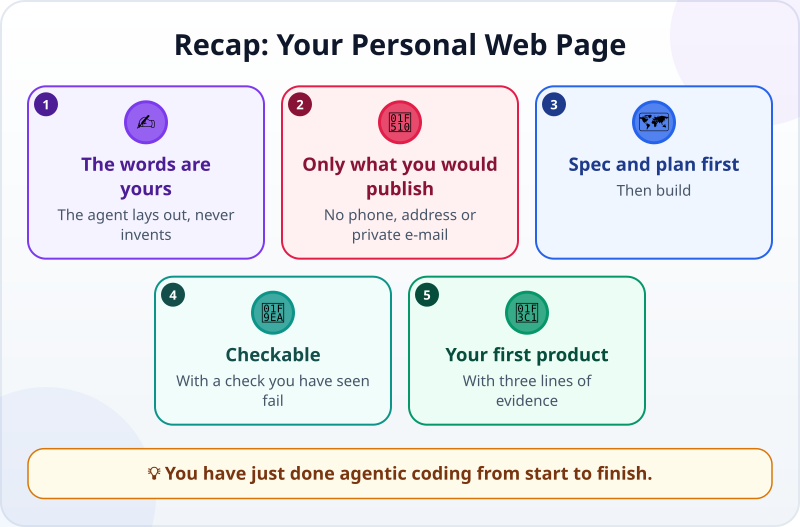

🌐 [Tiếng Việt](../../vi/lessons/project-personal-page.md) · **English** · [日本語](../../ja/lessons/project-personal-page.md)

# Project: Your Personal Web Page

<!-- section: objective -->
## Lesson Objective

By the end of this project, you will:

- Have a working web page about yourself in `ai-practice/personal-page/`.
- Have gone round a whole working loop with an agent on your own: content → spec → plan → build and read the diffs → checks → evidence.
- Show the product to someone else, with three lines of evidence.

<!-- section: hook -->
## Why It Matters

So far each lesson taught one skill. This project puts them together. The product is still small — a page about who you are, what you care about and what you have made — but this time **you are the lead from start to finish**.

And because the page is about you, one thing becomes obvious at once: the agent is great at presentation, but **the content has to be yours**.

<!-- section: concept -->
## Core Idea

### The project from start to finish



Every step is a skill you have learned:

- **Spec:** [writing good specs](writing-good-specs.md).
- **Plan:** [explore → plan → build → verify](explore-plan-build-verify.md).
- **Reading diffs:** [reviewing an agent's changes](reviewing-agent-changes.md).
- **Checks:** [turning "looks right" into checks](testing-basics.md).
- **When something breaks:** [debugging like a detective](errors-and-debugging.md).

### Two rules for this project

- **The content is yours.** You write the introduction yourself. The agent only lays it out and adds nothing about you — it can make up plausible-sounding things very confidently.
- **Only what you would publish.** No phone number, home address or private e-mail. Write as if the whole company will read it.

<!-- section: try-it -->
## Try It Yourself

About 60 minutes, in `ai-practice`, in a mode where the agent asks before each change.

**1. Write the content (10 minutes).** Create a file `about-me.txt` and **write it yourself**:

- The name or nickname you want to use.
- Two or three sentences about you: what you do, and why you are learning agentic coding.
- Three interests or skills.
- One project: your "My Week" card — one sentence on what it does.

**2. Write the spec (10 minutes)** — start from this one and make it yours:

```text
Goal: a web page about me, to share with friends and colleagues.
Context: the content is in about-me.txt (I wrote it). My my-week.html card is already in this folder.
Constraints:
- Every new file goes in a new folder, personal-page/.
- Use only the text in about-me.txt; add no information about me.
- No phone number, home address or private e-mail.
- It opens without the internet; no libraries or fonts loaded from outside.
Done when:
1. Opening personal-page/index.html shows every part: name, introduction, 3 interests/skills, project.
2. Every sentence in about-me.txt is on the page, and the agent added none of its own.
3. The link to my-week.html opens the card.
4. At phone width (a narrow window) it is readable with no sideways scrolling.
Before you start, restate the goal and the criteria. If anything is unclear, ask me first.
```

**3. Explore and plan (10 minutes).** In plan mode, send the spec and ask for a plan. Read it with the three questions: which files will change or be created? What gets added? Which decisions are yours (colours, layout)? Then approve.

**4. Build and read the diffs (15 minutes).** Read every change before you accept it. Watch for: any file outside `personal-page/`? Any sentence that did not come from `about-me.txt`? The link to the card looks like `../my-week.html` — a relative path one level up.

**5. Checks (10 minutes):**

```text
Write an automatic check: every sentence in about-me.txt appears in personal-page/index.html,
and the link to my-week.html points to a file that exists. Run it and show me the result.
Then run it on a copy of index.html with one sentence removed: it must say FAIL.
```

Check criterion 4 yourself: narrow the window and read.

**6. Evidence, and show someone (5 minutes):**

- *I can show…* `personal-page/index.html` open in a browser, in a narrow window too.
- *I checked…* all four criteria; the check says PASS for the real page and FAIL for the broken copy.
- *I would not use this when…* for example: the page needs private information, or daily updates.

Then ask a friend to open the page and tell you who you are. Did they get it right?

**Extra challenge (optional):** put the page online so anyone can open it — leave this until you have learned Git.

<!-- section: misconceptions -->
## Common Misconceptions

- **"Let the agent write the introduction, it is quicker."** — The agent does not know you; it will write sentences that sound good and may be wrong. Content about you is yours to write.
- **"A personal page does not need checks."** — The check "every sentence comes from `about-me.txt`" is exactly what catches sentences the agent added on its own.
- **"A project must be perfect before anyone sees it."** — Showing it early, with three lines of evidence, is the best way to learn what to fix next.

<!-- section: recap -->
## The Lesson in One Picture



<!-- section: takeaways -->
## Key Takeaways

- Content about you is yours to write; the agent lays it out and invents nothing.
- Put on the page only what you would publish.
- Spec → plan → build and read the diffs → checks → evidence: a whole working loop with an agent.
- Some people call this disciplined way of working — handing over work with criteria, approving plans and changes, verifying with checks — *agentic engineering*. In this course we keep calling it agentic coding.

<!-- section: sources -->
## Recommended Sources

- Anthropic — [Best practices for Claude Code](https://code.claude.com/docs/en/best-practices): always provide a way to verify (tests, scripts, screenshots) — if you cannot verify it, do not ship it.
