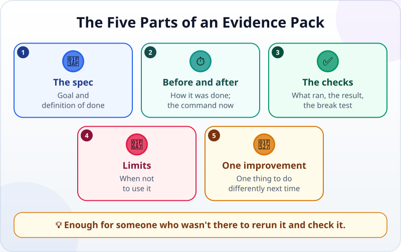
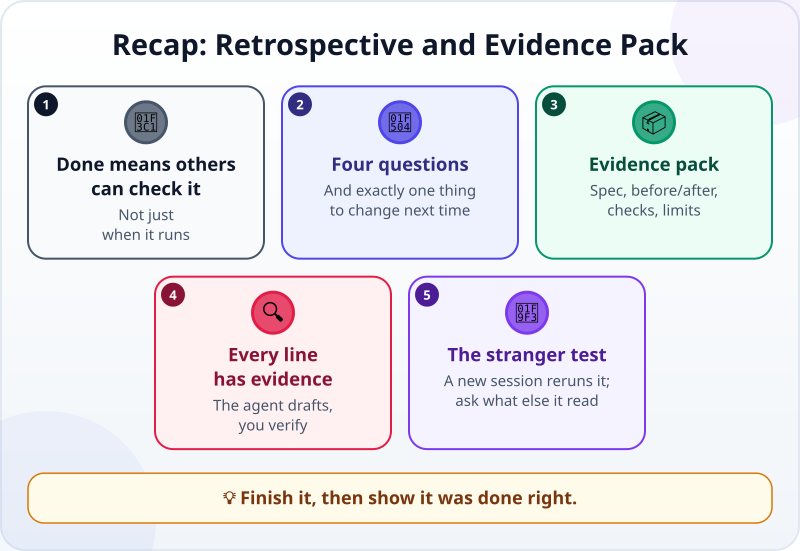

🌐 [Tiếng Việt](../../vi/lessons/project-retrospective.md) · **English** · [日本語](../../ja/lessons/project-retrospective.md)

# Project Retrospective and Evidence Pack

<!-- section: objective -->
## Lesson Objective

By the end of this lesson, you will be able to:

- Look back on a project with four questions, without blaming anyone.
- Pack a project's evidence into one short file: the spec, before and after, the checks, the limits, one improvement.
- Test the evidence pack with a "stranger": a new agent session that starts from that file, and says what else it loaded.

<!-- section: hook -->
## Why It Matters

Mai has finished the [monthly report project](project-office-automation.md): a program that reads made-up sales files, builds the report, and a check that compares it with the right answers. She tells her manager. Her manager asks three questions:

*"Is it right? If you're on leave, who can run it? Is there anywhere it will go wrong?"*

Mai knows the answers — scattered across her head, a few closed chat sessions and some files in `ai-practice`. She cannot hand over anything in five minutes.

A project is only really finished when **someone else** can check it.

<!-- section: concept -->
## Core Idea

### Looking back: four questions

Right after you finish — while you still remember clearly — answer four questions briefly:

1. **What was the original goal, and how far did you get?** Compare with the criteria you wrote in the spec.
2. **What worked well?** Which step, which way of writing a request, which check helped.
3. **What went wrong, and how was it fixed?** Bugs, the time the agent went off track, the time you had to interrupt.
4. **What will you do differently next time?** Just **one** concrete thing — one thing you will actually do beats five good intentions.

A retrospective is not about finding who is to blame — not even about blaming the agent. It is about doing better next time.

### The evidence pack: five parts



An evidence pack is **one short file** (for example `EVIDENCE.md`) next to the project, written for someone who has never seen it:

- **The spec:** the goal and the definition of done, as in [Writing Good Specs](writing-good-specs.md).
- **Before and after:** how it was done before and how long it took; which one command runs it now. Mark estimates clearly as estimates.
- **The checks:** what runs, what the result is, and evidence that the check really catches mistakes (the break test).
- **The limits:** when **not** to use it — data in a different shape, real company data (⛔ in this course), cases never tried.
- **One improvement:** the answer to the fourth question above.

These are the familiar three evidence lines (*I can show… / I checked… / I would not use this when…*), written out fully enough for someone else to do it again.

### The agent drafts, you check every line

An agent can read the [Git](git-version-control.md) history, the files and the check results and draft an evidence pack very quickly. But a summary is also a place where [hallucination](hallucination.md) slips in easily: a number nobody measured, a check that never ran. For each line, ask: *"Can I point to where this comes from?"* If not, fix it or delete it.

### The stranger test

An evidence pack is good when someone who **was not there** can still rerun and check the project. The cheapest way to test it: open **a new agent session**, start it from the evidence file, and ask it to follow it. Wherever it has to guess, the file is missing something. One catch: many tools load an instruction file (such as `CLAUDE.md`) into every new session. Ask the session what it used from such a file; whatever the project needs from it belongs in the evidence file too.

<!-- section: try-it -->
## Try It Yourself

About 11 minutes, with the monthly report project (or your [personal web page](project-personal-page.md)) in `ai-practice`. (On the watch-only route? Do step 1 and write step 2 on paper for something you finished recently.)

**1. Look back (3 minutes).** Write short answers to the four questions in `RETRO.md`.

**2. Draft the evidence pack (3 minutes).** Ask the agent:

```text
Draft EVIDENCE.md for this project, with five parts: Spec, Before and after,
Checks, Limits, One improvement (taken from RETRO.md).
Only write what is in the files, the Git history or real run results; where you are unsure, write "NEEDS CHECKING".
Write down the exact commands to rerun the program and the check.
```

**3. Check every line (3 minutes).** For each line: can you point to the evidence? Run the commands in the file yourself. Resolve every "NEEDS CHECKING". Delete any number nobody measured.

**4. The stranger test (2 minutes).** Open a **new session** and ask:

```text
Read only EVIDENCE.md. Follow it to rerun the program and the check.
List every place where you had to guess because the file was not clear.
```

Also ask: *"Did you use anything from a file loaded automatically at the start, such as an instruction file?"* Fix the evidence file wherever it had to guess or lean on such a file. Commit.

**Evidence:**

- *I can show…* `RETRO.md` and `EVIDENCE.md`, and a new session that reran the project starting from that file (with anything else it loaded listed and moved into the file).
- *I checked…* every line in the file against the real files, the Git history and the rerun results.
- *I would not use this when…* the evidence pack would have to contain real data or internal information — those are ⛔ in this course; keep the pack to made-up data.

<!-- section: misconceptions -->
## Common Misconceptions

- **"A retrospective is about finding who made the mistake."** — It is about doing better next time. The right question is *"what happened"*, not *"who got it wrong"*.
- **"An evidence pack is for showing off."** — It records the limits and the mistakes too. A document with only good news is harder to trust.
- **"The agent wrote the summary, so just send it."** — A summary can contain made-up numbers too. Every line must point to evidence.

<!-- section: recap -->
## The Lesson in One Picture



<!-- section: takeaways -->
## Key Takeaways

- A project is only finished when someone else can check it.
- Look back with four questions, and choose exactly one thing to change next time.
- Evidence pack: the spec, before and after, the checks, the limits, one improvement.
- The agent drafts; you can point to the evidence for every line.
- The stranger test: a new session starting from the file can still rerun it — and you check what else it read.

<!-- section: quiz -->
## Quick Check

**Question 1.** Which part must an evidence pack **never** leave out?

- A) The full transcript of every chat with the agent
- B) The limits: when not to use it
- C) The exact prompts you used, word for word

**Question 2.** The agent's draft says "saves 5 hours a month", but you never measured it. What should you do?

- A) Delete it, or mark it clearly as your estimate and say why
- B) Keep it; it sounds convincing
- C) Keep it; the agent probably measured it

**Question 3.** What is the cheapest way to find out whether an evidence pack is complete?

- A) Read it once more yourself
- B) Let a new agent session start from that file, try to rerun the project, and say what else it used
- C) Ask the agent that wrote it whether anything is missing

<details>
<summary>Show answers</summary>

1. **B** — other people need to know when not to use it; without it, the most important part is missing.
2. **A** — only write what you can point to evidence for; an unmeasured number is not evidence.
3. **B** — a new session does not remember the conversations you had while building; it starts from the file (plus any instruction file its tool loads — so check what it took from that too). Wherever it has to guess, the file is missing something.

</details>
