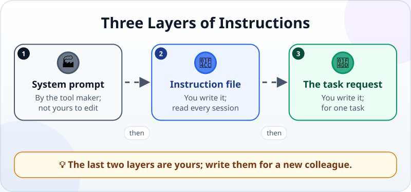
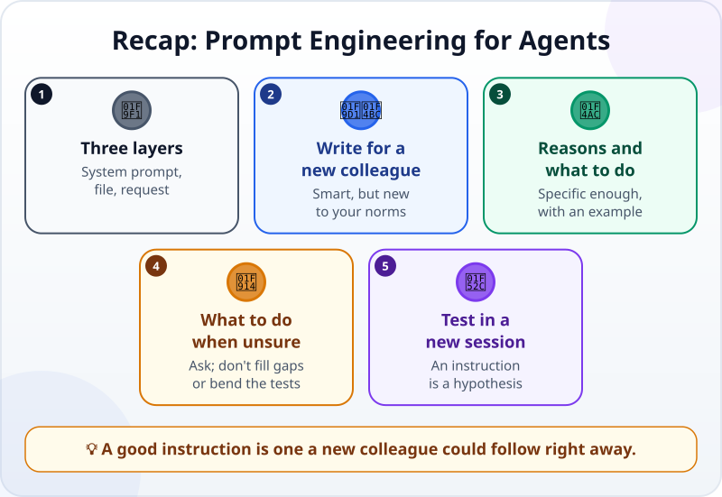

🌐 [Tiếng Việt](../../vi/lessons/prompt-engineering-for-agents.md) · **English** · [日本語](../../ja/lessons/prompt-engineering-for-agents.md)

# Prompt Engineering for Agents: System Prompts and Instructions

<!-- section: objective -->
## Lesson Objective

By the end of this lesson, you will be able to:

- Tell apart three layers of instructions: the **system prompt**, the **project's instruction file**, and **each task's request** — and which layers are yours.
- Rewrite a weak instruction into one an agent can follow, in five ways.
- Test an instruction in a new session and know whether it works.

<!-- section: hook -->
## Why It Matters

In the instruction file of her report project, Mai writes: *"The report must be professional."* The first week, the agent adds a cover page. The next week, it switches the headings to another language. The third week, it adds emoji at the start of every section "to make it lively".

If Mai said that sentence to a new colleague, they would ask: *"Professional in what way?"* The agent does not ask — it guesses, and each time it guesses differently.

Mai's instruction is not wrong. It just does not say what she really wants.

<!-- section: concept -->
## Core Idea

### Three layers of instructions

When an agent does a task, it reads instructions from three layers:



1. **The system prompt** — written by the tool maker, underneath every conversation: who the agent is, which tools it may use, how it works. You usually cannot see all of it, and usually cannot change it directly.
2. **The project's instruction file** — written by **you**, read at the start of every session (you practiced writing one in [Context Engineering](context-engineering.md)).
3. **Each task's request** — written by **you**, for one specific task (as in [Writing Good Specs](writing-good-specs.md)).

[Prompting Basics](prompting-basics.md) taught you to ask a chatbot clearly. With an agent, instructions must also **last**: they are read again across many sessions and tasks, and the agent acts on them — it does not just answer.

### Five ways to write instructions an agent can follow

Anthropic's documentation (September 2026) suggests a way to think about it: treat the model as **a brilliant new employee who does not yet know your norms**. Try giving your instruction to a colleague who knows nothing about the task — wherever they would be confused, the agent will be too.

**1. Give the reason.** *"Don't include customer names"* blocks exactly one thing. *"Don't include customer names or contact names, because this report goes outside the company"* lets the agent work out cases you had not thought of.

**2. Say what to do, not only what not to do.** *"Don't write numbers the wrong way"* leaves the agent guessing. *"Write amounts like $1,250.00"* gives it a target.

**3. Be specific enough.** Anthropic calls this writing at *the right altitude*: not vague like *"make it professional"*, and not a long, rigid list of *"if… then…"* rules for every situation. Say what you want to see: *"A short report, under 150 words: a title, three key points, one table of figures with units. No emoji."*

**4. Give a short example** when the format is hard to describe. Examples are one of the most reliable ways to steer format and tone.

**5. Say what to do when unsure.** *"If a figure is missing, write 'no data yet' and tell me; don't fill it in."* *"If a test looks wrong, stop and tell me; don't change the code just to match the test."*

### Don't shout

CAPITAL LETTERS, three exclamation marks, *"ABSOLUTELY"* on every line — they do not make instructions stronger. The Claude Code guidance (September 2026) says: if you emphasize many lines, none of them stands out. Emphasize only a line that really keeps being ignored, after you have tried writing it more clearly.

### Instructions are something to test

An instruction is a hypothesis: *"if I write this, the agent will do that"*. The only way to know is to test it — in a **new session**, so the agent carries nothing over from the old conversation — and see whether the behavior changes.

<!-- section: try-it -->
## Try It Yourself

About 8 minutes, in `ai-practice`, with made-up data. (On the watch-only route? Do step 1 on paper, then compare with the suggestions.)

**1. Rewrite three weak instructions (4 minutes).** Rewrite each one using at least two of the five ways:

```text
a) NEVER USE ABBREVIATIONS!!!
b) Make the report professional.
c) Don't break the tests.
```

<details>
<summary>Suggestions</summary>

- **a)** *"Write words in full, no abbreviations (for example 'quantity', not 'qty'), because the report goes to partners who read it through a translation tool, and abbreviations are often mistranslated."* — a reason and an example, no capitals needed.
- **b)** *"A short report, under 150 words: a title, three key points, one table of figures with units. No emoji, no cover page."* — specific enough, and says what to do.
- **c)** *"Run check_report.py before saying you are done. If a test looks wrong, stop and tell me; don't change the tests, and don't write code just to match them."* — says what to do when unsure.

</details>

**2. Test one (3 minutes).** Pick instruction **b**. It is only for this report, so do not add it to the instruction file read in every session. Open a **new session**, paste your rewritten **b** at the top of the request, then add this task:

```text
Create weekly_report.md from this made-up data: week 39, 12 orders, revenue $18,600, 2 orders returned.
```

Compare the result with each point in the instruction: under 150 words? a title? three key points? a table with units? no emoji?

**3. Fix once (1 minute).** If a point was missed, do not add capital letters. Ask yourself: *where could a new colleague read this sentence differently?* Fix that part, and test again in a new session.

**Evidence:**

- *I can show…* the three instructions before and after rewriting, and the report from a new session.
- *I checked…* each point of the instruction against the actual report.
- *I would not use this when…* what needs blocking is truly dangerous (deleting, sending, touching real data) — then you need a guardrail in the tool, not just an instruction.

<!-- section: misconceptions -->
## Common Misconceptions

- **"Capitals and exclamation marks make the agent obey more."** — If everything is emphasized, nothing stands out. A clear sentence with a reason works better.
- **"The longer the instruction and the more cases it covers, the better."** — A long *if… then…* list is rigid and easy to miss parts of. Say what you want and why; the agent handles the rest better.
- **"If I wrote 'do not delete', the agent cannot delete."** — An instruction is advice, not a lock. Dangerous actions need the tool's permissions and guardrails to stop them.

<!-- section: recap -->
## The Lesson in One Picture



<!-- section: takeaways -->
## Key Takeaways

- Three layers of instructions: the system prompt (the tool maker's), the instruction file and each task's request (yours).
- Write for a brilliant new employee who does not yet know your norms.
- Give the reason, say what to do, be specific enough, give an example, say what to do when unsure.
- Don't shout: if everything is emphasized, nothing stands out.
- An instruction is a hypothesis: test it in a new session and watch the behavior.

<!-- section: quiz -->
## Quick Check

**Question 1.** Which layer of instructions can you usually **not** change?

- A) The project's instruction file
- B) The tool's system prompt
- C) Each task's request

**Question 2.** Which instruction is the agent most likely to follow correctly?

- A) "Write amounts like $1,250.00, because the report goes to the finance team"
- B) "DON'T GET THE NUMBERS WRONG!!!"
- C) "Make it look nice"

**Question 3.** You add a new instruction to the instruction file. How do you know it works?

- A) Read it again; if it sounds sensible, that is enough
- B) Write it in capitals to be sure
- C) Give a task in a new session and see whether the agent's behavior changes

<details>
<summary>Show answers</summary>

1. **B** — the system prompt is written by the tool maker; the instruction file and the requests are your part.
2. **A** — it says what to do, with an example and a reason; B only shouts, C is vague.
3. **C** — an instruction is a hypothesis; the behavior in a new session is the evidence.

</details>

<!-- section: sources -->
## Recommended Sources

- Anthropic — [Prompting best practices](https://platform.claude.com/docs/en/build-with-claude/prompt-engineering/claude-prompting-best-practices) (English, as of September 2026): think of Claude as a brilliant but new employee who lacks context; show your prompt to a colleague with little context; explain the reason behind instructions; say what to do instead of what not to do; examples reliably steer format; a system prompt sets Claude's role; don't write code just to pass the tests.
- Anthropic — [Effective context engineering for AI agents](https://www.anthropic.com/engineering/effective-context-engineering-for-ai-agents) (English, September 2025): write system prompts at "the right altitude" — between rigid *if… then…* logic and vague general guidance.
- Anthropic — [Best practices for Claude Code](https://code.claude.com/docs/en/best-practices) (English, as of September 2026): emphasize only the one line that keeps being skipped; if you emphasize many lines, none stands out; test changes by watching whether Claude's behavior actually shifts.
