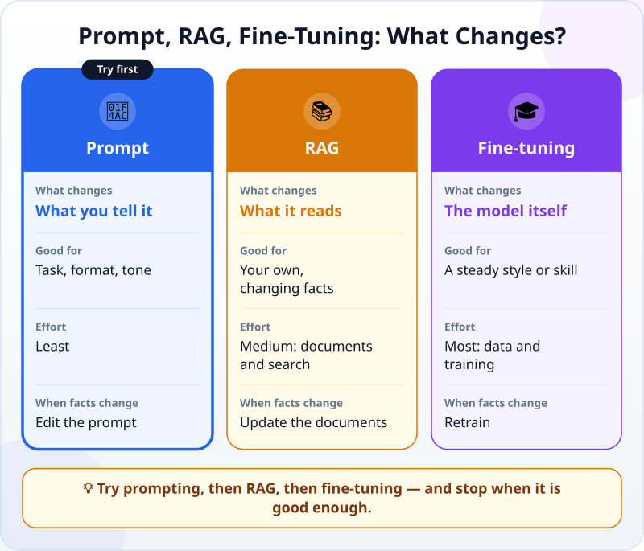
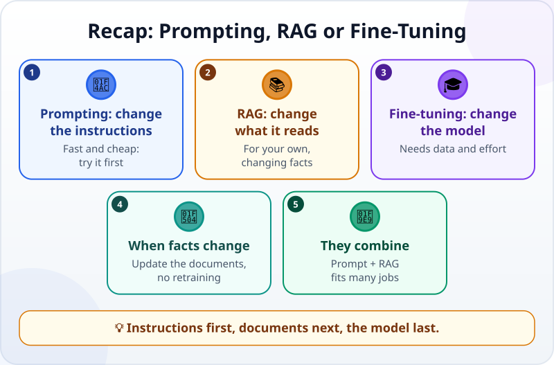

🌐 [Tiếng Việt](../../vi/lessons/prompt-rag-finetune-compare.md) · **English** · [日本語](../../ja/lessons/prompt-rag-finetune-compare.md)

# Prompting, RAG or Fine-Tuning: Which One When?

<!-- section: objective -->
## Lesson Objective

By the end of this lesson, you will be able to:

- Say what each one changes: what you tell the AI (prompting), what it reads (RAG), or the model itself (fine-tuning).
- Choose the one that fits a given need, in the order worth trying them.
- Explain why information that keeps changing suits RAG better than fine-tuning.

<!-- section: hook -->
## Why It Matters

Mai's team wants an AI assistant that answers colleagues' questions about travel-expense rules. In the meeting, three people have three ideas. One says: *"Just write a better prompt."* Another: *"Let the AI read the rule book."* A third: *"We need to fine-tune our own model."*

Each sounds reasonable. But the three change three different things, cost very different amounts of effort, and fail in different ways. Pick the wrong one and the team could spend weeks on something an afternoon would have solved.

<!-- section: concept -->
## Core Idea

### Three places you can make a change

An AI's answer comes from three things: the model itself, what it reads, and what you tell it. Each approach changes one of them:

- **Prompting — change what you tell it.** Instructions, sample examples, the format you want ([Prompting Basics](prompting-basics.md)). It works at once, only in that conversation or call, and you can change it any time.
- **RAG — change what it reads.** For each question, the system finds the relevant passages in your documents and puts them into the context ([RAG: Letting AI Look Things Up](rag-intro.md)). It suits knowledge that is your own, information that keeps changing, and answers that must cite their source. To update it, you edit the documents.
- **Fine-tuning — change the model itself.** An existing model is trained further on new data, so the numbers inside it change ([How Do Machines "Learn"?](how-machines-learn.md)). The model starts to mimic the patterns of that data, which makes this a way to adapt it to a field, a kind of task or a writing style. The AI assistants you use have themselves been fine-tuned to converse as assistants.

### What fine-tuning costs

Fine-tuning needs many good examples and training effort. It has risks of its own: the model can "memorize" its examples, or lose some of what it could already do. It also learns whatever is wrong in the data. When the information changes, what the model learned does not change with it: it has to be trained again. This is usually a job for an engineering team, and not every service lets you fine-tune at all — as of September 2026, Anthropic's glossary says the Claude API does not currently offer fine-tuning.

### In which order should you try them?

1. **Prompting first.** Fastest, cheapest, and you can change it at once. Many tasks only need a clearer prompt with one sample example.
2. **Add RAG** when the AI lacks information that is your own, or information that keeps changing. If the documents are only a few pages, pasting them straight into the prompt is sometimes enough.
3. **Consider fine-tuning** when you have tried both and still need a steady style or skill, used again and again at scale, and you have many good examples.

Stop at the first step that is good enough. And the three are not either-or: one system can use a prompt to say how to answer and RAG to bring the documents, on a model that has already been fine-tuned.

### And with a coding agent?

In this course you will almost only use the first two: writing instructions (prompts, and the project's instruction file) and letting the agent find and read the files it needs through [tool calling](tool-calling.md) — the same idea as RAG. Fine-tuning is rarely a learner's job.

<!-- section: analogy -->
## Simple Analogy

Think of a new employee:

- **Prompting** is like giving clear instructions for one task: *"Write a reply, politely, in five sentences at most."*
- **RAG** is like handing them the rule book to look things up whenever they need to.
- **Fine-tuning** is like sending them on a long training course: their habits change for good, but it takes time, and what they learned can go out of date when the rules change.

Where it breaks down: someone back from a course still understands why, and updates themselves by reading the new rules. A fine-tuned model only has adjusted numbers; to follow new rules it has to be trained again — or be given the new rules to read.

<!-- section: example -->
## Real Example

Mai's team tries each in turn, with a made-up rule book for practice:

1. **Prompting only:** *"You are an admin assistant. Answer briefly and politely, in English."* The answer is well presented but gives the wrong allowance: the AI does not know the rules of Mai's company, so it writes what sounds common.
2. **Prompting + RAG:** the system finds the right section of the rule book and puts it into the prompt. The answer gives the right allowance and names the section. Next month the rules change: the team only swaps the rule-book file.
3. **A fine-tuning proposal:** a colleague wants to train a model on all of last year's questions and answers. Mai asks two questions: *"What happens when the rules change?"* — it has to be trained again. *"Were any of last year's answers wrong?"* — the model would learn the mistakes too.

The team chooses prompting + RAG. Fine-tuning is kept for the day they need one kind of task, repeated a great many times, in a fixed style a prompt cannot reach.

<!-- section: misconceptions -->
## Common Misconceptions

- **"To make AI know our documents, we have to fine-tune."** — For information that changes and must be cited, RAG usually fits better: updating the documents is enough. Fine-tuning changes the model, and new information means training again.
- **"Prompts are a beginner's trick; real work needs fine-tuning."** — Prompting is the first step, cheap and fast, and many tasks need nothing more than a good prompt. A fine-tuned model still needs a prompt.
- **"You have to pick one of the three."** — They combine: a prompt says how to answer, RAG brings the documents, on a model already fine-tuned to be an assistant.

<!-- section: recap -->
## The Lesson in One Picture

<!-- section: takeaways -->
## Key Takeaways

- Prompting changes what you tell the AI; RAG changes what it reads; fine-tuning changes the model itself.
- Try them in the order prompting → RAG → fine-tuning, and stop when it is good enough.
- Your own, changing information that must be cited → RAG: update the documents instead of retraining.
- Fine-tuning suits a steady style or skill, and needs many good examples and real effort.
- With a coding agent, you mostly use prompts and let the agent look up files itself.

<!-- section: quiz -->
## Quick Check

**Question 1.** A team wants AI to answer by its travel-expense rules, and the rules change every few months. Which should it choose?

- A) Fine-tune the model again every time the rules change
- B) Just write a better prompt
- C) RAG with the latest rule book

**Question 2.** Which one changes the numbers inside the model itself?

- A) Fine-tuning
- B) RAG
- C) Prompting

**Question 3.** You want AI to write e-mails in one fixed format. What should you try first?

- A) Fine-tune a model of your own
- B) A clear prompt with one sample e-mail
- C) Build a RAG system

Show answers

1. **C** — information that changes belongs in documents that you update; a prompt alone does not know the rules, and fine-tuning again each time is costly.
2. **A** — fine-tuning trains the model further, so the model changes; RAG and prompting only change what the model reads, not the model.
3. **B** — a format is a matter of instructions; a clear prompt with a sample is usually enough.

<!-- section: sources -->
## Recommended Sources

- Anthropic — [Glossary](https://platform.claude.com/docs/en/about-claude/glossary), entries *Fine-tuning* and *RAG*: fine-tuning further trains a pretrained model on additional data so it mimics the patterns of that data, useful for adapting to a domain, task or writing style; Claude has already been fine-tuned to be an assistant; the Claude API does not currently offer fine-tuning (as of September 2026). RAG passes retrieved documents into the context when a query arrives, and is useful for up-to-date information, domain-specific knowledge and citing sources.
- Google Cloud — [Fine-tuning LLMs: overview and guide](https://cloud.google.com/use-cases/fine-tuning-ai-models): fine-tuning alters the model's parameters, while RAG augments prompts with external knowledge; fine-tuning brings higher resource costs, stronger data demands, and risks of overfitting and "catastrophic forgetting"; RAG can only reference the data it has access to.
- Anthropic — [Introducing Contextual Retrieval](https://www.anthropic.com/news/contextual-retrieval) (September 2024): a small enough knowledge base can simply go into the prompt, with no need for RAG; larger ones call for RAG.
- Google Cloud — [Prompt engineering: overview and guide](https://cloud.google.com/discover/what-is-prompt-engineering): a prompt gives the model context, instructions and examples so it understands what you intend.
