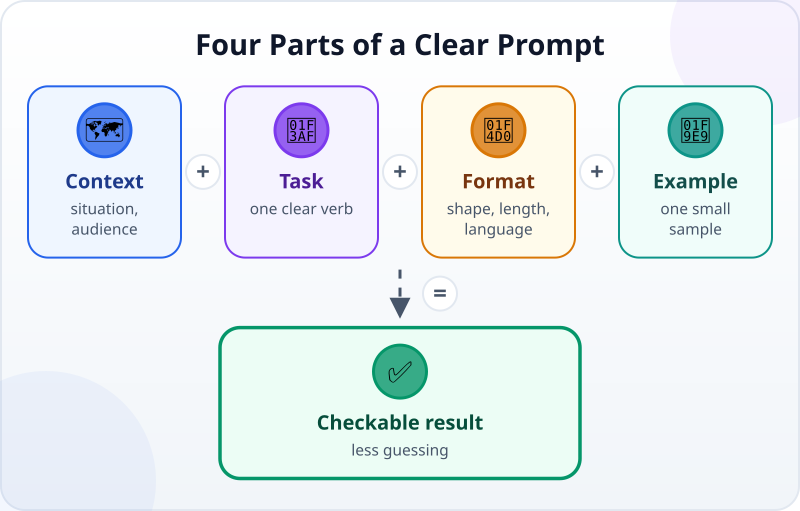
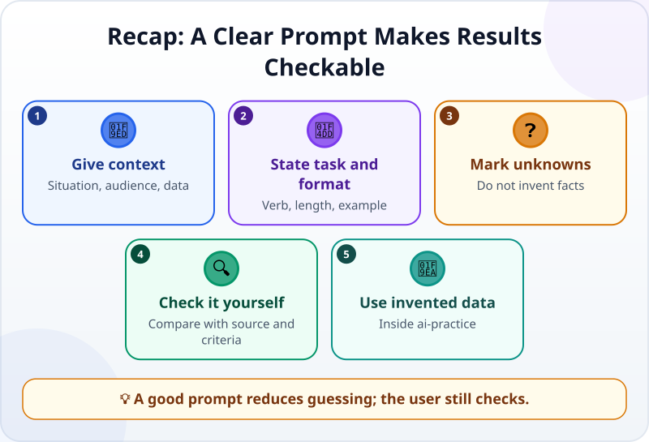

🌐 [Tiếng Việt](../../vi/lessons/prompting-basics.md) · **English** · [日本語](../../ja/lessons/prompting-basics.md)

# Prompting Basics: Talking So AI Understands

<!-- section: objective -->
## Lesson Objective

By the end of this lesson, you will be able to:

- Write a prompt with context, a task, an output format and an example.
- Ask AI to state what it does not know instead of guessing.
- Compare two answers with criteria you can check.

<!-- section: hook -->
## Why It Matters

Mai pastes three meeting notes into a chatbot and types, “Make this sound good.” The AI returns a long, formal email, invents a meeting date and calls the readers “valued customers.” None of these choices fit Mai's need.

AI cannot read your mind. When a request leaves gaps, it must guess. A fluent answer can still answer the wrong task.

<!-- section: concept -->
## Core Idea

A **prompt** is the content you give AI to ask for an answer or an action. A good prompt does not need to be long or use magic words. It gives enough information to reduce guessing and is clear enough for you to check the result.



Four useful parts are:

1. **Context:** the situation, audience and allowed data.
2. **Task:** one clear verb—summarize, classify, rewrite or compare.
3. **Format:** bullet count, table or email; length; language.
4. **Example:** a small sample of what you want, especially when the format is hard to describe.

Add an important guardrail: “Use only the information below. If something is missing, write `unknown`; do not guess.” This cannot guarantee that AI is always correct, but it makes missing information visible and checkable.

Do not provide real data just to give “enough context.” Every name, date and detail here is invented. The four-part pattern for handing a project to an agent is in [Writing Good Specs: The Task and Its Definition of Done](writing-good-specs.md); here we practise one question and answer with a chatbot.

<!-- section: try-it -->
## Try It Yourself

Allow about 12 minutes. Create `ai-practice/meeting-notes.txt` with this invented data:

```text
Project: Fictional Reading Corner
Present: Mai, Alex
Decision: try opening on Saturday morning
Unknown: who will prepare the sign
```

Do not use real company minutes, real people's names, passwords or API keys.

**1. Ask vaguely (2 minutes)**

Open a chatbot you are allowed to use, paste the file contents and ask:

```text
Write a good announcement about this meeting.
```

Save the answer as `ai-practice/vague-answer.txt`. Mark anything the AI added, any format that is inconvenient, and anything it should have asked about.

**2. Ask clearly (5 minutes)**

Start a new chat so the first request does not influence the second. Paste the same notes and this prompt:

```text
Context: These are invented notes for a volunteer group. Readers missed the meeting.
Task: Summarize the decision and the open item.
Format: Plain English, exactly 3 bullets, each under 20 words.
Example line: - Decision: [what the group agreed]
Use only the supplied notes. If the owner is missing, write "unknown"; do not guess.
```

Save the result as `ai-practice/clear-answer.txt`.

**3. Compare and revise once (5 minutes)**

Check: are there exactly three bullets? Is the decision accurate? Is the owner “unknown”? If one criterion fails, do not rewrite everything. Send one precise correction, such as: “Keep the content, but shorten every bullet to under 20 words.”

Finish with three lines of evidence:

- *I can show…* both answer files in `ai-practice` and the clear prompt with all four parts.
- *I checked…* the bullet count, length, decision and “unknown” against the original notes.
- *I would not use this when…* the data contains company secrets, real personal data, passwords or API keys.

<!-- section: recap -->
## The Lesson in One Picture



<!-- section: takeaways -->
## Key Takeaways

- A prompt is content you give AI; clarity matters more than length.
- State the context, task, format and an example when useful.
- Ask AI to mark missing information as “unknown” instead of guessing.
- Compare the answer with the source and criteria; fluency is not proof.
- Practise only with invented data inside `ai-practice`.

<!-- section: quiz -->
## Quick Check

**Question 1.** Which prompt produces the easiest result to check?

- A) “Write it better”
- B) “You are the best expert; make it perfect”
- C) “Summarize in 3 bullets; use only these notes; mark missing facts unknown”

**Question 2.** The notes do not name the person preparing the sign. What should you ask AI to do?

- A) Choose the person who seems most suitable
- B) Write “unknown” and do not guess
- C) Remove the item from the result

**Question 3.** After receiving a fluent answer, what is the most important next step?

- A) Compare it with the original notes and format criteria
- B) Trust it because it sounds natural
- C) Send real data so AI can check again

<details>
<summary>Show the answers</summary>

1. **C** — the task, format, allowed source and treatment of missing facts are all checkable.
2. **B** — marking the gap reveals the problem without turning a guess into a fact.
3. **A** — fluent wording does not prove that the content or format is correct.

</details>
