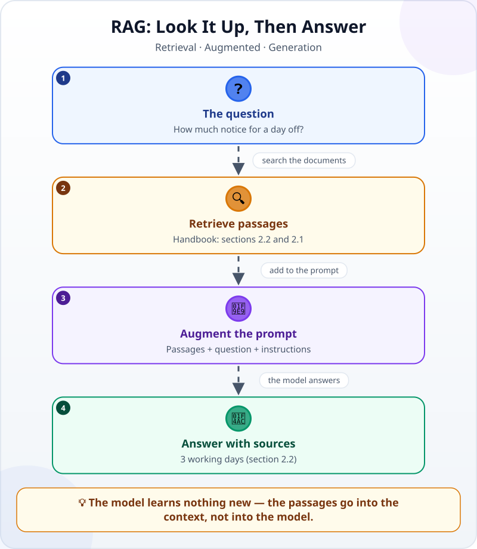
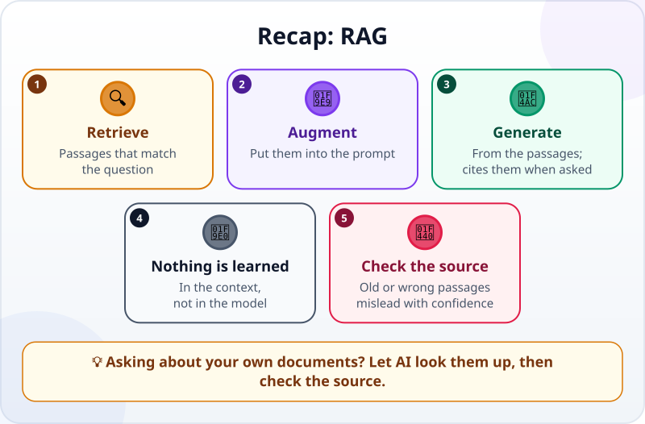

🌐 [Tiếng Việt](../../vi/lessons/rag-intro.md) · **English** · [日本語](../../ja/lessons/rag-intro.md)

# RAG: Letting AI Look Things Up

<!-- section: objective -->
## Lesson Objective

By the end of this lesson, you will be able to:

- Explain RAG in three steps: find the relevant passages, add them to the prompt, answer from them.
- Follow one question answered with RAG and point to the passage each part of the answer came from.
- Recognize two ways RAG still goes wrong — outdated documents and the wrong passage — and know to open the source and check.

<!-- section: hook -->
## Why It Matters

Tuan asks a chatbot: *"At my company, how much notice do I need to give before taking a day off?"* The answer comes at once, full of confidence: *"Typically, you should give one to two weeks' notice…"*

It sounds reasonable, but the chatbot has never read Tuan's employee handbook. It only wrote down what is *usual* somewhere. To get the right answer for his own company, the AI needs to be handed the right page — the way you would open the handbook and look it up instead of guessing.

<!-- section: concept -->
## Core Idea

### A model does not know your documents

A model carries only what it learned in training ([How Do Machines "Learn"?](how-machines-learn.md)). Your internal handbook, the rule changed last month, yesterday's meeting notes — it has never seen them. When information is missing, a model still writes an answer that sounds right, because it is built to [predict the next token](next-token-prediction.md). That is exactly where [hallucinations](hallucination.md) grow.

### RAG: look it up, then answer

**RAG** (Retrieval-Augmented Generation) is three steps, one for each word of its name:



1. **Retrieval:** the system searches the documents for the passages closest to the question.
2. **Augmented:** the passages it found are added to the prompt, together with the question and instructions on how to answer.
3. **Generation:** the model writes an answer from those passages and says which one each part came from.

Those passages sit in the [context window](context-window.md) and serve that one answer. The numbers inside the model do not change: the model does not "memorize" your documents.

### Why search? Why not hand over everything?

If the documents are only a few pages, the simplest thing is sometimes to put all of them into the prompt. But a large collection does not fit into the context window. So a RAG system splits the documents into small passages in advance, and for each question it takes only the few most relevant ones. Many systems search by **meaning**, not only by matching words: the question says "notice", the handbook says "at least 3 working days before the day off", and the passage is still found.

### Where you meet RAG

- Chatbots that answer questions about internal documents, giving the document name and section.
- AI search tools that show their sources under the answer.
- Agents that find and read files in a project before answering or changing code. There, the search is done through [tool calling](tool-calling.md) — the same idea: read the right material first, then answer.

<!-- section: analogy -->
## Simple Analogy

RAG is like an **open-book exam**. The student does not need to know the whole book by heart. Faced with a question, they turn to the right page, read the relevant passage, then write an answer and add *"see page 42"*. The examiner can open page 42 and check.

Where it breaks down: the student understands the material and can notice a misprint. The AI only uses the passages it is given. If the wrong page is opened, or the book is last year's edition, the answer is still confident and still "sourced" — just wrong. And here, the one turning the pages is usually the system's search, not the model itself.

<!-- section: example -->
## Real Example

Let us watch one question answered with RAG, using entirely made-up data. The document collection is a single file, `ai-practice/handbook.md`:

```text
# Employee handbook (made-up data for practice)

## 1. Working hours
1.1. Working hours are 8:30 to 17:30, with a 60-minute lunch break.

## 2. Paid leave
2.1. Permanent employees have 12 days of paid leave a year.
2.2. Request leave in the attendance system at least 3 working days before the day off.

## 3. Business travel
3.1. Train and bus tickets for business trips are booked by the admin team.
```

**Step 1 — Tuan asks:** *"How much notice do I need to give before a day off?"*

**Step 2 — the system searches.** It returns the two passages closest to the question: **2.2** and **2.1**. Sections 1 and 3 are left out, because they say nothing about leave.

**Step 3 — the system builds the prompt.** The model receives:

```text
Answer only from the passages below and name the sections you used.
If the passages do not contain the answer, say: "The handbook does not say."

[2.2] Request leave in the attendance system at least 3 working days before the day off.
[2.1] Permanent employees have 12 days of paid leave a year.

Question: How much notice do I need to give before a day off?
```

**Step 4 — the model answers:** *"At least 3 working days before the day off, requested in the attendance system (section 2.2)."*

**Step 5 — Tuan checks.** He opens section 2.2 of the handbook: it matches. An answer with a source can be checked in moments; an answer without one can only be believed — or not.

Now two harder cases:

- **A question the documents do not cover.** Tuan asks: *"Does the company allow remote work?"* No passage mentions it. The right answer is *"The handbook does not say."* If the AI still produces a "rule", that is a sign it is making things up — the instruction in Step 3 is there to prevent it.
- **An outdated document.** Suppose last year's handbook is still in the collection, saying *"give 5 working days' notice"*. If the system picks up that old passage, the answer names its source properly — and is still wrong. RAG is only as good as the documents in the collection and the search that finds them.

<!-- section: try-it -->
## Try It Yourself

About 10 minutes, with a chatbot you already use. Use only made-up data: ⛔ never put real company documents into an AI tool your company has not approved.

1. In your `ai-practice` folder, create `handbook.md` and copy the made-up handbook above into it.
2. Start a new conversation and ask: *"How much notice do I need to give before a day off?"* — without the file. Note the answer.
3. Start another new conversation. Paste the file's contents with the instructions from Step 3, then ask the same question.
4. In the second conversation, also ask: *"Does the company allow remote work?"*

Check yourself: the second time, the answer should be 3 working days and name section 2.2; for the last question, the AI should say the handbook does not say. Here, you did the "retrieval" step yourself — you chose which file to hand over. A RAG system automates that step for a large collection of documents.

<!-- section: misconceptions -->
## Common Misconceptions

- **"RAG makes the AI memorize my documents."** — No. The passages sit in the context of that one answer; nothing in the model changes.
- **"If it cites a source, it must be right."** — A source lets you check; it does not make the answer right. The system can pick the wrong passage or an old version, or the model can misread it. For anything that matters, open the source and compare.
- **"With RAG, careful prompts are no longer needed."** — They still are: tell the AI to answer only from the passages, to name the section, and to say so when the documents do not cover the question.

<!-- section: recap -->
## The Lesson in One Picture



<!-- section: takeaways -->
## Key Takeaways

- RAG = find the relevant passages → add them to the prompt → answer from them.
- The model learns nothing new: the documents sit in the context of one answer.
- A good answer names its source, and dares to say "the documents do not say".
- Outdated documents or the wrong passage give answers that are confident — and wrong.
- For anything important: open the cited section and compare.

<!-- section: quiz -->
## Quick Check

**Question 1.** How does RAG let a model answer questions about internal documents?

- A) It retrains the model on the documents every night
- B) It finds the relevant passages and adds them to the prompt with the question
- C) It makes the model remember every file it has ever read, for good

**Question 2.** An answer says "according to section 2.2", but the system picked up last year's handbook by mistake. What can happen?

- A) The answer is still right, because it has a source
- B) The model will notice by itself that the handbook is outdated
- C) The answer sounds well-grounded but is wrong

**Question 3.** A user asks about something the documents never mention. What should a good RAG system do?

- A) Say that the documents do not cover it
- B) Guess an answer that sounds reasonable
- C) Pick a passage that looks similar and answer from it

<details>
<summary>Show answers</summary>

1. **B** — RAG does not change the model; it finds the right passages and puts them into the context of that answer.
2. **C** — a source is only as good as the passage retrieved; an old document gives a "sourced" answer that is still wrong.
3. **A** — saying "not covered" is better than a made-up answer that sounds right.

</details>

<!-- section: sources -->
## Recommended Sources

- Anthropic — [Glossary](https://platform.claude.com/docs/en/about-claude/glossary), entry *RAG*: documents are retrieved when a query arrives and passed into the context window along with the query; the model can do the retrieval itself if it has tools; how well RAG works depends on the quality and relevance of what is retrieved.
- Anthropic — [Introducing Contextual Retrieval](https://www.anthropic.com/news/contextual-retrieval) (September 2024): RAG retrieves relevant information from a knowledge base and appends it to the prompt; large knowledge bases are split into small chunks, and each query retrieves the ones closest in meaning; a small enough knowledge base can simply go into the prompt whole.
- Google Cloud — [What is Retrieval-Augmented Generation (RAG)?](https://cloud.google.com/use-cases/retrieval-augmented-generation): RAG combines search with large language models so answers are more up to date and better grounded; if the retrieved information is irrelevant, the answer can be grounded yet off-topic or incorrect.
