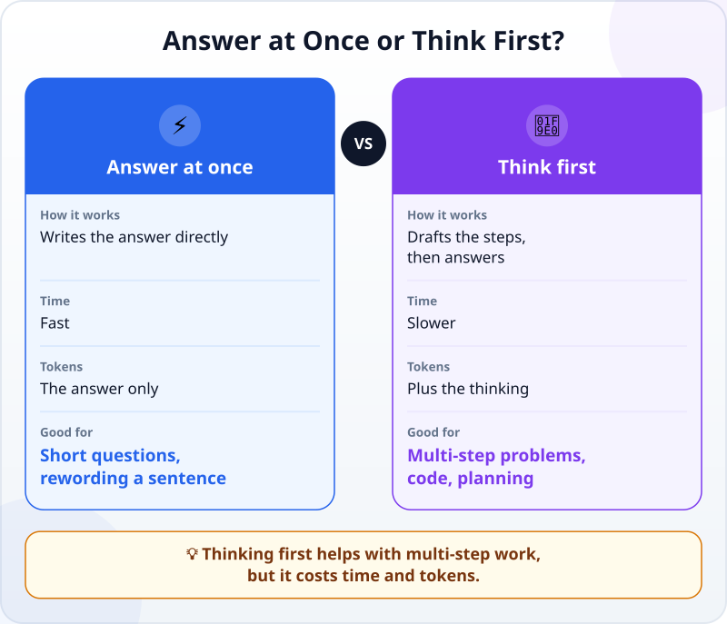
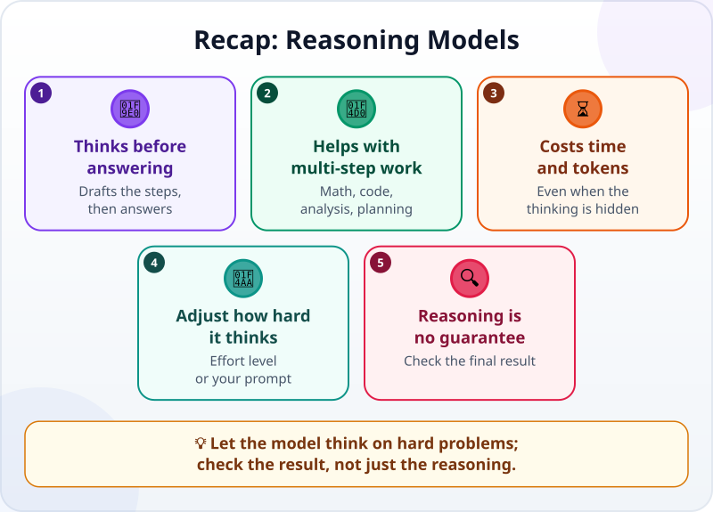

🌐 [Tiếng Việt](../../vi/lessons/reasoning-models.md) · **English** · [日本語](../../ja/lessons/reasoning-models.md)

# Models That "Think": What Is Reasoning?

<!-- section: objective -->
## Lesson Objective

After this lesson, you will be able to:

- Explain what a **reasoning model** does differently: it writes intermediate steps before it answers.
- Tell when thinking first is worth it, and what it costs: time and tokens.
- Explain why the reasoning you can read does not guarantee a right answer, and check the result instead of trusting the argument.

<!-- section: hook -->
## Why It Matters

Huy is a second-year student. After a weekend trip with three friends, he asks AI to split the costs: Huy paid the hotel, $240; Lan paid the car, $120; Minh paid for food, $80; Thảo paid nothing. Who owes whom how much?

The answer comes at once, neatly laid out: *"Thảo pays Huy $110, Minh pays Lan $30."* It sounds very sensible. But when Huy adds it up himself, the money does not balance. The next time, he notices the tool showing *"Thinking…"* for a few seconds before it answers. What happens in those seconds?

<!-- section: concept -->
## Core Idea

### Two ways to answer

In [Next-Token Prediction](next-token-prediction.md), you saw that an LLM writes its answer one token at a time. The usual way is to write the answer straight away. A **reasoning model** — or a model with its **thinking** mode on — does something first: it writes a draft. According to Anthropic's documentation (as of September 2026), in this draft the model restates the problem, tries approaches, checks intermediate results and drops paths that do not hold up, and only then writes the answer, drawing on that draft.



### Why does thinking first help?

Each new token can only build on what is already in the context before it: the question and what has been written so far. When the model must answer at once, every step of the working is squeezed into the answer itself, or skipped. With a draft, the intermediate steps — the total, each person's share, who is up and who is down — are already in the context for the answer to build on. That is why thinking first helps most with multi-step work: calculations, finding bugs in code, analysis, planning and long agent tasks.

### The cost: time and tokens

The draft is text the model writes too, so it takes time and is counted in [tokens](tokens.md). With Claude (as of September 2026), the tokens spent on thinking are counted even when you cannot see the thinking. For a simple question such as *"What is the capital of Japan?"*, extra thinking mostly just slows the answer down.

### Who decides how much to think?

On recent Claude models (as of September 2026), the model itself weighs each request: a simple question may get an answer at once, a multi-step problem gets deeper thought. You can still steer it in two ways:

- **Effort level:** some tools let you choose low or high. In Claude Code, the `/effort` command changes it: lower is faster for simple tasks, higher thinks more deeply for complex ones.
- **What you say in the prompt:** for example, *"This problem has several steps; think carefully before you answer."*

### The steps you can read are no guarantee

The thinking looks like an explanation, so it is easy to believe. But keep two things in mind:

- **What you see is usually a summary**, or it is hidden. For Claude, the documentation states that what is shown is never the full, raw chain of thought.
- **The written reasoning does not always reflect what really led to the answer.** In a 2025 study, Anthropic subtly slipped a hint about the answer into questions. When the model did use the hint, its thinking mentioned it only 25% of the time for Claude 3.7 Sonnet and 39% for DeepSeek R1.

The practical conclusion: thinking first reduces mistakes on hard problems, but it does not make an answer right. Check the **result**, not just the **reasoning**.

<!-- section: analogy -->
## Simple Analogy

Think back to math class: for a simple multiplication, you work it out in your head. For a word problem with several steps, you take scrap paper, write each calculation, cross out what is wrong and redo it, and only then copy the answer onto the test. Scrap paper makes you slower, but you make fewer mistakes.

Where the analogy breaks: your scrap paper is exactly what you thought. The model's "thinking" is text it produces, and what you are shown is usually a summary. It is more like a tidied-up copy of the draft than a window into the model's head.

<!-- section: example -->
## Real Example

Huy asks again, this time with thinking on. The tool shows the thinking (a summary, shortened here):

```text
Total: 240 + 120 + 80 = 440. Split by 4: 110 each.
Huy paid 240 → gets back 130. Lan paid 120 → gets back 10.
Minh paid 80 → owes 30. Thảo paid 0 → owes 110.
Thảo pays Huy 110. Minh pays Huy 20 and pays Lan 10.
Check: Huy receives 110 + 20 = 130. Lan receives 10. Balances.
```

The answer: *"Thảo pays Huy $110; Minh pays Huy $20 and Lan $10."*

Huy does not stop at the thinking looking "very rigorous". He checks the final result against a simple test: after the payments, **everyone must have spent exactly $110**.

1. Huy: paid $240, got back $110 + $20 → spent $110. ✓
2. Lan: paid $120, got back $10 → $110. ✓
3. Minh: $80 + $20 + $10 → $110. ✓
4. Thảo: $110. ✓

He runs the same test on the quick answer from before: Lan paid $120 and got back $30, so she spent only $90. Wrong — and now Huy knows exactly where. His lesson: thinking is worth turning on for a multi-step problem like this, and a simple check is worth more than a long argument.

<!-- section: misconceptions -->
## Common Misconceptions

- **"Thinking on is always better."** — For a simple question, it mostly slows things down and uses extra tokens. Save it for multi-step work.
- **"Reading the thinking tells you what the model really thought."** — What you see is usually a summary, and research shows the written reasoning can leave out what really led to the answer.
- **"The model thinks like a person."** — The thinking is also text produced one token at a time, like the answer. It helps, but do not credit the model with human thoughts or intentions.

<!-- section: recap -->
## The Lesson in One Picture



<!-- section: takeaways -->
## Key Takeaways

- A reasoning model writes a draft — the intermediate steps — before it answers.
- Thinking first helps most with multi-step work: calculations, code, analysis, planning.
- The cost is time and tokens, even when the thinking is hidden.
- The model weighs how much to think; you steer it with the effort level or with your prompt.
- The thinking is no guarantee: check the final result, not just the reasoning.

<!-- section: quiz -->
## Quick Check

**Question 1.** Which task is most worth letting the model think first?

- A) Asking for the capital of Japan
- B) Finding why some code gives a wrong result after a few steps of calculation
- C) Rewording a sentence to sound more polite

**Question 2.** The tool does not show the model's thinking. Which is true?

- A) It means the model did not think
- B) It means no extra tokens were used
- C) The thinking can still cost time and tokens even though you cannot see it

**Question 3.** The model's thinking looks long and rigorous. What should you do?

- A) Check the final result in an independent way, such as adding up the amounts yourself
- B) Trust it at once, since a long, detailed argument must be right
- C) Ask the model "Are you sure?" and trust that answer

<details>
<summary>Show answers</summary>

1. **B** — multi-step work is where a draft helps most; the other two are simple, and extra thinking mostly slows them down.
2. **C** — with Claude, the tokens spent on thinking are counted even when it is hidden.
3. **A** — written reasoning does not guarantee a right answer; an independent check can tell you.

</details>

<!-- section: sources -->
## Recommended Sources

- Anthropic — [Thinking](https://platform.claude.com/docs/en/build-with-claude/thinking) (English, as of September 2026): when thinking, Claude restates the problem, tries approaches, checks intermediate results and abandons paths that do not hold up before it answers; this helps with math, coding, analysis and long agentic work. Thinking tokens are billed even when not shown, and what is shown is a summary, never the raw chain of thought.
- Anthropic — [Steering thinking](https://platform.claude.com/docs/en/build-with-claude/thinking-steering-and-cost) (English, as of September 2026): Claude decides per request whether to think; a simple factual question may get no thinking, a multistep problem deeper reasoning; the effort level is the primary lever, and guidance in the prompt also works.
- Anthropic — [Extended thinking](https://platform.claude.com/docs/en/build-with-claude/extended-thinking) (English, as of September 2026): the older mode that sets a fixed token budget for thinking; Claude 4.7 and later do not support it, and use adaptive thinking instead.
- Anthropic — [Model configuration](https://code.claude.com/docs/en/model-config) (English, as of September 2026): in Claude Code, `/effort` changes the effort level; lower is faster for simple tasks, higher reasons more deeply on complex ones.
- Anthropic — [Reasoning models don't always say what they think](https://www.anthropic.com/research/reasoning-models-dont-say-think) (English, April 2025): given a hint about the answer, Claude 3.7 Sonnet mentioned the hint in its thinking only 25% of the time, DeepSeek R1 39%.
