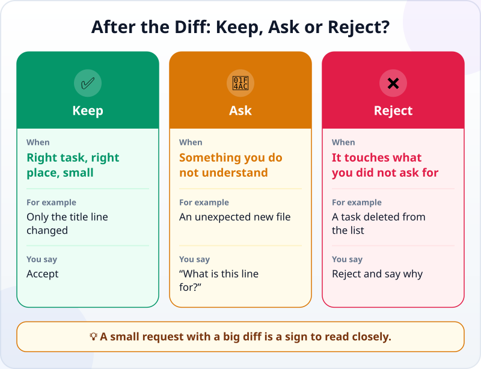
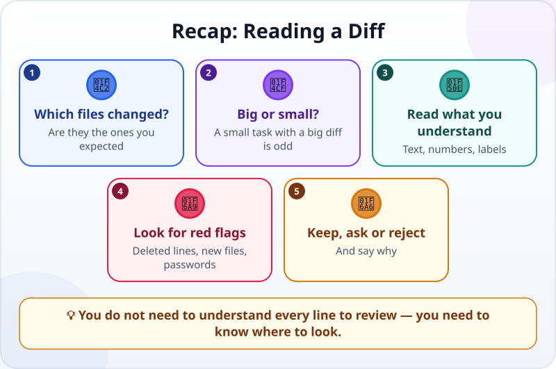

🌐 [Tiếng Việt](../../vi/lessons/reviewing-agent-changes.md) · **English** · [日本語](../../ja/lessons/reviewing-agent-changes.md)

# Reading and Reviewing an Agent's Changes (Diffs)

<!-- section: objective -->
## Lesson Objective

By the end of this lesson, you will be able to:

- Read a **diff**: which lines were added and which removed, in which file.
- Review an agent's change with four questions, even without understanding all the code.
- Decide to **keep, ask or reject** — and say why.

<!-- section: hook -->
## Why It Matters

So far you have checked results by their behaviour: open, click, compare with the criteria. But some changes do not show when you click around: a line removed where you were not looking, an unexpected file added, a password written straight into the code.

A diff shows you **exactly** what the agent changed — before you accept it. In a mode where the agent asks first, you see the diff of each change as soon as the agent proposes it.

<!-- section: concept -->
## Core Idea

### What does a diff look like?

```diff
-      <button>Next tip</button>
+      <button>Show another tip</button>
```

- A line starting with `-` (usually red) was **removed**.
- A line starting with `+` (usually green) was **added**.
- A changed line shows as a pair: the old line with `-` and the new one with `+`. The unchanged lines around them tell you where you are in the file.

Many tools also sum up the size, for example `+12 -1`: 12 lines added, 1 removed.

### Four questions for a review

1. **Which files changed?** Are they the ones you expected? (Paths help you answer.)
2. **Big or small?** A small request with a big diff is odd.
3. **Read what you understand:** visible text, numbers, names. Are they what you asked for?
4. **Look for red flags:** lines removed that you did not ask about, unexpected new files, new libraries, passwords or secret keys in the code.

### Keep, ask or reject



Rejecting is not failing. Saying why — *"Removing the 'Team meeting on Wednesday' task was not part of the request; keep the list as it was"* — helps the agent get it right next time.

<!-- section: example -->
## Real Example

Hana asks the agent: *"Change the button text from 'Next tip' to 'Show another tip'."* The agent proposes a change, summed up as `+2 -2`. One line of work — why two? Hana reads the diff:

```diff
-      <button>Next tip</button>
+      <button>Show another tip</button>
       ...
       const tips = [
         "Put the most important task at the top of your list.",
-        "Turn off notifications when you need 25 minutes of focus.",
+        "Turn off notifications when you need to focus.",
         "Answer e-mail at two fixed times a day.",
```

The button text: as requested. But the agent also "tidied" a tip — dropping "25 minutes". Hana replies: *"Keep the button change. Do not edit the tips — put the old sentence back."*

<!-- section: try-it -->
## Try It Yourself

About 15 minutes.

**1. Review a sample diff (5 minutes).** The request was: *"Add a sixth task: Call my parents."* The agent proposes:

```diff
   <ul>
     <li><input type="checkbox"> Send the monthly report</li>
-    <li><input type="checkbox"> Team meeting on Wednesday</li>
     <li><input type="checkbox"> Book a dentist appointment</li>
     <li><input type="checkbox"> Walk for 30 minutes</li>
     <li><input type="checkbox"> Read 20 pages</li>
+    <li><input type="checkbox"> Call my parents</li>
   </ul>
```

Answer the four questions, then decide: keep, ask or reject?

<details>
<summary>Suggested answer</summary>

- The sixth task was added correctly (`+`).
- But "Team meeting on Wednesday" was removed (`-`) — not part of the request. The list still has only 5 tasks, although the request was to add a sixth.
- Decision: **reject**, and say: *"Only add the new task; do not remove any."*

</details>

**2. Review a real change (10 minutes).** With `my-week.html`, in a mode where the agent asks before each change, hand over a small task:

```text
Change the title to "My Week Ahead" and add one new task: "Tidy my desk".
Do not change anything else.
```

Before you accept, read the diff with the four questions. Write your evidence:

- *I can show…* the diff contains only the title line and one new task.
- *I checked…* which file changed, the size of the change, and that no line was removed except the old title.
- *I would not use this when…* for example: the diff is too long to read — then I ask the agent to split the task.

<!-- section: misconceptions -->
## Common Misconceptions

- **"If you cannot code, you cannot review."** — You can review what you understand and look for red flags: which files changed, which lines were removed, what was added. Most agent mistakes show up right there.
- **"If it runs, it is right."** — A change can still run while deleting something you need or exposing a password.
- **"A long diff — just accept it to save time."** — A diff too long to read is a sign to split the task, not a reason to skip the review.

<!-- section: recap -->
## The Lesson in One Picture



<!-- section: takeaways -->
## Key Takeaways

- In a diff, `-` is a removed line and `+` an added one; a changed line is a `-` and `+` pair.
- Four questions: which files changed, big or small, is what you understand right, any red flags?
- Decide to keep, ask or reject — and say why.
- A diff too long to read? Split the task.

<!-- section: quiz -->
## Quick Check

**Question 1.** In a diff, what does a line starting with `-` mean?

- A) The line was removed
- B) The line was added
- C) The line has an error

**Question 2.** You asked for a one-word change, but the agent proposes `+40 -35`. What do you do?

- A) Accept; agents are usually right
- B) Accept now and look later
- C) Read closely why a small task became a big change before you decide

**Question 3.** The diff does what you asked but also adds a file you do not understand. What is most sensible?

- A) Reject everything and start over
- B) Ask the agent what the file is for
- C) Accept; the main part is right

<details>
<summary>Show answers</summary>

1. **A** — `-` means removed, `+` means added.
2. **C** — a small task with a big change is the first red flag worth reading closely.
3. **B** — when you do not understand, ask; decide to keep or reject once you have the answer.

</details>

<!-- section: sources -->
## Recommended Sources

- Anthropic — [Get started with the desktop app](https://code.claude.com/docs/en/desktop-quickstart): in *Manual* mode you see a diff of each change and accept or reject it; in more automatic modes you review the diff after the agent has made the change.
- Google Cloud — [What is agentic coding?](https://cloud.google.com/discover/what-is-agentic-coding): before code an AI agent writes goes into the main project, someone on the team should review it.
