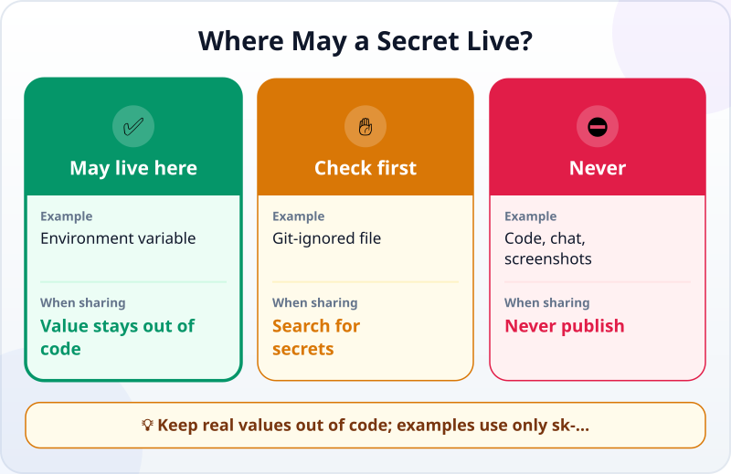
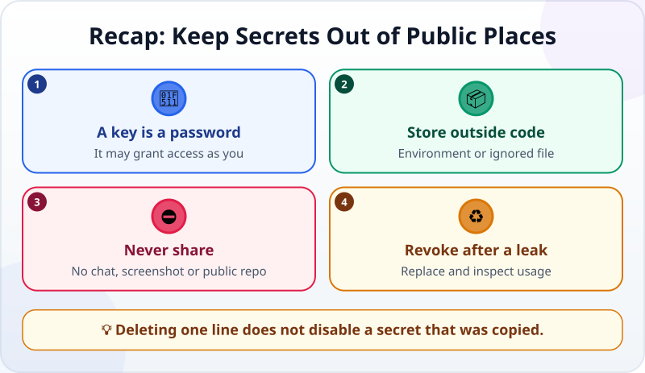

🌐 [Tiếng Việt](../../vi/lessons/security-basics.md) · **English** · [日本語](../../ja/lessons/security-basics.md)

# Safety Basics: API Keys, Passwords and Personal Data

<!-- section: objective -->
## Lesson Objective

By the end of this lesson, you will be able to:

- Explain why an API key needs the same care as a password.
- Tell where a secret may live and where it must never appear.
- Respond immediately if a secret has been exposed.

<!-- section: hook -->
## Why It Matters

Huy writes a small program in `ai-practice`. The service asks for an **API key**, so he pastes it into his Python file:

```python
API_KEY = "sk-..."  # a placeholder, not a real key
```

The program works. Huy is about to publish the project in a public Git repository to show a friend. Just before he clicks, he notices that anyone downloading the code would see that line.

A secret is not safe because it is surrounded by code. When the file is shared, the secret is shared too.

<!-- section: concept -->
## Core Idea

### An API key is a program's password

An **API key** is a secret string that identifies your program to a service. It may grant access and connect usage to your account. Someone who gets it may use that access under your name. Treat it like a password: do not publish it, send it, or paste it into an AI chat.

The rule also covers passwords and other people's personal data. A made-up name such as “Alex Example” is fine for practice; a real customer list, real phone numbers or a real payroll file is not.

### Where may a secret live?



- ✅ **May live:** in an environment variable held by the operating system, or in a local secret file that Git ignores. Use the second choice only when you understand the project's ignore file.
- ✋ **Check first:** before sharing a folder or screenshot, search for secrets in files, terminal output and images.
- ⛔ **Never:** in code, an AI chat, a screenshot or a public repository. Use `sk-...` in examples.

An environment variable lets a program read a value without writing it into the code. It is not magic: if you print the key in a terminal and capture the screen, the key is still exposed.

### When a secret leaks

Do not merely delete the line. Git history or someone else's copy may still contain it. Act in this order:

1. **Revoke** the key or change the password at the service that issued it.
2. **Create a new key** if it is still needed, then store it properly.
3. **Remove the secret from shared files and history**, check for unusual use, and tell the responsible person if it is a school or company account.

[Data Safety and Permissions](data-safety-and-permissions.md) applies ✅ / ✋ / ⛔ to every action. [Git: A Magic Undo Button for Your Whole Project](git-version-control.md) explains why deleting something from the current version may not remove it from history.

<!-- section: analogy -->
## Simple Analogy

An API key is like an access badge with your name on it. Whoever holds it may open the doors it permits, and the system records the entry under your name. You would not post a clear photo of its code on a noticeboard; you protect it and cancel it as soon as it is lost.

The analogy has a limit: you can notice that a physical badge is missing. A digital secret can be copied without your knowledge, and both copies still work. When you suspect exposure, revoke it rather than just move its file.

<!-- section: example -->
## Real Example

Huy fixes the project before sharing it:

1. He replaces the line with code that reads an environment variable: `API_KEY = os.environ["API_KEY"]`.
2. He sets the real value in an environment variable on his machine, not in a guide or code file.
3. He searches all of `ai-practice` for the beginning of the key to make sure no copy remains.
4. He reviews the Git changes before committing. Screenshots show only `sk-...`.

If a real key had ever been committed, Huy would revoke it first. A new commit that deletes the old line does not make the old key safe again.

<!-- section: recap -->
## The Lesson in One Picture



<!-- section: takeaways -->
## Key Takeaways

- An API key is a program's password; its holder may use access under your name.
- Keep secrets in environment variables or local Git-ignored files, not in code.
- Never put passwords, API keys or real personal data into AI, screenshots or public repositories.
- If a secret leaks, revoke, replace and inspect; deleting the line is not enough.

<!-- section: quiz -->
## Quick Check

**Question 1.** What is the best place for an API key used on your computer?

- A) Directly in the Python file
- B) An environment variable
- C) A private message to an AI

**Question 2.** You discover that a real key was in a public repository. What should you do first?

- A) Revoke the key at the service that issued it
- B) Only rename the file containing it
- C) Add a “do not use” comment

**Question 3.** Which data is suitable for an example in `ai-practice`?

- A) A real customer's phone list
- B) A real payroll with names removed but employee IDs retained
- C) A completely invented list of people and phone numbers

<details>
<summary>Show the answers</summary>

1. **B** — the program can read an environment variable without storing the secret value in code.
2. **A** — disable the exposed copy's access; editing a file cannot erase every copy.
3. **C** — invented data does not expose a real person's information.

</details>
