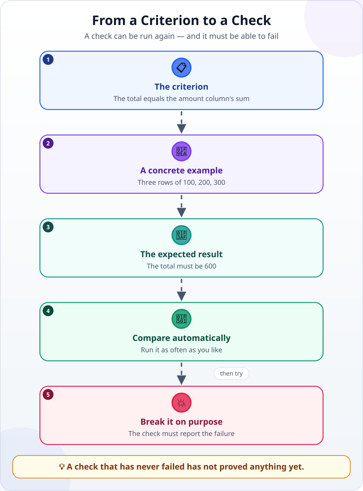
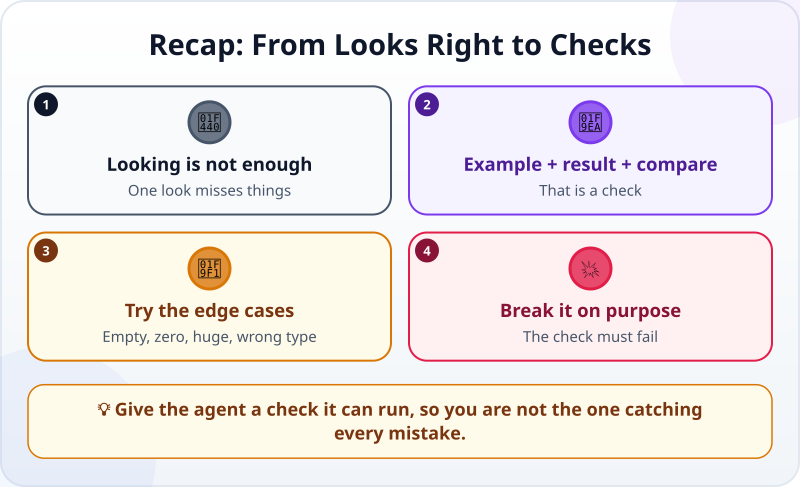

🌐 [Tiếng Việt](../../vi/lessons/testing-basics.md) · **English** · [日本語](../../ja/lessons/testing-basics.md)

# Turn "Looks Right" into Checks

<!-- section: objective -->
## Lesson Objective

By the end of this lesson, you will be able to:

- Turn a criterion into a **check** (a test): a concrete example, an expected result, an automatic comparison.
- Have the agent write and run the check, and read the result.
- Check the check itself: **break things on purpose** and try the **edge cases**.

<!-- section: hook -->
## Why It Matters

So far you have checked by eye: open it, click, add up a few numbers. That works, but after every change you have to start again — and human eyes miss things.

Claude Code's guidance is blunt: give the agent a check it can run. Without one, "looks done" is the only signal available, and you become the one who has to notice every mistake.

<!-- section: concept -->
## Core Idea

### What makes a check?



1. **A concrete example:** input you know well — say, three expense rows of 100, 200 and 300.
2. **The expected result:** the total must be 600.
3. **An automatic comparison:** a small program runs, compares the result with the expectation and reports **PASS** or **FAIL**.

Because it is a program, the check can run as often as you like — after each change, the agent runs it before reporting back.

### Try the edge cases too

Bugs like to hide where things are unusual. Besides a normal example, try:

- **Empty:** a file with no rows.
- **Zero or huge:** an expense of 0, an expense of a billion.
- **Wrong type:** an empty amount, or text where a number should be.

You do not have to write these yourself — just ask the agent to add them.

### Break it on purpose

A check that always says PASS is useless: it may not be checking anything. The surest way to know: **make something wrong on purpose**, run the check and watch it say FAIL. Then put things back. A check that has never failed has not proved anything yet.

<!-- section: example -->
## Real Example

Mai has `summary.csv`, her expenses summed up by category. She asks the agent for a check of the criterion *"Total equals the sum of the amount column in expenses.csv"*.

1. The agent writes a small program, `check_summary.py`, and runs it: **PASS**.
2. Mai does not trust it yet. She asks the agent to make a copy, `summary_wrong.csv`, with one number changed, and to run the check on the copy: **FAIL — the Total is off by 50,000.** Now she knows the check really catches mistakes.
3. Mai adds an edge case: a row with an empty `amount`. The agent's summary program stops with an error. Mai decides that an empty amount counts as 0 and must be listed in the report — then has the agent fix it and add a check for that case.

<!-- section: try-it -->
## Try It Yourself

About 12 minutes, with `expenses.csv` and `summary.csv` from [writing good specs](writing-good-specs.md) (do not have them? ask the agent to recreate them with made-up data).

**1. Have the agent write the check (4 minutes):**

```text
Write an automatic check (a small program) for the criterion:
"The Total in summary.csv equals the sum of the amount column in expenses.csv".
Run it and show me the result: PASS, or FAIL with the reason.
Do not change expenses.csv or summary.csv. Ask me before installing anything.
```

**2. Break it on purpose (4 minutes):**

```text
Make a copy called summary_wrong.csv, change one number in it,
and run the check on the copy. It must say FAIL.
```

If it still says PASS, the check is not checking the right thing — tell the agent.

**3. Add an edge case (4 minutes):** ask the agent to add checks for an expenses file with no rows, and for a row whose `amount` is empty. You decide what the expected result is.

Write your evidence:

- *I can show…* the check says PASS for the real file and FAIL for the copy I broke.
- *I checked…* a normal example and two edge cases.
- *I would not use this when…* for example: the criterion is a matter of taste ("looks professional") — then I still need to look myself.

<!-- section: misconceptions -->
## Common Misconceptions

- **"Tests are a programmer's job."** — You do not need to write tests, but you decide what to check, what to expect, and you read the results.
- **"If the test passes, the code is right."** — A test checks only what it was written to check. A test that has never failed may not be checking anything.
- **"One normal example is enough."** — Bugs hide in the edge cases: empty cells, zeros, very large data.

<!-- section: recap -->
## The Lesson in One Picture



<!-- section: takeaways -->
## Key Takeaways

- A check = a concrete example + an expected result + an automatic comparison.
- The agent can run the check after every change — so you are not the one catching every mistake.
- Try the edge cases too: empty, zero, huge, wrong type.
- Break it on purpose: the check must say FAIL, or it has not proved anything yet.

<!-- section: quiz -->
## Quick Check

**Question 1.** Which is a real check for the criterion "the total is right"?

- A) With rows of 100, 200 and 300, the total must be 600 — and a program compares
- B) Glancing at the number and finding it reasonable
- C) Asking the agent "is it right?"

**Question 2.** Why break things on purpose?

- A) So the agent can practise fixing bugs
- B) To be sure the check really catches mistakes
- C) To make the project longer

**Question 3.** Which is an edge case?

- A) 20 ordinary expense rows
- B) An expense of 50,000
- C) An expenses file with no rows

<details>
<summary>Show answers</summary>

1. **A** — it has a concrete example, an expected result and an automatic comparison.
2. **B** — a check that has never failed has not proved anything yet.
3. **C** — an empty file sits at the "edge" of the data; A and B are ordinary cases.

</details>

<!-- section: sources -->
## Recommended Sources

- Anthropic — [Best practices for Claude Code](https://code.claude.com/docs/en/best-practices), section *Give Claude a way to verify its work*: give the agent a check it can run — tests, a build, a screenshot to compare; without one, "looks done" is the only signal available, and you become the one who has to notice every mistake.
