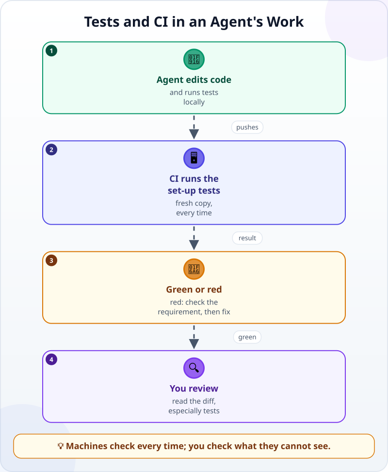
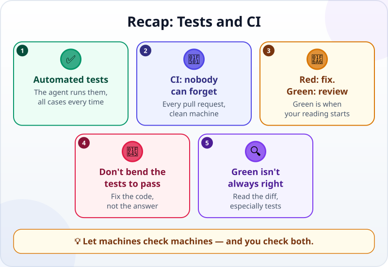

🌐 [Tiếng Việt](../../vi/lessons/tests-and-ci-for-agents.md) · **English** · [日本語](../../ja/lessons/tests-and-ci-for-agents.md)

# Tests and CI: Let Machines Check Machines

<!-- section: objective -->
## Lesson Objective

By the end of this lesson, you will be able to:

- Explain how **automated tests** and **CI** help when an agent works fast and changes many things.
- Read a green / red CI result and know the next step.
- Spot an agent "making the tests green" instead of making the code right — and refuse it.

<!-- section: hook -->
## Why It Matters

Huy still has his club's bill-splitting page from [Vibe Coding vs Agentic Coding](vibe-vs-agentic.md), now in a code repository on GitHub, along with its check file `check_split.py`. The club wants to add a 10% tip.

Huy gives the task to an agent. The agent reports: *"Tip added, the tests pass."* A few minutes later, a server sends back a red ❌: **tests failed**.

The agent says pass, the server says fail. Who is right? And without that server, where would the bug have gone?

<!-- section: concept -->
## Core Idea

### Tests: checks the agent runs itself

You already know how to [turn "looks right" into checks](testing-basics.md), and why [an agent needs a check it can run itself](traditional-vs-agentic.md). When those checks are written as a program, you have **automated tests**: they run in seconds and give *pass / fail* for each case. The agent runs them inside its loop, reads the result, and fixes things until they pass.

An agent works fast and changes many places at once. A person struggles to recheck everything by hand; tests recheck exactly the cases written in them, the same way every time, without getting tired — as long as you run them all.

### CI: running the tests where nobody can forget

Tests only help when they are run. An agent may run only some of them, or forget to. **CI** (continuous integration) solves that: you set up when it runs — usually on every *pull request*, a proposal to merge a change into the shared repository. At those moments, a server fetches the code and runs the tests you set it up to run — usually **all** of them, as in Huy's CI below. The result is shown to everyone: ✅ green or ❌ red.



CI is like a [hook](hooks-and-permissions.md) in that it always runs, regardless of anyone's memory. It differs in that it runs on the shared repository, on a clean machine, and everyone sees the result. This course works the same way: every change goes through CI, which checks the content and runs the tests before it is merged.

### Careful: "make the tests green" is not "make the code right"

When a test is red, there are two ways to make it green: fix the code, or **change the test** to match the wrong code. Agents sometimes pick the second — changing the expected answer in a test, or writing code that only works for exactly the cases in the tests. Anthropic's prompting guidance (September 2026) is clear: tests are there to verify correctness, not to define the solution; if a test looks wrong, report it instead of working around it.

So when you review a change, **read every changed line in the test files carefully**. A changed expected answer is a question you must answer yourself: was the old answer wrong, or is the new code wrong?

<!-- section: example -->
## Real Example

Huy has already set up CI for the repository: on every pull request, the server runs `python check_split.py` — every case. He gives the task:

```text
Add a 10% tip option to split_bill.html. The tip is rounded up to a whole dollar and added to the bill before splitting.
The old rules still hold: each share is a whole-dollar amount, the split is as even as possible,
and the shares add up to exactly the bill plus tip.
Add test cases for the tip. Run the tests, then open a pull request.
```

**1. The agent works and runs tests.** The agent adds the tip, adds three new test cases, and runs **only the tests with "tip" in their name** to save time: all three pass. It reports *"the tests pass"* and opens the pull request.

**2. CI says red.** The server runs every test. One **old** case fails: *$300 split 3 ways, no tip* gives $110 each. While adding the tip, the agent accidentally added 10% even when the tip option is off.

**3. The agent suggests a wrong "fix".** Huy pastes the CI result to the agent. The agent proposes: *"Update the expected answer in the test to $110."* Huy **refuses**: *"Don't change the expected answer. No tip means no tip; $300 split 3 ways is still $100. Fix the code."*

**4. Fix the code, CI goes green.** The agent changes the code so the tip is only added when the option is on, and runs **all** the tests locally: they pass. It pushes, CI runs again: ✅ green.

**5. Huy reviews.** He reads the diff: the tip code only runs when the option is on; the test file only **adds** new cases, and no old case has a changed expected answer. He tries the page once himself: $470 with a 10% tip split 6 ways. The shares add up to $517. Only then does he merge the change.

Without CI, the bug in step 2 would have gone straight to the club — every bill without a tip overcharged by 10%. And if Huy had approved step 3, CI would also have gone green… with a wrong expected answer.

<!-- section: misconceptions -->
## Common Misconceptions

- **"The agent already ran the tests, so CI isn't needed."** — The agent may have run only some of them, or on a computer with something the repository does not have. CI runs exactly the tests it is set up to run (set it up to run all of them), on a clean machine, every time.
- **"Green CI means the code is right."** — CI only checks what the tests check. If an expected answer in a test was changed wrongly, CI is still green. You still read the diff, especially the test files.
- **"CI is for big companies."** — With a repository on GitHub, even a small project can have CI run its tests on every push. An agent can help you set it up — and you read it before you approve.

<!-- section: recap -->
## The Lesson in One Picture



<!-- section: takeaways -->
## Key Takeaways

- Automated tests: checks the agent runs itself, the same way every time.
- CI runs the tests it is set up to run (usually all of them) on a server at the moments it is set up for (usually every pull request), whoever forgets.
- Red means go back and fix; only green is your turn to review.
- "Make the tests green" is not "make the code right": don't let the agent change answers to match.
- Green CI is not proof: read the diff, especially every changed line in the tests.

<!-- section: quiz -->
## Quick Check

**Question 1.** When does CI run the tests?

- A) Only when the agent remembers to
- B) Automatically, at the moments it is set up for — for example, every pull request
- C) Once a month

**Question 2.** A test is red, and the agent suggests changing the expected answer in the test to match the new result. What should you do?

- A) Ask yourself whether the old answer or the new code is wrong; if the old answer is right, make it fix the code
- B) Agree, because the agent understands the code better
- C) Delete that test so CI goes green

**Question 3.** The agent says "the tests pass", but CI says red. What is the most likely reason?

- A) The CI server is broken
- B) CI is always stricter than necessary
- C) The agent ran only some of the tests, while CI ran them all

<details>
<summary>Show answers</summary>

1. **B** — CI runs by itself when its setup says so, independent of anyone's memory.
2. **A** — an expected answer comes from the requirement; it does not define "right" by itself. Check it against the requirement, and only change it when the requirement shows the old answer was wrong.
3. **C** — like Huy's agent: running only the new tests does not show an old test breaking.

</details>

<!-- section: sources -->
## Recommended Sources

- Anthropic — [Prompting best practices](https://platform.claude.com/docs/en/build-with-claude/prompt-engineering/claude-prompting-best-practices) (English, as of September 2026): ask for a solution that works for all valid inputs, not just the test cases; tests verify correctness, they do not define the solution; if a test is wrong, say so.
- Anthropic — [Best practices for Claude Code](https://code.claude.com/docs/en/best-practices) (English, as of September 2026): give the agent a check it can run itself; the non-interactive mode `claude -p` is how Claude is brought into CI and automated workflows.
- Anthropic — [Claude Code GitHub Actions](https://code.claude.com/docs/en/github-actions) (English, as of September 2026): Claude Code can run inside a GitHub repository's automated workflows, called by a mention in a pull request or run on an event.
