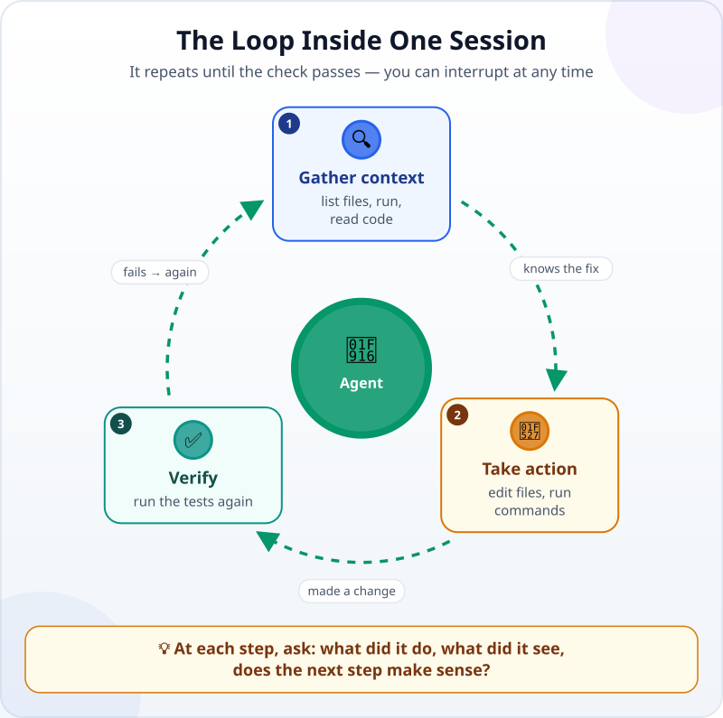
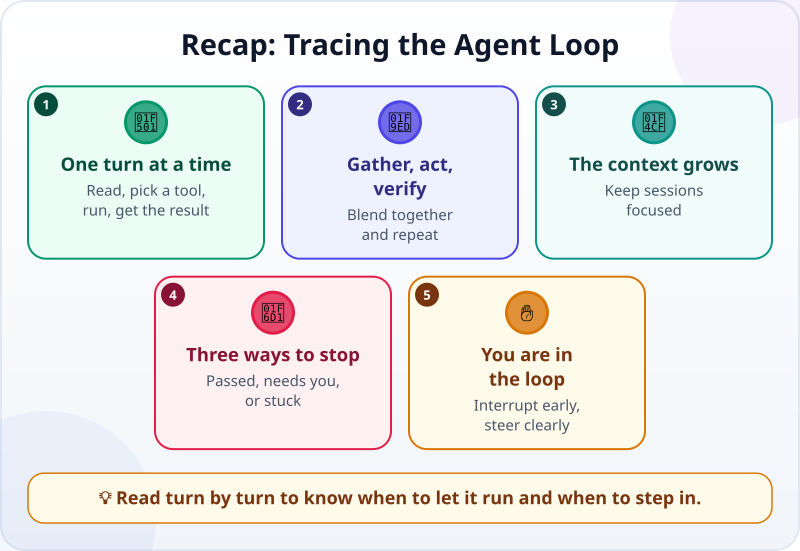

🌐 [Tiếng Việt](../../vi/lessons/the-agent-loop.md) · **English** · [日本語](../../ja/lessons/the-agent-loop.md)

# Trace an Agent Loop Through a Real Session

<!-- section: objective -->
## Lesson Objective

After this lesson, you will be able to:

- Name the three phases of the **agent loop** — gather context, take action, verify — in a real session.
- Read a session log with three questions for each step.
- Know when to stop or redirect an agent, and why you still check the final result yourself.

<!-- section: hook -->
## Why It Matters

Tuấn is a mechanical engineer working in Japan. He asks an agent to fix a bug in a small piece of code his team uses to add up expenses. A few seconds later, the agent reports: *"Fixed. All tests pass."* Above that, the screen shows a long list of commands and results, which Tuấn scrolls past without reading.

Should he trust "fixed"? That list is the session's log — and being able to read it is the skill that lets you supervise an agent, instead of just trusting its report.

<!-- section: concept -->
## Core Idea

### The three phases of a session

In [Brain, Tools and the Loop](agent-parts-and-loop.md), you learned that an agent repeats: think, use a tool, observe the result. The Claude Code documentation (September 2026) divides the work of a session into three phases that blend together:

1. **Gather context:** see which files there are, run things, read code.
2. **Take action:** edit files, create files, run commands that change something.
3. **Verify:** run the tests or a check again to see whether the change works.

If it does not pass yet, the loop goes around again. Each time the agent uses a tool, the result comes back into the conversation, as you saw in [Tool Calling](tool-calling.md), and the agent uses it to choose the next step.



### Three questions for each step

You do not need to understand all the code to read a session log. For each step, just ask:

1. **What did the agent just do?** — which tool, on what.
2. **What did it see?** — the result that came back.
3. **Does the next step make sense given what it just saw?**

If the answer to question 3 is "no" — the agent goes off to edit an unrelated file, or edits the test so that it passes instead of fixing the code — that is when you step in.

### You are in the loop too

According to the Claude Code documentation (September 2026), you can interrupt the agent at any time: press `Esc` to stop it at once, or type a correction and press Enter. The agent works on its own, but it still listens to you.

<!-- section: example -->
## Real Example

Below is a **real** session, run by Claude Code while this lesson was being written (September 2026), with only the display shortened. The folder `ai-practice` holds two files: `expenses.py`, with a function `total` that adds up a list of amounts, and `test_expenses.py`, with two tests. The goal given to the agent: *"Run the tests; if a test fails, find the cause and fix the code, not the tests. Run them again until they pass."*

**Step 1 — Gather context: look at the folder.**

```text
$ ls
expenses.py
test_expenses.py
```

The agent sees two files. Makes sense: the next step is to run the tests to find out what is wrong.

**Step 2 — Gather context: run the tests.**

```text
$ python -m pytest -q
E       assert 205000 == 250000
E        +  where 205000 = total([85000, 120000, 45000])
FAILED test_expenses.py::test_total - assert 205000 == 250000
1 failed, 1 passed
```

The agent sees: one test fails. The right total is 250,000, but the function returns 205,000 — exactly 85,000 + 120,000, so **the last amount**, 45,000, is missing. Makes sense: read the code to find out why.

**Step 3 — Gather context: read the code.**

```text
$ cat expenses.py
def total(amounts):
    """Return the sum of a list of amounts."""
    result = 0
    for i in range(len(amounts) - 1):
        result += amounts[i]
    return result
```

The agent sees: the loop runs over `range(len(amounts) - 1)` — it stops before the last item. That matches what it saw in step 2.

**Step 4 — Take action: change exactly one line.**

```text
-    for i in range(len(amounts) - 1):
+    for i in range(len(amounts)):
```

The agent fixes the code and does not touch the tests — as asked.

**Step 5 — Verify: run the tests again.**

```text
$ python -m pytest -q
2 passed
```

The check passes, the loop stops, and the agent reports.

**A detail worth noticing.** In step 2, the second test (`test_empty`: the total of an empty list is 0) **passed even while the code still had the bug**. One passing test, on its own, does not prove the code is right; it proves only what it checks. That is why it is worth having several different tests, as in [Turn "Looks Right" into Checks](testing-basics.md).

**Your part.** Reading the five steps above takes less than a minute. Tuấn also does two more things: he looks at the change (one line, in the right place) and runs the tests again on his own computer. Only then is "fixed" something he has checked, not just something he was told.

<!-- section: try-it -->
## Try It Yourself

About 5 minutes, in `ai-practice`, with an agent that is allowed to run commands on a personal computer. On a company computer, do this only if your company allows it; otherwise, read the session above and answer the three questions for each step yourself.

1. Ask the agent to create these two files exactly:

   ```python
   # expenses.py
   def total(amounts):
       """Return the sum of a list of amounts."""
       result = 0
       for i in range(len(amounts) - 1):
           result += amounts[i]
       return result
   ```

   ```python
   # test_expenses.py
   from expenses import total

   def test_total():
       assert total([85000, 120000, 45000]) == 250000

   def test_empty():
       assert total([]) == 0

   if __name__ == "__main__":
       test_total()
       test_empty()
       print("All tests passed")
   ```

2. Give it the goal: *"Run `python test_expenses.py`; if a test fails, find the cause and fix the code, not the tests. Run it again until it passes."* If the agent wants to install anything, that is ✋ ask first.
3. While the agent works, write one letter next to each step: **G** (gather context), **A** (take action) or **V** (verify).
4. Check it yourself: open `test_expenses.py` to see that it is unchanged, then run `python test_expenses.py` yourself — it must print `All tests passed`.

- *I can show…* the session log with G/A/V next to each step.
- *I checked…* the test file was not changed, and I ran the tests again myself and they passed.
- *I would not use this when…* for example: there are no tests yet — then the agent has nothing to verify against.

<!-- section: misconceptions -->
## Common Misconceptions

- **"The agent says the tests pass, so it is done."** — Look at what it changed: an agent can make a test pass by editing the test itself. And run it again yourself once.
- **"You have to know programming to read a session log."** — The three questions — what it did, what it saw, does the next step make sense — are enough to spot most suspicious steps.
- **"Once the agent is running, you cannot step in."** — You can stop or redirect it at any time; interrupting early beats fixing the damage late.

<!-- section: recap -->
## The Lesson in One Picture



<!-- section: takeaways -->
## Key Takeaways

- A session is a loop: gather context, take action, verify — until the check passes.
- Each tool's result comes back into the conversation and decides the next step.
- Read each step with three questions: what it did, what it saw, does the next step make sense.
- One passing test does not prove the code is right; it proves only what it checks.
- You can interrupt at any time, and you still check the final result yourself.

<!-- section: quiz -->
## Quick Check

**Question 1.** In the session above, which phase does "run the tests again after the fix" belong to?

- A) Gather context
- B) Verify
- C) Take action

**Question 2.** Reading the log, you see the agent editing `test_expenses.py` so that the test passes. What should you do?

- A) Stop the agent and remind it: fix the code, not the test
- B) Let it continue, since the test passes in the end
- C) Delete the whole folder and start again from scratch

**Question 3.** Why did `test_empty` pass even while the code still had the bug?

- A) Because pytest skipped that test
- B) Because the agent had already fixed it
- C) Because for an empty list, the wrong loop and the right one both give 0 — that test never reaches the bug

<details>
<summary>Show answers</summary>

1. **B** — running the check again to see whether the change works is verifying.
2. **A** — that step does not fit the goal; interrupt and redirect at once. Deleting the whole folder is too much.
3. **C** — a test proves only what it checks; you need tests that reach the places where things can go wrong.

</details>

<!-- section: sources -->
## Recommended Sources

- Anthropic — [How Claude Code works](https://code.claude.com/docs/en/how-claude-code-works) (English, as of September 2026): given a task, Claude works through three phases that blend together — gather context, take action, verify results — and repeats until the task is complete; each tool use returns information that feeds back into the loop and informs the next step; you can interrupt at any point, pressing `Esc` to stop or typing a correction.
