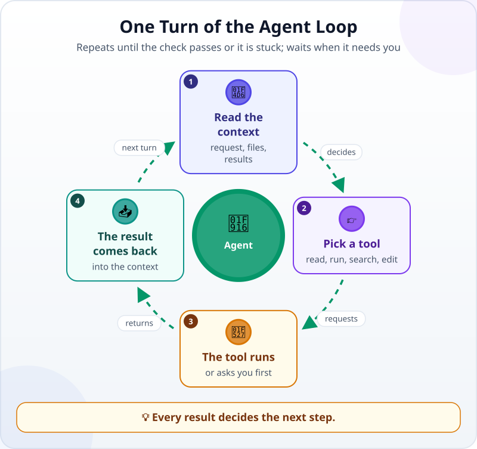

🌐 [Tiếng Việt](../../vi/lessons/the-agent-loop.md) · **English** · [日本語](../../ja/lessons/the-agent-loop.md)

# Trace an Agent Loop Through a Real Session

<!-- section: objective -->
## Lesson Objective

By the end of this lesson, you will be able to:

- Read a session **turn by turn**: the model reads the context → picks a tool → the tool runs → the result comes back into the context.
- Recognize the three ways a loop ends: the check passes, it needs your decision, or it is stuck.
- Know when to interrupt the agent and what to say to steer it.

<!-- section: hook -->
## Why It Matters

Mai already has her program `make_report.py` from the [office automation project](project-office-automation.md). In November, the report suddenly shows **two "District 1" rows** in the branch table, and each row's total is smaller than it should be.

She hands the fix to an agent. Two minutes later, nine steps have scrolled past on the screen: reading files, running commands, searching, editing, running again… It all goes by very fast. If one step went wrong, would Mai notice in time?

This lesson slows that very session down, one turn at a time.

<!-- section: concept -->
## Core Idea

### One turn of the loop

You already know an agent is made of [a brain, tools and a loop](agent-parts-and-loop.md), and that the model only [*asks* for a tool](tool-calling.md) while the software around it actually runs it. When you trace a real session, each **turn** that uses a tool has four steps:



1. **Read the context:** the model reads everything it has — your request, the files it has opened, the results of earlier turns.
2. **Pick a tool:** it decides the next step and asks for a tool — read a file, run a command, search, edit a file.
3. **The tool runs:** the agent's software runs that tool (or asks you first, if the action needs permission).
4. **The result comes back:** the result — file contents, an error message, a number — is added to the context.

Then the next turn starts, with a slightly longer context.

Not every turn uses a tool. When the model decides the work is done, or that it needs to ask you, it picks no tool and writes you a reply instead — like the last turn in the example below. That is when the loop stops.

### Three phases that blend together

The Claude Code documentation (September 2026) describes the agent's loop in three phases: **gather context**, **take action**, and **verify results**. They are not separate: fixing a bug may go through all three several times. Every tool result is new information for choosing the next step.

### The context grows with every turn

Each turn's result is added to the context. A long session that reads many large files gradually fills the [context window](context-window.md). When it is nearly full, the tool has to make room: as of September 2026, Claude Code clears older tool results first, then summarizes the conversation — and detailed instructions from early in the session can be lost. That is why a short, focused session usually does better than a long one full of corrections.

### When does the loop stop?

- **The check passes:** the agent runs the check you gave it, sees it pass, and reports.
- **It needs your decision:** something outside its permissions — deleting, installing, changing what you said not to change.
- **It is stuck:** the same command, the same error, over and over. The agent may notice and stop — or it may not. This is when you should interrupt.

### You are in the loop too

You can interrupt the agent at any moment to change direction, add information, or ask it to try another way. In Claude Code (September 2026), the **Esc** key stops the agent at once, keeps the context, and lets you type a new direction. Correcting early is usually faster than waiting for the agent to finish a wrong path.

<!-- section: example -->
## Real Example

Mai gives the task in her `ai-practice` folder, in the mode where the agent asks before editing files:

```text
The November report has two "District 1" rows in the branch table. Fix make_report.py so it groups them correctly.
Do not change the data files.
Done when:
1. The November branch table has exactly 2 rows, with totals matching the right answers I attached.
2. The check check_report.py still PASSES for September and October.
```

(`check_report.py` is the automatic check Mai made in the project: it compares a report with the table of right answers.)

Here is the session, turn by turn. Each turn shows which tool the agent chose and what came back.

**Turn 1 — gather context.** Tool: *list the folder*. Result: `make_report.py`, `check_report.py`, and three files `sales_september/october/november.csv`.

**Turn 2 — reproduce the bug.** Tool: *run a command* `python make_report.py sales_november.csv`. Result: the branch table has three rows — `District 1`, `Thu Duc`, and `District 1` again. The agent has now seen the bug Mai described with its own eyes.

**Turn 3 — read the code.** Tool: *read the file* `make_report.py`. Result: the program groups revenue by the exact text in the `branch` column, character by character.

**Turn 4 — find the cause.** Tool: *search* for `District 1` in `sales_november.csv`. Result: one row says `District 1 ` — with an extra space at the end. To a computer, that is a different branch.

**Turn 5 — asks, and is told no.** The agent wants to *edit* `sales_november.csv` to remove the space, so it asks Mai. Mai presses **deny** and types: *"Don't change the data files. Next month there may be a space again — fix the program so it strips extra spaces when it reads."* Mai's answer enters the context as a new result.

**Turn 6 — take action.** Tool: *edit* `make_report.py`: strip spaces at the start and end of the branch name before grouping. Mai approves. Result: one line changed.

**Turn 7 — verify.** Tool: *run a command* for the November report. Result: 2 branch rows, totals matching the right answers.

**Turn 8 — verify more.** Tool: *run a command* `python check_report.py` for September and October. Result: PASS for both. The fix did not break earlier months.

**Turn 9 — report.** *"Cause: one November row said 'District 1 ' with an extra space. I changed make_report.py to strip extra spaces. Checked: November has 2 branches, matching the right answers; September and October still PASS. Not checked: names written differently, like 'district 1' in lowercase."*

The loop stopped because the check passed. Mai does not stop there: she reads the diff — exactly one line changed — then adds up District 1's revenue in the November file with a calculator herself and compares it with the report. It matches. As for the "not checked" line, she writes it down to ask about next month.

Look at **turn 5**. If Mai had approved to save time, November's bug would also have gone away — but the original data file would have been changed, and in December the bug would be back. One answer from you in the middle of the loop can matter more than the other eight turns.

<!-- section: try-it -->
## Try It Yourself

About 5 minutes, nothing to install. Tuấn asked an agent to fix a unit-conversion program. Here is part of his session:

```text
Turn 4: run python convert_units.py      → Error: no module named 'pandas'
Turn 5: run pip install pandas           → Blocked: this company PC does not allow installs
Turn 6: run pip install pandas           → Blocked: this company PC does not allow installs
Turn 7: run pip install --user pandas    → Blocked: this company PC does not allow installs
```

Answer for yourself:

1. What state is the loop in: making progress, needing a decision, or stuck?
2. At which turn should Tuấn interrupt, and what should he say to the agent?

<details>
<summary>Suggested answers</summary>

1. **Stuck** — the same action, the same result, again and again. Worse, turn 7 is trying another way around the company PC's rules: that is a ⛔ never.
2. Interrupt right after **turn 5**, when the result shows the PC does not allow installs. For example: *"Stop, don't install anything on this PC. Rewrite the program using only Python's built-in libraries, then run it again."* If the task really needs that library, ask IT through the proper process.

</details>

<!-- section: misconceptions -->
## Common Misconceptions

- **"The agent works in one go from start to finish."** — It works turn by turn, and each turn builds on the last one's result. A wrong or missing result in one turn carries into the next ones.
- **"Interrupting the agent ruins its work."** — Interrupting keeps the context; you only add a new direction. Correcting early is cheaper than waiting for it to finish a wrong path.
- **"If the agent stopped, it is done."** — It can stop because the check passed, because it needs you, or because it ran out of ideas. Read the report to know which.

<!-- section: recap -->
## The Lesson in One Picture


<!-- section: takeaways -->
## Key Takeaways

- Each turn: read the context → pick a tool → the tool runs → the result comes back into the context.
- Gathering context, taking action and verifying blend together and can repeat many times.
- The context grows with every turn; short, focused sessions usually do better.
- The loop stops when the check passes, when it needs your decision, or when it is stuck.
- You are in the loop: interrupt early, give a clear new direction, and still check the final result yourself.

<!-- section: quiz -->
## Quick Check

**Question 1.** After a tool finishes running, where does its result go?

- A) It is shown to you and then disappears
- B) Into the context, where the model reads it to choose the next step
- C) Into a file the model never reads

**Question 2.** The agent runs the same command and hits the same error for the third time. What should you do?

- A) Wait longer; it will get through somehow
- B) Allow it to do anything so it can find its own way
- C) Interrupt, then give more information or point it in another direction

**Question 3.** In Mai's session, why did the agent run the check again for September and October?

- A) To make sure the November fix did not break earlier months
- B) Because an agent always has to run everything three times
- C) To make the context longer

<details>
<summary>Show answers</summary>

1. **B** — a tool result is new information in the context; the next turn builds on it.
2. **C** — the same error again and again is a sign of being stuck; one steering sentence from you is faster than waiting.
3. **A** — fixing one place can break another; running the old checks again is how you know for sure.

</details>

<!-- section: sources -->
## Recommended Sources

- Anthropic — [How Claude Code works](https://code.claude.com/docs/en/how-claude-code-works) (English, as of September 2026): the loop gathers context, takes action and verifies results, and the phases blend together; every tool use feeds information back for the next step; you can interrupt at any point to steer; as the context nears its limit, older tool outputs are cleared first and then the conversation is summarized.
- Anthropic — [Best practices for Claude Code](https://code.claude.com/docs/en/best-practices) (English, as of September 2026): course-correct early and often; Esc stops Claude and keeps the context; if you have corrected the same issue more than twice in one session, start a fresh session with a clearer prompt.
