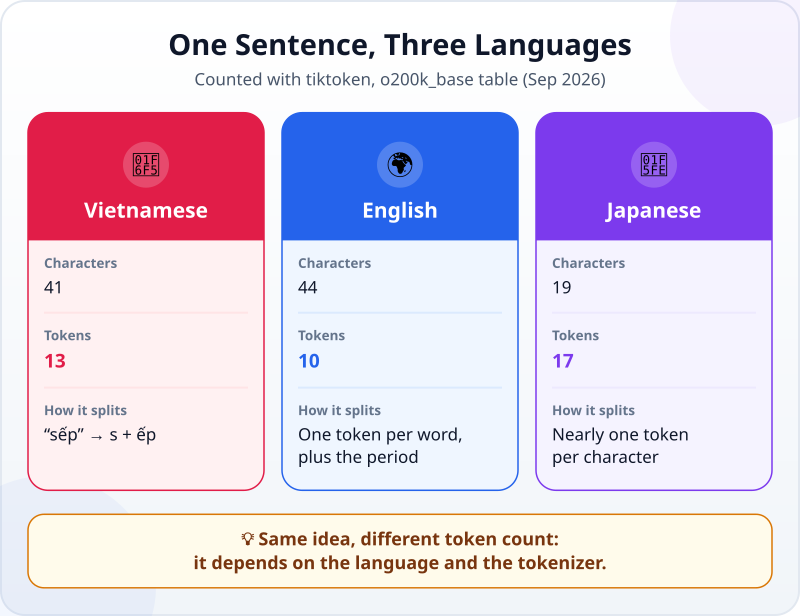
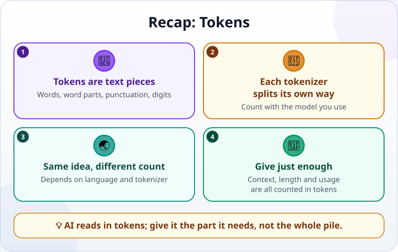

🌐 [Tiếng Việt](../../vi/lessons/tokens.md) · **English** · [日本語](../../ja/lessons/tokens.md)

# Tokens: How AI Reads Text in Pieces

<!-- section: objective -->
## Lesson Objective

After this lesson, you will be able to:

- Explain what a **token** is, and why it is not the same as a word or a letter.
- Watch a sentence being cut into tokens, and see the count change with the language and the tokenizer.
- Name what is counted in tokens, so you give the AI just enough instead of a whole pile of documents.

<!-- section: hook -->
## Why It Matters

Tuấn is a mechanical engineer in Japan. Every day he writes to his family in Vietnamese, to his colleagues in Japanese, and his reports in English. Reading the documentation of the AI tool his company allows, he sees every limit written in a strange unit: **tokens**. Not pages, not words.

How much text is one token? Does the same idea cost the same in three languages? This lesson lets you see for yourself.

<!-- section: concept -->
## Core Idea

### A token is a piece of text the model reads and writes

In [Next-Token Prediction](next-token-prediction.md), you saw that an LLM writes its answer one token at a time. Before a model can read your sentence, a program called a **tokenizer** cuts it into pieces and turns each piece into a number. The model works only with that sequence of numbers.

A token can be a whole word, part of a word, a punctuation mark, a digit, even a fragment of one character. A tokenizer has a fixed "set of pieces": strings that appear often in its data get a piece of their own; rare strings get cut into smaller ones.

### Each tokenizer cuts its own way

There is no single way of cutting that every AI shares. Each model family usually has its own tokenizer, and the tokenizer can change between model generations. Anthropic's documentation (as of September 2026) says that Claude models from version 4.7 use a newer tokenizer, and the same text gives about 30% more tokens than on earlier models. So a token count is only right for the tokenizer that produced it.

### What is counted in tokens

- **The [context window](context-window.md):** how much text the model can see at once — messages, files, command output — is measured in tokens.
- **Answer length:** tools usually set a limit on the number of tokens in each answer.
- **Usage:** many plans and APIs set limits or costs by the number of tokens going in and coming out.

You never need to count tokens by hand. But knowing the unit explains why a long document gets rejected as "too long", or why a session fills up faster than you expected.

<!-- section: analogy -->
## Simple Analogy

Imagine a stamp shop with a box of rubber stamps. Common words such as *"thanks"* or *"sales"* have a stamp of their own: one press and done. An unusual name or a rare word has no stamp, so it is put together from several small stamps. Another shop has a different box, so the same sentence can need a different number of presses.

Where the analogy breaks: a stamp usually prints a whole word, while a token need not mean anything. A word can be cut in the middle, like *"sếp"* in the example below. And the box does not change with each sentence you write: it comes ready-made with the model.

<!-- section: example -->
## Real Example

Tuấn tries one sentence in three languages. He cuts it with **tiktoken**, OpenAI's open-source tokenizer (its JavaScript version), using the `o200k_base` table, in September 2026. Each pair of square brackets is one token; a space usually sticks to the front of the token after it.

```text
Vietnamese: [Mai][ gửi][ báo][ cáo][ bán][ hàng][ tháng][ ][6][ cho][ s][ếp][.]
English:    [Mai][ sends][ the][ June][ sales][ report][ to][ her][ boss][.]
Japanese:   [マ][イ][は][6][月][の][売][上][報][告][を][上][司][に][送][ります][。]
```



Tuấn draws three conclusions:

1. **A token is not a word.** *"sếp"* (boss) is cut in two: `[ s]` and `[ếp]`. The digit `6` and the space before it are two separate tokens.
2. **Same idea, different count.** The English sentence needs 10 tokens, the Vietnamese 13, the Japanese 17 — even though the Japanese sentence has only 19 characters. In this table, nearly every kanji is a token of its own.
3. **Change the tokenizer, change the count.** The same Vietnamese sentence, cut with the older `cl100k_base` table of the same library, gives **22** tokens instead of 13: many syllables with diacritics are cut into bits, like `[ g][ử][i]`.

Tuấn's conclusion: the numbers matter less than the habit. When he asks AI about a long document, he gives it only the relevant part, because the extra text also takes room in the context window — whatever language it is in.

<!-- section: try-it -->
## Try It Yourself

About 3 minutes, nothing to install. With the same `o200k_base` table as above, **guess the order from fewest tokens to most**:

- A) `Cảm ơn anh nhiều.`
- B) `Thanks a lot.`
- C) `ありがとうございます。`
- D) `27/09/2026`

Write your answer down first, then open the results.

<details>
<summary>See the results</summary>

- **C) 2 tokens:** `[ありがとうございます][。]` — the whole familiar "thank you" is one piece.
- **B) 4 tokens:** `[Thanks][ a][ lot][.]`
- **D) 6 tokens:** `[27][/][09][/][202][6]` — a date is not one token.
- **A) 7 tokens:** `[C][ảm][ ][ơn][ anh][ nhiều][.]`

If you guessed that the Japanese would cost the most, it was probably because of the sentence above: there, Japanese took the most tokens. But a common phrase becomes a single piece, however long it is.

</details>

<!-- section: misconceptions -->
## Common Misconceptions

- **"One token is one word."** — Sometimes it is a word, sometimes part of a word, a punctuation mark or a digit.
- **"A count from one tool is right for every AI."** — Each tokenizer cuts its own way, and the tokenizer can change between model generations. For an exact number, count with the token counter for the model you actually use.
- **"Vietnamese always costs twice as much as English."** — It depends on the tokenizer: in the example above, the same Vietnamese sentence gives 13 tokens with one table and 22 with the other. Do not memorize a fixed ratio.

<!-- section: recap -->
## The Lesson in One Picture



<!-- section: takeaways -->
## Key Takeaways

- A token is a piece of text the model reads and writes: a word, part of a word, punctuation or a digit.
- A tokenizer cuts text into pieces; each model family usually has its own.
- The same idea takes a different number of tokens depending on the language and the tokenizer.
- The context window, answer length and usage are all counted in tokens — give the AI just enough.

<!-- section: quiz -->
## Quick Check

**Question 1.** What is a token?

- A) Always one whole word
- B) Always one letter
- C) A piece of text cut by a tokenizer: a word, part of a word or punctuation

**Question 2.** The same Vietnamese sentence gives 13 tokens with one table and 22 with another. Why?

- A) Because the two tokenizers have different sets of pieces
- B) Because one of the two counts has a bug
- C) Because the Vietnamese sentence is translated into English before counting

**Question 3.** Tuấn wants AI to answer a question about one section of a 200-page technical manual. What is the most sensible approach?

- A) Paste all 200 pages, because more information is always better
- B) Give only the relevant section, because everything pasted in takes tokens in the context window
- C) Translate the manual into English to be sure it uses fewer tokens

<details>
<summary>Show answers</summary>

1. **C** — a token can be a word, part of a word, punctuation or a digit, depending on the tokenizer.
2. **A** — each tokenizer has its own set of pieces, so the same sentence can give different counts.
3. **B** — extra text takes room too; and translating into English does not guarantee fewer tokens and can easily change the content.

</details>

<!-- section: sources -->
## Recommended Sources

- Anthropic — [Glossary](https://platform.claude.com/docs/en/about-claude/glossary) (English), *Tokens* entry: a token can be a word, part of a word, a character or a byte; for Claude, a token is roughly 3.5 English characters on average, and the number varies by language.
- Anthropic — [Token counting](https://platform.claude.com/docs/en/build-with-claude/token-counting) (English, as of September 2026): count tokens before sending; from Claude 4.7, a newer tokenizer gives about 30% more tokens for the same text, so recount against the model you plan to use.
- OpenAI — [tiktoken](https://github.com/openai/tiktoken) (English): an open-source tokenizer; models do not see text but a sequence of numbers called tokens, and on average each token corresponds to about 4 bytes. Every count in this lesson was made with its JavaScript version `js-tiktoken` 1.0.21, tables `o200k_base` and `cl100k_base`, in September 2026.
