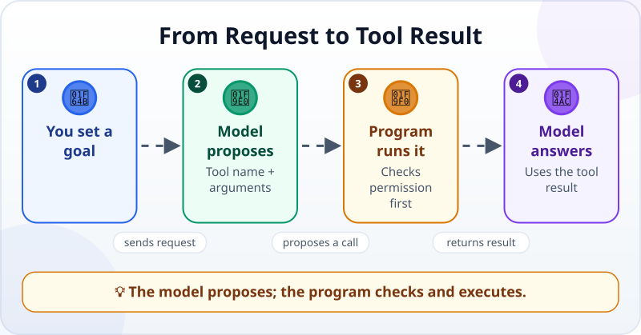
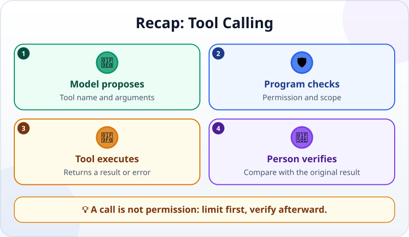

🌐 [Tiếng Việt](../../vi/lessons/tool-calling.md) · **English** · [日本語](../../ja/lessons/tool-calling.md)

# Tool Calling: How an LLM Presses Real Buttons

<!-- section: objective -->
## Lesson Objective

By the end of this lesson, you will be able to:

- Separate a model's tool request from the program that actually runs it.
- Read one tool call as a name, arguments, and result.
- Identify where permissions, inputs, and results need checking.

<!-- section: hook -->
## Why It Matters

Hana asks a chatbot, *“What time does the meeting in `ai-practice/meeting.txt` start?”* If the model only receives her question, it cannot know what the file says. It has no hand that can press an Open button.

It needs a **tool** that reads files. But the model does not run that tool directly: it proposes a call, and the surrounding program decides whether to run it.

<!-- section: concept -->
## Core Idea

**Tool calling** (also called **function calling**) lets a model return a structured request. The request states:

- **Tool name:** the capability to use, such as `read_file`.
- **Arguments:** the input the tool needs, such as `ai-practice/meeting.txt`.



The flow has four clear roles:

1. The **user** gives a goal.
2. The **model** chooses a tool and creates a structured call.
3. The **surrounding program** checks permission, runs the tool, and receives a result.
4. The **model** sees that result in the conversation and writes an answer.

This is not a magic phrase. The name and arguments must match tools supplied by the program. Without a file-reading tool, the model cannot invent permission to read a file. A wrong path produces an error; that error becomes information the model can use to correct its request or ask the user.

### Three control points

- **Before execution:** the program can block dangerous tools or ask for approval. A made-up file inside `ai-practice` may be ✅ safe; deleting, sending, or acting outside the folder is ✋ ask first; passwords, API keys, and real company data are ⛔ never provide.
- **During execution:** the tool receives only allowed arguments. One exact path is safer than access everywhere.
- **After execution:** a tool result is new data, not a guaranteed conclusion. The model may misunderstand it, so the user checks the answer against the original result.

A tool call is the **action** in the [agent loop](agent-parts-and-loop.md): choose an action → run it → observe the result → decide again. A simple question may need one call; a longer task may repeat the loop.

<!-- section: example -->
## Real Example

Here is one exchange with made-up data. `ai-practice/meeting.txt` contains:

```text
Project team meeting: Thursday at 2:30 p.m.
Room: Maple B
```

**Step 1 — Hana asks**

> What time does the meeting in `ai-practice/meeting.txt` start? Read only that file.

**Step 2 — the model proposes a tool call**

```json
{"tool": "read_file", "arguments": {"path": "ai-practice/meeting.txt"}}
```

This is a structured proposal, not the file content. The model selected `read_file`; the `path` argument limits the request to Hana's file.

**Step 3 — the program checks and runs it**

The program sees that the path is inside `ai-practice`, allows the read, and runs the tool. The tool returns:

```text
Project team meeting: Thursday at 2:30 p.m.
Room: Maple B
```

**Step 4 — the result returns to the model**

The model no longer needs to guess. It answers, *“The meeting starts Thursday at 2:30 p.m.”* Hana compares this with the source line.

If the model sends `ai-practice/meting.txt`, the tool returns *“file not found.”* That error is useful: the model can check the filename and try again. It should not invent content to fill the gap.

If Hana asks it to email the meeting time, that is a different action. The program should stop so Hana can review the recipient and message and approve sending. A model's proposal is not permission.

<!-- section: recap -->
## The Lesson in One Picture



<!-- section: takeaways -->
## Key Takeaways

- A model proposes a call with a tool name and arguments; the surrounding program runs it.
- The tool result returns to the conversation so the model can answer or decide again.
- A tool can only do what the program supplies and its permissions allow.
- Check before execution, limit arguments, and compare the answer with the result.
- A tool call is one action-and-observation turn in the agent loop.

<!-- section: quiz -->
## Quick Check

**Question 1.** Who actually executes a `read_file` request?

- A) The model opens the disk without a program
- B) The person who wrote the file
- C) The surrounding program, after checking the call and permission

**Question 2.** What is the argument in the example call?

- A) The path `ai-practice/meeting.txt`
- B) The tool name `read_file`
- C) The final answer to Hana

**Question 3.** The model proposes an email-sending tool. What should happen?

- A) Always send immediately because the model chose the tool
- B) Stop so the user can review and approve it first
- C) Read a file instead and treat it as sent

<details>
<summary>Show answers</summary>

1. **C** — the model makes the request; the program checks and executes the tool.
2. **A** — `read_file` is the tool name, while the path is its input.
3. **B** — sending outside is an action that needs user review and approval.

</details>
