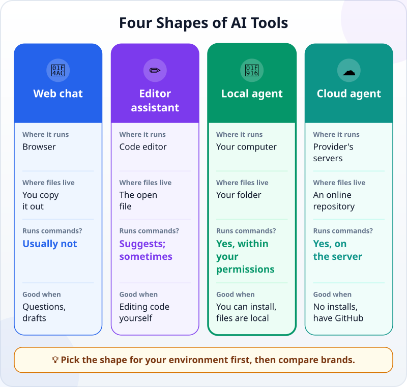
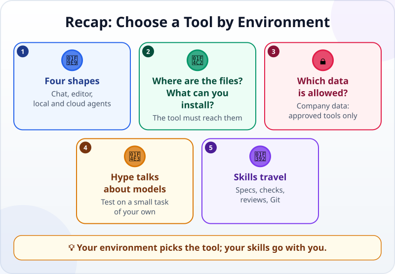

🌐 [Tiếng Việt](../../vi/lessons/tool-landscape.md) · **English** · [日本語](../../ja/lessons/tool-landscape.md)

# Choose a Tool by Environment, Not Hype

<!-- section: objective -->
## Lesson Objective

By the end of this lesson, you will be able to:

- Recognize the four **shapes** of AI tools for building software: web chat, an assistant in the code editor, a local agent, a cloud agent.
- Use four questions about your environment to choose the shape that fits you.
- Know what travels with you when you change tools: clear specs, checks, reviews, Git.

<!-- section: hook -->
## Why It Matters

Tuấn opens social media in the morning: *"Tool X just launched and leaves everyone behind!"* Last week it was tool Y. Last month, Z. One of his colleagues switches tools almost every month, and each time spends a few sessions getting used to the new one.

Tuấn wonders: am I using the wrong tool? Should I switch too?

The answer depends less on the rankings than you might think. It depends on **where you work**.

<!-- section: concept -->
## Core Idea

### The four shapes of tools

Do not start with the vendor's name. Start with the shape: where the tool runs, where the files live, and how much it can do on its own.

- **💬 Web chat:** you ask, it answers; usually you copy the code out and run it on your own computer. This is a [chatbot, not yet an agent](chatbot-to-agent.md).
- **✏️ An assistant in the code editor:** suggestions right in the file you are editing; many also have an agent mode.
- **🤖 A local agent:** runs on your computer — in the terminal or an app — reads the folder, edits files, runs commands. This is the main route of the course.
- **☁️ A cloud agent:** runs on the provider's servers and works on an online repository; you look at and approve the results.

One vendor often offers several shapes. For example, as of September 2026: Claude Code can be used in the terminal, a desktop app, code editors, the browser and even Slack, with the same agent loop; Google Antigravity comes as a desktop app and as a command-line tool. So the right question is not *"which vendor?"* but *"which shape, for which environment?"*.

### Four questions about your environment

1. **Where are the files?** On your computer, in a GitHub repository, or in a company system? The tool has to reach the files.
2. **What can you install and run?** A personal computer is more flexible; a company computer often blocks installs. If you cannot install anything, only the browser or tools the company has already installed are left.
3. **Which data may go in?** Made-up data can go anywhere. Company data goes only into tools the company has approved — the [never list](data-safety-and-permissions.md) does not change, however powerful a tool is.
4. **How far does it need to act?** Only suggestions and explanations? Chat is enough. It needs to run commands and check its own work? You need an agent — with clear permissions.

After these four questions, the list is usually down to one or two shapes. Only then compare tools of the same shape.

### What the hype says, and what your environment says

Hype is usually about the **model**: scores, speed, benchmark tests. Your daily work depends on the **environment**: can the tool get onto your computer, can it read your files, is it allowed to see that data. A tool at the top of the rankings that cannot run on the company computer is, for Tuấn, a tool he cannot use.

If you still want to try a new tool, try it the way you did in [Choosing a Model](choosing-models.md): the same small task of your own, a criterion written first, made-up data, in `ai-practice`. Your own result is more trustworthy than a post.

### What travels with you

Tools change every month. What you learn in this course does not:

- [Writing good specs](writing-good-specs.md) with a definition of done.
- A check the agent can run itself.
- [Reading diffs](reviewing-agent-changes.md) and keeping history with [Git](git-version-control.md).

Even instruction files for agents are becoming shareable: as of September 2026, Claude Code reads its own `CLAUDE.md` file and can also read `AGENTS.md`, the file other agents use. So changing tools usually costs a few sessions of learning a new interface, not starting over.

<!-- section: analogy -->
## Simple Analogy

Choosing how to get to work. The ads say the new car is the fastest and smoothest. But if you live in the city center, your office has no parking and the roads are jammed every morning, an old bicycle may still be the right choice. You choose by **the road you travel**, not by a speed ranking. And whatever you ride, traffic rules, checking your mirrors and keeping your distance are still up to you.

Where the comparison breaks down: people change vehicles every few years, while AI tools change every month. And a vehicle does not read your papers — an AI tool can see all the data you give it. That is why the question "which data may go in?" matters more than any spec sheet.

<!-- section: example -->
## Real Example

Tuấn answers the four questions for **both** of his environments.

**At work:**

1. Files: drawings and spreadsheets on the company computer and the internal network drive.
2. Installing: the computer is locked; nothing can be installed.
3. Data: company data may only go into tools the company has approved. The company has approved one AI chat tool that runs in the browser.
4. How far it needs to act: explaining Excel formulas, drafting technical emails — suggestions are enough.

→ At work, Tuấn uses **exactly the approved chat tool**, for exactly the tasks allowed. Tool X from social media fails questions 2 and 3, so however powerful it is, it is not an option here.

**At home:**

1. Files: the `ai-practice` folder on his personal laptop.
2. Installing: allowed.
3. Data: made-up data only.
4. How far it needs to act: run his unit-conversion program and run the check by itself — it needs an agent.

→ At home, Tuấn learns with **a local agent**. Wants to try tool X? He gives it the same small task he did last week, with the criteria already written, and compares the results. It takes thirty minutes, not a month.

Tuấn no longer has to chase every post. He knows which question rules a tool out of his list — and that his skills stay the same whichever tool he uses.

<!-- section: misconceptions -->
## Common Misconceptions

- **"The newest, highest-scoring tool is always best for me."** — Scores describe a model on a standard test. A tool that cannot get onto your computer, or is not allowed to see your data, is of no use to you.
- **"Changing tools means learning everything again."** — The interface changes; clear specs, checks, reviews and Git travel with you.
- **"You choose once and you are done."** — Environments change: the company approves a new tool, you get a new computer, the work grows. Ask the four questions again whenever your environment changes.

<!-- section: recap -->
## The Lesson in One Picture

<!-- section: takeaways -->
## Key Takeaways

- Four shapes: web chat, an editor assistant, a local agent, a cloud agent; one vendor often has several.
- Four questions: where the files are, what you can install, which data is allowed, how far it needs to act.
- Hype talks about models; daily work depends on the environment.
- Test a new tool on a small task of your own, with criteria written first and made-up data.
- Skills that travel: clear specs, checks, reviews, Git.

<!-- section: quiz -->
## Quick Check

**Question 1.** Tuấn's company computer cannot install anything, and company data may only go into approved tools. Tool X, which everyone is praising, needs to be installed. What should Tuấn do at work?

- A) Install tool X to try it, because it is more powerful
- B) Use the tool the company approved; to use X, request it through the proper process
- C) Move company data to his home computer to use X

**Question 2.** Which question should you ask **before** comparing tools' scores?

- A) Where your files are, and whether the tool can reach them
- B) Which tool has the most followers
- C) Which tool has the nicer logo

**Question 3.** When you switch to another agent tool, what **still works** unchanged?

- A) The old tool's keyboard shortcuts
- B) The names of the buttons in the interface
- C) Writing requests with criteria, checks, and reading diffs

Show answers

1. **B** — questions 2 and 3 already rule tool X out at work; getting around the rules or taking data out is on the never list.
2. **A** — if a tool cannot reach your files, a high score does not help.
3. **C** — interfaces change from tool to tool; the skills of working with an agent travel with you.

<!-- section: sources -->
## Recommended Sources

- Anthropic — [How Claude Code works](https://code.claude.com/docs/en/how-claude-code-works) (English, as of September 2026): the same agent loop in the terminal, the desktop app, code editors, the browser, Slack and CI/CD; runs locally, in the cloud or by remote control; Claude reads `CLAUDE.md` and can also read the `AGENTS.md` written for other agents.
- Google Cloud — [What is agentic coding?](https://cloud.google.com/discover/what-is-agentic-coding) (English, updated September 2026): Google Antigravity comes as a desktop app and a command-line tool; organizations should limit what agents can access and have people review an agent's code before it goes into the main project.
