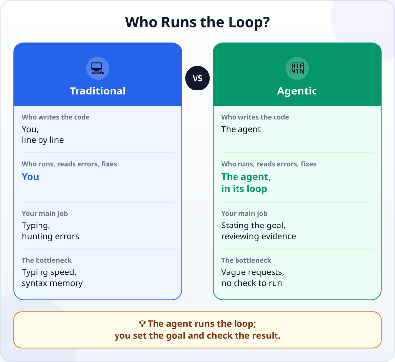
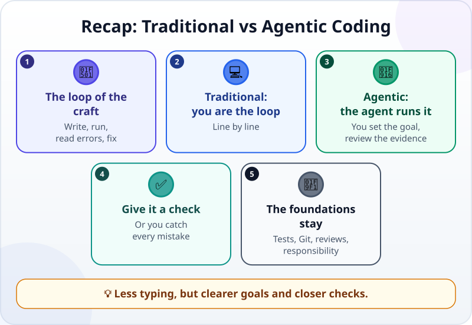

🌐 [Tiếng Việt](../../vi/lessons/traditional-vs-agentic.md) · **English** · [日本語](../../ja/lessons/traditional-vs-agentic.md)

# Traditional Coding vs Agentic Coding

<!-- section: objective -->
## Lesson Objective

After this lesson, you will be able to:

- Describe the loop of **write → run → read errors → fix**, and who runs it in traditional coding and in **agentic coding**.
- Explain why a check the agent can run by itself is the most important thing you give it.
- Name what does not change: the result must be right, tests, Git, reviewing changes and your responsibility.

<!-- section: hook -->
## Why It Matters

Mai is an accountant. She has 12 made-up sales files, one per month, and wants to combine them into one table for the year. Two years ago she tried teaching herself Python to do this kind of job: it took two weekends, and most of that time went on reading error messages and searching online for what they meant.

This week, she gives exactly that job to an agent. Half an hour later, the table is done and checked. She did not type a single line of code — but she was not idle either. So what has changed, and what is still the same?

<!-- section: concept -->
## Core Idea

### The programmer's loop

Writing software has never been write-once-and-done. Programmers repeat one loop again and again: **write** some code → **run** it → **read** the result or the error message → **fix** → run again. A small program can go around this loop dozens of times.

### Traditional: you are the loop

In traditional coding, you do every step of that loop: type each line, run it yourself, read the errors yourself, find the fix yourself. Your speed depends on how fast you type, how much syntax you remember and how well you understand error messages — which is why Mai needed two weekends.

### Agentic: the agent runs the loop

In agentic coding, the [agent](agent-parts-and-loop.md) runs that loop itself: it reads files, writes code, runs commands, reads the errors and fixes them, then runs again. The Claude Code documentation (September 2026) describes the change this way: instead of writing code yourself and asking the AI to review it, you describe what you want and the agent works out how to build it.



Your work moves to the two ends of the loop:

- **The input:** state the goal, the context and the boundaries clearly — as you practised in [Writing Good Specs](writing-good-specs.md).
- **The output:** review the evidence and the changes, then decide whether to accept them — as in [Reading and Reviewing an Agent's Changes](reviewing-agent-changes.md).

### The most important thing you give an agent: a check

An agent stops when the work *looks* done. The Claude Code documentation says it plainly: without a check the agent can run by itself, "looks done" is the only signal available, and **you become the verification loop** — every mistake waits for you to notice it. With a check that gives *pass / fail* — a [test](testing-basics.md), a number that must match — the agent does the work, runs the check, reads the result and fixes until it passes.

So the bottleneck has moved. It is no longer "how fast can you type", but "how clear is the request" and "how can the result be checked".

### What does not change

- **The result must still be right.** Code that runs does not necessarily do the right job.
- **Tests, [Git](git-version-control.md) and reviewing changes** are still the foundations; the agent works faster, so they matter even more.
- **The responsibility is still yours**, as in [You Are the Lead, Not the Typist](lead-not-typist.md).

<!-- section: analogy -->
## Simple Analogy

Washing by hand and washing by machine. By hand, you do every step yourself: soak, scrub, rinse, wring, look to see if it is clean, then scrub again. With a machine, you choose a programme, load the clothes, and the machine runs the wash – rinse – spin loop by itself. Your job becomes choosing the right programme, not putting in the wrong clothes, and checking the clothes when the machine finishes.

Where the comparison breaks down: a washing machine runs one fixed programme. An agent decides each step itself, can do something you did not expect, and can say "done" when the work is not. That is why you need clear boundaries and evidence, not just a button.

<!-- section: example -->
## Real Example

Mai's task: combine 12 files `month_01.csv` … `month_12.csv` (made-up data, columns `date, product, revenue`) into `year.csv`, with one total line per month.

**The traditional way — her attempt two years ago.** Mai taught herself how to read files in Python, wrote a loop and ran it. The first error was a message about the encoding of accented characters in the file — she spent an afternoon finding out what it meant. Once that was fixed, the program ran, but January's total was far too large: it turned out each file's header row had been mixed into the data. Every write – run – read – fix round was hers.

**The agentic way — this week.** Mai writes a request, and the most important part is the check:

```text
Combine the 12 files month_01.csv ... month_12.csv into year.csv, one line per month with the total revenue.
Do not change the original files. The data is made up.
Done when:
1. year.csv has exactly 12 month lines and one Grand total line.
2. Grand total equals the sum of the revenue column in all 12 files, calculated separately in a different way.
Run that check and show me the result.
```

The agent writes the code, runs it, hits the very same encoding error Mai once hit, fixes it itself, runs again, then runs the check and shows Mai: 12 month lines, and the two totals match. Mai does not stop there: she opens `month_03.csv`, adds up the revenue column herself and compares it with the March line. It matches. Her half hour went on writing the request and checking — not on finding out what an error message meant.

<!-- section: misconceptions -->
## Common Misconceptions

- **"Agentic coding means you need to know nothing about software."** — You still need enough understanding to state the goal clearly, read the evidence and notice a wrong result. That is why this course teaches files, tests and Git.
- **"If the agent ran the code without errors, the code is right."** — Running is not the same as doing the right job. Mai's January total was once wrong, and the program showed no error at all.
- **"Traditional coding is out of date."** — It is still useful for learning, for quickly fixing one word in a file you have open, and for understanding what the agent is doing. Agentic coding is built on it, not a replacement for it.

<!-- section: recap -->
## The Lesson in One Picture



<!-- section: takeaways -->
## Key Takeaways

- Building software means repeating the loop write → run → read errors → fix.
- Traditional coding: you run that loop, line by line.
- Agentic coding: the agent runs that loop; you state the goal clearly and review the evidence.
- Give the agent a check; without one, "looks done" is the only signal and you have to catch every mistake yourself.
- The foundations do not change: a right result, tests, Git, reviewing changes and your responsibility.

<!-- section: quiz -->
## Quick Check

**Question 1.** What is the core difference between traditional coding and agentic coding?

- A) Agentic coding uses a different programming language
- B) In agentic coding, the agent runs the write – run – fix loop; you set the goal and check
- C) Agentic coding no longer needs the result to be checked

**Question 2.** Mai gives a task to an agent but provides no way to check it. What is most likely to happen?

- A) The agent stops when the work looks done, and every mistake waits for Mai to find it
- B) The agent refuses to do the task
- C) The result is certainly right, because the agent ran the code

**Question 3.** When you move to agentic coding, what stays the same?

- A) You have to type every line of code yourself
- B) Only people who studied programming for years can build software
- C) You are still responsible for the result, and tests, Git and reviewing changes are still needed

<details>
<summary>Show answers</summary>

1. **B** — the languages and the need for a right result do not change; what changes is who runs the loop.
2. **A** — without a check, "looks done" is the agent's only signal, and Mai becomes the one who catches mistakes.
3. **C** — the agent types for you, but the foundations and the responsibility are still there.

</details>

<!-- section: sources -->
## Recommended Sources

- Anthropic — [Best practices for Claude Code](https://code.claude.com/docs/en/best-practices) (English, as of September 2026): instead of writing code yourself and asking Claude to review it, you describe what you want and Claude figures out how to build it; without a check it can run, "looks done" is the only signal and you become the verification loop; with a check, Claude does the work, runs the check, reads the result and iterates until it passes.
- Anthropic — [Claude Code overview](https://code.claude.com/docs/en/overview) (English, as of September 2026): Claude Code is an agentic coding tool that reads your codebase, edits files and runs commands.
