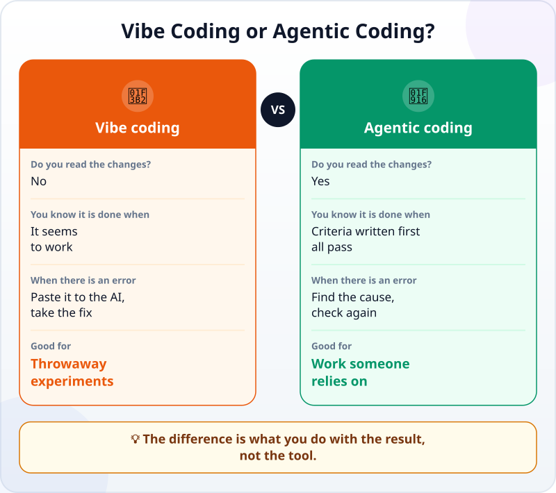

🌐 [Tiếng Việt](../../vi/lessons/vibe-vs-agentic.md) · **English** · [日本語](../../ja/lessons/vibe-vs-agentic.md)

# Vibe Coding vs Agentic Coding: What Is the Difference?

<!-- section: objective -->
## Lesson Objective

After this lesson, you will be able to:

- Tell **vibe coding** and **agentic coding** apart by what you do with the result, not by the tool.
- Know when vibe coding is enough, and use one question to decide when to switch to agentic coding.
- Turn a vibe-style request into an agentic one in three steps: what done means, a check, a review.

<!-- section: hook -->
## Why It Matters

Huy is a second-year student. On Friday evening, he builds a quiz scoreboard page for his club just by typing wishes to an AI: *"add a button to add points"*, *"make the colours nicer"*, *"add team names"*. Each time the AI replies, he opens the page, sees it working, and types the next request. He does not read a single line of code. An hour later it is done, and it looks great.

On Sunday, the club uses the page to keep score for real. Halfway through the game, the person holding the laptop accidentally reloads the page — and every score disappears. Nobody remembers what the scores were. Huy used no tool wrongly; he just used a way of working that suits a trial run for something people relied on.

<!-- section: concept -->
## Core Idea

### What is vibe coding?

According to Google Cloud, the term **vibe coding** was coined by AI researcher Andrej Karpathy in early 2025. In its "pure" form, you fully trust what the AI gives back — as Karpathy put it, almost "forgetting that the code even exists". The usual pattern: describe what you want, take the code, and if it seems to run, keep going; when there is an error, paste it to the AI and take the fix, still without reading.

### How is agentic coding different?

Agentic coding also hands the code writing to an AI, as you saw in [Traditional Coding vs Agentic Coding](traditional-vs-agentic.md). The difference is what you do around it: state the goal and the boundaries clearly, give a check, review the changes and the evidence, and take responsibility for the result. Google Cloud calls this responsible AI-assisted development: the user guides the AI, but then reviews, tests and understands the code it produces.



Note: **the same tool** can be used either way. Using an agent does not make your work agentic coding by itself; skip the checks and it is still vibe coding.

### When is vibe coding enough?

Vibe coding is not bad. Karpathy said it suits "throwaway weekend projects" — when speed matters most. In this course, that means:

- working in the `ai-practice` folder, with made-up data;
- nobody else relies on the result;
- you would not mind deleting it.

For example: trying out how a game idea looks, or trying a style for a draft personal page.

### One question to decide

Before you use the result, ask: **"If this is wrong, who is affected?"** If the answer is "nobody, I am just trying things out", vibe coding is fine. If it is another person, real figures, money, or a club event — switch to agentic.

### Three steps from vibe to agentic

1. **Write down what done means** — as in [Writing Good Specs](writing-good-specs.md).
2. **Add a check** that the agent can run and you can repeat yourself — as in [Turn "Looks Right" into Checks](testing-basics.md).
3. **Review the changes and the evidence** before you use it — not just the screen.

<!-- section: analogy -->
## Simple Analogy

Cooking a test dish for yourself versus cooking for a wedding. When you try a new dish for yourself, you season by feel; if it is bad, never mind, you try again tomorrow. When you cook for fifty guests, you follow the recipe, taste at every step and ask beforehand who has allergies — because other people rely on that meal.

Where the comparison breaks down: a bad dish tastes bad at once. Wrong code often still looks fine and only shows up at the moment someone really uses it — like reloading the page in the middle of a game. So with code, "tasting" means checking on purpose, not waiting for the problem to appear.

<!-- section: example -->
## Real Example

After that Sunday, Huy rebuilds the scoreboard, this time the agentic way, with the same agent.

**The vibe-style request (last time):**

```text
Make a quiz scoreboard page for the club, with team names and buttons to add points, nice colours.
```

**The agentic request (this time):**

```text
Goal: a quiz scoreboard for 4 teams, for use at a club meeting.
Constraints: one file scoreboard.html in ai-practice; do not install anything without asking me.
Done when:
1. Each team has a +10 and a -10 button; the score never goes below 0.
2. After reloading the page, the scores are still there.
3. A "New game" button resets the scores to 0, and asks for confirmation before clearing them.
When you are done, tell me how you checked each point.
```

The agent finishes and reports how it checked. Huy does not stop at the report. He reads the changes, then tries all three points himself: pressing -10 when a team has 0 points (still 0), adding points a few times and reloading the page (the scores are still there), pressing "New game" (the page asks before clearing; after confirming, all four scores are 0). The evidence he writes down:

- *I can show…* the file `scoreboard.html` running on my computer, with the scores still there after a reload.
- *I checked…* all three criteria, by hand, after reading the changes.
- *I would not use this when…* several people keep score at the same time on different computers — this page only saves the scores in one browser.

This time it took about fifteen minutes longer. In return, the next Sunday nobody had to keep the scores in their head.

<!-- section: misconceptions -->
## Common Misconceptions

- **"Vibe coding is the wrong way to work."** — For throwaway experiments, it is fast and fun. It is only in the wrong place when someone relies on the result.
- **"Using an agent is agentic coding."** — The tool does not decide that. Without criteria, checks and a review, it is still vibe coding, however powerful the tool.
- **"If the page runs, it is done."** — Running only means it showed no error when you tried it one way. Criteria written in advance tell you whether it does the right job.

<!-- section: recap -->
## The Lesson in One Picture


<!-- section: takeaways -->
## Key Takeaways

- Vibe coding: the AI writes, you accept it if it seems to run, with no reading and no checking.
- Agentic coding: a goal, boundaries, a check, a review — and you are responsible.
- The difference is what you do with the result, not the tool.
- Vibe coding is fine for experiments in `ai-practice`, with made-up data, that you can throw away.
- Ask "If this is wrong, who is affected?" — if someone else is, go agentic.

<!-- section: quiz -->
## Quick Check

**Question 1.** What separates vibe coding from agentic coding?

- A) Vibe coding uses a chatbot, agentic coding uses an agent
- B) Vibe coding is faster, so it is always lower quality
- C) What you do with the result: whether there are criteria, checks and a review

**Question 2.** Which task suits vibe coding best?

- A) Trying out how a game idea looks, in `ai-practice`, then deleting it
- B) The accounting team's payroll spreadsheet
- C) The sign-up page for the club's 200-person event

**Question 3.** A page the AI made for you works well when you try it. Next week the whole group will use it. What should you do first?

- A) Use it as it is, because you tried it and it works
- B) Write down what done means, check each criterion and read the changes before giving it to the group
- C) Ask the AI to rewrite all of it, to be safe

<details>
<summary>Show answers</summary>

1. **C** — the same tool can be used either way, and speed does not decide quality.
2. **A** — nobody relies on the result and deleting it costs nothing; in the other two, someone else is affected if it is wrong.
3. **B** — other people rely on the result, so it needs criteria, checks and a review; rewriting everything only produces more unchecked code.

</details>

<!-- section: sources -->
## Recommended Sources

- Google Cloud — [What is vibe coding?](https://cloud.google.com/discover/what-is-vibe-coding) (English, viewed on 29 September 2026): the term was coined by Andrej Karpathy in early 2025; "pure" vibe coding fully trusts the output, "forgetting that the code even exists", and is best suited to "throwaway weekend projects"; in responsible AI-assisted development the user guides the AI, then reviews, tests and understands the code, taking full ownership of the final product.
