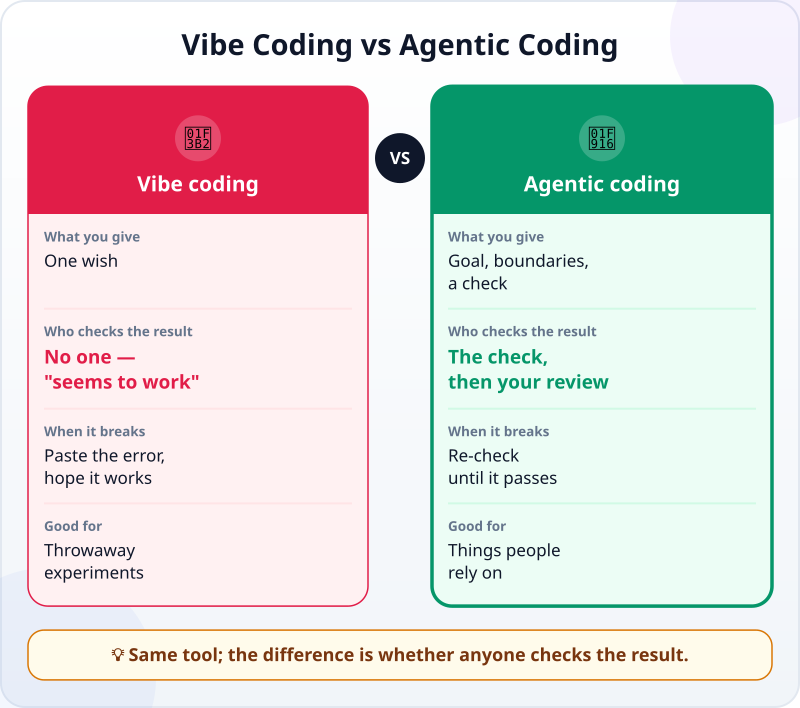
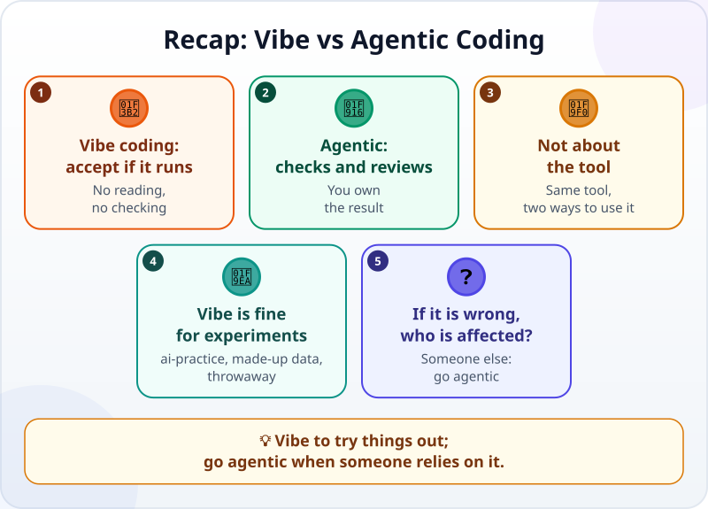

🌐 [Tiếng Việt](../../vi/lessons/vibe-vs-agentic.md) · **English** · [日本語](../../ja/lessons/vibe-vs-agentic.md)

# Vibe Coding vs Agentic Coding: What Is the Difference?

<!-- section: objective -->
## Lesson Objective

By the end of this lesson, you will be able to:

- Tell **vibe coding** (taking code without reading or checking it) apart from **agentic coding** (a goal, boundaries, a check, a review).
- Use one simple question to choose how to work: *"If it is wrong and nobody notices, who gets hurt?"*
- Turn a vibe-style request into an agentic one by adding four things.

<!-- section: hook -->
## Why It Matters

Huy is a second-year student. One evening he types into an AI tool: *"Make me a web page that splits the bill when a group eats out."* Ten minutes later he has a page. He tries it once: $300 split three ways, $100 each. Correct. He sends the link to his student club.

At the end of the month, the club's treasurer adds everything up and finds money missing: each bill came up a dollar or two short, tens of dollars over the month. Huy has no idea why — he never read the code, and never tried any bill except the first one.

Huy was **vibe coding**. That is not always wrong. But this time, people relied on the result.

<!-- section: concept -->
## Core Idea

### What is vibe coding?

According to Google Cloud's introduction page, the term *vibe coding* was coined by AI researcher Andrej Karpathy in early 2025. In its "pure" form, the user fully trusts the code the AI writes — almost *forgetting that the code even exists* — and it suits weekend projects you throw away afterwards.

In practice, vibe coding often looks like this:

1. Describe what you want in one sentence.
2. Take the code the AI returns, **without reading it**.
3. Run it once. If it seems to work, keep it.
4. If there is an error, paste the error back to the AI and hope the next try works.

No step asks *"is the result right?"* — only *"does it run?"*.

### Agentic coding adds four things

[Agentic coding](traditional-vs-agentic.md) can use **exactly the same tool**. The difference is how you work with it. You add four things:

- **A clear goal:** what the task is, who it is for, what "done" means — as in [Writing Good Specs](writing-good-specs.md).
- **Boundaries:** what the agent may touch and what it must not do — for example, only the `ai-practice` folder, only made-up data.
- **A check:** something that gives *pass / fail* and that the agent can run itself, such as a [test](testing-basics.md) or a number that must match.
- **A review:** you read the changes and the evidence before you accept them — as in [Reading and Reviewing an Agent's Changes](reviewing-agent-changes.md).



Look at the middle row: **who checks the result**. In vibe coding the answer is "no one" — there is only the feeling that *it seems to work*. In agentic coding, a check runs every time, and you read the evidence.

### When is vibe coding enough?

Vibe coding is not bad. It is fast, fun, and great for trying an idea. Ask yourself one question: **"If it is wrong and nobody notices, who gets hurt?"**

- **No one** — a small game to try something, a practice page in `ai-practice`, made-up data, thrown away afterwards: vibe away. ✅
- **Someone** — other people's money, other people's data, something others will use or open again next week: you need agentic coding.

Huy's page moved into the second group the moment he sent the link to his club. From then on, it was no longer an experiment.

### Going from vibe to agentic costs little

Moving from vibe to agentic usually costs a few extra minutes to write the request and a few minutes to read the result. What is expensive is **not** doing it: a silent error living inside something everyone uses, and nobody knowing where it is.

<!-- section: analogy -->
## Simple Analogy

Cooking for yourself versus cooking for a restaurant. At home in the evening, you season by feel: a little salt, a little sugar, if it tastes fine, it is fine. Cooking for a restaurant is different: there is a recipe, you measure, you taste before serving, you keep things clean — because customers pay and trust you.

The same kitchen, the same cook. The difference is **who eats** the dish.

Where the comparison breaks down: a bad dish tastes bad right away. Wrong code usually still runs and still produces numbers that look reasonable — the error only shows when someone adds things up, like Huy's treasurer. That is why the check in agentic coding has to be written down, not just "tasted once".

<!-- section: example -->
## Real Example

Huy rebuilds the bill-splitting page, this time the agentic way, in his `ai-practice` folder.

**First time (vibe):**

```text
Make me a web page that splits the bill when a group eats out.
```

**Second time (agentic):**

```text
Goal: a page split_bill.html that splits one bill between several people, for my club to use.
Boundaries: work only in the ai-practice folder, one file, send no data anywhere.
Done when:
1. The bill entered is always a whole-dollar amount; anything else shows an error.
2. Each share is a whole-dollar amount, and the shares always add up to exactly the bill.
3. Split as evenly as possible: the largest and smallest shares differ by at most $1.
4. It works for: $300 split 3 ways; $1,000 split 3 ways; $100 split 7 ways; $250 split 1 way.
5. Entering 0 people shows a clear error, not a strange number.
Write a check that runs all the cases above, run it and show me the result.
```

The agent writes the page, then runs the check. The case **$1,000 split 3 ways** fails: $333 each, $999 in total — $1 short. The case **$100 split 7 ways** is short too: 7 × $14 = $98. That is exactly the bug that left the club short: each share was rounded down to whole dollars, and the leftover disappeared.

The agent fixes it: split the whole-dollar part evenly, then add the leftover dollars one by one to the first few people — $1,000 split 3 ways becomes $334, $333, $333. It runs the check again: every case passes.

Huy does not stop there. He reads the agent's report, then tries a bill that is not on the list — $470 split 6 ways — and adds up the shares with a calculator: $79 + $79 + 4 × $78 = $470. It matches. Only then does he send the new link to his club.

The same tool, the same evening. The second time took about ten minutes more.

<!-- section: misconceptions -->
## Common Misconceptions

- **"Vibe coding is always bad."** — For a throwaway experiment with made-up data that nobody relies on, it is a fast way to try an idea. The problem starts when something vibe-coded gets used for real.
- **"Using an agent is agentic; using a chatbot is vibe."** — It does not depend on the tool. You can vibe-code with a powerful agent if you give it no check and do not read the result.
- **"The code runs without errors, so it is right."** — Huy's page ran smoothly for a whole month and was still wrong. Running is not the same as doing the right thing.

<!-- section: recap -->
## The Lesson in One Picture



<!-- section: takeaways -->
## Key Takeaways

- Vibe coding: describe, take the code without reading it, keep it if it seems to work.
- Agentic coding adds four things: a clear goal, boundaries, a check, a review.
- The difference is in how you work, not in the tool.
- Ask: "If it is wrong and nobody notices, who gets hurt?" — no one, vibe away; someone, go agentic.
- Running is not the same as right: silent errors only show up with a check, or when someone adds things up.

<!-- section: quiz -->
## Quick Check

**Question 1.** What shows most clearly that someone is vibe coding?

- A) They use an AI tool to write code
- B) They keep code because it seems to work, without reading it or checking the result
- C) They write requests in their own language instead of English

**Question 2.** When is vibe coding enough?

- A) A payroll spreadsheet the whole accounting team will use
- B) A page for collecting class fees, sent to the whole class
- C) A small game you make in `ai-practice` to try something, thrown away afterwards

**Question 3.** To turn *"make a bill-splitting page"* into an agentic request, what matters most to add?

- A) A check the agent can run itself, such as "the shares always add up to the bill"
- B) More polite words in the request
- C) Asking the agent to work faster

<details>
<summary>Show answers</summary>

1. **B** — using AI is not vibe coding; skipping the reading and the checking is.
2. **C** — nobody relies on the result, so if it is wrong, nobody gets hurt.
3. **A** — the check tells the agent what "right" means, and it catches the missing money that a single try does not.

</details>

<!-- section: sources -->
## Recommended Sources

- Google Cloud — [What is vibe coding?](https://cloud.google.com/discover/what-is-vibe-coding) (English, updated March 2026): the term was coined by Andrej Karpathy in early 2025; "pure" vibe coding means fully trusting the AI's code and suits throwaway weekend projects; the responsible way is for the user to review, test and understand the code and take ownership of the product.
- Anthropic — [Best practices for Claude Code](https://code.claude.com/docs/en/best-practices) (English, as of September 2026): give the agent a check it can run itself; without one, "looks done" is the only signal.
